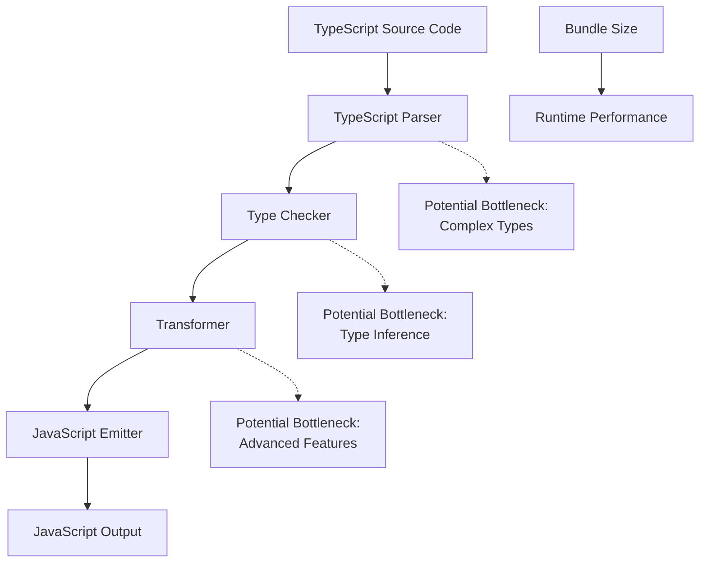

# TypeScript Performance

## Introduction

Performance optimization is a critical aspect of professional software development. While TypeScript provides many benefits such as type safety, better tooling, and improved developer experience, it's important to understand how your TypeScript code affects runtime performance. In this guide, we'll explore various techniques, patterns, and best practices to optimize TypeScript code for better performance.

TypeScript itself doesn't inherently make your code faster or slower since it compiles down to JavaScript. However, understanding TypeScript's compilation process and how to leverage its features efficiently can help you write better-performing applications.

## TypeScript's Impact on Performance

### Compilation Overhead

TypeScript adds a compilation step to your development process, which doesn't affect runtime performance but can impact developer experience.

```typescript
// TypeScript code
interface User {
  id: number;
  name: string;
  email: string;
}

function greetUser(user: User): string {
  return `Hello, ${user.name}!`;
}

// Compiles to JavaScript
function greetUser(user) {
  return `Hello, ${user.name}!`;
}
```

Notice how all type annotations are removed in the compiled JavaScript output. Types have zero runtime cost!

### Bundle Size Considerations

TypeScript itself doesn't add to your bundle size, but certain TypeScript patterns might generate more code than necessary.

## Common Performance Bottlenecks

### 1. Excessive Type Complexity

Extremely complex type definitions can slow down the TypeScript compiler, affecting development time.

```typescript
// Avoid: Overly complex types
type DeepNested<T> = { 
  [K in keyof T]: T[K] extends object 
    ? DeepNested<T[K]> 
    : T[K] extends Array<infer U> 
      ? Array<DeepNested<U>> 
      : T[K] 
};

// Better: Break down into smaller, reusable types
type DeepNestedArray<T> = Array<DeepNested<T>>;
type DeepNested<T> = T extends object 
  ? { [K in keyof T]: DeepNested<T[K]> } 
  : T;
```

### 2. Type Assertion Overuse

Frequent use of type assertions (`as` keyword) can lead to type safety issues and may hide performance problems.

```typescript
// Avoid: Excessive type assertions
function processData(data: any) {
  const user = data as User;
  const settings = data.settings as UserSettings;
  // More assertions...
}

// Better: Use proper type checking
function processData(data: unknown) {
  if (isUser(data)) {
    // Now TypeScript knows data is User
    const settings = data.settings;
    // ...
  }
}

function isUser(value: unknown): value is User {
  return (
    typeof value === 'object' && 
    value !== null && 
    'id' in value && 
    'name' in value
  );
}
```

## Optimizing TypeScript Code for Runtime Performance

### 1. Efficient Data Structures

Choosing the right data structure can significantly impact performance.

```typescript
// Inefficient: Linear search in array for frequent lookups
const users: User[] = [...]; 
const findUser = (id: number) => users.find(user => user.id === id);

// Efficient: Map for O(1) lookups
const userMap = new Map<number, User>();
users.forEach(user => userMap.set(user.id, user));
const findUser = (id: number) => userMap.get(id);
```

### 2. Avoiding Unnecessary Object Creation

Object creation can be expensive, especially when done repeatedly.

```typescript
// Inefficient: Creates new objects on every call
function processCoordinates(points: Array<{x: number, y: number}>) {
  return points.map(p => ({
    x: p.x * 2,
    y: p.y * 2
  }));
}

// Better: Modify objects in place when appropriate
function processCoordinates(points: Array<{x: number, y: number}>) {
  points.forEach(p => {
    p.x *= 2;
    p.y *= 2;
  });
  return points;
}
```

### 3. Memoization for Expensive Calculations

Caching results of expensive function calls can dramatically improve performance.

```typescript
// Without memoization
function fibonacci(n: number): number {
  if (n <= 1) return n;
  return fibonacci(n - 1) + fibonacci(n - 2);
}

// With memoization
function memoizedFibonacci() {
  const cache: Record<number, number> = {};
  
  return function fib(n: number): number {
    if (n in cache) return cache[n];
    
    let result: number;
    if (n <= 1) result = n;
    else result = fib(n - 1) + fib(n - 2);
    
    cache[n] = result;
    return result;
  };
}

const fastFib = memoizedFibonacci();
console.log(fastFib(40)); // Much faster than fibonacci(40)
```

## Advanced TypeScript Performance Patterns

### Using Readonly Types for Immutability

The `readonly` modifier helps enforce immutability, which can prevent accidental mutations and optimize certain operations.

```typescript
// Using readonly for immutable data
interface Point {
  readonly x: number;
  readonly y: number;
}

// Using readonly arrays
function calculateDistance(points: readonly Point[]): number {
  // Cannot accidentally modify the array
  // points.push({x: 0, y: 0}); // Error!
  
  // Implementation...
  return 0;
}
```

### Reducing Union Types Complexity

Complex union types can slow down the TypeScript compiler and make code harder to understand.

```typescript
// Complex union type
type Status = 
  | { state: 'loading' }
  | { state: 'success'; data: string }
  | { state: 'error'; error: Error }
  | { state: 'idle' };

// Simplified with discriminated union
type Status = {
  state: 'loading' | 'success' | 'error' | 'idle';
  data?: string;
  error?: Error;
};
```

## TypeScript Compiler Optimizations

### tsconfig.json Performance Settings

Optimizing your TypeScript configuration can improve build times:

```json
{
  "compilerOptions": {
    "incremental": true,       // Enable incremental compilation
    "skipLibCheck": true,      // Skip type checking of declaration files
    "isolatedModules": true,   // Enable transpileModule-like behavior
    "noEmit": true,            // When using Babel or other transpilers
    "target": "ES2020",        // Use modern JavaScript target
    "module": "ESNext"         // Use modern module system
  }
}
```

### Using Project References

For large projects, TypeScript project references can significantly improve build times:

```json
// tsconfig.json
{
  "references": [
    { "path": "./src/core" },
    { "path": "./src/ui" }
  ],
  "files": []
}
```

## Real-World Performance Optimization Example

Let's look at a practical example of optimizing a React component using TypeScript:

```tsx
// Before optimization
import React, { useState, useEffect } from 'react';

interface User {
  id: number;
  name: string;
  email: string;
}

const UserList: React.FC = () => {
  const [users, setUsers] = useState<User[]>([]);
  const [searchTerm, setSearchTerm] = useState('');
  
  useEffect(() => {
    fetch('/api/users')
      .then(res => res.json())
      .then(data => setUsers(data));
  }, []);
  
  // Inefficient: Filters list on every render
  const filteredUsers = users.filter(user => 
    user.name.toLowerCase().includes(searchTerm.toLowerCase())
  );
  
  return (
    <div>
      <input 
        type="text" 
        value={searchTerm}
        onChange={(e) => setSearchTerm(e.target.value)}
        placeholder="Search users..."
      />
      <ul>
        {filteredUsers.map(user => (
          <li key={user.id}>{user.name} ({user.email})</li>
        ))}
      </ul>
    </div>
  );
};

export default UserList;
```

Now, let's optimize it:

```tsx
// After optimization
import React, { useState, useEffect, useMemo, useCallback } from 'react';

interface User {
  id: number;
  name: string;
  email: string;
}

const UserList: React.FC = () => {
  const [users, setUsers] = useState<User[]>([]);
  const [searchTerm, setSearchTerm] = useState('');
  
  // Optimized: Use useCallback for stable function reference
  const fetchUsers = useCallback(async () => {
    try {
      const response = await fetch('/api/users');
      const data = await response.json();
      setUsers(data);
    } catch (error) {
      console.error('Failed to fetch users:', error);
    }
  }, []);
  
  useEffect(() => {
    fetchUsers();
  }, [fetchUsers]);
  
  // Optimized: Use useMemo to avoid re-filtering on every render
  const filteredUsers = useMemo(() => {
    const lowercasedTerm = searchTerm.toLowerCase();
    return users.filter(user => 
      user.name.toLowerCase().includes(lowercasedTerm)
    );
  }, [users, searchTerm]);
  
  // Optimized: Use useCallback for event handlers
  const handleSearch = useCallback((e: React.ChangeEvent<HTMLInputElement>) => {
    setSearchTerm(e.target.value);
  }, []);
  
  return (
    <div>
      <input 
        type="text" 
        value={searchTerm}
        onChange={handleSearch}
        placeholder="Search users..."
      />
      <ul>
        {filteredUsers.map(user => (
          <li key={user.id}>{user.name} ({user.email})</li>
        ))}
      </ul>
    </div>
  );
};

export default UserList;
```

## Measuring TypeScript Performance

It's important to measure performance before and after optimization to ensure your changes are actually improving things.

### Tools for Performance Measurement

1. **TypeScript's `--generateTrace` flag**
   
   ```bash
   tsc --generateTrace trace-directory
   ```

2. **Chrome DevTools Performance Tab**
   
   For runtime performance analysis of your compiled JavaScript.

3. **TypeScript Build Performance Analyzer**

   ```bash
   npx ts-perf
   ```

## Common TypeScript Performance Anti-Patterns

Understanding what not to do is just as important:

### 1. Overuse of `any` Type

```typescript
// Avoid this
function processData(data: any) {
  // Type safety abandoned
  return data.someProperty.someMethod();
}

// Better alternative
function processData<T extends { someProperty: { someMethod: () => R } }, R>(data: T): R {
  return data.someProperty.someMethod();
}
```

### 2. Excessive Type Casting

```typescript
// Avoid excessive casting
function handleUser(userInput: unknown) {
  const user = userInput as User;  // Dangerous
  const name = (userInput as any).name; // Very dangerous
  
  // ...
}

// Better: Type guards
function handleUser(userInput: unknown) {
  if (isUser(userInput)) {
    // TypeScript knows userInput is User here
    const name = userInput.name;
    // ...
  }
}
```

### 3. Deep Object Cloning

```typescript
// Inefficient deep cloning
const clonedState = JSON.parse(JSON.stringify(originalState));

// Better: Use libraries like immer or structured cloning
import produce from 'immer';

const clonedState = produce(originalState, draft => {
  draft.user.name = 'New Name';
});
```

## Performance Visualization

Here's a flowchart showing the TypeScript compilation process and where performance bottlenecks might occur:



## Summary

Performance optimization in TypeScript involves understanding both compile-time and runtime performance considerations:

1. **Compilation Performance**:
   - Use incremental compilation
   - Configure the TypeScript compiler appropriately
   - Break down large projects with project references
   - Avoid excessively complex types

2. **Runtime Performance**:
   - Choose efficient data structures
   - Avoid unnecessary object creation
   - Use memoization for expensive operations
   - Leverage immutability with `readonly` types

3. **Best Practices**:
   - Measure performance before and after optimizations
   - Be strategic about type complexity
   - Avoid type assertion overuse
   - Use appropriate TypeScript features for your needs

Remember that premature optimization can lead to code complexity without meaningful benefits. Always profile and measure before investing time in optimizations, and focus on the areas that will have the most significant impact on user experience.

## Further Learning Resources

- [TypeScript Performance Documentation](https://www.typescriptlang.org/docs/handbook/release-notes/overview.html)
- [React TypeScript Performance Optimization](https://reactjs.org/docs/optimizing-performance.html)
- [V8 JavaScript Performance Tips](https://v8.dev/blog)

## Exercises

1. Profile a TypeScript application using Chrome DevTools and identify three potential performance bottlenecks.
2. Convert a function with expensive calculations to use memoization.
3. Optimize a React component that renders a large list with filtering capabilities.
4. Reduce the complexity of a codebase that uses excessively complex types.
5. Implement an efficient data structure for a use case requiring frequent data lookups.

Happy optimizing!