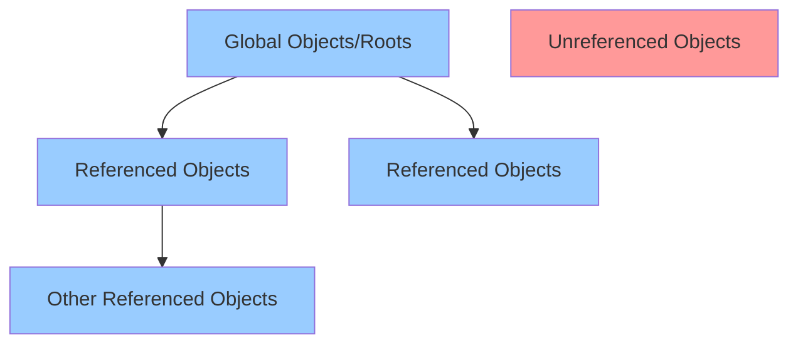

# TypeScript Memory Management

Memory management is a crucial aspect of application development that directly impacts performance and user experience. In TypeScript, like JavaScript, memory is managed automatically through garbage collection. However, understanding how this works under the hood can help you write more efficient and performance-optimized code.

## Introduction to Memory Management in TypeScript

TypeScript compiles to JavaScript, so it inherits JavaScript's memory management characteristics. Unlike lower-level languages such as C or C++ where developers must explicitly allocate and free memory, TypeScript handles memory allocation and deallocation automatically.

The primary mechanism for this is **garbage collection** - a process that automatically identifies and reclaims memory that is no longer being used by the application.

## How Memory Allocation Works

When you create variables, functions, or objects in TypeScript, memory is allocated automatically:

```typescript
// Memory is allocated for these variables
let number = 42;              // Primitive allocated on the stack
let name = "TypeScript";      // String allocated on the heap
let user = {                  // Object allocated on the heap
  id: 1,
  name: "Alice"
};

// Arrays allocate contiguous blocks of memory
let numbers = [1, 2, 3, 4, 5]; // Array allocated on the heap
```

Memory allocation in TypeScript happens in two main areas:

1. **Stack memory**: Used for static data like primitive types (numbers, booleans) and references to objects
2. **Heap memory**: Used for dynamic data like objects, arrays, and functions

## The Garbage Collection Process

JavaScript engines (which run TypeScript code) use automatic garbage collection to reclaim memory. The main principle is simple: identify and remove objects that are no longer reachable from the "roots" (global objects).



There are two primary garbage collection algorithms used in modern JavaScript engines:

1. **Mark and Sweep**: The most common algorithm that marks all reachable objects and then sweeps away unmarked ones.
2. **Reference Counting**: Keeps track of how many references point to an object and collects it when the count reaches zero.

## Common Memory Issues in TypeScript

Despite automatic garbage collection, memory leaks can still occur in TypeScript applications. Here are some common causes:

### 1. Unintentional Reference Retention

```typescript
function createMemoryLeak() {
  const hugeData = new Array(1000000).fill("🔥");
  
  // Global reference prevents garbage collection
  window.keepData = hugeData;
}

createMemoryLeak();
// hugeData can't be garbage collected because window.keepData still references it
```

### 2. Closure-Related Memory Leaks

```typescript
function setupEventHandlers() {
  const element = document.getElementById('button');
  const hugeData = new Array(1000000).fill("🔥");
  
  element?.addEventListener('click', () => {
    // This closure keeps a reference to hugeData
    console.log(hugeData[0]);
  });
}

// Even after setupEventHandlers() completes, hugeData remains in memory
// as long as the event listener exists
```

### 3. Event Listeners Not Being Removed

```typescript
class Component {
  private data: string[] = [];
  
  constructor() {
    this.data = new Array(10000).fill('data');
    document.addEventListener('click', this.handleClick);
  }
  
  private handleClick = () => {
    console.log(this.data.length);
  };
  
  // Missing cleanup method:
  // destroy() {
  //   document.removeEventListener('click', this.handleClick);
  // }
}

// If Component instances are created and discarded without cleaning up,
// both the handlers and Component instances will leak
```

## Best Practices for Memory Management

### 1. Properly Clean Up Resources

Always remove event listeners, cancel subscriptions, and clear intervals when they're no longer needed:

```typescript
class ImprovedComponent {
  private data: string[] = [];
  
  constructor() {
    this.data = new Array(1000).fill('data');
    document.addEventListener('click', this.handleClick);
  }
  
  private handleClick = () => {
    console.log(this.data.length);
  };
  
  // Cleanup method that should be called when the component is no longer needed
  destroy() {
    document.removeEventListener('click', this.handleClick);
    this.data = []; // Help garbage collector by removing references
  }
}

const component = new ImprovedComponent();
// Later when no longer needed
component.destroy();
```

### 2. Avoid Unnecessary Closures with Large Data

```typescript
// Bad practice
function processData() {
  const hugeData = new Array(1000000).fill("Large dataset");
  
  return function() {
    // This inner function keeps hugeData in memory
    return hugeData.length;
  };
}

// Better practice
function processDataBetter() {
  const hugeData = new Array(1000000).fill("Large dataset");
  const result = hugeData.length;
  
  return function() {
    // Only keeps what's needed, allowing hugeData to be garbage collected
    return result;
  };
}
```

### 3. Use WeakMap and WeakSet for References

When you need to associate data with objects without preventing garbage collection, use `WeakMap` or `WeakSet`:

```typescript
// Strong reference - prevents garbage collection
const cache = new Map();
function processUser(user) {
  if (!cache.has(user)) {
    cache.set(user, expensiveComputation(user));
  }
  return cache.get(user);
}

// Weak reference - allows garbage collection of user
const weakCache = new WeakMap();
function processUserBetter(user) {
  if (!weakCache.has(user)) {
    weakCache.set(user, expensiveComputation(user));
  }
  return weakCache.get(user);
}

function expensiveComputation(user) {
  // Complex processing here
  return { result: `Processed ${user.name}` };
}

let user = { name: "Alice" };
processUserBetter(user);

// Later
user = null; // The entry in weakCache can now be garbage collected
```

### 4. Watch Out for Circular References

While modern garbage collectors can handle circular references, it's still good practice to be aware of them:

```typescript
function createCircularReference() {
  const obj1 = {};
  const obj2 = {};
  
  // Create circular reference
  obj1.ref = obj2;
  obj2.ref = obj1;
  
  return { obj1, obj2 };
}

// Modern garbage collectors can still clean this up when no longer referenced
```

### 5. Use Object Pooling for Frequent Allocations

If your application frequently creates and disposes of similar objects, consider implementing an object pool:

```typescript
class Vector {
  x: number;
  y: number;
  
  constructor(x: number, y: number) {
    this.x = x;
    this.y = y;
  }
  
  reset(x: number, y: number): void {
    this.x = x;
    this.y = y;
  }
}

class VectorPool {
  private pool: Vector[] = [];
  
  get(x: number, y: number): Vector {
    if (this.pool.length > 0) {
      const vector = this.pool.pop()!;
      vector.reset(x, y);
      return vector;
    }
    
    return new Vector(x, y);
  }
  
  release(vector: Vector): void {
    this.pool.push(vector);
  }
}

// Usage
const vectorPool = new VectorPool();

function simulateParticles() {
  const particles: Vector[] = [];
  
  // Get from pool instead of creating new
  for (let i = 0; i < 1000; i++) {
    particles.push(vectorPool.get(Math.random(), Math.random()));
  }
  
  // Process particles...
  
  // Release back to pool when done
  particles.forEach(particle => vectorPool.release(particle));
}
```

## Analyzing Memory Usage

To identify memory issues in your TypeScript applications, use browser developer tools:

1. **Chrome DevTools**: Use the Memory tab to take heap snapshots and analyze memory consumption
2. **Performance Monitor**: Monitor JavaScript memory usage in real-time
3. **Allocation Profiling**: Track where objects are being created

Example workflow for identifying memory leaks:

1. Take a heap snapshot
2. Perform actions that might cause memory leaks
3. Take another snapshot
4. Compare snapshots to identify retained objects

## Real-World Example: Memory Management in a React/TypeScript Application

Let's examine a common scenario in React applications where memory management issues can arise:

```typescript
import React, { useState, useEffect } from 'react';

// Memory leak scenario in a React component
const DataFetcher = ({ url }: { url: string }) => {
  const [data, setData] = useState<any>(null);
  
  useEffect(() => {
    let isMounted = true;
    const fetchData = async () => {
      // Imagine this is a large dataset
      const result = await fetch(url).then(res => res.json());
      
      // Check if component is still mounted before updating state
      if (isMounted) {
        setData(result);
      }
    };
    
    fetchData();
    
    // Cleanup function to prevent memory leaks
    return () => {
      isMounted = false;
    };
  }, [url]);
  
  return <div>{data ? JSON.stringify(data) : 'Loading...'}</div>;
};

// Usage
const App = () => {
  const [showFetcher, setShowFetcher] = useState(true);
  
  return (
    <div>
      <button onClick={() => setShowFetcher(!showFetcher)}>
        Toggle Fetcher
      </button>
      {showFetcher && <DataFetcher url="https://api.example.com/data" />}
    </div>
  );
};
```

In this example:
1. We prevent a common memory leak by using the `isMounted` flag
2. The cleanup function runs when the component unmounts
3. This prevents state updates on unmounted components, which can cause memory leaks

## Summary and Best Practices

Memory management in TypeScript largely comes down to understanding JavaScript's garbage collection mechanism and following some key principles:

1. **Be conscious of references**: Avoid unintentional global references and clean up references when no longer needed
2. **Clean up after yourself**: Remove event listeners, cancel timers and subscriptions
3. **Limit closure scope**: Only capture what you need in closures
4. **Use weak references**: `WeakMap` and `WeakSet` when appropriate
5. **Analyze your app**: Regularly profile your application for memory leaks

By following these principles, you can ensure your TypeScript applications perform efficiently with minimal memory overhead.

## Exercises

1. Create a class that maintains a cache using WeakMap to avoid memory leaks.
2. Refactor a function that creates a closure over a large dataset to minimize memory usage.
3. Use Chrome DevTools to analyze memory usage in a simple TypeScript application and identify potential memory leaks.
4. Implement an object pooling system for a particle system in a TypeScript game.
5. Create a custom hook in React/TypeScript that properly manages subscriptions to prevent memory leaks.

## Additional Resources

- [MDN Web Docs: Memory Management](https://developer.mozilla.org/en-US/docs/Web/JavaScript/Memory_Management)
- [JavaScript Garbage Collection](https://javascript.info/garbage-collection)
- [Chrome DevTools Memory Panel](https://developer.chrome.com/docs/devtools/memory-problems/)
- [V8 Garbage Collection Mechanism](https://v8.dev/blog/free-garbage-collection)
- [React Documentation: Cleaning up Effects](https://reactjs.org/docs/hooks-effect.html#effects-with-cleanup)

Understanding memory management in TypeScript gives you the tools to create more performant and reliable applications. Since TypeScript compiles to JavaScript, mastering these concepts helps you optimize both languages effectively.