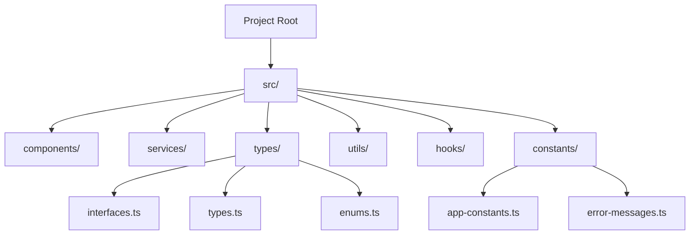

# TypeScript Clean Code

Writing clean code is a fundamental skill that separates professional developers from beginners. When we talk about "clean code," we're referring to code that is easy to read, understand, and maintain. In TypeScript, clean code principles become even more powerful as they combine with static typing to create robust, reliable applications.

## Why Clean Code Matters

Clean code isn't just about aesthetics—it directly impacts:

- **Maintainability**: Code that others (and your future self) can easily work with
- **Bug reduction**: Clearer code means fewer places for bugs to hide
- **Onboarding speed**: New team members can understand the codebase faster
- **Development velocity**: Clean code enables faster feature development and improvements

## Core Principles of Clean TypeScript

### 1. Meaningful Names

Variable, function, and class names should clearly communicate their purpose.

❌ Bad:

```typescript
const d = new Date();
const tms = d.getTime();

function calc(a: number, b: number): number {
  return a + b;
}
```

✅ Good:

```typescript
const currentDate = new Date();
const timeStampInMilliseconds = currentDate.getTime();

function calculateSum(firstNumber: number, secondNumber: number): number {
  return firstNumber + secondNumber;
}
```

### 2. Strong Typing

Leverage TypeScript's type system to make code more predictable and self-documenting.

❌ Bad:

```typescript
function processUser(user: any) {
  console.log(user.name);
}
```

✅ Good:

```typescript
interface User {
  id: string;
  name: string;
  email: string;
  isActive: boolean;
}

function processUser(user: User): void {
  console.log(user.name);
}
```

### 3. Small Functions with Single Responsibility

Each function should do one thing and do it well.

❌ Bad:

```typescript
function validateAndSaveUser(user: User): boolean {
  // Check if user is valid
  if (!user.name || user.name.length < 2) {
    console.error("Invalid name");
    return false;
  }
  
  if (!user.email || !user.email.includes('@')) {
    console.error("Invalid email");
    return false;
  }
  
  // Save user to database
  const db = connectToDatabase();
  db.users.save(user);
  console.log("User saved successfully");
  return true;
}
```

✅ Good:

```typescript
function validateUser(user: User): boolean {
  if (!isNameValid(user.name)) {
    console.error("Invalid name");
    return false;
  }
  
  if (!isEmailValid(user.email)) {
    console.error("Invalid email");
    return false;
  }
  
  return true;
}

function isNameValid(name: string): boolean {
  return !!name && name.length >= 2;
}

function isEmailValid(email: string): boolean {
  return !!email && email.includes('@');
}

function saveUser(user: User): void {
  const db = connectToDatabase();
  db.users.save(user);
  console.log("User saved successfully");
}

function processUser(user: User): boolean {
  if (validateUser(user)) {
    saveUser(user);
    return true;
  }
  return false;
}
```

### 4. Avoid Magic Values

Use constants instead of hardcoded values.

❌ Bad:

```typescript
if (user.role === 'admin') {
  // Grant access to admin panel
}

setTimeout(refreshData, 300000); // 5 minutes in milliseconds
```

✅ Good:

```typescript
enum UserRole {
  ADMIN = 'admin',
  USER = 'user',
  GUEST = 'guest',
}

const TIME_CONSTANTS = {
  REFRESH_INTERVAL_MS: 5 * 60 * 1000, // 5 minutes
};

if (user.role === UserRole.ADMIN) {
  // Grant access to admin panel
}

setTimeout(refreshData, TIME_CONSTANTS.REFRESH_INTERVAL_MS);
```

### 5. Interface Segregation

Create small, specific interfaces rather than large, monolithic ones.

❌ Bad:

```typescript
interface Entity {
  id: string;
  name: string;
  email: string;
  createdAt: Date;
  updatedAt: Date;
  address: string;
  phone: string;
  isActive: boolean;
  metadata: Record<string, unknown>;
}
```

✅ Good:

```typescript
interface Entity {
  id: string;
  createdAt: Date;
  updatedAt: Date;
}

interface Person extends Entity {
  name: string;
  email: string;
}

interface ContactInfo {
  address: string;
  phone: string;
}

interface User extends Person, ContactInfo {
  isActive: boolean;
  metadata: Record<string, unknown>;
}
```

### 6. Consistent Error Handling

Establish patterns for handling errors throughout your application.

❌ Bad:

```typescript
function fetchData(): Promise<Data> {
  return fetch('/api/data')
    .then(response => {
      if (!response.ok) throw new Error('Network error');
      return response.json();
    });
}

// Some functions use try/catch, others use promise catch
async function processData() {
  try {
    const result = await fetchData();
    return process(result);
  } catch (error) {
    console.error('Failed to process:', error);
    return null;
  }
}
```

✅ Good:

```typescript
class ApiError extends Error {
  constructor(
    message: string,
    public statusCode: number,
    public data?: unknown
  ) {
    super(message);
    this.name = 'ApiError';
  }
}

async function fetchData(): Promise<Data> {
  try {
    const response = await fetch('/api/data');
    if (!response.ok) {
      throw new ApiError(
        'Failed to fetch data',
        response.status,
        await response.text()
      );
    }
    return await response.json();
  } catch (error) {
    if (error instanceof ApiError) throw error;
    throw new ApiError('Network error', 500, error);
  }
}

// Consistent error handling pattern
async function processData(): Promise<ProcessedData | null> {
  try {
    const data = await fetchData();
    return process(data);
  } catch (error) {
    if (error instanceof ApiError) {
      logApiError(error);
    } else {
      logGenericError(error);
    }
    return null;
  }
}
```

### 7. Avoid Type Assertions When Possible

Rely on TypeScript's type inference and proper typing instead of type assertions.

❌ Bad:

```typescript
const userInput = document.getElementById('user-input') as HTMLInputElement;
const value = userInput.value;

const data = JSON.parse(response) as UserData;
```

✅ Good:

```typescript
const userInput = document.getElementById('user-input');
if (userInput instanceof HTMLInputElement) {
  const value = userInput.value;
}

try {
  const responseData = JSON.parse(response);
  if (isUserData(responseData)) {
    const userData: UserData = responseData;
    // Use userData
  }
} catch (error) {
  // Handle parsing error
}

// Type guard
function isUserData(data: any): data is UserData {
  return (
    data &&
    typeof data.id === 'string' &&
    typeof data.name === 'string' &&
    typeof data.email === 'string'
  );
}
```

## Real-World Application Example

Let's see how we can apply these principles to a real-world scenario: building a simple task management application.

```typescript
// types.ts
export interface Task {
  id: string;
  title: string;
  description: string;
  completed: boolean;
  createdAt: Date;
  priority: TaskPriority;
}

export enum TaskPriority {
  LOW = 'low',
  MEDIUM = 'medium',
  HIGH = 'high',
}

export interface TaskFilter {
  completed?: boolean;
  priority?: TaskPriority;
}

// task-service.ts
export class TaskService {
  private tasks: Task[] = [];
  
  constructor(initialTasks: Task[] = []) {
    this.tasks = [...initialTasks];
  }
  
  public addTask(taskData: Omit<Task, 'id' | 'createdAt'>): Task {
    const newTask: Task = {
      ...taskData,
      id: this.generateUniqueId(),
      createdAt: new Date(),
    };
    
    this.tasks.push(newTask);
    return newTask;
  }
  
  public deleteTask(id: string): boolean {
    const initialLength = this.tasks.length;
    this.tasks = this.tasks.filter(task => task.id !== id);
    return this.tasks.length !== initialLength;
  }
  
  public updateTask(id: string, updates: Partial<Omit<Task, 'id' | 'createdAt'>>): Task | null {
    const taskIndex = this.tasks.findIndex(task => task.id === id);
    
    if (taskIndex === -1) {
      return null;
    }
    
    this.tasks[taskIndex] = {
      ...this.tasks[taskIndex],
      ...updates,
    };
    
    return this.tasks[taskIndex];
  }
  
  public getTasks(filter?: TaskFilter): Task[] {
    if (!filter) {
      return [...this.tasks];
    }
    
    return this.tasks.filter(task => {
      if (filter.completed !== undefined && task.completed !== filter.completed) {
        return false;
      }
      
      if (filter.priority !== undefined && task.priority !== filter.priority) {
        return false;
      }
      
      return true;
    });
  }
  
  private generateUniqueId(): string {
    return `task_${Date.now()}_${Math.random().toString(36).substr(2, 9)}`;
  }
}

// usage-example.ts
import { TaskService, Task, TaskPriority } from './task-service';

const taskService = new TaskService();

// Add a new task
const newTask = taskService.addTask({
  title: 'Learn TypeScript Clean Code',
  description: 'Study best practices for writing clean TypeScript code',
  completed: false,
  priority: TaskPriority.HIGH,
});

console.log('New task created:', newTask);

// Get high priority tasks
const highPriorityTasks = taskService.getTasks({ priority: TaskPriority.HIGH });
console.log('High priority tasks:', highPriorityTasks);

// Mark task as completed
if (newTask) {
  const updatedTask = taskService.updateTask(newTask.id, { completed: true });
  console.log('Task completed:', updatedTask);
}

// Get all completed tasks
const completedTasks = taskService.getTasks({ completed: true });
console.log('Completed tasks:', completedTasks);
```

This example demonstrates:
- Clear type definitions
- Single responsibility functions
- Immutable data handling
- Strong typing with interfaces and enums
- Consistent error handling
- Clear naming conventions

## Common Code Smells to Avoid

### 1. Long Parameter Lists

❌ Bad:
```typescript
function createUser(
  name: string,
  email: string,
  password: string,
  age: number,
  address: string,
  city: string,
  country: string,
  isAdmin: boolean
) {
  // ...
}
```

✅ Good:
```typescript
interface UserCreationParams {
  name: string;
  email: string;
  password: string;
  age: number;
  address: {
    street: string;
    city: string;
    country: string;
  };
  isAdmin: boolean;
}

function createUser(params: UserCreationParams) {
  // ...
}
```

### 2. Nested Conditionals

❌ Bad:
```typescript
function processPayment(payment: Payment) {
  if (payment.status === 'new') {
    if (payment.amount > 0) {
      if (payment.currency === 'USD') {
        // Process USD payment
      } else if (payment.currency === 'EUR') {
        // Process EUR payment
      } else {
        throw new Error('Unsupported currency');
      }
    } else {
      throw new Error('Invalid amount');
    }
  } else {
    throw new Error('Payment already processed');
  }
}
```

✅ Good:
```typescript
function processPayment(payment: Payment) {
  if (payment.status !== 'new') {
    throw new Error('Payment already processed');
  }
  
  if (payment.amount <= 0) {
    throw new Error('Invalid amount');
  }
  
  switch (payment.currency) {
    case 'USD':
      return processUsdPayment(payment);
    case 'EUR':
      return processEurPayment(payment);
    default:
      throw new Error(`Unsupported currency: ${payment.currency}`);
  }
}

function processUsdPayment(payment: Payment) {
  // Process USD payment
}

function processEurPayment(payment: Payment) {
  // Process EUR payment
}
```

### 3. Duplicate Code

❌ Bad:
```typescript
function calculateAreaOfRectangle(width: number, height: number): number {
  return width * height;
}

function calculateAreaOfSquare(side: number): number {
  return side * side;
}
```

✅ Good:
```typescript
function calculateRectangleArea(width: number, height: number): number {
  return width * height;
}

function calculateSquareArea(side: number): number {
  return calculateRectangleArea(side, side);
}
```

## Organizational Structure

A clean TypeScript project should have a clear organizational structure:



## Code Reviews for Clean Code

When reviewing TypeScript code, look for these aspects:

1. **Type accuracy**: Are the right types being used?
2. **Function length**: Are functions small and focused?
3. **Variable naming**: Are names descriptive and consistent?
4. **Error handling**: Is error handling consistent?
5. **Code duplication**: Is there repeated logic that could be abstracted?
6. **Interface design**: Are interfaces cohesive and focused?
7. **Magic values**: Are constants used instead of literal values?
8. **Complexity**: Is code easy to understand?

## Summary

Clean code in TypeScript builds on traditional clean code principles while leveraging TypeScript's robust type system to create more maintainable, readable, and error-resistant code. The key principles we've covered include:

- Meaningful and consistent naming
- Strong typing without excessive type assertions
- Small functions with single responsibilities
- Interface segregation
- Avoiding magic values
- Consistent error handling
- Clear code organization

Following these principles will help you create TypeScript applications that are easier to maintain, extend, and debug.

## Additional Resources

- **Books**
  - "Clean Code" by Robert C. Martin
  - "Effective TypeScript" by Dan Vanderkam

- **Online Resources**
  - [TypeScript Official Documentation](https://www.typescriptlang.org/docs/)
  - [Clean Code TypeScript](https://github.com/labs42io/clean-code-typescript)

## Exercises

1. Take a poorly written TypeScript function and refactor it following clean code principles.
2. Create interfaces for a domain model (e.g., an e-commerce system) following interface segregation.
3. Implement a utility class with proper error handling and type safety.
4. Review an existing TypeScript project and identify three areas where clean code principles could be applied.

By integrating these practices into your development workflow, you'll write TypeScript code that's not only functional but also maintainable and professional.