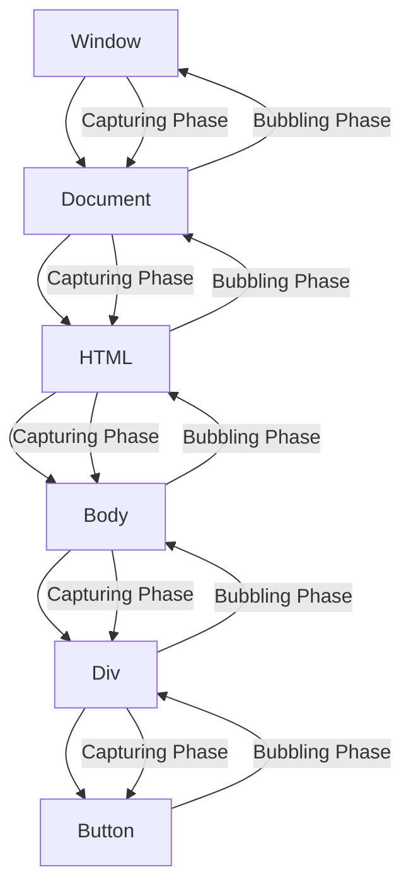

# TypeScript Event Handling

Events are actions or occurrences that happen in your browser, such as a button click, mouse movement, or a page load. In TypeScript, knowing how to handle these events properly allows you to build interactive and responsive web applications. This guide will walk you through the fundamentals of event handling in TypeScript, from basic event listeners to creating and dispatching custom events.

## Introduction to Event Handling

In web development, event handling is the process of detecting events triggered by the user (like clicks and keypresses) or by the browser (like page loading), and responding to them with appropriate code. TypeScript enhances JavaScript's event handling capabilities by providing type safety and better tooling.

## Basic DOM Event Handling in TypeScript

### Adding Event Listeners

The most common way to handle events is by using the `addEventListener` method:

```typescript
// Select an element
const button = document.querySelector('#myButton');

// Add an event listener with proper type annotations
button?.addEventListener('click', (event: MouseEvent) => {
  console.log('Button was clicked!');
  console.log(`Mouse position: ${event.clientX}, ${event.clientY}`);
});
```

Note the use of the optional chaining operator (`?.`) to safely access the `addEventListener` method in case the element doesn't exist.

### Typed Event Handlers

TypeScript allows you to specify the event type to get better type checking and autocompletion:

```typescript
// Defining a typed event handler function
function handleInputChange(event: Event) {
  const input = event.target as HTMLInputElement;
  console.log(`Input value changed to: ${input.value}`);
}

// Using the handler
const inputElement = document.querySelector('#myInput');
inputElement?.addEventListener('input', handleInputChange);
```

### Removing Event Listeners

To prevent memory leaks, especially in single-page applications, you should remove event listeners when they're no longer needed:

```typescript
const clickHandler = (event: MouseEvent) => {
  console.log('Clicked!');
};

// Add the event listener
element.addEventListener('click', clickHandler);

// Later, when needed, remove it
element.removeEventListener('click', clickHandler);
```

## Common Event Types in TypeScript

TypeScript provides interfaces for different DOM events. Here are some common ones:

```typescript
// Mouse events
element.addEventListener('click', (event: MouseEvent) => {
  // Access mouse-specific properties
  console.log(`Clicked at: ${event.clientX}, ${event.clientY}`);
});

// Keyboard events
document.addEventListener('keydown', (event: KeyboardEvent) => {
  // Access keyboard-specific properties
  console.log(`Key pressed: ${event.key}, code: ${event.code}`);
  
  // Checking for specific keys
  if (event.key === 'Enter') {
    console.log('Enter key was pressed!');
  }
});

// Form events
const form = document.querySelector('form');
form?.addEventListener('submit', (event: SubmitEvent) => {
  // Prevent the default form submission
  event.preventDefault();
  console.log('Form submitted!');
});

// Input events
const input = document.querySelector('input');
input?.addEventListener('input', (event: Event) => {
  const target = event.target as HTMLInputElement;
  console.log(`Input value: ${target.value}`);
});
```

## Event Delegation

Event delegation is a technique where you attach a single event listener to a parent element instead of multiple listeners to individual child elements. This is especially useful when you have many similar elements or dynamically added elements.

```typescript
// Instead of adding click handlers to each li element
const ul = document.querySelector('ul');
ul?.addEventListener('click', (event: MouseEvent) => {
  const target = event.target as HTMLElement;
  
  // Check if the clicked element is an li
  if (target.tagName === 'LI') {
    console.log(`List item clicked: ${target.textContent}`);
  }
});

// Now any li in the ul will trigger this handler, even ones added dynamically!
```

## Creating Custom Events

TypeScript allows you to create and dispatch custom events:

```typescript
// Define a custom event interface
interface ProductSelectedEvent extends CustomEvent {
  detail: {
    productId: string;
    quantity: number;
  };
}

// Create and dispatch the custom event
function selectProduct(productId: string, quantity: number): void {
  const productSelectedEvent = new CustomEvent<{
    productId: string;
    quantity: number;
  }>('productSelected', {
    detail: {
      productId,
      quantity
    },
    bubbles: true,
    cancelable: true
  });
  
  document.dispatchEvent(productSelectedEvent);
}

// Listen for the custom event
document.addEventListener('productSelected', (event: Event) => {
  const customEvent = event as ProductSelectedEvent;
  const { productId, quantity } = customEvent.detail;
  
  console.log(`Product ${productId} selected with quantity ${quantity}`);
});

// Usage
selectProduct('prod-123', 2);
// Output: "Product prod-123 selected with quantity 2"
```

## Handling Events in Classes

TypeScript's class-based approach works well with event handling:

```typescript
class TodoList {
  private container: HTMLElement;
  private items: string[] = [];
  
  constructor(containerId: string) {
    const element = document.getElementById(containerId);
    if (!element) {
      throw new Error(`Container with ID "${containerId}" not found`);
    }
    this.container = element;
    this.initialize();
  }
  
  private initialize(): void {
    // Create UI
    const input = document.createElement('input');
    const button = document.createElement('button');
    const list = document.createElement('ul');
    
    button.textContent = 'Add Todo';
    
    this.container.appendChild(input);
    this.container.appendChild(button);
    this.container.appendChild(list);
    
    // Add event listeners
    button.addEventListener('click', () => this.addTodo(input.value));
    
    // Using event delegation for the list
    list.addEventListener('click', (event: MouseEvent) => {
      const target = event.target as HTMLElement;
      if (target.tagName === 'BUTTON' && target.classList.contains('delete')) {
        const index = Number(target.dataset.index);
        this.removeTodo(index);
      }
    });
  }
  
  private addTodo(text: string): void {
    if (!text.trim()) return;
    
    this.items.push(text);
    this.renderList();
  }
  
  private removeTodo(index: number): void {
    this.items = this.items.filter((_, i) => i !== index);
    this.renderList();
  }
  
  private renderList(): void {
    const list = this.container.querySelector('ul');
    if (!list) return;
    
    list.innerHTML = '';
    
    this.items.forEach((item, index) => {
      const li = document.createElement('li');
      li.textContent = item;
      
      const deleteButton = document.createElement('button');
      deleteButton.textContent = 'Delete';
      deleteButton.classList.add('delete');
      deleteButton.dataset.index = String(index);
      
      li.appendChild(deleteButton);
      list.appendChild(li);
    });
  }
}

// Usage
const todoList = new TodoList('todo-container');
```

## Event Flow: Bubbling and Capturing

Understanding event propagation is important in TypeScript event handling.



The third parameter to `addEventListener` can control whether to use capturing (true) or bubbling (false, the default):

```typescript
// Bubbling (default)
element.addEventListener('click', handler);

// Capturing
element.addEventListener('click', handler, true);

// Using options object (modern approach)
element.addEventListener('click', handler, {
  capture: true,    // Use capturing phase
  once: true,       // Remove listener after first invocation
  passive: true     // Improves scrolling performance
});
```

## Practical Example: Image Gallery with TypeScript

Let's create a simple image gallery that demonstrates event handling:

```typescript
class ImageGallery {
  private container: HTMLElement;
  private images: string[] = [
    'https://example.com/image1.jpg',
    'https://example.com/image2.jpg',
    'https://example.com/image3.jpg'
  ];
  private currentIndex: number = 0;
  
  constructor(containerId: string) {
    const container = document.getElementById(containerId);
    if (!container) {
      throw new Error(`Container with ID "${containerId}" not found`);
    }
    this.container = container;
    this.initializeGallery();
  }
  
  private initializeGallery(): void {
    // Create elements
    const galleryContainer = document.createElement('div');
    galleryContainer.classList.add('gallery-container');
    
    const mainImage = document.createElement('img');
    mainImage.classList.add('main-image');
    mainImage.alt = 'Gallery image';
    
    const prevButton = document.createElement('button');
    prevButton.textContent = 'Previous';
    prevButton.classList.add('gallery-button', 'prev');
    
    const nextButton = document.createElement('button');
    nextButton.textContent = 'Next';
    nextButton.classList.add('gallery-button', 'next');
    
    // Add event listeners
    prevButton.addEventListener('click', () => this.navigate(-1));
    nextButton.addEventListener('click', () => this.navigate(1));
    
    // Add keyboard navigation
    document.addEventListener('keydown', (event: KeyboardEvent) => {
      if (event.key === 'ArrowLeft') {
        this.navigate(-1);
      } else if (event.key === 'ArrowRight') {
        this.navigate(1);
      }
    });
    
    // Append elements
    galleryContainer.appendChild(prevButton);
    galleryContainer.appendChild(mainImage);
    galleryContainer.appendChild(nextButton);
    this.container.appendChild(galleryContainer);
    
    // Show initial image
    this.updateImage();
    
    // Custom event when image changes
    mainImage.addEventListener('load', () => {
      const imageChangedEvent = new CustomEvent('imageChanged', {
        detail: { index: this.currentIndex }
      });
      this.container.dispatchEvent(imageChangedEvent);
    });
  }
  
  private navigate(direction: number): void {
    this.currentIndex = (this.currentIndex + direction + this.images.length) % this.images.length;
    this.updateImage();
  }
  
  private updateImage(): void {
    const mainImage = this.container.querySelector('.main-image') as HTMLImageElement;
    if (mainImage) {
      mainImage.src = this.images[this.currentIndex];
    }
  }
}

// Usage
document.addEventListener('DOMContentLoaded', () => {
  const gallery = new ImageGallery('gallery-container');
  
  // Listen for custom image changed event
  document.getElementById('gallery-container')?.addEventListener('imageChanged', (event: Event) => {
    const customEvent = event as CustomEvent;
    console.log(`Image changed to index: ${customEvent.detail.index}`);
  });
});
```

## Best Practices for TypeScript Event Handling

1. **Use TypeScript interfaces for events**
   ```typescript
   interface DragEvent extends MouseEvent {
     dataTransfer: DataTransfer;
   }
   ```

2. **Remove event listeners when no longer needed**
   ```typescript
   ngOnDestroy() {
     window.removeEventListener('resize', this.resizeHandler);
   }
   ```

3. **Use event delegation for dynamic elements**
   ```typescript
   parentElement.addEventListener('click', (event) => {
     if ((event.target as HTMLElement).matches('.child-selector')) {
       // Handle the event for child elements
     }
   });
   ```

4. **Throttle or debounce frequent events**
   ```typescript
   function debounce<F extends (...args: any[]) => any>(func: F, delay: number): (...args: Parameters<F>) => void {
     let timeoutId: ReturnType<typeof setTimeout> | null = null;
     
     return function(...args: Parameters<F>) {
       if (timeoutId) {
         clearTimeout(timeoutId);
       }
       
       timeoutId = setTimeout(() => {
         func(...args);
       }, delay);
     };
   }
   
   // Usage
   const handleResize = debounce(() => {
     console.log('Window resized');
   }, 200);
   
   window.addEventListener('resize', handleResize);
   ```

5. **Use passive event listeners for scrolling performance**
   ```typescript
   element.addEventListener('scroll', handleScroll, { passive: true });
   ```

## Summary

In this guide, we've covered the fundamentals of TypeScript event handling, including:

- Basic event listeners and typed event handlers
- Common event types and their specific properties
- Event delegation for efficient handling of multiple elements
- Creating and dispatching custom events
- Implementing event handling in TypeScript classes
- Understanding event flow (bubbling and capturing)
- Best practices for TypeScript event handling

Event handling is a critical aspect of building interactive web applications. TypeScript enhances JavaScript's event system by providing type safety, better tooling, and a more structured approach to managing events.

## Additional Resources and Exercises

### Exercises

1. Create a form with multiple fields and implement validation using TypeScript event handling.
2. Build a custom drag-and-drop interface using TypeScript event handling.
3. Implement a throttle function and use it to handle window scroll events efficiently.
4. Create a custom event system for a component-based architecture.

### Further Reading

- [TypeScript Handbook](https://www.typescriptlang.org/docs/)
- [MDN Web Docs: Introduction to Events](https://developer.mozilla.org/en-US/docs/Learn/JavaScript/Building_blocks/Events)
- [TypeScript Deep Dive: Event Handling](https://basarat.gitbook.io/typescript/)

By mastering event handling in TypeScript, you'll be able to create more interactive, responsive, and maintainable web applications that provide excellent user experiences.