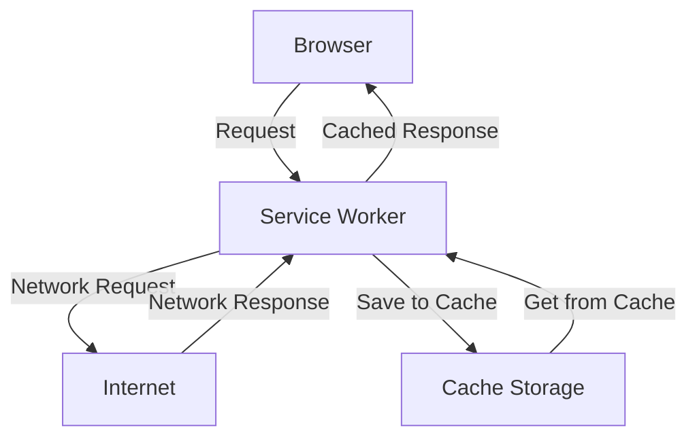

# TypeScript Service Workers

## Introduction

Service Workers are a powerful browser feature that act as a proxy between your web application and the network. They enable creating offline-capable web applications, implement sophisticated caching strategies, and handle background tasks like push notifications. When combined with TypeScript, you get the benefits of type safety, enhanced tooling, and better code organization.

In this tutorial, we'll explore how to implement Service Workers using TypeScript, helping you create more reliable and responsive web applications that can work even when the user is offline.

## What are Service Workers?

Service Workers are JavaScript files that run separately from the main browser thread, acting as programmable network proxies. They intercept network requests, cache resources, and enable features like:

- **Offline functionality**: Allow your app to work without an internet connection
- **Background processing**: Perform tasks even when your website isn't open
- **Resource caching**: Control how and when to cache network resources
- **Push notifications**: Enable web apps to receive notifications



## Setting Up TypeScript for Service Workers

First, we need to ensure our TypeScript configuration supports Service Workers. Add the following to your `tsconfig.json`:

```json
{
  "compilerOptions": {
    "target": "ES2020",
    "lib": ["DOM", "ES2020", "WebWorker"],
    "moduleResolution": "node",
    "strict": true
  }
}
```

The important part is including `"WebWorker"` in the `lib` array to access Service Worker specific types.

## Creating Your First TypeScript Service Worker

Let's create a basic Service Worker in TypeScript. First, create a file named `service-worker.ts`:

```typescript
// Define version for cache management
const CACHE_VERSION = 'v1';
const CACHE_NAME = `my-app-${CACHE_VERSION}`;

// Define assets to cache initially
const ASSETS_TO_CACHE = [
  '/',
  '/index.html',
  '/styles.css',
  '/app.js',
  '/offline.html'
];

// Listen to the install event
self.addEventListener('install', (event: ExtendableEvent) => {
  console.log('Service worker installing...');
  
  // Ensure the service worker becomes active right away
  self.skipWaiting();
  
  // Cache initial assets during installation
  event.waitUntil(
    caches.open(CACHE_NAME).then(cache => {
      console.log('Caching app shell');
      return cache.addAll(ASSETS_TO_CACHE);
    })
  );
});

// Listen to the activate event
self.addEventListener('activate', (event: ExtendableEvent) => {
  console.log('Service worker activating...');
  
  // Clean up old caches
  event.waitUntil(
    caches.keys().then(cacheNames => {
      return Promise.all(
        cacheNames
          .filter(cacheName => cacheName !== CACHE_NAME)
          .map(cacheName => {
            console.log('Removing old cache', cacheName);
            return caches.delete(cacheName);
          })
      );
    })
  );
});

// Listen to fetch events
self.addEventListener('fetch', (event: FetchEvent) => {
  console.log('Fetch intercepted for:', event.request.url);
  
  event.respondWith(
    caches.match(event.request).then(cachedResponse => {
      // Return cached response if available
      if (cachedResponse) {
        return cachedResponse;
      }
      
      // Otherwise fetch from network
      return fetch(event.request)
        .then(response => {
          // Don't cache if not a valid response
          if (!response || response.status !== 200 || response.type !== 'basic') {
            return response;
          }
          
          // Clone the response as it can only be consumed once
          const responseToCache = response.clone();
          
          // Add the new response to our cache
          caches.open(CACHE_NAME).then(cache => {
            cache.put(event.request, responseToCache);
          });
          
          return response;
        })
        .catch(() => {
          // When network fails, serve the offline page
          if (event.request.mode === 'navigate') {
            return caches.match('/offline.html');
          }
          
          return new Response('Network error happened', {
            status: 408,
            headers: { 'Content-Type': 'text/plain' }
          });
        });
    })
  );
});
```

## Registering the Service Worker

Now, let's create a TypeScript file to register our Service Worker in the main application:

```typescript
// service-worker-registration.ts

export function registerServiceWorker(): void {
  if ('serviceWorker' in navigator) {
    window.addEventListener('load', () => {
      navigator.serviceWorker.register('/service-worker.js')
        .then(registration => {
          console.log('ServiceWorker registration successful with scope: ', registration.scope);
        })
        .catch(error => {
          console.log('ServiceWorker registration failed: ', error);
        });
    });
  } else {
    console.log('Service workers are not supported in this browser.');
  }
}

// Check if service worker needs update
export function checkForUpdates(): void {
  if ('serviceWorker' in navigator) {
    navigator.serviceWorker.ready.then(registration => {
      registration.update();
    });
  }
}
```

Then import and call this function in your main application file:

```typescript
// app.ts
import { registerServiceWorker } from './service-worker-registration';

// Register the service worker
registerServiceWorker();

// Rest of your application code
document.addEventListener('DOMContentLoaded', () => {
  console.log('App initialized');
  // Your app initialization logic here
});
```

## Building and Serving the Service Worker

You'll need to compile your TypeScript Service Worker to JavaScript. Here's a simple build script using the TypeScript compiler:

```json
{
  "scripts": {
    "build": "tsc service-worker.ts --outDir dist --lib es2020,webworker",
    "build:app": "tsc app.ts --outDir dist --lib es2020,dom",
    "build:all": "npm run build && npm run build:app"
  }
}
```

## Advanced TypeScript Service Worker Patterns

### 1. Type-Safe Cache Strategies

Let's implement a more sophisticated caching strategy using TypeScript interfaces:

```typescript
// cache-strategies.ts

interface CacheStrategy {
  handle(request: Request): Promise<Response>;
}

class CacheFirst implements CacheStrategy {
  constructor(private cacheName: string) {}
  
  async handle(request: Request): Promise<Response> {
    const cache = await caches.open(this.cacheName);
    const cachedResponse = await cache.match(request);
    
    if (cachedResponse) {
      return cachedResponse;
    }
    
    const networkResponse = await fetch(request);
    cache.put(request, networkResponse.clone());
    return networkResponse;
  }
}

class NetworkFirst implements CacheStrategy {
  constructor(private cacheName: string) {}
  
  async handle(request: Request): Promise<Response> {
    const cache = await caches.open(this.cacheName);
    
    try {
      const networkResponse = await fetch(request);
      cache.put(request, networkResponse.clone());
      return networkResponse;
    } catch (error) {
      const cachedResponse = await cache.match(request);
      if (cachedResponse) {
        return cachedResponse;
      }
      throw error;
    }
  }
}

// Export our strategies
export const strategies = {
  CacheFirst,
  NetworkFirst
};
```

Now we can use these strategies in our Service Worker:

```typescript
// service-worker.ts
import { strategies } from './cache-strategies';

const CACHE_NAME = 'my-app-v1';

const imageStrategy = new strategies.CacheFirst(CACHE_NAME);
const apiStrategy = new strategies.NetworkFirst(CACHE_NAME);

self.addEventListener('fetch', (event: FetchEvent) => {
  const url = new URL(event.request.url);
  
  if (url.pathname.match(/\.(jpg|jpeg|png|gif|svg)$/)) {
    event.respondWith(imageStrategy.handle(event.request));
  } else if (url.pathname.startsWith('/api/')) {
    event.respondWith(apiStrategy.handle(event.request));
  } else {
    // Default strategy
    event.respondWith(
      caches.match(event.request)
        .then(response => response || fetch(event.request))
    );
  }
});
```

### 2. Handling Push Notifications

TypeScript allows us to create type-safe push notification handlers:

```typescript
// push-notifications.ts

interface PushNotificationData {
  title: string;
  body: string;
  icon?: string;
  badge?: string;
  tag?: string;
  data?: {
    url?: string;
    [key: string]: any;
  };
}

self.addEventListener('push', (event: PushEvent) => {
  if (!event.data) return;
  
  // Try to parse the data as JSON
  let notification: PushNotificationData;
  try {
    notification = event.data.json() as PushNotificationData;
  } catch (e) {
    // Fallback if not JSON
    notification = {
      title: 'New Notification',
      body: event.data.text()
    };
  }
  
  const showNotificationPromise = self.registration.showNotification(
    notification.title,
    {
      body: notification.body,
      icon: notification.icon || '/icons/notification-icon.png',
      badge: notification.badge || '/icons/badge-icon.png',
      tag: notification.tag,
      data: notification.data
    }
  );
  
  event.waitUntil(showNotificationPromise);
});

// Handle notification click
self.addEventListener('notificationclick', (event: NotificationEvent) => {
  event.notification.close();
  
  // Try to extract the URL from the notification data
  const urlToOpen = event.notification.data?.url || '/';
  
  event.waitUntil(
    clients.matchAll({ type: 'window', includeUncontrolled: true })
      .then(clientList => {
        // Try to focus an existing window
        for (const client of clientList) {
          if (client.url === urlToOpen && 'focus' in client) {
            return client.focus();
          }
        }
        
        // Otherwise, open a new window
        return clients.openWindow(urlToOpen);
      })
  );
});
```

## Real-World Example: Offline Blog App

Let's combine what we've learned to build a simple offline-capable blog application:

```typescript
// service-worker.ts for a blog application

// Types
type Route = {
  pattern: RegExp;
  strategy: 'cache-first' | 'network-first';
};

// Configuration
const APP_VERSION = '1.0.0';
const CACHE_NAME = `blog-app-${APP_VERSION}`;

const STATIC_ASSETS = [
  '/',
  '/index.html',
  '/styles.css',
  '/app.js',
  '/offline.html',
  '/favicon.ico'
];

const ROUTE_HANDLERS: Route[] = [
  { pattern: /\/api\/posts/, strategy: 'network-first' },
  { pattern: /\.(png|jpg|jpeg|gif|svg|webp)$/, strategy: 'cache-first' },
  { pattern: /\.(css|js)$/, strategy: 'cache-first' }
];

// Install event handler
self.addEventListener('install', (event: ExtendableEvent) => {
  event.waitUntil(
    caches.open(CACHE_NAME).then(cache => {
      console.log('Caching static assets');
      return cache.addAll(STATIC_ASSETS);
    })
  );
});

// Activate event handler
self.addEventListener('activate', (event: ExtendableEvent) => {
  event.waitUntil(
    caches.keys().then(cacheNames => {
      return Promise.all(
        cacheNames
          .filter(cacheName => cacheName.startsWith('blog-app-') && cacheName !== CACHE_NAME)
          .map(cacheName => caches.delete(cacheName))
      );
    }).then(() => {
      console.log(`${CACHE_NAME} is now ready to handle fetches!`);
      return self.clients.claim();
    })
  );
});

// Fetch event handler
self.addEventListener('fetch', (event: FetchEvent) => {
  // Find matching route handler
  const url = new URL(event.request.url);
  const matchingRoute = ROUTE_HANDLERS.find(route => 
    route.pattern.test(url.pathname)
  );
  
  if (matchingRoute) {
    if (matchingRoute.strategy === 'cache-first') {
      event.respondWith(cacheFirstStrategy(event.request));
    } else {
      event.respondWith(networkFirstStrategy(event.request));
    }
  } else {
    // Default strategy
    event.respondWith(networkFirstStrategy(event.request));
  }
});

// Cache-first strategy implementation
async function cacheFirstStrategy(request: Request): Promise<Response> {
  const cache = await caches.open(CACHE_NAME);
  const cachedResponse = await cache.match(request);
  
  if (cachedResponse) {
    return cachedResponse;
  }
  
  try {
    const networkResponse = await fetch(request);
    cache.put(request, networkResponse.clone());
    return networkResponse;
  } catch (error) {
    return new Response('Network error occurred', {
      status: 408,
      headers: { 'Content-Type': 'text/plain' }
    });
  }
}

// Network-first strategy implementation
async function networkFirstStrategy(request: Request): Promise<Response> {
  const cache = await caches.open(CACHE_NAME);
  
  try {
    const networkResponse = await fetch(request);
    cache.put(request, networkResponse.clone());
    return networkResponse;
  } catch (error) {
    const cachedResponse = await cache.match(request);
    
    if (cachedResponse) {
      return cachedResponse;
    }
    
    // For navigation requests, return the offline page
    if (request.mode === 'navigate') {
      return cache.match('/offline.html') as Promise<Response>;
    }
    
    return new Response('You are offline and the content is not available in cache', {
      status: 503,
      headers: { 'Content-Type': 'text/plain' }
    });
  }
}
```

## Best Practices for TypeScript Service Workers

1. **Use TypeScript interfaces for structured data**: Define clear interfaces for any data structures you use in your Service Worker.

2. **Avoid using DOM APIs**: Service Workers run in a different context that doesn't have access to DOM. TypeScript will help catch these errors at compile time.

3. **Handle errors gracefully**: Service Workers should provide fallbacks when operations fail.

4. **Version your cache**: Include version information in your cache names to facilitate updates.

5. **Use async/await**: Modern Service Worker code is much cleaner with async/await syntax, which TypeScript supports well.

```typescript
// Example of a well-typed error handler
async function safeRequest(request: Request): Promise<Response> {
  try {
    return await fetch(request);
  } catch (error) {
    console.error('Network request failed:', error);
    return new Response('Network error', {
      status: 503,
      headers: { 'Content-Type': 'text/plain' }
    });
  }
}
```

## Common Pitfalls and Solutions

### TypeScript Compilation Issues

**Problem**: Service Worker APIs might not be recognized in TypeScript.

**Solution**: Make sure to include `"WebWorker"` in your `lib` array in `tsconfig.json`.

### Update Issues

**Problem**: Service Workers can be hard to update due to caching.

**Solution**: Use versioning and implement a proper update strategy:

```typescript
// In your main application code
function registerAndUpdate() {
  if ('serviceWorker' in navigator) {
    navigator.serviceWorker.register('/service-worker.js')
      .then(registration => {
        // Check for updates every hour
        setInterval(() => {
          registration.update();
        }, 60 * 60 * 1000);
      });
  }
}
```

### Debugging Tips

Service Workers can be difficult to debug. Use Chrome DevTools > Application tab > Service Workers section to:

1. Check if your Service Worker is registered
2. Force update or unregister Service Workers during development
3. View console logs from Service Worker context

## Summary

Service Workers provide a powerful way to enhance web applications with offline capabilities, improved performance, and background processing features. When implemented using TypeScript, you gain type safety and better code organization, making your Service Workers more maintainable and robust.

We've covered:
- Setting up TypeScript for Service Worker development
- Creating and registering a basic Service Worker
- Implementing caching strategies
- Handling push notifications
- Building a real-world example
- Best practices and common pitfalls

By leveraging TypeScript's type system, you can create more reliable Service Workers with fewer runtime errors, providing your users with an enhanced web experience even in challenging network conditions.

## Further Learning Resources

1. **MDN Web Docs**: [Using Service Workers](https://developer.mozilla.org/en-US/docs/Web/API/Service_Worker_API/Using_Service_Workers)
2. **Google Developers**: [Service Workers: an Introduction](https://developers.google.com/web/fundamentals/primers/service-workers)
3. **TypeScript Documentation**: [Advanced Types](https://www.typescriptlang.org/docs/handbook/advanced-types.html)

## Exercises

1. Create a Service Worker that caches API responses with a maximum age of 1 hour
2. Implement a "stale-while-revalidate" caching strategy using TypeScript
3. Build a background sync feature that stores failed form submissions and retries them when connectivity is restored
4. Create a messaging system between your main application and Service Worker
5. Implement a precaching strategy that loads resources based on user behavior patterns

Happy coding with TypeScript Service Workers!