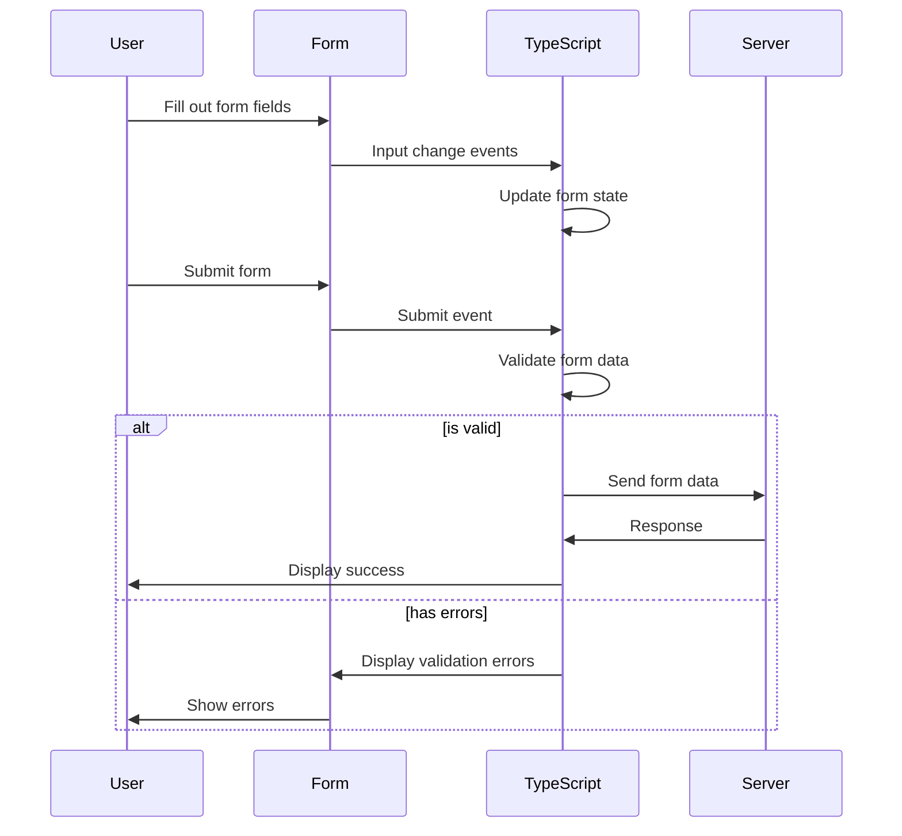

# TypeScript Forms

## Introduction

Forms are a fundamental part of web applications, allowing users to input data and interact with your application. TypeScript brings type safety to JavaScript, making it an excellent choice for handling forms by catching errors at compile time rather than runtime.

In this guide, we'll learn how to create, handle, and validate forms using TypeScript. We'll cover everything from basic form creation to complex validation patterns and best practices.

## Basic Form Handling in TypeScript

Let's start with a simple form and see how TypeScript can help us handle it effectively.

### Creating a Form Interface

First, define an interface that represents your form's data structure:

```typescript
interface UserForm {
  username: string;
  email: string;
  password: string;
  age: number;
  subscribe: boolean;
}
```

### Setting Up Form State

Now, let's create a form state using this interface:

```typescript
// Initial form state
const initialFormState: UserForm = {
  username: '',
  email: '',
  password: '',
  age: 0,
  subscribe: false
};

// State management (using a simple variable for demonstration)
let formData: UserForm = { ...initialFormState };
```

### Handling Form Events

Let's create a handler for input changes:

```typescript
function handleInputChange(event: Event): void {
  const target = event.target as HTMLInputElement;
  const value = target.type === 'checkbox' ? target.checked : target.value;
  const name = target.name as keyof UserForm;
  
  // Type assertion to handle different value types
  if (target.type === 'number') {
    formData[name] = Number(value) as any;
  } else if (target.type === 'checkbox') {
    formData[name] = Boolean(value) as any;
  } else {
    formData[name] = value as any;
  }
  
  console.log(formData);
}
```

### Basic Form Setup in HTML

Here's how we could set up the HTML with TypeScript handling:

```html
<form id="userForm">
  <div>
    <label for="username">Username:</label>
    <input type="text" id="username" name="username" required />
  </div>
  
  <div>
    <label for="email">Email:</label>
    <input type="email" id="email" name="email" required />
  </div>
  
  <div>
    <label for="password">Password:</label>
    <input type="password" id="password" name="password" required />
  </div>
  
  <div>
    <label for="age">Age:</label>
    <input type="number" id="age" name="age" />
  </div>
  
  <div>
    <label for="subscribe">Subscribe to newsletter:</label>
    <input type="checkbox" id="subscribe" name="subscribe" />
  </div>
  
  <button type="submit">Submit</button>
</form>
```

### Connecting TypeScript to the Form

```typescript
document.addEventListener('DOMContentLoaded', () => {
  const form = document.getElementById('userForm');
  
  // Add event listeners to all inputs
  const inputs = form?.querySelectorAll('input');
  inputs?.forEach(input => {
    input.addEventListener('change', handleInputChange);
  });
  
  // Form submission
  form?.addEventListener('submit', (event) => {
    event.preventDefault();
    handleFormSubmit();
  });
});

function handleFormSubmit(): void {
  console.log('Form submitted with data:', formData);
  // Here you would typically send the data to a server
}
```

## Form Validation in TypeScript

Form validation is crucial for ensuring data integrity. Let's implement some validation for our user form.

### Creating a Validation Interface

```typescript
interface ValidationErrors {
  [key: string]: string;
}

interface FormState {
  values: UserForm;
  errors: ValidationErrors;
  isValid: boolean;
}
```

### Implementing Validation Functions

```typescript
function validateForm(data: UserForm): ValidationErrors {
  const errors: ValidationErrors = {};
  
  // Username validation
  if (!data.username) {
    errors.username = "Username is required";
  } else if (data.username.length < 3) {
    errors.username = "Username must be at least 3 characters";
  }
  
  // Email validation
  if (!data.email) {
    errors.email = "Email is required";
  } else if (!/^\S+@\S+\.\S+$/.test(data.email)) {
    errors.email = "Email format is invalid";
  }
  
  // Password validation
  if (!data.password) {
    errors.password = "Password is required";
  } else if (data.password.length < 8) {
    errors.password = "Password must be at least 8 characters";
  }
  
  // Age validation
  if (data.age < 18) {
    errors.age = "You must be at least 18 years old";
  }
  
  return errors;
}

function isFormValid(errors: ValidationErrors): boolean {
  return Object.keys(errors).length === 0;
}
```

### Enhanced Form Submission with Validation

```typescript
function handleFormSubmit(): void {
  const errors = validateForm(formData);
  const isValid = isFormValid(errors);
  
  if (isValid) {
    console.log('Form submitted with valid data:', formData);
    // Send data to server
  } else {
    console.log('Form has errors:', errors);
    displayErrors(errors);
  }
}

function displayErrors(errors: ValidationErrors): void {
  // Clear previous error messages
  document.querySelectorAll('.error-message').forEach(el => el.remove());
  
  // Display new error messages
  Object.entries(errors).forEach(([field, message]) => {
    const inputElement = document.getElementById(field);
    if (inputElement) {
      const errorElement = document.createElement('div');
      errorElement.className = 'error-message';
      errorElement.textContent = message;
      errorElement.style.color = 'red';
      inputElement.parentNode?.appendChild(errorElement);
    }
  });
}
```

## Advanced Form Handling with TypeScript

Now let's look at more advanced techniques for form handling in TypeScript.

### Generic Form Handler

We can create a generic form handler that works with any form type:

```typescript
class FormHandler<T extends Record<string, any>> {
  private formData: T;
  private errors: ValidationErrors;
  private validator: (data: T) => ValidationErrors;
  
  constructor(initialState: T, validator: (data: T) => ValidationErrors) {
    this.formData = { ...initialState };
    this.errors = {};
    this.validator = validator;
  }
  
  handleChange(name: keyof T, value: any): void {
    this.formData = {
      ...this.formData,
      [name]: value
    };
  }
  
  validate(): boolean {
    this.errors = this.validator(this.formData);
    return Object.keys(this.errors).length === 0;
  }
  
  getErrors(): ValidationErrors {
    return this.errors;
  }
  
  getData(): T {
    return this.formData;
  }
  
  reset(): void {
    this.errors = {};
  }
}
```

### Using the Generic Form Handler

```typescript
// Create a user form handler
const userValidator = (data: UserForm) => {
  const errors: ValidationErrors = {};
  
  // The same validation logic as before
  if (!data.username) errors.username = "Username is required";
  // ...other validations
  
  return errors;
};

const userFormHandler = new FormHandler<UserForm>(initialFormState, userValidator);

// Example of handling an input change
document.getElementById('username')?.addEventListener('change', (e) => {
  const target = e.target as HTMLInputElement;
  userFormHandler.handleChange('username', target.value);
});

// On form submit
document.getElementById('userForm')?.addEventListener('submit', (e) => {
  e.preventDefault();
  
  if (userFormHandler.validate()) {
    console.log('Valid form data:', userFormHandler.getData());
    // Submit to server
  } else {
    console.log('Form errors:', userFormHandler.getErrors());
    // Display errors
  }
});
```

## Real-world Example: Registration Form

Let's create a complete user registration form using TypeScript and all the concepts we've covered.

### Form Interface and State

```typescript
interface RegistrationForm {
  firstName: string;
  lastName: string;
  email: string;
  password: string;
  confirmPassword: string;
  birthDate: string;
  country: string;
  terms: boolean;
}

const initialRegistrationState: RegistrationForm = {
  firstName: '',
  lastName: '',
  email: '',
  password: '',
  confirmPassword: '',
  birthDate: '',
  country: '',
  terms: false
};
```

### Validation Function

```typescript
function validateRegistration(data: RegistrationForm): ValidationErrors {
  const errors: ValidationErrors = {};
  
  // First name validation
  if (!data.firstName.trim()) {
    errors.firstName = "First name is required";
  }
  
  // Last name validation
  if (!data.lastName.trim()) {
    errors.lastName = "Last name is required";
  }
  
  // Email validation
  if (!data.email.trim()) {
    errors.email = "Email is required";
  } else if (!/^\S+@\S+\.\S+$/.test(data.email)) {
    errors.email = "Email format is invalid";
  }
  
  // Password validation
  if (!data.password) {
    errors.password = "Password is required";
  } else if (data.password.length < 8) {
    errors.password = "Password must be at least 8 characters";
  } else if (!/[A-Z]/.test(data.password) || !/[0-9]/.test(data.password)) {
    errors.password = "Password must contain at least one uppercase letter and one number";
  }
  
  // Confirm password validation
  if (data.password !== data.confirmPassword) {
    errors.confirmPassword = "Passwords don't match";
  }
  
  // Birth date validation
  if (!data.birthDate) {
    errors.birthDate = "Birth date is required";
  } else {
    const birthDateObj = new Date(data.birthDate);
    const today = new Date();
    const age = today.getFullYear() - birthDateObj.getFullYear();
    if (age < 18) {
      errors.birthDate = "You must be at least 18 years old";
    }
  }
  
  // Country validation
  if (!data.country) {
    errors.country = "Please select your country";
  }
  
  // Terms validation
  if (!data.terms) {
    errors.terms = "You must accept the terms and conditions";
  }
  
  return errors;
}
```

### Full Implementation with Form Handler

```typescript
document.addEventListener('DOMContentLoaded', () => {
  const formHandler = new FormHandler<RegistrationForm>(
    initialRegistrationState, 
    validateRegistration
  );
  
  const registrationForm = document.getElementById('registrationForm');
  
  // Handle input changes
  registrationForm?.querySelectorAll('input, select').forEach(element => {
    element.addEventListener('change', (e) => {
      const target = e.target as HTMLInputElement | HTMLSelectElement;
      const name = target.name as keyof RegistrationForm;
      
      let value: string | boolean;
      if (target instanceof HTMLInputElement && target.type === 'checkbox') {
        value = target.checked;
      } else {
        value = target.value;
      }
      
      formHandler.handleChange(name, value);
    });
  });
  
  // Handle form submission
  registrationForm?.addEventListener('submit', (e) => {
    e.preventDefault();
    
    if (formHandler.validate()) {
      const data = formHandler.getData();
      console.log('Registration successful!', data);
      
      // Example of what you might do with the form data
      fetch('/api/register', {
        method: 'POST',
        headers: {
          'Content-Type': 'application/json'
        },
        body: JSON.stringify(data)
      })
      .then(response => response.json())
      .then(result => {
        console.log('Server response:', result);
        // Handle successful registration
        alert('Registration successful!');
        registrationForm.reset();
      })
      .catch(error => {
        console.error('Error:', error);
        // Handle error
        alert('Error during registration. Please try again.');
      });
    } else {
      const errors = formHandler.getErrors();
      console.log('Validation errors:', errors);
      displayFormErrors(errors);
    }
  });
  
  function displayFormErrors(errors: ValidationErrors): void {
    // Clear previous errors
    document.querySelectorAll('.error-message').forEach(el => el.remove());
    
    // Display new errors
    Object.entries(errors).forEach(([field, message]) => {
      const element = document.getElementById(field);
      if (element) {
        const errorDiv = document.createElement('div');
        errorDiv.className = 'error-message';
        errorDiv.textContent = message;
        errorDiv.style.color = 'red';
        errorDiv.style.fontSize = '12px';
        errorDiv.style.marginTop = '5px';
        element.parentNode?.appendChild(errorDiv);
        
        // Highlight the input field
        element.classList.add('error-input');
      }
    });
  }
});
```

## Form Submission Visualization with TypeScript

Let's visualize the form submission process:



## Summary

In this guide, we've covered:

1. Basic form handling in TypeScript with type definitions for form data
2. Implementing form validation with TypeScript interfaces
3. Creating a flexible and reusable form handler
4. Building a real-world registration form example
5. Displaying validation errors and submitting form data to a server

TypeScript brings strong typing to form handling, which helps catch errors early in the development process and provides better tooling and autocompletion. By using interfaces to define your form structure and validation rules, you create more robust and maintainable web applications.

## Exercises

1. **Basic Form**: Create a simple contact form with name, email, and message fields. Implement validation that ensures all fields are filled and the email is in a valid format.

2. **Form with Conditional Fields**: Create a form where some fields appear or disappear based on other fields' values (e.g., a shipping address form that can be toggled to use the same address as billing).

3. **Multi-step Form**: Implement a multi-step form with TypeScript that maintains state between steps and validates each step before proceeding.

4. **Form with API Validation**: Create a form that checks if a username is already taken by making an API call when the user leaves the username input field.

5. **File Upload Form**: Extend your knowledge by creating a form that handles file uploads with TypeScript.

## Additional Resources

- [TypeScript Official Documentation](https://www.typescriptlang.org/docs/)
- [TypeScript Handbook: Generics](https://www.typescriptlang.org/docs/handbook/2/generics.html)
- [MDN Web Docs: Web Forms](https://developer.mozilla.org/en-US/docs/Learn/Forms)
- [Web.dev Forms Best Practices](https://web.dev/learn/forms/)

With these concepts and examples, you now have a solid foundation for building type-safe forms in your TypeScript web applications. Happy coding!