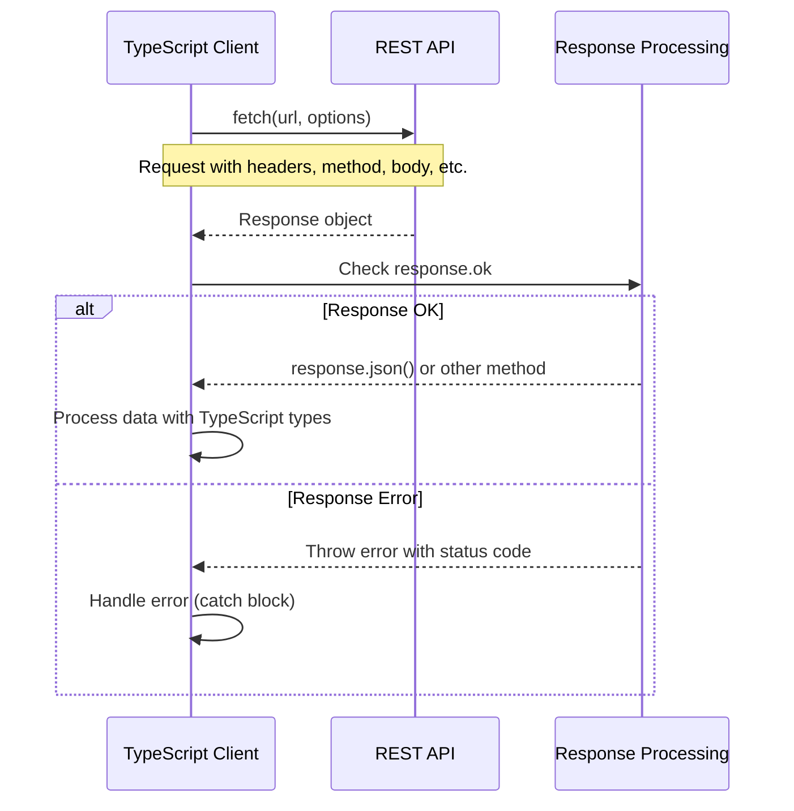

# TypeScript Fetch API

## Introduction

The Fetch API is a modern interface for making HTTP requests in web applications. It provides a more powerful and flexible feature set than older techniques like XMLHttpRequest. When combined with TypeScript, you get the additional benefits of type safety, code completion, and better error handling.

In this guide, we'll explore how to use the Fetch API with TypeScript to make HTTP requests, handle responses, work with JSON data, and implement error handling in your web applications.

## Understanding the Fetch API

The Fetch API provides a JavaScript interface for accessing and manipulating parts of the HTTP pipeline, such as requests and responses. The primary function is `fetch()`, which returns a Promise that resolves to the Response object representing the response to the request.

### Basic Syntax

```typescript
fetch(url, options)
  .then(response => response.json())
  .then(data => console.log(data))
  .catch(error => console.error('Error:', error));
```

## Setting Up TypeScript for Fetch API

Before diving into examples, let's set up the proper TypeScript types for our Fetch operations:

```typescript
// Define a type for our data
interface User {
  id: number;
  name: string;
  email: string;
}

// Define a type for API response
interface ApiResponse<T> {
  data: T;
  message: string;
  success: boolean;
}
```

## Making a Basic GET Request

Let's start with a simple GET request to retrieve data:

```typescript
function fetchUsers(): Promise<User[]> {
  return fetch('https://api.example.com/users')
    .then(response => {
      if (!response.ok) {
        throw new Error(`HTTP error! Status: ${response.status}`);
      }
      return response.json() as Promise<User[]>;
    });
}

// Usage
fetchUsers()
  .then(users => {
    console.log('Users:', users);
    users.forEach(user => {
      console.log(`User ${user.id}: ${user.name} (${user.email})`);
    });
  })
  .catch(error => {
    console.error('Failed to fetch users:', error);
  });
```

### Output

```
Users: [{ id: 1, name: "John Doe", email: "john@example.com" }, ...]
User 1: John Doe (john@example.com)
User 2: Jane Smith (jane@example.com)
...
```

## Using Async/Await with Fetch

TypeScript works wonderfully with the modern async/await syntax, making your fetch code much cleaner:

```typescript
async function fetchUserById(id: number): Promise<User> {
  try {
    const response = await fetch(`https://api.example.com/users/${id}`);
    
    if (!response.ok) {
      throw new Error(`HTTP error! Status: ${response.status}`);
    }
    
    const user = await response.json() as User;
    return user;
  } catch (error) {
    console.error(`Failed to fetch user with ID ${id}:`, error);
    throw error; // Re-throw to allow further handling
  }
}

// Usage
async function displayUser(id: number): Promise<void> {
  try {
    const user = await fetchUserById(id);
    console.log(`Found user: ${user.name} (${user.email})`);
  } catch (error) {
    console.error('Error displaying user:', error);
  }
}

// Call the function
displayUser(1);
```

### Output

```
Found user: John Doe (john@example.com)
```

## POST Requests with TypeScript

Creating a new resource typically requires a POST request:

```typescript
async function createUser(userData: Omit<User, 'id'>): Promise<User> {
  const response = await fetch('https://api.example.com/users', {
    method: 'POST',
    headers: {
      'Content-Type': 'application/json'
    },
    body: JSON.stringify(userData)
  });

  if (!response.ok) {
    throw new Error(`HTTP error! Status: ${response.status}`);
  }

  return response.json() as Promise<User>;
}

// Usage
const newUser = {
  name: 'Alice Johnson',
  email: 'alice@example.com'
};

createUser(newUser)
  .then(createdUser => {
    console.log('User created successfully:', createdUser);
  })
  .catch(error => {
    console.error('Failed to create user:', error);
  });
```

### Output

```
User created successfully: { id: 3, name: "Alice Johnson", email: "alice@example.com" }
```

## Creating a Generic Fetch Utility

Let's create a reusable, type-safe fetch utility that can be used throughout your application:

```typescript
class HttpClient {
  private baseUrl: string;
  
  constructor(baseUrl: string) {
    this.baseUrl = baseUrl;
  }
  
  async get<T>(endpoint: string): Promise<T> {
    const response = await fetch(`${this.baseUrl}${endpoint}`);
    
    if (!response.ok) {
      throw new Error(`HTTP error! Status: ${response.status}`);
    }
    
    return response.json() as Promise<T>;
  }
  
  async post<T, U>(endpoint: string, data: T): Promise<U> {
    const response = await fetch(`${this.baseUrl}${endpoint}`, {
      method: 'POST',
      headers: {
        'Content-Type': 'application/json'
      },
      body: JSON.stringify(data)
    });
    
    if (!response.ok) {
      throw new Error(`HTTP error! Status: ${response.status}`);
    }
    
    return response.json() as Promise<U>;
  }
  
  async put<T, U>(endpoint: string, data: T): Promise<U> {
    const response = await fetch(`${this.baseUrl}${endpoint}`, {
      method: 'PUT',
      headers: {
        'Content-Type': 'application/json'
      },
      body: JSON.stringify(data)
    });
    
    if (!response.ok) {
      throw new Error(`HTTP error! Status: ${response.status}`);
    }
    
    return response.json() as Promise<U>;
  }
  
  async delete<T>(endpoint: string): Promise<T> {
    const response = await fetch(`${this.baseUrl}${endpoint}`, {
      method: 'DELETE'
    });
    
    if (!response.ok) {
      throw new Error(`HTTP error! Status: ${response.status}`);
    }
    
    return response.json() as Promise<T>;
  }
}

// Usage
const apiClient = new HttpClient('https://api.example.com');

// GET request
const getUsers = async (): Promise<void> => {
  try {
    const users = await apiClient.get<User[]>('/users');
    console.log('Users:', users);
  } catch (error) {
    console.error('Error fetching users:', error);
  }
};

// POST request
const addUser = async (user: Omit<User, 'id'>): Promise<void> => {
  try {
    const newUser = await apiClient.post<Omit<User, 'id'>, User>('/users', user);
    console.log('New user created:', newUser);
  } catch (error) {
    console.error('Error creating user:', error);
  }
};
```

## Advanced Features

### Working with Request Headers

TypeScript helps ensure you're using the correct header names and values:

```typescript
type HeadersInit = Headers | string[][] | Record<string, string>;

function fetchWithAuth(url: string, token: string): Promise<Response> {
  const headers: HeadersInit = {
    'Authorization': `Bearer ${token}`,
    'Content-Type': 'application/json'
  };
  
  return fetch(url, {
    headers
  });
}

// Usage
const token = 'your-auth-token';
fetchWithAuth('https://api.example.com/protected-resource', token)
  .then(response => response.json())
  .then(data => console.log('Protected data:', data))
  .catch(error => console.error('Auth error:', error));
```

### Handling Different Response Types

The Fetch API can handle various response types, not just JSON:

```typescript
async function fetchImage(url: string): Promise<Blob> {
  const response = await fetch(url);
  
  if (!response.ok) {
    throw new Error(`Failed to fetch image: ${response.status}`);
  }
  
  return response.blob();
}

// Usage
fetchImage('https://example.com/image.jpg')
  .then(imageBlob => {
    const imageUrl = URL.createObjectURL(imageBlob);
    const imgElement = document.createElement('img');
    imgElement.src = imageUrl;
    document.body.appendChild(imgElement);
  })
  .catch(error => console.error('Image fetch error:', error));
```

### Handling Timeouts

The Fetch API doesn't natively support timeouts, but we can implement it with TypeScript:

```typescript
function fetchWithTimeout<T>(
  url: string, 
  options: RequestInit = {}, 
  timeout: number = 5000
): Promise<T> {
  return Promise.race([
    fetch(url, options)
      .then(response => {
        if (!response.ok) {
          throw new Error(`HTTP error! Status: ${response.status}`);
        }
        return response.json() as Promise<T>;
      }),
    new Promise<never>((_, reject) =>
      setTimeout(() => reject(new Error(`Request timed out after ${timeout}ms`)), timeout)
    )
  ]);
}

// Usage
fetchWithTimeout<User[]>('https://api.example.com/users', {}, 3000)
  .then(users => console.log('Users:', users))
  .catch(error => console.error('Error or timeout:', error.message));
```

### Handling Request Cancellation

With the AbortController API, you can cancel fetch requests:

```typescript
function createCancellableFetch<T>(url: string, options: RequestInit = {}): { 
  promise: Promise<T>, 
  cancel: () => void 
} {
  const controller = new AbortController();
  const { signal } = controller;
  
  const promise = fetch(url, { ...options, signal })
    .then(response => {
      if (!response.ok) {
        throw new Error(`HTTP error! Status: ${response.status}`);
      }
      return response.json() as Promise<T>;
    });
    
  return {
    promise,
    cancel: () => controller.abort()
  };
}

// Usage
const { promise, cancel } = createCancellableFetch<User[]>('https://api.example.com/users');

// To cancel the request after 2 seconds
setTimeout(() => {
  console.log('Cancelling request...');
  cancel();
}, 2000);

promise
  .then(users => console.log('Users:', users))
  .catch(error => {
    if (error.name === 'AbortError') {
      console.log('Request was cancelled');
    } else {
      console.error('Error:', error);
    }
  });
```

## Real-World Example: Building a Data Service

Let's create a complete data service for a blog application:

```typescript
// Define our data models
interface Post {
  id: number;
  title: string;
  body: string;
  authorId: number;
}

interface Comment {
  id: number;
  postId: number;
  name: string;
  email: string;
  body: string;
}

// Create a BlogService class
class BlogService {
  private apiClient: HttpClient;
  
  constructor(baseUrl: string) {
    this.apiClient = new HttpClient(baseUrl);
  }
  
  // Post methods
  async getPosts(): Promise<Post[]> {
    return this.apiClient.get<Post[]>('/posts');
  }
  
  async getPostById(id: number): Promise<Post> {
    return this.apiClient.get<Post>(`/posts/${id}`);
  }
  
  async createPost(post: Omit<Post, 'id'>): Promise<Post> {
    return this.apiClient.post<Omit<Post, 'id'>, Post>('/posts', post);
  }
  
  async updatePost(id: number, post: Partial<Post>): Promise<Post> {
    return this.apiClient.put<Partial<Post>, Post>(`/posts/${id}`, post);
  }
  
  async deletePost(id: number): Promise<void> {
    return this.apiClient.delete<void>(`/posts/${id}`);
  }
  
  // Comment methods
  async getCommentsByPostId(postId: number): Promise<Comment[]> {
    return this.apiClient.get<Comment[]>(`/posts/${postId}/comments`);
  }
  
  async addComment(comment: Omit<Comment, 'id'>): Promise<Comment> {
    return this.apiClient.post<Omit<Comment, 'id'>, Comment>('/comments', comment);
  }
}

// Usage
const blogService = new BlogService('https://jsonplaceholder.typicode.com');

async function displayPostWithComments(postId: number): Promise<void> {
  try {
    const [post, comments] = await Promise.all([
      blogService.getPostById(postId),
      blogService.getCommentsByPostId(postId)
    ]);
    
    console.log('Post:', post);
    console.log(`Comments (${comments.length}):`);
    comments.forEach(comment => {
      console.log(`- ${comment.name} (${comment.email}): ${comment.body.substring(0, 50)}...`);
    });
  } catch (error) {
    console.error('Error displaying post:', error);
  }
}

// Call the function
displayPostWithComments(1);
```

### Flow of a Fetch Request

Here's a diagram showing the flow of a typical fetch request:



## Error Handling Best Practices

TypeScript can help create more robust error handling:

```typescript
// Define custom error types
class NetworkError extends Error {
  constructor(message: string) {
    super(message);
    this.name = 'NetworkError';
  }
}

class ApiError extends Error {
  status: number;
  
  constructor(message: string, status: number) {
    super(message);
    this.name = 'ApiError';
    this.status = status;
  }
}

// Enhanced fetch with better error handling
async function enhancedFetch<T>(url: string, options: RequestInit = {}): Promise<T> {
  try {
    const response = await fetch(url, options);
    
    if (!response.ok) {
      // Handle different status codes
      if (response.status === 404) {
        throw new ApiError('Resource not found', response.status);
      } else if (response.status === 401) {
        throw new ApiError('Unauthorized access', response.status);
      } else {
        throw new ApiError(`API error: ${response.statusText}`, response.status);
      }
    }
    
    return await response.json() as T;
  } catch (error) {
    // Handle network errors
    if (error instanceof TypeError && error.message === 'Failed to fetch') {
      throw new NetworkError('Network connectivity issue');
    }
    
    // Re-throw other errors
    throw error;
  }
}

// Usage with proper error handling
async function fetchUserWithErrorHandling(id: number): Promise<void> {
  try {
    const user = await enhancedFetch<User>(`https://api.example.com/users/${id}`);
    console.log('User:', user);
  } catch (error) {
    if (error instanceof NetworkError) {
      console.error('Network error occurred. Please check your connection.');
    } else if (error instanceof ApiError) {
      if (error.status === 404) {
        console.error(`User with ID ${id} not found.`);
      } else if (error.status === 401) {
        console.error('Authentication required. Please log in again.');
      } else {
        console.error(`API error (${error.status}): ${error.message}`);
      }
    } else {
      console.error('Unknown error:', error);
    }
  }
}
```

## Summary

In this guide, we've explored how to use the Fetch API with TypeScript to make web requests. We've covered:

1. Setting up TypeScript for making HTTP requests
2. Making GET, POST, PUT, and DELETE requests
3. Handling responses and different data types
4. Creating reusable HTTP client utilities
5. Working with request headers
6. Implementing advanced features like timeouts and request cancellation
7. Building a real-world data service
8. Implementing robust error handling

By combining TypeScript's type safety with the Fetch API's modern approach to HTTP requests, you can build more reliable, maintainable, and robust web applications.

## Additional Resources and Exercises

### Practice Exercises

1. **Basic Fetch Exercise**: Create a function that fetches and displays a list of products from a fictional e-commerce API.

2. **Error Handling Exercise**: Enhance the product fetch function to handle different error types (network errors, 404 errors, server errors).

3. **Advanced Exercise**: Create a paginated data fetch utility that loads data in chunks when the user scrolls to the bottom of the page.

4. **Authentication Exercise**: Build a login service that stores and sends authentication tokens with each request.

### Further Reading

- [TypeScript Documentation](https://www.typescriptlang.org/docs/)
- [MDN Fetch API Guide](https://developer.mozilla.org/en-US/docs/Web/API/Fetch_API)
- [Best Practices for API Error Handling](https://blog.restcase.com/rest-api-error-codes-101/)
- [TypeScript Generics](https://www.typescriptlang.org/docs/handbook/2/generics.html)

Keep practicing and experimenting with TypeScript and the Fetch API to build increasingly complex and robust web applications!