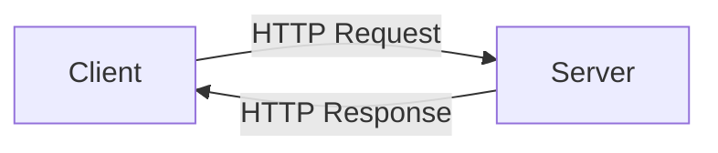

# TypeScript HTTP Requests

## Introduction

HTTP requests are the foundation of modern web applications, enabling communication between clients and servers across the internet. In this guide, we'll explore how to make HTTP requests in TypeScript applications to interact with external APIs, fetch data, and send information to servers.

TypeScript adds strong typing to JavaScript, making HTTP requests more reliable and maintainable by providing type safety for request configurations and response data. This helps catch potential errors during development rather than at runtime.

## Understanding HTTP Requests

Before diving into code examples, let's understand the basics of HTTP requests:



HTTP requests consist of:
- **Method** (GET, POST, PUT, DELETE, etc.)
- **URL** (the endpoint you're requesting)
- **Headers** (metadata about the request)
- **Body** (data sent to the server, for methods like POST)

## Methods for Making HTTP Requests in TypeScript

### 1. Using the Fetch API

The Fetch API is built into modern browsers and provides a simple interface for making HTTP requests.

#### Basic GET Request

```typescript
async function fetchUsers(): Promise<User[]> {
  try {
    const response = await fetch('https://api.example.com/users');
    
    if (!response.ok) {
      throw new Error(`HTTP error! Status: ${response.status}`);
    }
    
    const data: User[] = await response.json();
    return data;
  } catch (error) {
    console.error('Failed to fetch users:', error);
    throw error;
  }
}

// Define the User interface for type safety
interface User {
  id: number;
  name: string;
  email: string;
}

// Usage
fetchUsers()
  .then(users => {
    console.log('Users:', users);
    // Output: Users: [{id: 1, name: "John Doe", email: "john@example.com"}, ...]
  })
  .catch(error => {
    console.error('Error in component:', error);
  });
```

#### POST Request with Fetch

```typescript
interface CreateUserRequest {
  name: string;
  email: string;
  password: string;
}

interface CreateUserResponse {
  id: number;
  name: string;
  email: string;
  createdAt: string;
}

async function createUser(userData: CreateUserRequest): Promise<CreateUserResponse> {
  try {
    const response = await fetch('https://api.example.com/users', {
      method: 'POST',
      headers: {
        'Content-Type': 'application/json',
      },
      body: JSON.stringify(userData),
    });

    if (!response.ok) {
      throw new Error(`HTTP error! Status: ${response.status}`);
    }

    return await response.json() as CreateUserResponse;
  } catch (error) {
    console.error('Failed to create user:', error);
    throw error;
  }
}

// Usage
const newUser: CreateUserRequest = {
  name: 'Jane Smith',
  email: 'jane@example.com',
  password: 'securePassword123',
};

createUser(newUser)
  .then(createdUser => {
    console.log('User created successfully:', createdUser);
    // Output: User created successfully: {id: 2, name: "Jane Smith", email: "jane@example.com", createdAt: "2023-07-25T14:30:00Z"}
  })
  .catch(error => {
    console.error('Error creating user:', error);
  });
```

### 2. Using Axios

Axios is a popular HTTP client library that provides a more feature-rich alternative to the Fetch API. First, you'll need to install it:

```bash
npm install axios
# or with yarn
yarn add axios
```

#### Setting Up Axios with TypeScript

```typescript
import axios, { AxiosResponse, AxiosError } from 'axios';

// Create a typed instance of axios
const api = axios.create({
  baseURL: 'https://api.example.com',
  timeout: 10000,
  headers: {
    'Content-Type': 'application/json',
  },
});

// Define response types
interface User {
  id: number;
  name: string;
  email: string;
}

// GET request with Axios
async function getUsers(): Promise<User[]> {
  try {
    const response: AxiosResponse<User[]> = await api.get('/users');
    return response.data;
  } catch (error) {
    const axiosError = error as AxiosError;
    console.error('Error fetching users:', axiosError.message);
    throw error;
  }
}

// Usage
getUsers()
  .then(users => {
    console.log('Users:', users);
    // Output: Users: [{id: 1, name: "John Doe", email: "john@example.com"}, ...]
  })
  .catch(error => {
    console.error('Error in component:', error);
  });
```

#### POST Request with Axios

```typescript
interface CreateUserRequest {
  name: string;
  email: string;
  password: string;
}

interface CreateUserResponse {
  id: number;
  name: string;
  email: string;
  createdAt: string;
}

async function createUser(userData: CreateUserRequest): Promise<CreateUserResponse> {
  try {
    const response: AxiosResponse<CreateUserResponse> = await api.post('/users', userData);
    return response.data;
  } catch (error) {
    const axiosError = error as AxiosError;
    console.error('Error creating user:', axiosError.message);
    
    // You can also access the response if available
    if (axiosError.response) {
      console.error('Server responded with:', axiosError.response.data);
      console.error('Status code:', axiosError.response.status);
    }
    
    throw error;
  }
}
```

## Creating a Reusable API Client

For larger applications, it's a good practice to create a reusable API client:

```typescript
// api-client.ts
import axios, { AxiosInstance, AxiosResponse, AxiosRequestConfig } from 'axios';

// Define commonly used response types
export interface ApiResponse<T> {
  data: T;
  message: string;
  success: boolean;
}

export class ApiClient {
  private client: AxiosInstance;
  
  constructor(baseURL: string) {
    this.client = axios.create({
      baseURL,
      timeout: 10000,
      headers: {
        'Content-Type': 'application/json',
      },
    });
    
    // Add request interceptor for auth tokens, etc.
    this.client.interceptors.request.use(
      (config) => {
        const token = localStorage.getItem('authToken');
        if (token) {
          config.headers.Authorization = `Bearer ${token}`;
        }
        return config;
      },
      (error) => Promise.reject(error)
    );
    
    // Add response interceptor for error handling
    this.client.interceptors.response.use(
      (response) => response,
      (error) => {
        // Handle common errors like 401 Unauthorized
        if (error.response && error.response.status === 401) {
          // Redirect to login or refresh token
          console.log('Session expired. Redirecting to login...');
        }
        return Promise.reject(error);
      }
    );
  }
  
  async get<T>(url: string, config?: AxiosRequestConfig): Promise<T> {
    const response: AxiosResponse<T> = await this.client.get(url, config);
    return response.data;
  }
  
  async post<T>(url: string, data?: any, config?: AxiosRequestConfig): Promise<T> {
    const response: AxiosResponse<T> = await this.client.post(url, data, config);
    return response.data;
  }
  
  async put<T>(url: string, data?: any, config?: AxiosRequestConfig): Promise<T> {
    const response: AxiosResponse<T> = await this.client.put(url, data, config);
    return response.data;
  }
  
  async delete<T>(url: string, config?: AxiosRequestConfig): Promise<T> {
    const response: AxiosResponse<T> = await this.client.delete(url, config);
    return response.data;
  }
}

// Usage
export default new ApiClient('https://api.example.com');
```

### Using the API Client

```typescript
// users-service.ts
import apiClient, { ApiResponse } from './api-client';

interface User {
  id: number;
  name: string;
  email: string;
}

interface CreateUserRequest {
  name: string;
  email: string;
  password: string;
}

export const UsersService = {
  async getUsers(): Promise<User[]> {
    return await apiClient.get<User[]>('/users');
  },
  
  async getUserById(id: number): Promise<User> {
    return await apiClient.get<User>(`/users/${id}`);
  },
  
  async createUser(userData: CreateUserRequest): Promise<ApiResponse<User>> {
    return await apiClient.post<ApiResponse<User>>('/users', userData);
  },
  
  async updateUser(id: number, userData: Partial<User>): Promise<ApiResponse<User>> {
    return await apiClient.put<ApiResponse<User>>(`/users/${id}`, userData);
  },
  
  async deleteUser(id: number): Promise<ApiResponse<null>> {
    return await apiClient.delete<ApiResponse<null>>(`/users/${id}`);
  }
};

// Using the service in a component or another service
async function loadUserData() {
  try {
    const users = await UsersService.getUsers();
    console.log('Users loaded:', users);
    
    if (users.length > 0) {
      const firstUser = await UsersService.getUserById(users[0].id);
      console.log('First user details:', firstUser);
    }
  } catch (error) {
    console.error('Failed to load user data:', error);
  }
}
```

## Error Handling Best Practices

Error handling is crucial when working with HTTP requests. Here's a comprehensive approach:

```typescript
interface ApiError {
  status: number;
  message: string;
  errors?: Record<string, string[]>;
}

async function fetchWithErrorHandling<T>(
  requestFn: () => Promise<T>
): Promise<T> {
  try {
    return await requestFn();
  } catch (error) {
    if (axios.isAxiosError(error) && error.response) {
      // Handle specific status codes
      const status = error.response.status;
      
      switch (status) {
        case 400:
          console.error('Bad Request:', error.response.data);
          throw new Error('The request was invalid. Please check your input.');
          
        case 401:
          console.error('Unauthorized:', error.response.data);
          // Redirect to login or refresh token
          throw new Error('Your session has expired. Please log in again.');
          
        case 403:
          console.error('Forbidden:', error.response.data);
          throw new Error('You do not have permission to access this resource.');
          
        case 404:
          console.error('Not Found:', error.response.data);
          throw new Error('The requested resource was not found.');
          
        case 422:
          console.error('Validation Error:', error.response.data);
          const apiError = error.response.data as ApiError;
          
          if (apiError.errors) {
            // Format validation errors nicely
            const errorMessages = Object.entries(apiError.errors)
              .map(([field, messages]) => `${field}: ${messages.join(', ')}`)
              .join('; ');
            throw new Error(`Validation error: ${errorMessages}`);
          }
          throw new Error('The provided data failed validation.');
          
        case 500:
        case 502:
        case 503:
          console.error('Server Error:', error.response.data);
          throw new Error('A server error occurred. Please try again later.');
          
        default:
          console.error(`Unexpected error (${status}):`, error.response.data);
          throw new Error('An unexpected error occurred.');
      }
    } else if (error instanceof Error) {
      // Network errors, timeouts, etc.
      console.error('Request failed:', error.message);
      throw new Error('Failed to connect to the server. Please check your internet connection.');
    } else {
      console.error('Unknown error:', error);
      throw new Error('An unknown error occurred.');
    }
  }
}

// Usage
async function loadData() {
  try {
    const users = await fetchWithErrorHandling(() => 
      UsersService.getUsers()
    );
    console.log('Users loaded successfully:', users);
  } catch (error) {
    if (error instanceof Error) {
      // Display user-friendly error message
      alert(error.message);
    }
  }
}
```

## Real-World Example: Building a Weather App

Let's create a practical example of a weather app that fetches data from a weather API:

```typescript
// weather-service.ts
import axios from 'axios';

interface WeatherData {
  location: {
    name: string;
    country: string;
  };
  current: {
    temperature: number;
    condition: {
      text: string;
      icon: string;
    };
    humidity: number;
    windSpeed: number;
  };
  forecast: {
    date: string;
    maxTemp: number;
    minTemp: number;
    condition: string;
    chanceOfRain: number;
  }[];
}

interface WeatherApiResponse {
  location: {
    name: string;
    country: string;
  };
  current: {
    temp_c: number;
    condition: {
      text: string;
      icon: string;
    };
    humidity: number;
    wind_kph: number;
  };
  forecast: {
    forecastday: Array<{
      date: string;
      day: {
        maxtemp_c: number;
        mintemp_c: number;
        condition: {
          text: string;
        };
        daily_chance_of_rain: number;
      };
    }>;
  };
}

export class WeatherService {
  private readonly apiKey: string;
  private readonly baseUrl: string;
  
  constructor(apiKey: string) {
    this.apiKey = apiKey;
    this.baseUrl = 'https://api.weatherapi.com/v1';
  }
  
  async getWeather(city: string, days = 3): Promise<WeatherData> {
    try {
      const response = await axios.get<WeatherApiResponse>(
        `${this.baseUrl}/forecast.json`,
        {
          params: {
            key: this.apiKey,
            q: city,
            days: days,
          },
        }
      );
      
      // Transform API response to our internal format
      return {
        location: {
          name: response.data.location.name,
          country: response.data.location.country,
        },
        current: {
          temperature: response.data.current.temp_c,
          condition: {
            text: response.data.current.condition.text,
            icon: response.data.current.condition.icon,
          },
          humidity: response.data.current.humidity,
          windSpeed: response.data.current.wind_kph,
        },
        forecast: response.data.forecast.forecastday.map(day => ({
          date: day.date,
          maxTemp: day.day.maxtemp_c,
          minTemp: day.day.mintemp_c,
          condition: day.day.condition.text,
          chanceOfRain: day.day.daily_chance_of_rain,
        })),
      };
    } catch (error) {
      if (axios.isAxiosError(error) && error.response) {
        if (error.response.status === 400) {
          throw new Error('City not found. Please check the city name.');
        } else {
          throw new Error(`Weather service error: ${error.response.data.error.message || 'Unknown error'}`);
        }
      }
      throw new Error('Failed to fetch weather data. Please try again later.');
    }
  }
}

// Usage example
const weatherService = new WeatherService('your_api_key_here');

async function displayWeather() {
  try {
    const weatherData = await weatherService.getWeather('London');
    
    console.log(`Current weather in ${weatherData.location.name}, ${weatherData.location.country}:`);
    console.log(`Temperature: ${weatherData.current.temperature}°C`);
    console.log(`Condition: ${weatherData.current.condition.text}`);
    console.log(`Humidity: ${weatherData.current.humidity}%`);
    console.log(`Wind Speed: ${weatherData.current.windSpeed} km/h`);
    
    console.log('\nForecast:');
    weatherData.forecast.forEach(day => {
      console.log(`Date: ${day.date}`);
      console.log(`Max/Min Temp: ${day.maxTemp}°C/${day.minTemp}°C`);
      console.log(`Condition: ${day.condition}`);
      console.log(`Chance of Rain: ${day.chanceOfRain}%`);
      console.log('-----------------');
    });
  } catch (error) {
    console.error(error instanceof Error ? error.message : 'Unknown error');
  }
}

displayWeather();
```

## Best Practices for TypeScript HTTP Requests

1. **Use Interfaces for Request and Response Types**: Define clear interfaces for API requests and responses to leverage TypeScript's type checking.

2. **Centralize API Logic**: Create dedicated service classes or functions for API calls to maintain a separation of concerns.

3. **Handle Errors Gracefully**: Implement comprehensive error handling to provide meaningful feedback to users.

4. **Use Environment Variables for API Keys**: Store API keys and base URLs in environment variables rather than hardcoding them.

5. **Add Request Timeouts**: Set reasonable timeouts to avoid hanging requests.

6. **Implement Retry Logic for Transient Failures**:

```typescript
async function fetchWithRetry<T>(
  fn: () => Promise<T>,
  retries = 3,
  delay = 1000
): Promise<T> {
  try {
    return await fn();
  } catch (error) {
    // Don't retry for client errors (4xx)
    if (
      axios.isAxiosError(error) && 
      error.response && 
      error.response.status >= 400 && 
      error.response.status < 500
    ) {
      throw error;
    }
    
    if (retries <= 0) {
      throw error;
    }
    
    console.log(`Request failed. Retrying in ${delay}ms... (${retries} attempts left)`);
    await new Promise(resolve => setTimeout(resolve, delay));
    
    // Exponential backoff
    return fetchWithRetry(fn, retries - 1, delay * 2);
  }
}

// Usage
fetchWithRetry(() => api.get('/users'))
  .then(data => console.log('Success:', data))
  .catch(error => console.error('All retries failed:', error));
```

## Summary

HTTP requests are fundamental to modern web applications, allowing clients to communicate with servers and external APIs. In this guide, we explored:

- Making HTTP requests using the Fetch API and Axios in TypeScript
- Creating strongly typed request and response interfaces
- Building a reusable API client
- Implementing comprehensive error handling
- Creating a real-world weather application

TypeScript enhances HTTP requests by providing type safety, which helps catch potential errors during development and makes your code more maintainable. By following the best practices outlined in this guide, you can create robust, type-safe HTTP communications in your TypeScript applications.

## Additional Resources and Exercises

### Resources
- [Axios Documentation](https://axios-http.com/docs/intro)
- [MDN Fetch API Guide](https://developer.mozilla.org/en-US/docs/Web/API/Fetch_API)
- [TypeScript Handbook](https://www.typescriptlang.org/docs/handbook/intro.html)

### Exercises

1. **Basic API Client**: Create a simple API client that can make GET, POST, PUT, and DELETE requests to the JSONPlaceholder API (https://jsonplaceholder.typicode.com/).

2. **Todo Application**: Build a todo application that uses TypeScript HTTP requests to store and retrieve todo items from a backend service.

3. **Authentication System**: Implement a user authentication system with login, registration, and protected routes using JWT tokens.

4. **Pagination and Filtering**: Extend the API client to support pagination, sorting, and filtering of results.

5. **Rate Limiting and Caching**: Add response caching and implement a rate limiting mechanism to prevent too many requests to the same endpoint.