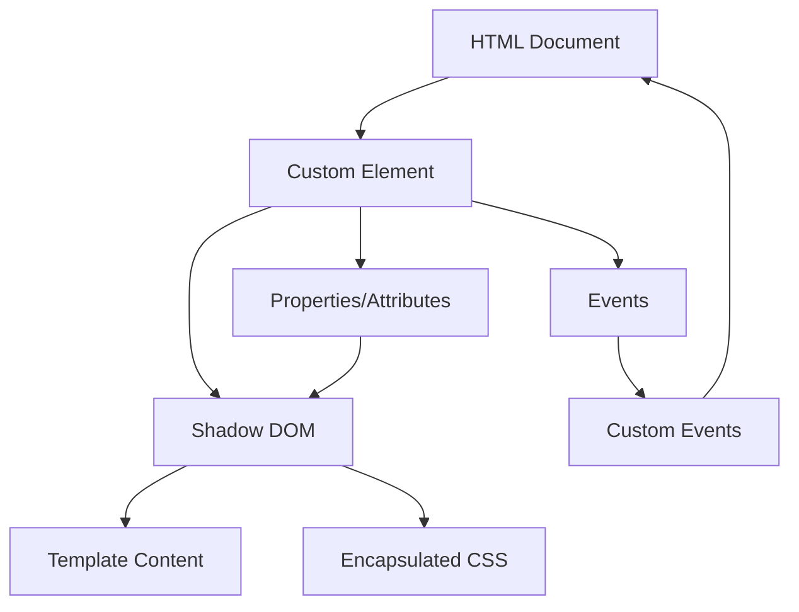

# TypeScript Web Components

## Introduction

Web Components are a set of standardized web platform APIs that allow you to create custom, reusable HTML elements that encapsulate their functionality and styling. By combining Web Components with TypeScript, you can build strongly-typed, modular components that can be used across different frameworks or in vanilla JavaScript applications.

In this guide, you'll learn how to use TypeScript to create Web Components that are:
- Reusable across projects
- Framework-agnostic
- Type-safe and maintainable
- Encapsulated with their own styling and behavior

## Understanding Web Components

Web Components are built on four main technologies:

1. **Custom Elements**: JavaScript APIs to define new HTML elements
2. **Shadow DOM**: Encapsulated DOM and styling
3. **HTML Templates**: Reusable HTML structures
4. **ES Modules**: JavaScript module system for organization

Let's explore how TypeScript enhances these technologies.

## Setting Up Your Environment

Before we start building Web Components with TypeScript, let's set up our development environment:

```bash
# Create a new project directory
mkdir ts-web-components
cd ts-web-components

# Initialize a new npm project
npm init -y

# Install TypeScript and development dependencies
npm install typescript --save-dev
npm install --save-dev webpack webpack-cli webpack-dev-server ts-loader

# Initialize TypeScript configuration
npx tsc --init
```

Configure your `tsconfig.json` for Web Components:

```json
{
  "compilerOptions": {
    "target": "ES2020",
    "module": "ESNext",
    "moduleResolution": "node",
    "strict": true,
    "declaration": true,
    "outDir": "./dist",
    "experimentalDecorators": true,
    "lib": ["DOM", "DOM.Iterable", "ESNext"],
    "sourceMap": true
  },
  "include": ["src/**/*"]
}
```

## Creating Your First Web Component with TypeScript

Let's create a simple counter component to demonstrate the basics:

### 1. Define the Component Class

Create a file named `src/counter-element.ts`:

```typescript
export class CounterElement extends HTMLElement {
  private _count: number = 0;
  private countDisplay: HTMLElement | null = null;
  
  constructor() {
    super();
    // Create a shadow root
    this.attachShadow({ mode: 'open' });
  }
  
  // Lifecycle method when element is added to DOM
  connectedCallback() {
    this.render();
    this.addEventListeners();
  }
  
  // Render the component's HTML
  private render() {
    if (this.shadowRoot) {
      this.shadowRoot.innerHTML = `
        <style>
          :host {
            display: block;
            font-family: sans-serif;
            text-align: center;
            padding: 1rem;
            border: 1px solid #ccc;
            border-radius: 4px;
            max-width: 200px;
          }
          .counter {
            font-size: 2rem;
            margin: 1rem 0;
          }
          button {
            padding: 0.5rem 1rem;
            margin: 0 0.25rem;
            border: none;
            background-color: #0077cc;
            color: white;
            border-radius: 4px;
            cursor: pointer;
          }
          button:hover {
            background-color: #005fa3;
          }
        </style>
        <div>
          <h2>Counter</h2>
          <div class="counter">${this._count}</div>
          <div>
            <button id="decrement">-</button>
            <button id="increment">+</button>
          </div>
        </div>
      `;
      
      this.countDisplay = this.shadowRoot.querySelector('.counter');
    }
  }
  
  // Add event listeners for buttons
  private addEventListeners() {
    if (this.shadowRoot) {
      const incrementBtn = this.shadowRoot.getElementById('increment');
      const decrementBtn = this.shadowRoot.getElementById('decrement');
      
      incrementBtn?.addEventListener('click', () => this.increment());
      decrementBtn?.addEventListener('click', () => this.decrement());
    }
  }
  
  // Methods to modify the counter
  increment() {
    this._count++;
    this.updateDisplay();
  }
  
  decrement() {
    this._count--;
    this.updateDisplay();
  }
  
  // Update the display with the current count
  private updateDisplay() {
    if (this.countDisplay) {
      this.countDisplay.textContent = this._count.toString();
    }
  }
}

// Register the custom element
customElements.define('ts-counter', CounterElement);
```

### 2. Create the Main Entry File

Create a file named `src/index.ts`:

```typescript
import './counter-element';

console.log('Web Components loaded');
```

### 3. Using Your Component in HTML

Create an `index.html` file:

```html
<!DOCTYPE html>
<html lang="en">
<head>
  <meta charset="UTF-8">
  <meta name="viewport" content="width=device-width, initial-scale=1.0">
  <title>TypeScript Web Components Demo</title>
  <script src="dist/bundle.js" defer></script>
</head>
<body>
  <h1>TypeScript Web Components Demo</h1>
  
  <ts-counter></ts-counter>
  
  <p>This counter is a custom web component built with TypeScript.</p>
</body>
</html>
```

## Working with Properties and Attributes

Web Components need to handle both properties (JavaScript) and attributes (HTML). Let's enhance our counter component to handle attributes:

```typescript
export class CounterElement extends HTMLElement {
  private _count: number = 0;
  private countDisplay: HTMLElement | null = null;
  
  // Specify observed attributes
  static get observedAttributes(): string[] {
    return ['initial-value', 'step'];
  }
  
  // Getter/setter for count property
  get count(): number {
    return this._count;
  }
  
  set count(value: number) {
    this._count = value;
    this.updateDisplay();
  }
  
  // Get step value from attribute
  get step(): number {
    return Number(this.getAttribute('step') || 1);
  }
  
  constructor() {
    super();
    this.attachShadow({ mode: 'open' });
  }
  
  // Handle attribute changes
  attributeChangedCallback(name: string, oldValue: string, newValue: string) {
    if (name === 'initial-value' && newValue !== oldValue) {
      this._count = Number(newValue || 0);
      this.updateDisplay();
    }
  }
  
  connectedCallback() {
    // Initialize with initial-value attribute if present
    const initialValue = this.getAttribute('initial-value');
    if (initialValue !== null) {
      this._count = Number(initialValue);
    }
    
    this.render();
    this.addEventListeners();
  }
  
  // Other methods remain the same...
  
  increment() {
    this._count += this.step;
    this.updateDisplay();
  }
  
  decrement() {
    this._count -= this.step;
    this.updateDisplay();
  }
  
  // Rest of the class remains the same...
}
```

Now you can use the component with attributes:

```html
<!-- Start with a value of 10 and increment/decrement by 5 -->
<ts-counter initial-value="10" step="5"></ts-counter>
```

## Using TypeScript Interfaces with Web Components

We can define interfaces to provide better type safety for our components:

```typescript
// Define an interface for component events
interface CounterChangeEventDetail {
  oldValue: number;
  newValue: number;
  source: string;
}

// Define custom event type
type CounterChangeEvent = CustomEvent<CounterChangeEventDetail>;

// Update our component to use these types
export class CounterElement extends HTMLElement {
  // Previous code...
  
  private dispatchChangeEvent(oldValue: number, source: 'increment' | 'decrement' | 'attribute') {
    const event: CounterChangeEvent = new CustomEvent('counter-change', {
      detail: {
        oldValue,
        newValue: this._count,
        source
      },
      bubbles: true,
      composed: true
    });
    
    this.dispatchEvent(event);
  }
  
  increment() {
    const oldValue = this._count;
    this._count += this.step;
    this.updateDisplay();
    this.dispatchChangeEvent(oldValue, 'increment');
  }
  
  decrement() {
    const oldValue = this._count;
    this._count -= this.step;
    this.updateDisplay();
    this.dispatchChangeEvent(oldValue, 'decrement');
  }
  
  // Rest of the class...
}
```

## Advanced: Creating a Web Component Template System

For more complex components, we can create a template system:

```typescript
// Base component class with template support
export abstract class TSComponent extends HTMLElement {
  protected template: HTMLTemplateElement | null = null;
  
  constructor() {
    super();
    this.attachShadow({ mode: 'open' });
  }
  
  protected createTemplate(html: string): HTMLTemplateElement {
    const template = document.createElement('template');
    template.innerHTML = html;
    return template;
  }
  
  protected render() {
    if (this.shadowRoot && this.template) {
      this.shadowRoot.innerHTML = '';
      const instance = document.importNode(this.template.content, true);
      this.shadowRoot.appendChild(instance);
    }
  }
}

// Example usage of the base component
export class UserCardElement extends TSComponent {
  private _user: { name: string; email: string } | null = null;
  
  constructor() {
    super();
    // Create template
    this.template = this.createTemplate(`
      <style>
        :host {
          display: block;
          padding: 1rem;
          border: 1px solid #ddd;
          border-radius: 8px;
          max-width: 300px;
        }
        h2 {
          margin-top: 0;
          color: #333;
        }
        .email {
          color: #666;
          font-style: italic;
        }
      </style>
      <div class="user-card">
        <h2 id="user-name">User Name</h2>
        <div class="email" id="user-email">user@example.com</div>
      </div>
    `);
  }
  
  set user(value: { name: string; email: string }) {
    this._user = value;
    this.updateUser();
  }
  
  get user() {
    return this._user || { name: '', email: '' };
  }
  
  connectedCallback() {
    this.render();
    this.updateUser();
  }
  
  private updateUser() {
    if (!this.shadowRoot) return;
    
    const nameElement = this.shadowRoot.getElementById('user-name');
    const emailElement = this.shadowRoot.getElementById('user-email');
    
    if (nameElement && emailElement && this._user) {
      nameElement.textContent = this._user.name;
      emailElement.textContent = this._user.email;
    }
  }
}

// Register
customElements.define('user-card', UserCardElement);
```

## Using the Component in a Real Application

Here's how you might use these components in a real application:

```typescript
// app.ts
import './counter-element';
import './user-card-element';

// Initialize the counter with a JavaScript API
const counter = document.querySelector('ts-counter');
if (counter instanceof HTMLElement) {
  // Add event listener for the custom event
  counter.addEventListener('counter-change', (e) => {
    const event = e as CustomEvent<CounterChangeEventDetail>;
    console.log(`Counter changed: ${event.detail.oldValue} → ${event.detail.newValue}`);
  });
}

// Initialize the user card
const userCard = document.querySelector('user-card');
if (userCard instanceof UserCardElement) {
  // Set data programmatically
  userCard.user = {
    name: 'John Doe',
    email: 'john.doe@example.com'
  };
}
```

## Best Practices for TypeScript Web Components

1. **Keep your components focused**: Each component should do one thing well
2. **Use TypeScript interfaces** for props and events
3. **Provide sensible defaults** for all properties
4. **Properly clean up** in `disconnectedCallback()`
5. **Use CustomEvent** for communication between components
6. **Follow naming conventions**: Use kebab-case for element names and camelCase for properties
7. **Document your components** with JSDoc comments

```typescript
/**
 * A custom counter element that increments and decrements a value
 * 
 * @element ts-counter
 * 
 * @attr {number} initial-value - The starting value for the counter
 * @attr {number} step - The amount to increment/decrement by
 * 
 * @fires counter-change - Fired when counter value changes
 * @property {number} count - The current count value
 */
export class CounterElement extends HTMLElement {
  // Implementation...
}
```

## Testing Web Components

Testing Web Components with TypeScript is important for reliability. Here's a simple test example using Jest:

```typescript
// counter-element.test.ts
describe('CounterElement', () => {
  let counterElement: HTMLElement;
  
  beforeEach(() => {
    // Create a new counter element for each test
    counterElement = document.createElement('ts-counter');
    document.body.appendChild(counterElement);
  });
  
  afterEach(() => {
    // Clean up after each test
    document.body.removeChild(counterElement);
  });
  
  test('should increment counter when + button is clicked', () => {
    // Find the increment button in shadow DOM
    const shadowRoot = counterElement.shadowRoot;
    const incrementBtn = shadowRoot?.querySelector('#increment') as HTMLButtonElement;
    
    // Initial value should be 0
    let counterDisplay = shadowRoot?.querySelector('.counter');
    expect(counterDisplay?.textContent).toBe('0');
    
    // Click the increment button
    incrementBtn.click();
    
    // Value should now be 1
    expect(counterDisplay?.textContent).toBe('1');
  });
  
  // More tests...
});
```

## Visualizing Web Components Architecture



## Building and Bundling Web Components

For production, we need to bundle our TypeScript Web Components:

```typescript
// webpack.config.js
const path = require('path');

module.exports = {
  mode: 'production',
  entry: './src/index.ts',
  module: {
    rules: [
      {
        test: /\.tsx?$/,
        use: 'ts-loader',
        exclude: /node_modules/
      }
    ]
  },
  resolve: {
    extensions: ['.tsx', '.ts', '.js']
  },
  output: {
    filename: 'bundle.js',
    path: path.resolve(__dirname, 'dist')
  }
};
```

## Summary

In this guide, we've covered:

1. The basics of Web Components and how TypeScript enhances them
2. Creating custom elements with TypeScript classes
3. Working with Shadow DOM for encapsulation
4. Handling properties and attributes properly
5. Dispatching and listening to custom events
6. Creating reusable component templates
7. Testing and building Web Components

TypeScript Web Components provide a powerful way to build reusable UI components that can work anywhere, with the added benefits of type safety and better developer tooling.

## Further Learning and Exercises

### Exercises

1. **Basic Counter**: Modify the counter component to have a maximum and minimum value.
2. **Todo List Component**: Create a todo list component that stores items in localStorage.
3. **Form Component**: Build a form component with validation using TypeScript interfaces.

### Additional Resources

- [MDN Web Components Guide](https://developer.mozilla.org/en-US/docs/Web/Web_Components)
- [TypeScript Documentation](https://www.typescriptlang.org/docs/)
- [Lit Library](https://lit.dev/) - A library that helps build Web Components
- [Stencil](https://stenciljs.com/) - A compiler for generating Web Components

By mastering TypeScript Web Components, you'll be able to create reusable UI components that work across frameworks and provide consistent experiences for your users.