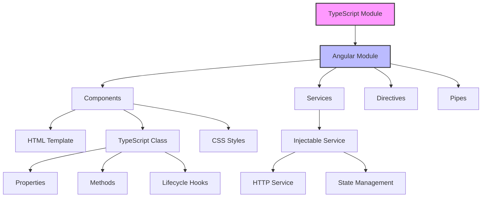

# TypeScript Angular

## Introduction

Angular is a powerful, open-source web application framework developed and maintained by Google. What sets Angular apart from many other frontend frameworks is its deep integration with TypeScript. In fact, Angular is built with TypeScript and uses it as its primary language.

This guide will introduce you to using TypeScript with Angular, explaining why they work so well together and how you can leverage TypeScript's features to build robust Angular applications.

## Why Angular Uses TypeScript

Angular was designed from the ground up to work with TypeScript, providing several advantages:

1. **Strong typing** - Catch errors at compile time rather than at runtime
2. **Enhanced IDE support** - Better autocomplete, navigation, and refactoring tools
3. **Improved code organization** - Interfaces, classes, and modules help structure large applications
4. **Better tooling** - TypeScript's tooling makes it easier to manage complex projects
5. **Future JavaScript features** - Access to features not yet available in all browsers

## Setting Up an Angular Project with TypeScript

Let's start by creating a new Angular project. Angular's CLI tool automatically configures TypeScript for you.

### Prerequisites

- Node.js and npm installed
- Angular CLI installed (`npm install -g @angular/cli`)

### Creating a New Project

```bash
ng new my-angular-app
cd my-angular-app
ng serve
```

This creates a fully-configured Angular project using TypeScript. The `tsconfig.json` file is already set up with recommended settings for Angular development.

## Key TypeScript Features in Angular

### 1. Component Types

Angular components use TypeScript classes with decorators:

```typescript
import { Component } from '@angular/core';

@Component({
  selector: 'app-hello',
  template: `<h1>Hello, {{name}}!</h1>`,
  styles: [`h1 { font-family: Arial; }`]
})
export class HelloComponent {
  name: string = 'World';
}
```

The `@Component` decorator transforms a regular TypeScript class into an Angular component.

### 2. Using Interfaces for Models

TypeScript interfaces help define the shape of your data:

```typescript
// user.model.ts
export interface User {
  id: number;
  name: string;
  email: string;
  isAdmin?: boolean; // optional property
}

// user.component.ts
import { Component } from '@angular/core';
import { User } from './user.model';

@Component({
  selector: 'app-user-profile',
  template: `
    <div>
      <h2>User Profile</h2>
      <p>Name: {{user.name}}</p>
      <p>Email: {{user.email}}</p>
      <p *ngIf="user.isAdmin">Administrator</p>
    </div>
  `
})
export class UserProfileComponent {
  user: User = {
    id: 1,
    name: 'John Doe',
    email: 'john@example.com',
    isAdmin: true
  };
}
```

### 3. Type-Safe Dependency Injection

Angular's dependency injection system works seamlessly with TypeScript:

```typescript
import { Component } from '@angular/core';
import { UserService } from './user.service';
import { User } from './user.model';

@Component({
  selector: 'app-user-list',
  template: `
    <h2>User List</h2>
    <ul>
      <li *ngFor="let user of users">{{user.name}}</li>
    </ul>
  `
})
export class UserListComponent {
  users: User[] = [];
  
  // UserService is injected via constructor
  constructor(private userService: UserService) { }
  
  ngOnInit() {
    this.userService.getUsers().subscribe(users => {
      this.users = users;
    });
  }
}
```

TypeScript ensures that `userService` has all the methods we try to call.

### 4. Type-Safe Forms

Angular's reactive forms are much more powerful with TypeScript:

```typescript
import { Component } from '@angular/core';
import { FormBuilder, FormGroup, Validators } from '@angular/forms';

@Component({
  selector: 'app-contact-form',
  template: `
    <form [formGroup]="contactForm" (ngSubmit)="onSubmit()">
      <div>
        <label for="name">Name</label>
        <input id="name" type="text" formControlName="name">
        <div *ngIf="contactForm.get('name')?.invalid && contactForm.get('name')?.touched">
          Name is required
        </div>
      </div>
      
      <div>
        <label for="email">Email</label>
        <input id="email" type="email" formControlName="email">
      </div>
      
      <button type="submit" [disabled]="contactForm.invalid">Submit</button>
    </form>
  `
})
export class ContactFormComponent {
  contactForm: FormGroup;
  
  constructor(private fb: FormBuilder) {
    this.contactForm = this.fb.group({
      name: ['', Validators.required],
      email: ['', [Validators.required, Validators.email]]
    });
  }
  
  onSubmit() {
    if (this.contactForm.valid) {
      console.log(this.contactForm.value);
      // { name: '...', email: '...' }
    }
  }
}
```

## Real-World Example: Building a ToDo Application

Let's see how TypeScript and Angular work together in a simple Todo application:

### Step 1: Define the Todo interface

```typescript
// models/todo.model.ts
export interface Todo {
  id: number;
  title: string;
  completed: boolean;
  dueDate?: Date;
}
```

### Step 2: Create a Todo service

```typescript
// services/todo.service.ts
import { Injectable } from '@angular/core';
import { BehaviorSubject, Observable } from 'rxjs';
import { Todo } from '../models/todo.model';

@Injectable({
  providedIn: 'root'
})
export class TodoService {
  private todos: Todo[] = [
    { id: 1, title: 'Learn Angular', completed: false },
    { id: 2, title: 'Learn TypeScript', completed: true },
    { id: 3, title: 'Build an app', completed: false }
  ];
  
  private todosSubject = new BehaviorSubject<Todo[]>(this.todos);
  
  getTodos(): Observable<Todo[]> {
    return this.todosSubject.asObservable();
  }
  
  addTodo(title: string): void {
    const newTodo: Todo = {
      id: Math.max(0, ...this.todos.map(t => t.id)) + 1,
      title,
      completed: false
    };
    
    this.todos = [...this.todos, newTodo];
    this.todosSubject.next(this.todos);
  }
  
  toggleTodo(id: number): void {
    this.todos = this.todos.map(todo => 
      todo.id === id ? { ...todo, completed: !todo.completed } : todo
    );
    this.todosSubject.next(this.todos);
  }
  
  removeTodo(id: number): void {
    this.todos = this.todos.filter(todo => todo.id !== id);
    this.todosSubject.next(this.todos);
  }
}
```

### Step 3: Create a Todo List Component

```typescript
// components/todo-list/todo-list.component.ts
import { Component, OnInit } from '@angular/core';
import { TodoService } from '../../services/todo.service';
import { Todo } from '../../models/todo.model';

@Component({
  selector: 'app-todo-list',
  template: `
    <div class="todo-container">
      <h2>My Todo List</h2>
      
      <div class="add-todo">
        <input #newTodo 
               placeholder="Add new task" 
               (keyup.enter)="addTodo(newTodo.value); newTodo.value = ''">
        <button (click)="addTodo(newTodo.value); newTodo.value = ''">Add</button>
      </div>
      
      <ul class="todo-list">
        <li *ngFor="let todo of todos" [class.completed]="todo.completed">
          <input type="checkbox" 
                 [checked]="todo.completed" 
                 (change)="toggleTodo(todo.id)">
          <span>{{ todo.title }}</span>
          <button (click)="removeTodo(todo.id)">Delete</button>
        </li>
      </ul>
    </div>
  `,
  styles: [`
    .todo-container { max-width: 500px; margin: 0 auto; }
    .completed { text-decoration: line-through; color: gray; }
    .todo-list { list-style-type: none; padding: 0; }
    .todo-list li { display: flex; align-items: center; margin: 8px 0; }
    .todo-list li span { flex-grow: 1; margin: 0 10px; }
  `]
})
export class TodoListComponent implements OnInit {
  todos: Todo[] = [];
  
  constructor(private todoService: TodoService) { }
  
  ngOnInit(): void {
    this.todoService.getTodos().subscribe(todos => {
      this.todos = todos;
    });
  }
  
  addTodo(title: string): void {
    if (title.trim()) {
      this.todoService.addTodo(title);
    }
  }
  
  toggleTodo(id: number): void {
    this.todoService.toggleTodo(id);
  }
  
  removeTodo(id: number): void {
    this.todoService.removeTodo(id);
  }
}
```

### Step 4: Register the component in a module

```typescript
// app.module.ts
import { NgModule } from '@angular/core';
import { BrowserModule } from '@angular/platform-browser';
import { FormsModule } from '@angular/forms';

import { AppComponent } from './app.component';
import { TodoListComponent } from './components/todo-list/todo-list.component';

@NgModule({
  declarations: [
    AppComponent,
    TodoListComponent
  ],
  imports: [
    BrowserModule,
    FormsModule
  ],
  providers: [],
  bootstrap: [AppComponent]
})
export class AppModule { }
```

This example demonstrates several TypeScript features in Angular:

1. Interfaces to define the shape of a Todo
2. Type-safe service methods
3. Proper typing of component properties and methods
4. Type checking for events and data binding

## Advanced TypeScript Features in Angular

### 1. Generics with Services

```typescript
import { Injectable } from '@angular/core';
import { HttpClient } from '@angular/common/http';
import { Observable } from 'rxjs';

@Injectable({
  providedIn: 'root'
})
export class ApiService {
  private baseUrl = 'https://api.example.com';
  
  constructor(private http: HttpClient) { }
  
  // Generic method to get any type of data
  get<T>(endpoint: string): Observable<T> {
    return this.http.get<T>(`${this.baseUrl}/${endpoint}`);
  }
  
  post<T>(endpoint: string, data: any): Observable<T> {
    return this.http.post<T>(`${this.baseUrl}/${endpoint}`, data);
  }
}

// Usage example
interface Product {
  id: number;
  name: string;
  price: number;
}

// In a component:
// this.apiService.get<Product[]>('products').subscribe(products => {...});
```

### 2. Union Types for Component States

```typescript
import { Component } from '@angular/core';
import { ProductService } from './product.service';

type LoadingState = 'loading' | 'error' | 'success' | 'idle';

@Component({
  selector: 'app-product-list',
  template: `
    <div>
      <div [ngSwitch]="state">
        <div *ngSwitchCase="'loading'">Loading products...</div>
        <div *ngSwitchCase="'error'">Error loading products</div>
        <div *ngSwitchCase="'success'">
          <ul>
            <li *ngFor="let product of products">{{product.name}}</li>
          </ul>
        </div>
        <div *ngSwitchDefault>Please load products</div>
      </div>
      <button (click)="loadProducts()" [disabled]="state === 'loading'">
        Load Products
      </button>
    </div>
  `
})
export class ProductListComponent {
  products: any[] = [];
  state: LoadingState = 'idle';
  
  constructor(private productService: ProductService) { }
  
  loadProducts() {
    this.state = 'loading';
    this.productService.getProducts().subscribe({
      next: (data) => {
        this.products = data;
        this.state = 'success';
      },
      error: () => {
        this.state = 'error';
      }
    });
  }
}
```

### 3. Type Guards for Components

```typescript
import { Component, Input } from '@angular/core';

interface TextItem {
  type: 'text';
  content: string;
}

interface ImageItem {
  type: 'image';
  url: string;
  altText: string;
}

type ContentItem = TextItem | ImageItem;

@Component({
  selector: 'app-content-display',
  template: `
    <div class="content-item" *ngFor="let item of items">
      <div *ngIf="isTextItem(item)">
        <p>{{ item.content }}</p>
      </div>
      <div *ngIf="isImageItem(item)">
        
      </div>
    </div>
  `
})
export class ContentDisplayComponent {
  @Input() items: ContentItem[] = [];
  
  isTextItem(item: ContentItem): item is TextItem {
    return item.type === 'text';
  }
  
  isImageItem(item: ContentItem): item is ImageItem {
    return item.type === 'image';
  }
}
```

## Angular Lifecycle Methods with TypeScript

Angular components have lifecycle methods that you can implement using TypeScript interfaces:

```typescript
import { Component, OnInit, OnDestroy, Input, OnChanges, SimpleChanges } from '@angular/core';
import { Subscription } from 'rxjs';
import { DataService } from './data.service';

@Component({
  selector: 'app-lifecycle-demo',
  template: `<div>Value: {{value}}</div>`
})
export class LifecycleDemoComponent implements OnInit, OnChanges, OnDestroy {
  @Input() value: string = '';
  private subscription: Subscription | undefined;
  
  constructor(private dataService: DataService) {
    console.log('Constructor called');
  }
  
  ngOnInit(): void {
    console.log('Component initialized');
    this.subscription = this.dataService.getData().subscribe(data => {
      console.log('Data received', data);
    });
  }
  
  ngOnChanges(changes: SimpleChanges): void {
    console.log('Input changed:', changes);
  }
  
  ngOnDestroy(): void {
    console.log('Component being destroyed');
    this.subscription?.unsubscribe();
  }
}
```

By implementing these interfaces, TypeScript ensures you implement the methods correctly and helps prevent bugs.

## Common Angular TypeScript Patterns

### Component Structure

```typescript
@Component({...})
export class MyComponent {
  // Properties with types
  items: Item[] = [];
  selectedItem: Item | null = null;
  isLoading: boolean = false;
  errorMessage: string = '';
  
  // Private properties (not part of the public API)
  private subscriptions: Subscription[] = [];
  
  // Constructor for dependency injection
  constructor(private service: MyService) {}
  
  // Lifecycle methods
  ngOnInit(): void {
    this.loadItems();
  }
  
  ngOnDestroy(): void {
    // Clean up subscriptions to prevent memory leaks
    this.subscriptions.forEach(sub => sub.unsubscribe());
  }
  
  // Public methods (component API)
  selectItem(item: Item): void {
    this.selectedItem = item;
  }
  
  // Private methods (internal implementation)
  private loadItems(): void {
    this.isLoading = true;
    const sub = this.service.getItems().subscribe({
      next: (data) => {
        this.items = data;
        this.isLoading = false;
      },
      error: (err) => {
        this.errorMessage = err.message;
        this.isLoading = false;
      }
    });
    this.subscriptions.push(sub);
  }
}
```

### Service Structure

```typescript
@Injectable({
  providedIn: 'root'
})
export class DataService {
  private apiUrl = 'https://api.example.com';
  
  constructor(private http: HttpClient) {}
  
  // Method with typed parameters and return value
  getItems<T>(category: string): Observable<T[]> {
    return this.http.get<T[]>(`${this.apiUrl}/items?category=${category}`);
  }
  
  // Method with optional parameters
  searchItems<T>(term?: string, limit?: number): Observable<T[]> {
    let params = new HttpParams();
    if (term) params = params.set('q', term);
    if (limit) params = params.set('limit', limit.toString());
    
    return this.http.get<T[]>(`${this.apiUrl}/search`, { params });
  }
}
```

## Angular Application Structure Visualization

Here's a diagram showing how TypeScript helps structure an Angular application:



## Summary

TypeScript and Angular form a powerful combination that enables developers to build complex, maintainable web applications:

1. **Strong typing** helps catch errors early in the development process
2. **Interfaces and models** provide clear contracts for your data structures
3. **Decorators** transform regular classes into Angular-specific entities
4. **Type-safe dependency injection** ensures components receive the correct services
5. **Advanced TypeScript features** like generics and union types help express complex concepts

The TypeScript integration makes Angular particularly suitable for large-scale applications where type safety and maintainability are important concerns.

## Additional Resources

Here are some resources to continue your learning journey:

- [Official Angular Documentation](https://angular.io/docs)
- [TypeScript Handbook](https://www.typescriptlang.org/docs/)
- [Angular University](https://angular-university.io/)

## Exercises

1. Create a simple Angular component that displays a list of typed objects (e.g., products with name, price, and description).

2. Extend the Todo application example by adding:
   - Categories for todos (using TypeScript enums)
   - Priority levels (using a union type)
   - Due dates with proper date handling

3. Create a generic pagination service in Angular that can work with any type of data:
   ```typescript
   class PaginationService<T> {
     // Implement methods like getPage, setPageSize, etc.
   }
   ```

4. Implement a type-safe event bus service using TypeScript's discriminated unions to handle different types of events in your Angular application.