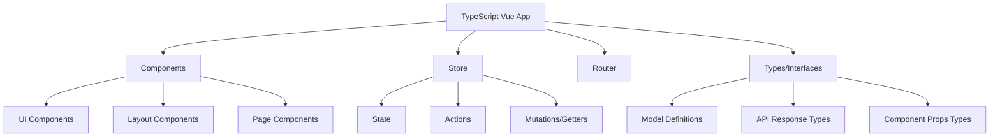

# TypeScript Vue

## Introduction

Vue.js is a progressive JavaScript framework for building user interfaces and single-page applications. When combined with TypeScript, it provides type safety, better tooling, and an enhanced developer experience. TypeScript Vue integration brings static type checking to your Vue applications, making them more maintainable and less prone to runtime errors.

In this guide, we'll explore how to use TypeScript with Vue, covering the setup process, key concepts, and best practices for building robust applications.

## Why Use TypeScript with Vue?

TypeScript offers several benefits when used with Vue.js:

1. **Type Safety**: Catch errors at compile time rather than runtime
2. **Better IDE Support**: Enhanced autocompletion, code navigation, and refactoring
3. **Improved Documentation**: Types serve as documentation for your code
4. **Enhanced Component API**: Better support for complex component structures
5. **Safer Refactoring**: TypeScript helps ensure changes don't break existing code

## Getting Started with TypeScript Vue

### Setup Options

You have two main options for setting up a TypeScript Vue project:

1. **Vue CLI**: The official Vue command line tool
2. **Manual Setup**: Configure TypeScript with Vue from scratch

Let's start with the Vue CLI approach, which is recommended for beginners.

### Setting up with Vue CLI

```bash
# Install Vue CLI if you don't have it yet
npm install -g @vue/cli

# Create a new project with TypeScript
vue create my-ts-vue-project

# Select the TypeScript preset when prompted
```

When creating your project, Vue CLI will ask you to choose a preset. Select the option that includes TypeScript support.

## Understanding Vue Components with TypeScript

In TypeScript Vue, components can be defined using several approaches. Here are the two most common ones:

### Option 1: Class-Based Components (Vue Class Component)

This approach uses decorators and classes to define components:

```typescript
<script lang="ts">
import { Vue, Component, Prop } from 'vue-property-decorator';

@Component
export default class HelloWorld extends Vue {
  // Props are defined as class properties
  @Prop({ required: true }) private msg!: string;
  
  // Data properties are defined as class properties
  private count: number = 0;
  
  // Methods are defined as class methods
  private increment(): void {
    this.count++;
  }
}
</script>

<template>
  <div>
    <h1>{{ msg }}</h1>
    <p>Count: {{ count }}</p>
    <button @click="increment">Increment</button>
  </div>
</template>
```

### Option 2: Options API with TypeScript

This approach uses the familiar Vue options object with TypeScript type annotations:

```typescript
<script lang="ts">
import { defineComponent } from 'vue';

export default defineComponent({
  props: {
    msg: {
      type: String as () => string,
      required: true
    }
  },
  data() {
    return {
      count: 0 as number
    };
  },
  methods: {
    increment(): void {
      this.count++;
    }
  }
});
</script>

<template>
  <div>
    <h1>{{ msg }}</h1>
    <p>Count: {{ count }}</p>
    <button @click="increment">Increment</button>
  </div>
</template>
```

### Option 3: Composition API with TypeScript (Vue 3)

For Vue 3, the Composition API works beautifully with TypeScript:

```typescript
<script setup lang="ts">
import { ref, defineProps } from 'vue';

// Type the props
interface Props {
  msg: string;
}

const props = defineProps<Props>();
const count = ref<number>(0);

const increment = () => {
  count.value++;
};
</script>

<template>
  <div>
    <h1>{{ msg }}</h1>
    <p>Count: {{ count }}</p>
    <button @click="increment">Increment</button>
  </div>
</template>
```

## Type Definitions for Vue Components

### Typing Props

Props should be properly typed to ensure components are used correctly:

```typescript
// Using Vue Class Component
@Prop({ required: true }) private name!: string;
@Prop({ default: 0 }) private age!: number;
@Prop({ validator: (val: string[]) => val.length > 0 }) private items!: string[];

// Using Options API
props: {
  name: {
    type: String as PropType<string>,
    required: true
  },
  age: {
    type: Number as PropType<number>,
    default: 0
  },
  items: {
    type: Array as PropType<string[]>,
    validator: (val: string[]) => val.length > 0
  }
}

// Using Composition API (Vue 3)
interface Props {
  name: string;
  age?: number;
  items?: string[];
}

const props = defineProps<Props>();
```

### Typing Component Data

Properly typing your component's data ensures type safety:

```typescript
// Class Component
private userData: User = { name: 'John', age: 30 };
private items: string[] = [];

// Options API
data() {
  return {
    userData: { name: 'John', age: 30 } as User,
    items: [] as string[]
  };
}

// Composition API
const userData = ref<User>({ name: 'John', age: 30 });
const items = ref<string[]>([]);
```

### Typing Component Methods

Adding return types to methods improves code quality:

```typescript
// Class Component
private calculateTotal(items: CartItem[]): number {
  return items.reduce((sum, item) => sum + item.price, 0);
}

// Options API
methods: {
  calculateTotal(items: CartItem[]): number {
    return items.reduce((sum, item) => sum + item.price, 0);
  }
}

// Composition API
const calculateTotal = (items: CartItem[]): number => {
  return items.reduce((sum, item) => sum + item.price, 0);
};
```

## Practical Example: Building a Todo Application

Let's create a simple todo application using TypeScript and Vue to demonstrate these concepts:

### Step 1: Define the Todo interface

```typescript
// types.ts
export interface Todo {
  id: number;
  text: string;
  completed: boolean;
}
```

### Step 2: Create a TodoList component using the Composition API

```typescript
<script setup lang="ts">
import { ref, computed } from 'vue';
import type { Todo } from './types';

// State
const todos = ref<Todo[]>([]);
const newTodoText = ref<string>('');

// Computed properties
const completedTodos = computed(() => todos.value.filter(todo => todo.completed));
const incompleteTodos = computed(() => todos.value.filter(todo => !todo.completed));

// Methods
const addTodo = (): void => {
  if (newTodoText.value.trim()) {
    todos.value.push({
      id: Date.now(),
      text: newTodoText.value,
      completed: false
    });
    newTodoText.value = '';
  }
};

const toggleTodo = (id: number): void => {
  const todo = todos.value.find(todo => todo.id === id);
  if (todo) {
    todo.completed = !todo.completed;
  }
};

const removeTodo = (id: number): void => {
  todos.value = todos.value.filter(todo => todo.id !== id);
};
</script>

<template>
  <div>
    <h1>Todo List</h1>
    
    <div>
      <input 
        v-model="newTodoText"
        @keyup.enter="addTodo"
        placeholder="Add a new todo"
      />
      <button @click="addTodo">Add</button>
    </div>
    
    <ul>
      <li v-for="todo in todos" :key="todo.id">
        <input
          type="checkbox"
          :checked="todo.completed"
          @change="toggleTodo(todo.id)"
        />
        <span :class="{ completed: todo.completed }">{{ todo.text }}</span>
        <button @click="removeTodo(todo.id)">Delete</button>
      </li>
    </ul>
    
    <div>
      <p>Total: {{ todos.length }}</p>
      <p>Completed: {{ completedTodos.length }}</p>
      <p>Incomplete: {{ incompleteTodos.length }}</p>
    </div>
  </div>
</template>

<style scoped>
.completed {
  text-decoration: line-through;
  color: #888;
}
</style>
```

## Advanced Concepts in TypeScript Vue

### Typing Vuex Store (Vue 2)

If you're using Vuex with TypeScript, you can type your store like this:

```typescript
// store/types.ts
export interface RootState {
  user: UserState;
  products: ProductState;
}

export interface UserState {
  name: string;
  email: string;
  isLoggedIn: boolean;
}

export interface ProductState {
  items: Product[];
  loading: boolean;
}

export interface Product {
  id: string;
  name: string;
  price: number;
}
```

```typescript
// store/index.ts
import Vue from 'vue';
import Vuex, { StoreOptions } from 'vuex';
import { RootState } from './types';
import { user } from './user';
import { products } from './products';

Vue.use(Vuex);

const store: StoreOptions<RootState> = {
  state: {
    version: '1.0.0' // could be used for API versioning
  },
  modules: {
    user,
    products
  }
};

export default new Vuex.Store<RootState>(store);
```

### Typing Pinia Store (Vue 3)

For Vue 3 applications, Pinia provides a type-safe alternative to Vuex:

```typescript
// stores/counter.ts
import { defineStore } from 'pinia';

interface CounterState {
  count: number;
  history: number[];
}

export const useCounterStore = defineStore('counter', {
  state: (): CounterState => ({
    count: 0,
    history: []
  }),
  
  getters: {
    doubleCount: (state) => state.count * 2
  },
  
  actions: {
    increment() {
      this.count++;
      this.history.push(this.count);
    },
    
    async fetchAndAdd(amount: number) {
      // Simulating API call
      const response = await fetch('/api/value');
      const data = await response.json();
      this.count += data.value + amount;
    }
  }
});
```

### Typing Vue Router

You can also type your Vue Router configuration:

```typescript
// router/index.ts
import { createRouter, createWebHistory, RouteRecordRaw } from 'vue-router';
import Home from '../views/Home.vue';
import About from '../views/About.vue';

const routes: Array<RouteRecordRaw> = [
  {
    path: '/',
    name: 'Home',
    component: Home
  },
  {
    path: '/about',
    name: 'About',
    component: About
  },
  {
    path: '/user/:id',
    name: 'User',
    component: () => import('../views/User.vue'),
    props: route => ({ id: Number(route.params.id) })
  }
];

const router = createRouter({
  history: createWebHistory(),
  routes
});

export default router;
```

## Best Practices for TypeScript Vue

1. **Define interfaces for component props**: Create clear interfaces for component props to improve reusability and maintainability.

2. **Use strict typing**: Enable `strict: true` in your `tsconfig.json` to catch more potential issues.

3. **Type guard checks**: Use type guards to safely handle type transitions:

```typescript
if (typeof value === 'string') {
  // TypeScript knows value is a string here
  return value.toUpperCase();
}
```

4. **Type assertions only when necessary**: Avoid excessive use of type assertions (`as` keyword). Use them only when TypeScript cannot infer types correctly.

5. **Use discriminated unions for complex state management**:

```typescript
type RequestState<T> =
  | { status: 'idle' }
  | { status: 'loading' }
  | { status: 'success'; data: T }
  | { status: 'error'; error: Error };

// In a component
const userRequest = ref<RequestState<User>>({ status: 'idle' });

// Later in your code
if (userRequest.value.status === 'success') {
  // TypeScript knows userRequest.value.data exists and is of type User
  console.log(userRequest.value.data.name);
}
```

## TypeScript Vue Architecture Patterns

Here's a diagram showing the typical architecture of a TypeScript Vue application:



## Summary

TypeScript brings powerful type checking and improved developer experience to Vue applications. Key benefits include:

- Catching errors at compile time rather than runtime
- Enhanced IDE support with autocompletion and navigation
- Better documentation through type definitions
- Safer refactoring and maintenance

We've covered:
1. Setting up TypeScript with Vue
2. Different component definition styles (Class API, Options API, Composition API)
3. Typing props, data, and methods
4. Building a practical Todo application with TypeScript
5. Advanced concepts including Vuex/Pinia typing and Vue Router typing
6. Best practices for TypeScript in Vue applications

## Additional Resources

To further enhance your TypeScript Vue skills, consider exploring these resources:

- [Vue.js Official TypeScript Support Guide](https://vuejs.org/guide/typescript/overview.html)
- [Pinia Documentation](https://pinia.vuejs.org/)
- [Vue Router Documentation](https://router.vuejs.org/)
- [TypeScript Documentation](https://www.typescriptlang.org/docs/)

## Exercises

1. Convert an existing JavaScript Vue component to TypeScript.
2. Create a form component with proper TypeScript typing for form validation.
3. Build a small application with Vue 3, TypeScript, and Pinia for state management.
4. Implement a type-safe API client service using TypeScript and Axios.
5. Create custom type guards for complex component props validation.

With these skills, you're now ready to build robust, type-safe Vue applications using TypeScript!