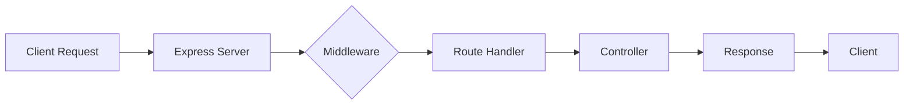

# TypeScript Express

## Introduction

Express.js (or simply Express) is one of the most popular web application frameworks for Node.js. It provides a robust set of features for building web applications and APIs. When combined with TypeScript, Express becomes even more powerful, offering type safety and better developer experience.

In this tutorial, we'll learn how to set up an Express application with TypeScript, understand the core concepts, and build a simple yet practical REST API. We'll explore how TypeScript enhances your Express development workflow through static typing, improved autocompletion, and better error detection.

## Prerequisites

Before we begin, you should have:

- Basic knowledge of TypeScript
- Node.js installed on your machine
- npm or yarn package manager
- A code editor (like VS Code)

## Setting Up a TypeScript Express Project

Let's start by creating a new project and installing the necessary dependencies:

```bash
mkdir typescript-express-demo
cd typescript-express-demo
npm init -y
npm install express
npm install --save-dev typescript @types/express @types/node ts-node nodemon
```

### Create TypeScript Configuration

Create a `tsconfig.json` file at the root of your project:

```json
{
  "compilerOptions": {
    "target": "es6",
    "module": "commonjs",
    "outDir": "./dist",
    "rootDir": "./src",
    "strict": true,
    "esModuleInterop": true,
    "skipLibCheck": true,
    "forceConsistentCasingInFileNames": true
  },
  "include": ["src/**/*"]
}
```

### Project Structure

Create a basic project structure:

```
typescript-express-demo/
├── package.json
├── tsconfig.json
├── src/
│   ├── app.ts      # Express app setup
│   ├── routes/     # Route definitions
│   ├── controllers/# Route controllers
│   ├── models/     # Data models
│   └── index.ts    # Entry point
```

## Creating Your First TypeScript Express Server

Let's create a simple Express server with TypeScript:

### 1. Entry Point (src/index.ts)

```typescript
import app from './app';

const PORT = process.env.PORT || 3000;

app.listen(PORT, () => {
  console.log(`Server is running on port ${PORT}`);
});
```

### 2. App Setup (src/app.ts)

```typescript
import express, { Application } from 'express';
import routes from './routes';

const app: Application = express();

// Middleware
app.use(express.json());
app.use(express.urlencoded({ extended: true }));

// Routes
app.use('/api', routes);

// Basic route
app.get('/', (req, res) => {
  res.send('TypeScript Express Server is Running');
});

export default app;
```

### 3. Create Routes (src/routes/index.ts)

```typescript
import { Router } from 'express';
import userRoutes from './userRoutes';

const router = Router();

router.use('/users', userRoutes);

export default router;
```

### 4. Create User Routes (src/routes/userRoutes.ts)

```typescript
import { Router } from 'express';
import { getUsers, getUserById, createUser } from '../controllers/userController';

const router = Router();

router.get('/', getUsers);
router.get('/:id', getUserById);
router.post('/', createUser);

export default router;
```

### 5. Create User Controller (src/controllers/userController.ts)

```typescript
import { Request, Response } from 'express';
import { User } from '../models/User';

// Mock database
const users: User[] = [
  { id: '1', name: 'John Doe', email: 'john@example.com', age: 28 },
  { id: '2', name: 'Jane Smith', email: 'jane@example.com', age: 32 }
];

export const getUsers = (req: Request, res: Response): void => {
  res.status(200).json(users);
};

export const getUserById = (req: Request, res: Response): void => {
  const { id } = req.params;
  const user = users.find(user => user.id === id);

  if (!user) {
    res.status(404).json({ message: `User with id ${id} not found` });
    return;
  }

  res.status(200).json(user);
};

export const createUser = (req: Request, res: Response): void => {
  const { name, email, age } = req.body;
  
  // Validate input
  if (!name || !email) {
    res.status(400).json({ message: 'Name and email are required' });
    return;
  }
  
  // Create new user
  const newUser: User = {
    id: (users.length + 1).toString(),
    name,
    email,
    age: age || null
  };
  
  users.push(newUser);
  
  res.status(201).json(newUser);
};
```

### 6. Create User Model (src/models/User.ts)

```typescript
export interface User {
  id: string;
  name: string;
  email: string;
  age: number | null;
}
```

### 7. Update package.json Scripts

```json
"scripts": {
  "start": "node dist/index.js",
  "dev": "nodemon --exec ts-node src/index.ts",
  "build": "tsc"
}
```

## Running the Application

Start your development server:

```bash
npm run dev
```

Now your TypeScript Express server should be running at http://localhost:3000.

## Type-Safe Request and Response Handling

One of the biggest advantages of using TypeScript with Express is type-safe request handling. Let's examine how we can create more advanced, type-safe endpoints.

### Creating Custom Request Types

```typescript
import { Request } from 'express';
import { User } from '../models/User';

export interface TypedRequestBody<T> extends Request {
  body: T;
}

export interface TypedRequestParams<T> extends Request {
  params: T;
}

export interface TypedRequest<T, U> extends Request {
  body: T;
  params: U;
}

// Usage example
export const updateUser = (req: TypedRequest<Partial<User>, { id: string }>, res: Response): void => {
  const { id } = req.params;
  const updates = req.body;
  
  // Implementation goes here
};
```

### Error Handling Middleware

Let's add proper error handling with TypeScript:

```typescript
import { Request, Response, NextFunction } from 'express';

// Custom error class
export class ApiError extends Error {
  statusCode: number;
  
  constructor(statusCode: number, message: string) {
    super(message);
    this.statusCode = statusCode;
    this.name = this.constructor.name;
    Error.captureStackTrace(this, this.constructor);
  }
}

// Error handling middleware
export const errorHandler = (
  err: Error | ApiError,
  req: Request,
  res: Response,
  next: NextFunction
): void => {
  console.error(err);
  
  if (err instanceof ApiError) {
    res.status(err.statusCode).json({
      status: 'error',
      statusCode: err.statusCode,
      message: err.message
    });
    return;
  }
  
  res.status(500).json({
    status: 'error',
    statusCode: 500,
    message: 'Internal Server Error'
  });
};

// Usage
app.use(errorHandler);
```

### Using the ApiError in a Controller

```typescript
import { Request, Response, NextFunction } from 'express';
import { ApiError } from '../middleware/errorHandler';

export const getUserById = async (
  req: Request,
  res: Response,
  next: NextFunction
): Promise<void> => {
  try {
    const { id } = req.params;
    const user = users.find(user => user.id === id);

    if (!user) {
      throw new ApiError(404, `User with id ${id} not found`);
    }

    res.status(200).json(user);
  } catch (error) {
    next(error);
  }
};
```

## Advanced Express Features with TypeScript

### Middleware Types

TypeScript can help you create well-typed middleware:

```typescript
import { Request, Response, NextFunction } from 'express';

// Authentication middleware
interface AuthRequest extends Request {
  user?: {
    id: string;
    role: string;
  };
}

const authMiddleware = (
  req: AuthRequest,
  res: Response,
  next: NextFunction
): void => {
  // Get token from headers
  const token = req.headers.authorization?.split(' ')[1];
  
  if (!token) {
    res.status(401).json({ message: 'Authentication required' });
    return;
  }
  
  try {
    // In a real app, you would verify the token
    // For demo purposes, we'll just mock it
    req.user = {
      id: '123',
      role: 'admin'
    };
    next();
  } catch (error) {
    res.status(401).json({ message: 'Invalid token' });
  }
};

// Usage
app.get('/protected', authMiddleware, (req: AuthRequest, res: Response) => {
  res.json({ user: req.user });
});
```

### Route Parameters Validation

Using TypeScript with Express allows you to validate route parameters more effectively:

```typescript
import { Request, Response } from 'express';
import { z } from 'zod';

// Define schema for validation
const UserParamsSchema = z.object({
  id: z.string().uuid()
});

type UserParams = z.infer<typeof UserParamsSchema>;

export const getUserById = (req: Request<UserParams>, res: Response): void => {
  try {
    const { id } = UserParamsSchema.parse(req.params);
    // Rest of the code
  } catch (error) {
    res.status(400).json({ message: 'Invalid user ID format' });
  }
};
```

## Real-World Example: Building a Todo API

Let's create a more complete example of a Todo API with proper typing:

### Todo Model (src/models/Todo.ts)

```typescript
export interface Todo {
  id: string;
  title: string;
  description: string;
  completed: boolean;
  createdAt: Date;
  updatedAt: Date;
}

export type CreateTodoDto = Pick<Todo, 'title' | 'description'>;
export type UpdateTodoDto = Partial<CreateTodoDto> & { completed?: boolean };
```

### Todo Controller (src/controllers/todoController.ts)

```typescript
import { Request, Response } from 'express';
import { v4 as uuidv4 } from 'uuid';
import { Todo, CreateTodoDto, UpdateTodoDto } from '../models/Todo';

// Mock database
let todos: Todo[] = [];

// Get all todos
export const getAllTodos = (req: Request, res: Response): void => {
  res.status(200).json(todos);
};

// Get todo by id
export const getTodoById = (req: Request, res: Response): void => {
  const { id } = req.params;
  const todo = todos.find(todo => todo.id === id);
  
  if (!todo) {
    res.status(404).json({ message: `Todo with id ${id} not found` });
    return;
  }
  
  res.status(200).json(todo);
};

// Create todo
export const createTodo = (req: Request<{}, {}, CreateTodoDto>, res: Response): void => {
  const { title, description } = req.body;
  
  if (!title) {
    res.status(400).json({ message: 'Title is required' });
    return;
  }
  
  const newTodo: Todo = {
    id: uuidv4(),
    title,
    description: description || '',
    completed: false,
    createdAt: new Date(),
    updatedAt: new Date()
  };
  
  todos.push(newTodo);
  
  res.status(201).json(newTodo);
};

// Update todo
export const updateTodo = (
  req: Request<{ id: string }, {}, UpdateTodoDto>,
  res: Response
): void => {
  const { id } = req.params;
  const updates = req.body;
  
  const todoIndex = todos.findIndex(todo => todo.id === id);
  
  if (todoIndex === -1) {
    res.status(404).json({ message: `Todo with id ${id} not found` });
    return;
  }
  
  todos[todoIndex] = {
    ...todos[todoIndex],
    ...updates,
    updatedAt: new Date()
  };
  
  res.status(200).json(todos[todoIndex]);
};

// Delete todo
export const deleteTodo = (req: Request, res: Response): void => {
  const { id } = req.params;
  
  const todoIndex = todos.findIndex(todo => todo.id === id);
  
  if (todoIndex === -1) {
    res.status(404).json({ message: `Todo with id ${id} not found` });
    return;
  }
  
  const [deletedTodo] = todos.splice(todoIndex, 1);
  
  res.status(200).json({ message: 'Todo deleted successfully', todo: deletedTodo });
};
```

### Todo Routes (src/routes/todoRoutes.ts)

```typescript
import { Router } from 'express';
import { 
  getAllTodos,
  getTodoById,
  createTodo,
  updateTodo,
  deleteTodo
} from '../controllers/todoController';

const router = Router();

router.get('/', getAllTodos);
router.get('/:id', getTodoById);
router.post('/', createTodo);
router.put('/:id', updateTodo);
router.delete('/:id', deleteTodo);

export default router;
```

To use this Todo API, you would add it to your main routes file:

```typescript
// In src/routes/index.ts
import todoRoutes from './todoRoutes';

// ... existing code

router.use('/todos', todoRoutes);

export default router;
```

## The Express Request-Response Flow

Understanding how the request-response flow works in Express is crucial:



## Best Practices for TypeScript Express Apps

1. **Use interfaces for request and response types**: Define interfaces for request parameters, query parameters, and request bodies.

2. **Separate concerns**: Keep routes, controllers, and models in separate files.

3. **Use async/await with proper error handling**: Wrap async operations in try/catch blocks.

4. **Create reusable middleware types**: Define custom middleware types for authentication and validation.

5. **Use DTOs (Data Transfer Objects)**: Define separate types for creating and updating resources.

6. **Implement proper error handling middleware**: Create custom error classes and a centralized error handler.

7. **Use environment variables**: Store configuration in environment variables, not in your code.

8. **Add request validation**: Use libraries like Zod or Joi to validate incoming requests.

## Summary

In this tutorial, we've learned how to:

1. Set up an Express application with TypeScript
2. Create type-safe routes and controllers
3. Implement middleware with proper typing
4. Handle errors effectively
5. Build a complete RESTful API with TypeScript

TypeScript brings significant benefits to Express development by:
- Providing compile-time type checking
- Improving code autocompletion
- Making refactoring easier
- Detecting potential errors during development

Express.js combined with TypeScript gives you a powerful, type-safe foundation for building robust web applications and APIs.

## Additional Resources and Exercises

### Resources

- [Express.js Official Documentation](https://expressjs.com/)
- [TypeScript Documentation](https://www.typescriptlang.org/docs/)
- [TypeScript Express GitHub Repository Examples](https://github.com/expressjs/express)

### Exercises

1. **Authentication System**: Extend the Todo API by implementing JWT authentication.
2. **Database Integration**: Connect the API to a real database like MongoDB or PostgreSQL.
3. **Validation**: Implement request validation using a library like Zod or Joi.
4. **Testing**: Write unit and integration tests for your Express endpoints.
5. **Swagger Documentation**: Add Swagger/OpenAPI documentation to your API.

By practicing these exercises, you'll gain hands-on experience with TypeScript and Express.js in real-world scenarios.