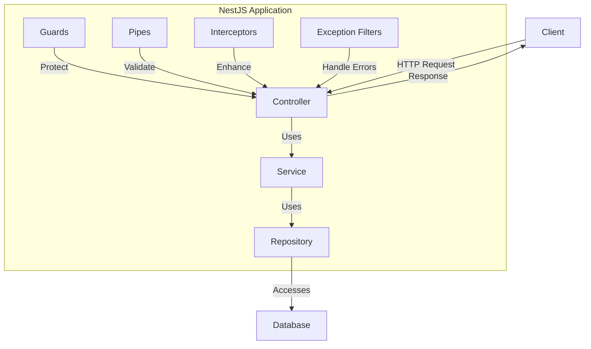

# TypeScript NestJS

## Introduction

NestJS is a powerful, progressive Node.js framework for building efficient, reliable, and scalable server-side applications. It's built with and fully supports TypeScript, though you can also use pure JavaScript. NestJS combines elements of Object-Oriented Programming (OOP), Functional Programming (FP), and Functional Reactive Programming (FRP).

What makes NestJS special is its architecture heavily inspired by Angular, providing a structured way to organize your code using modules, controllers, and services. This architecture promotes code reusability, testability, and maintainability - ideal for large-scale applications.

## Why NestJS?

- **TypeScript-first**: Built with and optimized for TypeScript
- **Modular architecture**: Organize your application into reusable modules
- **Dependency injection**: Built-in powerful DI system
- **Middleware support**: Similar to Express middleware
- **Testing utilities**: Testing is a first-class citizen in NestJS
- **WebSocket support**: Real-time communication built-in
- **Microservices ready**: Build distributed systems with ease
- **REST and GraphQL support**: Create APIs using your preferred style

## Getting Started with NestJS

### Installation

To get started with NestJS, you'll need to install the Nest CLI to scaffold your project:

```bash
npm i -g @nestjs/cli
nest new my-nest-project
```

This will create a new project with a standard directory structure. When prompted, you can choose your preferred package manager (npm, yarn, or pnpm).

### Project Structure

After installation, you'll have a project structure like this:

```
my-nest-project/
├── src/
│   ├── app.controller.spec.ts
│   ├── app.controller.ts
│   ├── app.module.ts
│   ├── app.service.ts
│   └── main.ts
├── test/
├── package.json
├── tsconfig.json
└── nest-cli.json
```

Let's understand each key file:

- **main.ts**: The entry point of the application
- **app.module.ts**: The root module of the application
- **app.controller.ts**: A basic controller with a single route
- **app.service.ts**: A basic service with business logic

### Understanding the Main Components

#### 1. Modules

Modules are used to organize the application structure. Each application has at least one module - the root module:

```typescript
// app.module.ts
import { Module } from '@nestjs/common';
import { AppController } from './app.controller';
import { AppService } from './app.service';

@Module({
  imports: [],
  controllers: [AppController],
  providers: [AppService],
})
export class AppModule {}
```

#### 2. Controllers

Controllers are responsible for handling incoming requests and returning responses:

```typescript
// app.controller.ts
import { Controller, Get } from '@nestjs/common';
import { AppService } from './app.service';

@Controller()
export class AppController {
  constructor(private readonly appService: AppService) {}

  @Get()
  getHello(): string {
    return this.appService.getHello();
  }
}
```

#### 3. Services

Services contain the business logic and are used by controllers:

```typescript
// app.service.ts
import { Injectable } from '@nestjs/common';

@Injectable()
export class AppService {
  getHello(): string {
    return 'Hello World!';
  }
}
```

#### 4. Main.ts

The entry file that creates a NestJS application instance:

```typescript
// main.ts
import { NestFactory } from '@nestjs/core';
import { AppModule } from './app.module';

async function bootstrap() {
  const app = await NestFactory.create(AppModule);
  await app.listen(3000);
}
bootstrap();
```

## Building a REST API with NestJS

Let's create a simple REST API for a book collection to demonstrate NestJS in action:

### 1. Create a Book Module

Generate a new module using the Nest CLI:

```bash
nest generate module books
```

### 2. Create a Book Model

Create a `book.model.ts` file in the books folder:

```typescript
// books/book.model.ts
export interface Book {
  id: number;
  title: string;
  author: string;
  published: number;
}
```

### 3. Create a Books Service

Generate a service using the Nest CLI:

```bash
nest generate service books
```

Implement the service:

```typescript
// books/books.service.ts
import { Injectable, NotFoundException } from '@nestjs/common';
import { Book } from './book.model';

@Injectable()
export class BooksService {
  private books: Book[] = [
    { id: 1, title: 'The Hobbit', author: 'J.R.R. Tolkien', published: 1937 },
    { id: 2, title: '1984', author: 'George Orwell', published: 1949 },
  ];

  findAll(): Book[] {
    return this.books;
  }

  findOne(id: number): Book {
    const book = this.books.find(book => book.id === id);
    if (!book) {
      throw new NotFoundException(`Book with ID ${id} not found`);
    }
    return book;
  }

  create(book: Omit<Book, 'id'>): Book {
    const newBook = {
      id: this.books.length + 1,
      ...book,
    };
    this.books.push(newBook);
    return newBook;
  }

  update(id: number, bookData: Partial<Book>): Book {
    const book = this.findOne(id);
    Object.assign(book, bookData);
    return book;
  }

  delete(id: number): void {
    const index = this.books.findIndex(book => book.id === id);
    if (index === -1) {
      throw new NotFoundException(`Book with ID ${id} not found`);
    }
    this.books.splice(index, 1);
  }
}
```

### 4. Create a Books Controller

Generate a controller using the Nest CLI:

```bash
nest generate controller books
```

Implement the controller:

```typescript
// books/books.controller.ts
import { 
  Controller, 
  Get, 
  Post, 
  Body, 
  Param, 
  Put, 
  Delete, 
  ParseIntPipe 
} from '@nestjs/common';
import { BooksService } from './books.service';
import { Book } from './book.model';

@Controller('books')
export class BooksController {
  constructor(private readonly booksService: BooksService) {}

  @Get()
  findAll(): Book[] {
    return this.booksService.findAll();
  }

  @Get(':id')
  findOne(@Param('id', ParseIntPipe) id: number): Book {
    return this.booksService.findOne(id);
  }

  @Post()
  create(@Body() bookData: Omit<Book, 'id'>): Book {
    return this.booksService.create(bookData);
  }

  @Put(':id')
  update(
    @Param('id', ParseIntPipe) id: number,
    @Body() bookData: Partial<Book>,
  ): Book {
    return this.booksService.update(id, bookData);
  }

  @Delete(':id')
  delete(@Param('id', ParseIntPipe) id: number): void {
    return this.booksService.delete(id);
  }
}
```

### 5. Update the Books Module

Update the books module to include the controller and service:

```typescript
// books/books.module.ts
import { Module } from '@nestjs/common';
import { BooksController } from './books.controller';
import { BooksService } from './books.service';

@Module({
  controllers: [BooksController],
  providers: [BooksService],
})
export class BooksModule {}
```

### 6. Test the API

With the implementation complete, you can run your NestJS application:

```bash
npm run start:dev
```

Now you can test your API endpoints:

- `GET /books` - Get all books
- `GET /books/1` - Get book with ID 1
- `POST /books` - Create a new book
- `PUT /books/1` - Update book with ID 1
- `DELETE /books/1` - Delete book with ID 1

## Advanced NestJS Concepts

### 1. Dependency Injection

NestJS has a built-in dependency injection system:

```typescript
@Injectable()
export class BooksService {
  // Service implementation
}

@Controller('books')
export class BooksController {
  constructor(private readonly booksService: BooksService) {}
  // Controller implementation
}
```

The NestJS DI container automatically resolves the booksService dependency.

### 2. Pipes

Pipes can be used for data transformation and validation:

```typescript
// Create a validation pipe for creating books
import { PipeTransform, Injectable, BadRequestException } from '@nestjs/common';

@Injectable()
export class BookValidationPipe implements PipeTransform {
  transform(value: any) {
    if (!value.title || !value.author || !value.published) {
      throw new BadRequestException('Missing required book properties');
    }
    return value;
  }
}

// Use it in the controller
@Post()
create(@Body(new BookValidationPipe()) bookData: Omit<Book, 'id'>): Book {
  return this.booksService.create(bookData);
}
```

### 3. Guards

Guards determine whether a request will be handled by the route handler:

```typescript
// auth.guard.ts
import { Injectable, CanActivate, ExecutionContext } from '@nestjs/common';

@Injectable()
export class AuthGuard implements CanActivate {
  canActivate(context: ExecutionContext): boolean {
    const request = context.switchToHttp().getRequest();
    // Check if user is authenticated
    return !!request.headers.authorization;
  }
}

// Use it in the controller
@UseGuards(AuthGuard)
@Post()
create(@Body() bookData: Omit<Book, 'id'>): Book {
  return this.booksService.create(bookData);
}
```

### 4. Interceptors

Interceptors add extra logic before or after method execution:

```typescript
// logging.interceptor.ts
import { Injectable, NestInterceptor, ExecutionContext, CallHandler } from '@nestjs/common';
import { Observable } from 'rxjs';
import { tap } from 'rxjs/operators';

@Injectable()
export class LoggingInterceptor implements NestInterceptor {
  intercept(context: ExecutionContext, next: CallHandler): Observable<any> {
    console.log('Before...');
    const now = Date.now();
    
    return next
      .handle()
      .pipe(
        tap(() => console.log(`After... ${Date.now() - now}ms`)),
      );
  }
}

// Use it in the controller
@UseInterceptors(LoggingInterceptor)
@Get()
findAll(): Book[] {
  return this.booksService.findAll();
}
```

### 5. Exception Filters

Exception filters handle errors that occur during request processing:

```typescript
// http-exception.filter.ts
import { ExceptionFilter, Catch, ArgumentsHost, HttpException } from '@nestjs/common';
import { Response } from 'express';

@Catch(HttpException)
export class HttpExceptionFilter implements ExceptionFilter {
  catch(exception: HttpException, host: ArgumentsHost) {
    const ctx = host.switchToHttp();
    const response = ctx.getResponse<Response>();
    const status = exception.getStatus();
    const message = exception.message;

    response
      .status(status)
      .json({
        statusCode: status,
        message,
        timestamp: new Date().toISOString(),
      });
  }
}

// Use it in the controller
@UseFilters(HttpExceptionFilter)
@Get(':id')
findOne(@Param('id', ParseIntPipe) id: number): Book {
  return this.booksService.findOne(id);
}
```

## Database Integration with TypeORM

NestJS works seamlessly with TypeORM for database operations. Here's how to integrate it:

### 1. Install Dependencies

```bash
npm install --save @nestjs/typeorm typeorm pg
```

### 2. Configure TypeORM in AppModule

```typescript
// app.module.ts
import { Module } from '@nestjs/common';
import { TypeOrmModule } from '@nestjs/typeorm';
import { BooksModule } from './books/books.module';

@Module({
  imports: [
    TypeOrmModule.forRoot({
      type: 'postgres',
      host: 'localhost',
      port: 5432,
      username: 'postgres',
      password: 'postgres',
      database: 'bookdb',
      entities: [__dirname + '/**/*.entity{.ts,.js}'],
      synchronize: true, // Don't use in production!
    }),
    BooksModule,
  ],
})
export class AppModule {}
```

### 3. Create a Book Entity

```typescript
// books/book.entity.ts
import { Entity, Column, PrimaryGeneratedColumn } from 'typeorm';

@Entity()
export class Book {
  @PrimaryGeneratedColumn()
  id: number;

  @Column()
  title: string;

  @Column()
  author: string;

  @Column()
  published: number;
}
```

### 4. Update the Books Module

```typescript
// books/books.module.ts
import { Module } from '@nestjs/common';
import { TypeOrmModule } from '@nestjs/typeorm';
import { Book } from './book.entity';
import { BooksController } from './books.controller';
import { BooksService } from './books.service';

@Module({
  imports: [TypeOrmModule.forFeature([Book])],
  controllers: [BooksController],
  providers: [BooksService],
})
export class BooksModule {}
```

### 5. Update the Books Service to Use the Repository

```typescript
// books/books.service.ts
import { Injectable, NotFoundException } from '@nestjs/common';
import { InjectRepository } from '@nestjs/typeorm';
import { Repository } from 'typeorm';
import { Book } from './book.entity';

@Injectable()
export class BooksService {
  constructor(
    @InjectRepository(Book)
    private bookRepository: Repository<Book>,
  ) {}

  async findAll(): Promise<Book[]> {
    return this.bookRepository.find();
  }

  async findOne(id: number): Promise<Book> {
    const book = await this.bookRepository.findOneBy({ id });
    if (!book) {
      throw new NotFoundException(`Book with ID ${id} not found`);
    }
    return book;
  }

  async create(bookData: Omit<Book, 'id'>): Promise<Book> {
    const book = this.bookRepository.create(bookData);
    return this.bookRepository.save(book);
  }

  async update(id: number, bookData: Partial<Book>): Promise<Book> {
    await this.bookRepository.update(id, bookData);
    return this.findOne(id);
  }

  async delete(id: number): Promise<void> {
    const result = await this.bookRepository.delete(id);
    if (result.affected === 0) {
      throw new NotFoundException(`Book with ID ${id} not found`);
    }
  }
}
```

## NestJS Architecture Diagram

Here's a visual representation of the NestJS architecture:



## Summary

NestJS is a powerful TypeScript framework for building scalable server-side applications. Its architecture is inspired by Angular, making it familiar to frontend developers transitioning to backend development. Key features include:

- A modular architecture allowing for code organization and reuse
- Powerful dependency injection system
- Built-in support for REST APIs, GraphQL, WebSockets, and microservices
- Middleware, pipes, guards, and interceptors for cross-cutting concerns
- Integration with various ORMs like TypeORM and Mongoose
- Built-in testing utilities

NestJS is particularly suitable for enterprise-level applications where code organization, maintainability, and scalability are priorities.

## Additional Resources

Here are some resources to continue your NestJS journey:

- [Official NestJS Documentation](https://docs.nestjs.com/)
- [NestJS GitHub Repository](https://github.com/nestjs/nest)
- [NestJS Courses on Udemy](https://www.udemy.com/courses/search/?src=ukw&q=nestjs)

## Exercises

1. Create a simple NestJS application that provides CRUD operations for a "Todo" item.
2. Add validation to ensure the todo item has a title and is not empty.
3. Implement authentication using Passport.js integration with NestJS.
4. Create a GraphQL API alongside your REST API for the same data.
5. Implement a real-time feature using NestJS WebSockets.

By completing these exercises, you'll gain practical experience with the most important aspects of NestJS development.