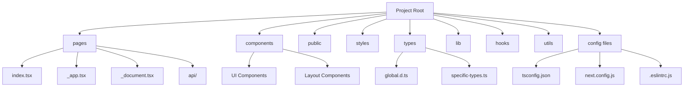

# TypeScript with Next.js

## Introduction

Next.js is a powerful React framework that enables features like server-side rendering, static site generation, API routes, and more. When combined with TypeScript, it provides a robust, type-safe environment for building modern web applications. This guide will walk you through setting up and using TypeScript in a Next.js application, highlighting the benefits and best practices along the way.

TypeScript in Next.js gives you:

- Type safety across your entire application
- Better developer experience with improved autocomplete
- Early error detection during development
- Enhanced maintainability for larger projects
- Built-in types for Next.js-specific features

## Getting Started with TypeScript in Next.js

### Setting Up a New Project

Creating a new Next.js project with TypeScript support is straightforward:

```bash
npx create-next-app@latest my-typescript-app --typescript
# or
yarn create next-app my-typescript-app --typescript
```

This command sets up a new Next.js project with TypeScript configuration already in place.

### Converting an Existing Next.js Project

If you have an existing Next.js project, you can add TypeScript support by:

1. Installing TypeScript and type definitions:

```bash
npm install --save-dev typescript @types/react @types/node
# or
yarn add --dev typescript @types/react @types/node
```

2. Creating a `tsconfig.json` file in your project root:

```bash
touch tsconfig.json
```

3. Running the development server - Next.js will automatically populate the config:

```bash
npm run dev
# or
yarn dev
```

## Next.js-specific TypeScript Features

### Page Components

In Next.js, pages are React components exported from files in the `pages` directory. With TypeScript, you can use built-in types for pages:

```tsx
// pages/index.tsx
import type { NextPage } from 'next';

const Home: NextPage = () => {
  return (
    <div>
      <h1>Welcome to my TypeScript Next.js App!</h1>
    </div>
  );
};

export default Home;
```

### GetServerSideProps with TypeScript

For server-side rendering, you can use types for `getServerSideProps`:

```tsx
// pages/ssr-example.tsx
import type { NextPage, GetServerSideProps } from 'next';

// Define the type for your page props
interface SSRPageProps {
  serverTime: string;
}

const SSRPage: NextPage<SSRPageProps> = ({ serverTime }) => {
  return (
    <div>
      <h1>Server-side Rendered Page</h1>
      <p>This page was rendered on the server at: {serverTime}</p>
    </div>
  );
};

export const getServerSideProps: GetServerSideProps<SSRPageProps> = async () => {
  // This runs on the server
  const serverTime = new Date().toISOString();
  
  return {
    props: {
      serverTime,
    },
  };
};

export default SSRPage;
```

### GetStaticProps and GetStaticPaths

For static site generation, TypeScript provides types for `getStaticProps` and `getStaticPaths`:

```tsx
// pages/posts/[id].tsx
import type { NextPage, GetStaticProps, GetStaticPaths } from 'next';

interface PostPageProps {
  post: {
    id: number;
    title: string;
    content: string;
  };
}

const PostPage: NextPage<PostPageProps> = ({ post }) => {
  return (
    <div>
      <h1>{post.title}</h1>
      <p>{post.content}</p>
    </div>
  );
};

export const getStaticPaths: GetStaticPaths = async () => {
  // In a real app, you might fetch this from an API
  const posts = [
    { id: 1 },
    { id: 2 },
    { id: 3 },
  ];

  const paths = posts.map((post) => ({
    params: { id: post.id.toString() },
  }));

  return { paths, fallback: false };
};

export const getStaticProps: GetStaticProps<PostPageProps> = async ({ params }) => {
  // In a real app, fetch the post from an API or database
  const post = {
    id: Number(params?.id),
    title: `Post ${params?.id}`,
    content: `This is the content for post ${params?.id}`,
  };

  return {
    props: {
      post,
    },
  };
};

export default PostPage;
```

### API Routes

TypeScript also works with Next.js API routes:

```tsx
// pages/api/hello.ts
import type { NextApiRequest, NextApiResponse } from 'next';

interface ResponseData {
  message: string;
  timestamp: number;
}

export default function handler(
  req: NextApiRequest,
  res: NextApiResponse<ResponseData>
) {
  res.status(200).json({ 
    message: 'Hello from TypeScript API route!',
    timestamp: Date.now()
  });
}
```

## Custom Type Definitions

### Global Types

You can define global types for your application in a declaration file:

```tsx
// types/global.d.ts
export interface User {
  id: number;
  name: string;
  email: string;
}

export interface Product {
  id: number;
  title: string;
  price: number;
  description: string;
}
```

Then import them where needed:

```tsx
// components/UserProfile.tsx
import { FC } from 'react';
import { User } from '../types/global';

interface UserProfileProps {
  user: User;
}

const UserProfile: FC<UserProfileProps> = ({ user }) => {
  return (
    <div>
      <h2>{user.name}</h2>
      <p>{user.email}</p>
    </div>
  );
};

export default UserProfile;
```

### Environment Variables

For type-safe environment variables, create a module declaration:

```tsx
// env.d.ts
declare namespace NodeJS {
  interface ProcessEnv {
    NODE_ENV: 'development' | 'production' | 'test';
    NEXT_PUBLIC_API_URL: string;
    DATABASE_URL: string;
  }
}
```

## Practical Example: Building a Typed Todo Application

Let's build a simple Todo application with TypeScript and Next.js:

### Define Types

```tsx
// types/todo.ts
export interface Todo {
  id: number;
  text: string;
  completed: boolean;
}

export type TodoState = {
  todos: Todo[];
  loading: boolean;
};

export type TodoAction = 
  | { type: 'ADD_TODO'; payload: Omit<Todo, 'id'> }
  | { type: 'TOGGLE_TODO'; payload: number }
  | { type: 'DELETE_TODO'; payload: number }
  | { type: 'SET_TODOS'; payload: Todo[] }
  | { type: 'SET_LOADING'; payload: boolean };
```

### Create a Reducer

```tsx
// reducers/todoReducer.ts
import { TodoState, TodoAction, Todo } from '../types/todo';

export const initialState: TodoState = {
  todos: [],
  loading: false,
};

let nextId = 1;

export function todoReducer(state: TodoState, action: TodoAction): TodoState {
  switch (action.type) {
    case 'ADD_TODO':
      return {
        ...state,
        todos: [...state.todos, { ...action.payload, id: nextId++ }],
      };
    case 'TOGGLE_TODO':
      return {
        ...state,
        todos: state.todos.map((todo) =>
          todo.id === action.payload
            ? { ...todo, completed: !todo.completed }
            : todo
        ),
      };
    case 'DELETE_TODO':
      return {
        ...state,
        todos: state.todos.filter((todo) => todo.id !== action.payload),
      };
    case 'SET_TODOS':
      return {
        ...state,
        todos: action.payload,
      };
    case 'SET_LOADING':
      return {
        ...state,
        loading: action.payload,
      };
    default:
      return state;
  }
}
```

### Create Todo Components

```tsx
// components/TodoItem.tsx
import { FC } from 'react';
import { Todo } from '../types/todo';

interface TodoItemProps {
  todo: Todo;
  onToggle: (id: number) => void;
  onDelete: (id: number) => void;
}

const TodoItem: FC<TodoItemProps> = ({ todo, onToggle, onDelete }) => {
  return (
    <div style={{ 
      display: 'flex', 
      alignItems: 'center', 
      marginBottom: '10px' 
    }}>
      <input
        type="checkbox"
        checked={todo.completed}
        onChange={() => onToggle(todo.id)}
      />
      <span
        style={{
          marginLeft: '10px',
          textDecoration: todo.completed ? 'line-through' : 'none',
        }}
      >
        {todo.text}
      </span>
      <button
        onClick={() => onDelete(todo.id)}
        style={{ marginLeft: 'auto' }}
      >
        Delete
      </button>
    </div>
  );
};

export default TodoItem;
```

```tsx
// components/TodoList.tsx
import { FC } from 'react';
import TodoItem from './TodoItem';
import { Todo } from '../types/todo';

interface TodoListProps {
  todos: Todo[];
  onToggleTodo: (id: number) => void;
  onDeleteTodo: (id: number) => void;
}

const TodoList: FC<TodoListProps> = ({ todos, onToggleTodo, onDeleteTodo }) => {
  if (todos.length === 0) {
    return <p>No todos yet. Add one!</p>;
  }

  return (
    <div>
      {todos.map((todo) => (
        <TodoItem
          key={todo.id}
          todo={todo}
          onToggle={onToggleTodo}
          onDelete={onDeleteTodo}
        />
      ))}
    </div>
  );
};

export default TodoList;
```

### Main Page with TypeScript

```tsx
// pages/index.tsx
import { NextPage } from 'next';
import { useReducer, useState, FormEvent } from 'react';
import TodoList from '../components/TodoList';
import { todoReducer, initialState } from '../reducers/todoReducer';

const Home: NextPage = () => {
  const [state, dispatch] = useReducer(todoReducer, initialState);
  const [newTodo, setNewTodo] = useState('');

  const handleAddTodo = (e: FormEvent) => {
    e.preventDefault();
    if (newTodo.trim()) {
      dispatch({
        type: 'ADD_TODO',
        payload: { text: newTodo.trim(), completed: false },
      });
      setNewTodo('');
    }
  };

  const handleToggleTodo = (id: number) => {
    dispatch({ type: 'TOGGLE_TODO', payload: id });
  };

  const handleDeleteTodo = (id: number) => {
    dispatch({ type: 'DELETE_TODO', payload: id });
  };

  return (
    <div style={{ maxWidth: '500px', margin: '0 auto', padding: '20px' }}>
      <h1>TypeScript Next.js Todo App</h1>
      
      <form onSubmit={handleAddTodo} style={{ marginBottom: '20px' }}>
        <input
          type="text"
          value={newTodo}
          onChange={(e) => setNewTodo(e.target.value)}
          placeholder="What needs to be done?"
          style={{ padding: '8px', width: '70%' }}
        />
        <button 
          type="submit" 
          style={{ padding: '8px 16px', marginLeft: '10px' }}
        >
          Add
        </button>
      </form>

      <TodoList
        todos={state.todos}
        onToggleTodo={handleToggleTodo}
        onDeleteTodo={handleDeleteTodo}
      />
      
      <div style={{ marginTop: '20px' }}>
        <p>Total: {state.todos.length} items</p>
        <p>
          Completed: {state.todos.filter((todo) => todo.completed).length} items
        </p>
      </div>
    </div>
  );
};

export default Home;
```

## Type Checking and Linting

To enhance the TypeScript experience in Next.js, add ESLint with TypeScript support:

```bash
npm install --save-dev eslint @typescript-eslint/parser @typescript-eslint/eslint-plugin eslint-plugin-react
```

Create an `.eslintrc.js` file:

```js
// .eslintrc.js
module.exports = {
  parser: '@typescript-eslint/parser',
  plugins: ['@typescript-eslint'],
  extends: [
    'next/core-web-vitals',
    'plugin:@typescript-eslint/recommended',
  ],
  rules: {
    // Add custom rules here
  },
};
```

## Project Architecture Visualization

Here's a diagram showing a typical Next.js with TypeScript project structure:



## Advanced TypeScript Features in Next.js

### Custom App with TypeScript

Create a typed custom `_app.tsx`:

```tsx
// pages/_app.tsx
import type { AppProps } from 'next/app';
import '../styles/globals.css';

function MyApp({ Component, pageProps }: AppProps) {
  return <Component {...pageProps} />;
}

export default MyApp;
```

### Custom Document with TypeScript

Create a typed custom `_document.tsx`:

```tsx
// pages/_document.tsx
import Document, { Html, Head, Main, NextScript, DocumentContext } from 'next/document';

class MyDocument extends Document {
  static async getInitialProps(ctx: DocumentContext) {
    const initialProps = await Document.getInitialProps(ctx);
    return { ...initialProps };
  }

  render() {
    return (
      <Html lang="en">
        <Head />
        <body>
          <Main />
          <NextScript />
        </body>
      </Html>
    );
  }
}

export default MyDocument;
```

### Custom Hooks with TypeScript

Create type-safe custom hooks:

```tsx
// hooks/useLocalStorage.ts
import { useState, useEffect } from 'react';

export function useLocalStorage<T>(key: string, initialValue: T): [T, (value: T) => void] {
  // State to store our value
  const [storedValue, setStoredValue] = useState<T>(initialValue);

  useEffect(() => {
    // Get from local storage by key
    if (typeof window !== 'undefined') {
      try {
        const item = window.localStorage.getItem(key);
        // Parse stored json or if none return initialValue
        setStoredValue(item ? JSON.parse(item) : initialValue);
      } catch (error) {
        console.log(error);
        setStoredValue(initialValue);
      }
    }
  }, [key, initialValue]);

  // Return a wrapped version of useState's setter function that
  // persists the new value to localStorage
  const setValue = (value: T) => {
    try {
      // Allow value to be a function so we have same API as useState
      const valueToStore = value instanceof Function ? value(storedValue) : value;
      // Save state
      setStoredValue(valueToStore);
      // Save to local storage
      if (typeof window !== 'undefined') {
        window.localStorage.setItem(key, JSON.stringify(valueToStore));
      }
    } catch (error) {
      console.log(error);
    }
  };

  return [storedValue, setValue];
}
```

Usage:

```tsx
// components/ThemeToggle.tsx
import { FC } from 'react';
import { useLocalStorage } from '../hooks/useLocalStorage';

type Theme = 'light' | 'dark';

const ThemeToggle: FC = () => {
  const [theme, setTheme] = useLocalStorage<Theme>('theme', 'light');

  const toggleTheme = () => {
    setTheme(theme === 'light' ? 'dark' : 'light');
  };

  return (
    <button onClick={toggleTheme}>
      Current theme: {theme}. Click to toggle.
    </button>
  );
};

export default ThemeToggle;
```

## Summary

In this guide, we've explored how to use TypeScript with Next.js to build type-safe web applications. We covered:

- Setting up a Next.js project with TypeScript
- Using TypeScript with Next.js pages, API routes, and data fetching methods
- Creating custom type definitions for your application
- Building a practical Todo application with typed components and state
- Setting up proper linting and type checking
- Using advanced TypeScript features with Next.js

TypeScript enhances the Next.js development experience by providing type safety, better tooling, and clearer code structure. By combining these technologies, you can build robust, maintainable web applications with confidence.

## Additional Resources

- [Next.js Documentation](https://nextjs.org/docs)
- [TypeScript Handbook](https://www.typescriptlang.org/docs/handbook/intro.html)
- [Next.js with TypeScript Examples](https://github.com/vercel/next.js/tree/canary/examples/with-typescript)

## Exercises

1. Create a simple blog with TypeScript and Next.js that fetches posts from a mock API
2. Add strong typing to an existing Next.js project
3. Create a user authentication system with TypeScript interfaces for user types
4. Build a shopping cart with TypeScript for product and cart item types
5. Implement form validation using TypeScript for type-checking user inputs

By completing these exercises, you'll gain practical experience with TypeScript and Next.js, solidifying your understanding of these powerful technologies.