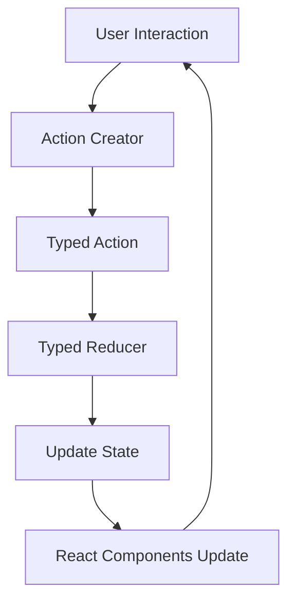

# TypeScript Redux

## Introduction

Redux is a predictable state container for JavaScript applications that helps you manage application state in a consistent way. When combined with TypeScript, Redux becomes even more powerful, providing type safety and improved developer experience. This guide will walk you through how to use Redux with TypeScript, ensuring your state management is both robust and type-safe.

## What is Redux?

Redux is based on three fundamental principles:

1. **Single source of truth**: The entire application state is stored in a single store.
2. **State is read-only**: The only way to change state is to emit an action.
3. **Changes are made with pure functions**: Reducers are pure functions that take the previous state and an action to return the new state.

Adding TypeScript to Redux gives you:

- Type safety for actions, reducers, and state
- Better autocompletion in your IDE
- Safer refactoring
- Clearer intent through type definitions

## Setting Up TypeScript Redux

### Installation

First, let's install Redux along with TypeScript typings:

```bash
npm install redux react-redux @reduxjs/toolkit
npm install --save-dev @types/react-redux
```

### Basic Setup with TypeScript

#### Step 1: Define Your State Types

Start by defining the shape of your application state:

```typescript
// src/types/store.ts
export interface TodoItem {
  id: number;
  text: string;
  completed: boolean;
}

export interface AppState {
  todos: TodoItem[];
  loading: boolean;
  error: string | null;
}
```

#### Step 2: Define Action Types

Define your action types using TypeScript:

```typescript
// src/types/actions.ts
export const ADD_TODO = 'ADD_TODO';
export const TOGGLE_TODO = 'TOGGLE_TODO';
export const FETCH_TODOS = 'FETCH_TODOS';
export const FETCH_TODOS_SUCCESS = 'FETCH_TODOS_SUCCESS';
export const FETCH_TODOS_FAILURE = 'FETCH_TODOS_FAILURE';

interface AddTodoAction {
  type: typeof ADD_TODO;
  payload: {
    text: string;
  };
}

interface ToggleTodoAction {
  type: typeof TOGGLE_TODO;
  payload: {
    id: number;
  };
}

interface FetchTodosAction {
  type: typeof FETCH_TODOS;
}

interface FetchTodosSuccessAction {
  type: typeof FETCH_TODOS_SUCCESS;
  payload: {
    todos: TodoItem[];
  };
}

interface FetchTodosFailureAction {
  type: typeof FETCH_TODOS_FAILURE;
  payload: {
    error: string;
  };
}

export type TodoActionTypes = 
  | AddTodoAction 
  | ToggleTodoAction 
  | FetchTodosAction 
  | FetchTodosSuccessAction 
  | FetchTodosFailureAction;
```

#### Step 3: Create Action Creators

Now, create type-safe action creators:

```typescript
// src/actions/todoActions.ts
import { TodoItem, TodoActionTypes, ADD_TODO, TOGGLE_TODO, FETCH_TODOS, FETCH_TODOS_SUCCESS, FETCH_TODOS_FAILURE } from '../types';

export const addTodo = (text: string): TodoActionTypes => {
  return {
    type: ADD_TODO,
    payload: {
      text
    }
  };
};

export const toggleTodo = (id: number): TodoActionTypes => {
  return {
    type: TOGGLE_TODO,
    payload: {
      id
    }
  };
};

export const fetchTodos = (): TodoActionTypes => {
  return {
    type: FETCH_TODOS
  };
};

export const fetchTodosSuccess = (todos: TodoItem[]): TodoActionTypes => {
  return {
    type: FETCH_TODOS_SUCCESS,
    payload: {
      todos
    }
  };
};

export const fetchTodosFailure = (error: string): TodoActionTypes => {
  return {
    type: FETCH_TODOS_FAILURE,
    payload: {
      error
    }
  };
};
```

#### Step 4: Create Reducers

Create type-safe reducers that use the types we've defined:

```typescript
// src/reducers/todoReducer.ts
import { 
  AppState, 
  TodoActionTypes,
  ADD_TODO,
  TOGGLE_TODO,
  FETCH_TODOS,
  FETCH_TODOS_SUCCESS,
  FETCH_TODOS_FAILURE
} from '../types';

const initialState: AppState = {
  todos: [],
  loading: false,
  error: null
};

export const todoReducer = (
  state = initialState,
  action: TodoActionTypes
): AppState => {
  switch (action.type) {
    case ADD_TODO:
      return {
        ...state,
        todos: [
          ...state.todos,
          {
            id: state.todos.length + 1,
            text: action.payload.text,
            completed: false
          }
        ]
      };
    
    case TOGGLE_TODO:
      return {
        ...state,
        todos: state.todos.map(todo =>
          todo.id === action.payload.id
            ? { ...todo, completed: !todo.completed }
            : todo
        )
      };
    
    case FETCH_TODOS:
      return {
        ...state,
        loading: true,
        error: null
      };
    
    case FETCH_TODOS_SUCCESS:
      return {
        ...state,
        loading: false,
        todos: action.payload.todos
      };
    
    case FETCH_TODOS_FAILURE:
      return {
        ...state,
        loading: false,
        error: action.payload.error
      };
    
    default:
      return state;
  }
};
```

#### Step 5: Create and Configure Store

Configure your Redux store:

```typescript
// src/store/index.ts
import { createStore, applyMiddleware } from 'redux';
import thunk from 'redux-thunk';
import { todoReducer } from '../reducers/todoReducer';
import { AppState } from '../types';

export const store = createStore(
  todoReducer,
  applyMiddleware(thunk)
);

export type AppDispatch = typeof store.dispatch;
```

## Using Redux with React and TypeScript

Let's see how to use our typed Redux store in a React application:

### Setup Provider

```tsx
// src/index.tsx
import React from 'react';
import ReactDOM from 'react-dom';
import { Provider } from 'react-redux';
import { store } from './store';
import App from './App';

ReactDOM.render(
  <Provider store={store}>
    <App />
  </Provider>,
  document.getElementById('root')
);
```

### Create Typed Hooks

For better TypeScript integration, create typed versions of `useDispatch` and `useSelector`:

```typescript
// src/hooks/reduxHooks.ts
import { TypedUseSelectorHook, useDispatch, useSelector } from 'react-redux';
import type { AppState } from '../types/store';
import type { AppDispatch } from '../store';

// Use throughout your app instead of plain `useDispatch` and `useSelector`
export const useAppDispatch = () => useDispatch<AppDispatch>();
export const useAppSelector: TypedUseSelectorHook<AppState> = useSelector;
```

### Example Component

Here's how to use TypeScript with Redux in a React component:

```tsx
// src/components/TodoList.tsx
import React, { useState, useEffect } from 'react';
import { useAppSelector, useAppDispatch } from '../hooks/reduxHooks';
import { addTodo, toggleTodo, fetchTodos } from '../actions/todoActions';

const TodoList: React.FC = () => {
  const [newTodo, setNewTodo] = useState('');
  const dispatch = useAppDispatch();
  const { todos, loading, error } = useAppSelector(state => state);

  useEffect(() => {
    dispatch(fetchTodos());
  }, [dispatch]);

  const handleAddTodo = (e: React.FormEvent) => {
    e.preventDefault();
    if (newTodo.trim()) {
      dispatch(addTodo(newTodo.trim()));
      setNewTodo('');
    }
  };

  const handleToggle = (id: number) => {
    dispatch(toggleTodo(id));
  };

  if (loading) return <p>Loading...</p>;
  if (error) return <p>Error: {error}</p>;

  return (
    <div>
      <h1>Todo List</h1>
      <form onSubmit={handleAddTodo}>
        <input
          type="text"
          value={newTodo}
          onChange={(e) => setNewTodo(e.target.value)}
          placeholder="Add a new todo"
        />
        <button type="submit">Add</button>
      </form>

      <ul>
        {todos.map(todo => (
          <li
            key={todo.id}
            onClick={() => handleToggle(todo.id)}
            style={{ textDecoration: todo.completed ? 'line-through' : 'none' }}
          >
            {todo.text}
          </li>
        ))}
      </ul>
    </div>
  );
};

export default TodoList;
```

## Using Redux Toolkit with TypeScript

Redux Toolkit simplifies Redux configuration and is the recommended approach for new Redux projects.

### Setup with Redux Toolkit

```bash
npm install @reduxjs/toolkit react-redux
```

#### Creating a Slice

```typescript
// src/features/todos/todosSlice.ts
import { createSlice, createAsyncThunk, PayloadAction } from '@reduxjs/toolkit';
import { TodoItem } from '../../types/store';

interface TodosState {
  todos: TodoItem[];
  loading: boolean;
  error: string | null;
}

const initialState: TodosState = {
  todos: [],
  loading: false,
  error: null
};

// Async thunk for fetching todos
export const fetchTodos = createAsyncThunk(
  'todos/fetchTodos',
  async (_, { rejectWithValue }) => {
    try {
      const response = await fetch('https://api.example.com/todos');
      if (!response.ok) throw new Error('Server Error');
      const data: TodoItem[] = await response.json();
      return data;
    } catch (error) {
      return rejectWithValue('Failed to fetch todos');
    }
  }
);

const todosSlice = createSlice({
  name: 'todos',
  initialState,
  reducers: {
    addTodo: (state, action: PayloadAction<string>) => {
      state.todos.push({
        id: state.todos.length + 1,
        text: action.payload,
        completed: false
      });
    },
    toggleTodo: (state, action: PayloadAction<number>) => {
      const todo = state.todos.find(todo => todo.id === action.payload);
      if (todo) {
        todo.completed = !todo.completed;
      }
    }
  },
  extraReducers: (builder) => {
    builder
      .addCase(fetchTodos.pending, (state) => {
        state.loading = true;
        state.error = null;
      })
      .addCase(fetchTodos.fulfilled, (state, action: PayloadAction<TodoItem[]>) => {
        state.loading = false;
        state.todos = action.payload;
      })
      .addCase(fetchTodos.rejected, (state, action) => {
        state.loading = false;
        state.error = action.payload as string;
      });
  }
});

export const { addTodo, toggleTodo } = todosSlice.actions;
export default todosSlice.reducer;
```

#### Configure Store

```typescript
// src/store/index.ts
import { configureStore } from '@reduxjs/toolkit';
import todosReducer from '../features/todos/todosSlice';

export const store = configureStore({
  reducer: {
    todos: todosReducer
  }
});

export type RootState = ReturnType<typeof store.getState>;
export type AppDispatch = typeof store.dispatch;
```

#### Update Hooks

```typescript
// src/hooks/reduxHooks.ts
import { TypedUseSelectorHook, useDispatch, useSelector } from 'react-redux';
import type { RootState, AppDispatch } from '../store';

export const useAppDispatch = () => useDispatch<AppDispatch>();
export const useAppSelector: TypedUseSelectorHook<RootState> = useSelector;
```

#### Using the Redux Toolkit Slice in a Component

```tsx
// src/components/TodoListToolkit.tsx
import React, { useState, useEffect } from 'react';
import { useAppSelector, useAppDispatch } from '../hooks/reduxHooks';
import { addTodo, toggleTodo, fetchTodos } from '../features/todos/todosSlice';

const TodoListToolkit: React.FC = () => {
  const [newTodo, setNewTodo] = useState('');
  const dispatch = useAppDispatch();
  const { todos, loading, error } = useAppSelector(state => state.todos);

  useEffect(() => {
    dispatch(fetchTodos());
  }, [dispatch]);

  const handleAddTodo = (e: React.FormEvent) => {
    e.preventDefault();
    if (newTodo.trim()) {
      dispatch(addTodo(newTodo.trim()));
      setNewTodo('');
    }
  };

  const handleToggle = (id: number) => {
    dispatch(toggleTodo(id));
  };

  if (loading) return <p>Loading...</p>;
  if (error) return <p>Error: {error}</p>;

  return (
    <div>
      <h1>Todo List with Redux Toolkit</h1>
      <form onSubmit={handleAddTodo}>
        <input
          type="text"
          value={newTodo}
          onChange={(e) => setNewTodo(e.target.value)}
          placeholder="Add a new todo"
        />
        <button type="submit">Add</button>
      </form>

      <ul>
        {todos.map(todo => (
          <li
            key={todo.id}
            onClick={() => handleToggle(todo.id)}
            style={{ textDecoration: todo.completed ? 'line-through' : 'none' }}
          >
            {todo.text}
          </li>
        ))}
      </ul>
    </div>
  );
};

export default TodoListToolkit;
```

## Redux Flow with TypeScript

The Redux flow with TypeScript can be visualized as follows:



## Best Practices for TypeScript Redux

1. **Use TypeScript interfaces for state**: Define the shape of your state with TypeScript interfaces.
2. **Type your actions**: Create union types for actions to ensure type safety.
3. **Use typed selectors**: Ensure your selectors know the type of state they're working with.
4. **Leverage Redux Toolkit**: It significantly reduces boilerplate code and provides better TypeScript integration.
5. **Create typed hooks**: Create custom hooks with proper typing for `useDispatch` and `useSelector`.
6. **Use action creators**: Type-safe action creators make it easier to dispatch actions correctly.
7. **Use constants for action types**: This prevents typos and makes refactoring easier.

## Common Patterns

### Normalized State Shape

For complex applications, normalize your state:

```typescript
interface NormalizedState<T> {
  byId: Record<string, T>;
  allIds: string[];
}

interface TodosState {
  items: NormalizedState<TodoItem>;
  loading: boolean;
  error: string | null;
}

const initialState: TodosState = {
  items: {
    byId: {},
    allIds: []
  },
  loading: false,
  error: null
};
```

### Module Augmentation for Thunk Types

```typescript
// src/types/redux-thunk.d.ts
import { ThunkAction } from 'redux-thunk';
import { Action } from 'redux';
import { RootState } from '../store';

declare module 'redux' {
  export interface Dispatch<A extends Action = AnyAction> {
    <R>(thunk: ThunkAction<R, RootState, unknown, A>): R;
  }
}
```

## Summary

TypeScript enhances Redux by providing type safety and improving the developer experience. By clearly defining your state shape, action types, and ensuring type safety throughout your application, you can catch errors at compile time rather than runtime.

Redux Toolkit makes working with TypeScript even easier by reducing boilerplate and providing built-in support for TypeScript. It's the recommended approach for new Redux projects, especially those using TypeScript.

## Additional Resources

- [Redux Documentation](https://redux.js.org/)
- [Redux Toolkit Documentation](https://redux-toolkit.js.org/)
- [TypeScript Documentation](https://www.typescriptlang.org/docs/)
- [Redux Style Guide](https://redux.js.org/style-guide/style-guide)

## Exercises

1. Create a simple counter application using TypeScript and Redux.
2. Extend the todo application to include categories and filters.
3. Implement user authentication with TypeScript and Redux.
4. Create a shopping cart with Redux Toolkit and TypeScript.
5. Implement error handling middleware for your Redux application.

By completing these exercises, you'll gain practical experience with TypeScript and Redux, and develop a deeper understanding of how they work together to create robust applications.