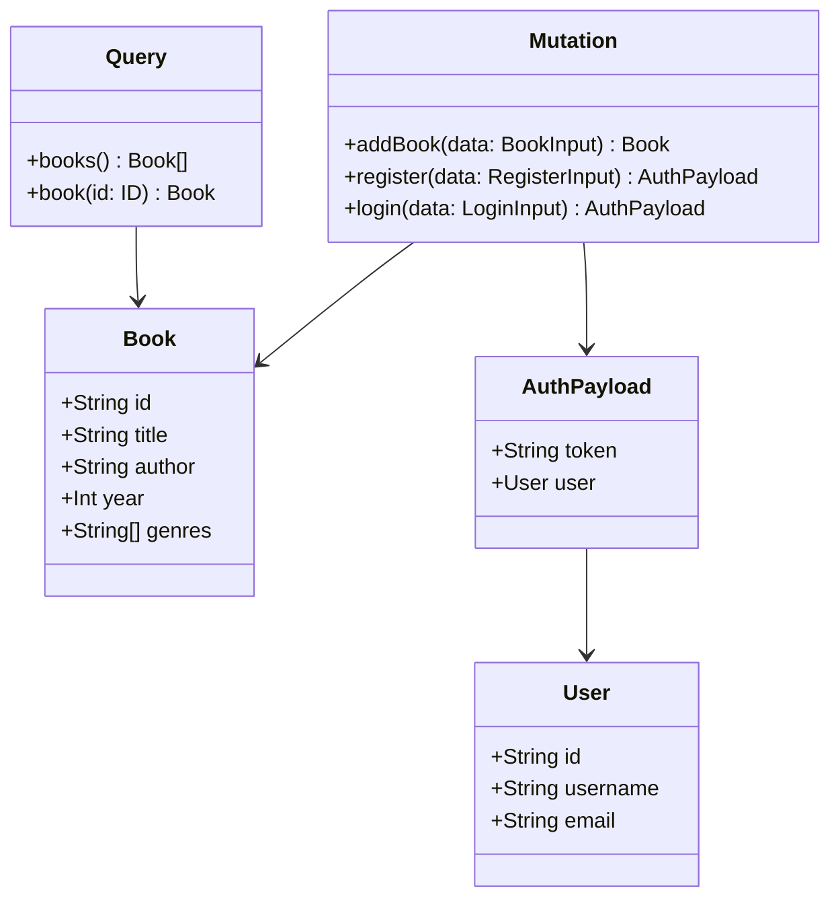

# TypeScript GraphQL

## Introduction

GraphQL is a powerful query language for APIs and a runtime for executing those queries with your existing data. When combined with TypeScript, you get additional benefits of type safety, improved developer experience, and better code quality. In this tutorial, we'll explore how to use GraphQL with TypeScript to build robust, type-safe APIs and client applications.

## What is GraphQL?

GraphQL was developed by Facebook in 2012 and released as open source in 2015. Unlike REST APIs where you have multiple endpoints for different resources, GraphQL provides a single endpoint where clients can request exactly the data they need.

Key benefits of GraphQL include:

- **Precise data fetching**: Clients specify exactly what data they need
- **Single request for multiple resources**: Reduce network overhead
- **Strong typing system**: Schema defines what data is available
- **Introspection**: API can be queried for its own schema

When combined with TypeScript, these benefits are amplified through static type checking.

## Setting Up a TypeScript GraphQL Project

Let's start by setting up a basic TypeScript GraphQL project.

### Prerequisites

- Node.js installed (version 12 or higher)
- Basic knowledge of TypeScript
- Understanding of API concepts

### Step 1: Project Initialization

```bash
mkdir ts-graphql-demo
cd ts-graphql-demo
npm init -y
npm install typescript ts-node @types/node --save-dev
npx tsc --init
```

### Step 2: Installing GraphQL Dependencies

```bash
npm install graphql apollo-server type-graphql reflect-metadata class-validator
```

### Step 3: Configure TypeScript

Update your `tsconfig.json` to include:

```json
{
  "compilerOptions": {
    "target": "es2018",
    "module": "commonjs",
    "lib": ["es2018", "esnext.asynciterable"],
    "experimentalDecorators": true,
    "emitDecoratorMetadata": true,
    "strict": true,
    "esModuleInterop": true
  }
}
```

## Creating a Simple GraphQL Server with TypeScript

Let's build a simple book catalog API using TypeScript and GraphQL.

### Step 1: Define Your GraphQL Schema

First, let's create our schema using TypeScript decorators with type-graphql:

```typescript
// src/schema.ts
import "reflect-metadata";
import { ObjectType, Field, ID, Int, InputType } from "type-graphql";

@ObjectType()
export class Book {
  @Field(() => ID)
  id: string;

  @Field()
  title: string;

  @Field()
  author: string;

  @Field(() => Int)
  year: number;

  @Field(() => [String], { nullable: true })
  genres?: string[];
}

@InputType()
export class BookInput {
  @Field()
  title: string;

  @Field()
  author: string;

  @Field(() => Int)
  year: number;

  @Field(() => [String], { nullable: true })
  genres?: string[];
}
```

### Step 2: Create Resolvers

Now let's implement the resolvers that will handle the GraphQL operations:

```typescript
// src/resolvers.ts
import { Resolver, Query, Mutation, Arg, ID } from "type-graphql";
import { Book, BookInput } from "./schema";
import { v4 as uuid } from "uuid";

// Mock database
const books: Book[] = [
  {
    id: "1",
    title: "The Hobbit",
    author: "J.R.R. Tolkien",
    year: 1937,
    genres: ["Fantasy", "Adventure"]
  }
];

@Resolver(of => Book)
export class BookResolver {
  @Query(() => [Book])
  books(): Book[] {
    return books;
  }

  @Query(() => Book, { nullable: true })
  book(@Arg("id", () => ID) id: string): Book | undefined {
    return books.find(book => book.id === id);
  }

  @Mutation(() => Book)
  addBook(@Arg("data") data: BookInput): Book {
    const book: Book = {
      ...data,
      id: uuid()
    };
    
    books.push(book);
    return book;
  }
}
```

### Step 3: Set Up the Apollo Server

```typescript
// src/index.ts
import "reflect-metadata";
import { ApolloServer } from "apollo-server";
import { buildSchema } from "type-graphql";
import { BookResolver } from "./resolvers";

async function bootstrap() {
  // Build the schema
  const schema = await buildSchema({
    resolvers: [BookResolver],
    emitSchemaFile: true,
    validate: false,
  });

  // Create the Apollo Server
  const server = new ApolloServer({
    schema,
    playground: true,
  });

  // Start the server
  const { url } = await server.listen(4000);
  console.log(`Server is running, GraphQL Playground available at ${url}`);
}

bootstrap().catch(console.error);
```

### Step 4: Run the Server

Add a start script to your `package.json`:

```json
"scripts": {
  "start": "ts-node src/index.ts"
}
```

Then run:

```bash
npm start
```

Navigate to `http://localhost:4000` to see the GraphQL Playground.

## Type-Safe GraphQL Operations

One of the greatest benefits of using TypeScript with GraphQL is generating types from your schema. Let's see how this works.

### Generating TypeScript Types from GraphQL Schema

Install the necessary packages:

```bash
npm install --save-dev @graphql-codegen/cli @graphql-codegen/typescript @graphql-codegen/typescript-operations
```

Create a configuration file for GraphQL Code Generator:

```typescript
// codegen.yml
overwrite: true
schema: "./schema.graphql"
documents: "./src/client/**/*.graphql"
generates:
  src/generated/graphql.ts:
    plugins:
      - "typescript"
      - "typescript-operations"
```

Create a sample query file:

```graphql
# src/client/queries.graphql
query GetAllBooks {
  books {
    id
    title
    author
    year
    genres
  }
}

query GetBook($id: ID!) {
  book(id: $id) {
    id
    title
    author
    year
    genres
  }
}

mutation AddBook($data: BookInput!) {
  addBook(data: $data) {
    id
    title
  }
}
```

Add a script to generate types:

```json
"scripts": {
  "generate": "graphql-codegen --config codegen.yml"
}
```

Run:

```bash
npm run generate
```

This will create TypeScript types based on your GraphQL schema. Now you can use these types in your client code:

```typescript
// src/client/app.ts
import { GetAllBooksQuery, GetBookQuery, AddBookMutation } from "../generated/graphql";

// Now you have type-safe GraphQL operations!
const showBooks = (data: GetAllBooksQuery) => {
  data.books.forEach(book => {
    console.log(`${book.title} by ${book.author} (${book.year})`);
  });
};

const showBook = (data: GetBookQuery) => {
  if (data.book) {
    console.log(`Found: ${data.book.title} by ${data.book.author}`);
  } else {
    console.log("Book not found");
  }
};

const handleAddedBook = (data: AddBookMutation) => {
  console.log(`Added new book with ID: ${data.addBook.id}`);
};
```

## Practical Examples

### Example 1: Building a TypeScript GraphQL API with Authentication

Let's extend our example to include user authentication:

```typescript
// src/schema.ts - add these types
@ObjectType()
export class User {
  @Field(() => ID)
  id: string;

  @Field()
  username: string;

  @Field()
  email: string;
}

@ObjectType()
export class AuthPayload {
  @Field()
  token: string;
  
  @Field(() => User)
  user: User;
}

@InputType()
export class RegisterInput {
  @Field()
  username: string;
  
  @Field()
  email: string;
  
  @Field()
  password: string;
}

@InputType()
export class LoginInput {
  @Field()
  email: string;
  
  @Field()
  password: string;
}
```

Authentication resolver:

```typescript
// src/auth-resolver.ts
import { Resolver, Mutation, Arg, Ctx } from "type-graphql";
import { User, AuthPayload, RegisterInput, LoginInput } from "./schema";
import { hash, compare } from "bcrypt";
import { sign } from "jsonwebtoken";
import { v4 as uuid } from "uuid";

// Mock user database
const users: User[] = [];
// Mock user credentials (in a real app, store hashed passwords separately)
const credentials: Record<string, string> = {};

@Resolver()
export class AuthResolver {
  @Mutation(() => AuthPayload)
  async register(
    @Arg("data") { username, email, password }: RegisterInput
  ): Promise<AuthPayload> {
    // Check if email already exists
    if (users.find(user => user.email === email)) {
      throw new Error("Email already in use");
    }
    
    // Hash the password
    const hashedPassword = await hash(password, 10);
    
    // Create new user
    const id = uuid();
    const user: User = { id, username, email };
    users.push(user);
    
    // Store credentials
    credentials[email] = hashedPassword;
    
    // Generate token
    const token = sign({ userId: id }, "your-secret-key", {
      expiresIn: "1d"
    });
    
    return { token, user };
  }
  
  @Mutation(() => AuthPayload)
  async login(
    @Arg("data") { email, password }: LoginInput
  ): Promise<AuthPayload> {
    // Find user
    const user = users.find(u => u.email === email);
    if (!user) {
      throw new Error("Invalid email or password");
    }
    
    // Verify password
    const valid = await compare(password, credentials[email]);
    if (!valid) {
      throw new Error("Invalid email or password");
    }
    
    // Generate token
    const token = sign({ userId: user.id }, "your-secret-key", {
      expiresIn: "1d"
    });
    
    return { token, user };
  }
}
```

Now update your `index.ts` to include the authentication resolver:

```typescript
// src/index.ts
import { BookResolver } from "./resolvers";
import { AuthResolver } from "./auth-resolver";

// Update the buildSchema function
const schema = await buildSchema({
  resolvers: [BookResolver, AuthResolver],
  emitSchemaFile: true,
  validate: false,
});
```

### Example 2: Client-Side TypeScript GraphQL Integration

Here's how you can use TypeScript GraphQL on the client side with Apollo Client:

```typescript
// src/client/apollo-client.ts
import { ApolloClient, InMemoryCache, createHttpLink } from '@apollo/client';
import { setContext } from '@apollo/client/link/context';

// HTTP connection to the API
const httpLink = createHttpLink({
  uri: 'http://localhost:4000',
});

// Authentication link
const authLink = setContext((_, { headers }) => {
  // Get the authentication token from local storage if it exists
  const token = localStorage.getItem('token');
  
  // Return the headers to the context so httpLink can read them
  return {
    headers: {
      ...headers,
      authorization: token ? `Bearer ${token}` : "",
    }
  };
});

// Create Apollo client
export const client = new ApolloClient({
  link: authLink.concat(httpLink),
  cache: new InMemoryCache()
});
```

Using the client with type-safety:

```typescript
// src/client/book-service.ts
import { gql } from '@apollo/client';
import { client } from './apollo-client';
import { 
  GetAllBooksQuery, 
  GetBookQuery, 
  AddBookMutation,
  BookInput
} from '../generated/graphql';

export const getAllBooks = async (): Promise<GetAllBooksQuery['books']> => {
  const { data } = await client.query<GetAllBooksQuery>({
    query: gql`
      query GetAllBooks {
        books {
          id
          title
          author
          year
          genres
        }
      }
    `,
  });
  return data.books;
};

export const getBook = async (id: string): Promise<GetBookQuery['book']> => {
  const { data } = await client.query<GetBookQuery>({
    query: gql`
      query GetBook($id: ID!) {
        book(id: $id) {
          id
          title
          author
          year
          genres
        }
      }
    `,
    variables: { id }
  });
  return data.book;
};

export const addBook = async (bookData: BookInput): Promise<AddBookMutation['addBook']> => {
  const { data } = await client.mutate<AddBookMutation>({
    mutation: gql`
      mutation AddBook($data: BookInput!) {
        addBook(data: $data) {
          id
          title
          author
        }
      }
    `,
    variables: { data: bookData }
  });
  return data!.addBook;
};
```

## Type-Safe GraphQL Schema Visualization

One advantage of using TypeScript with GraphQL is the ability to visualize your schema. Here's a visualization of our book catalog schema:



## Best Practices for TypeScript GraphQL

Here are some best practices to follow when working with TypeScript and GraphQL:

1. **Keep your schema as the source of truth**: Generate TypeScript types from your GraphQL schema, not the other way around.

2. **Use enums for fixed values**: GraphQL and TypeScript both support enums, use them for clarity.

```typescript
@registerEnumType(BookGenre, {
  name: "BookGenre",
})
export enum BookGenre {
  FANTASY = "FANTASY",
  SCIENCE_FICTION = "SCIENCE_FICTION",
  MYSTERY = "MYSTERY",
  ROMANCE = "ROMANCE"
}
```

3. **Leverage interfaces for shared fields**: Use GraphQL interfaces for types that share common fields.

```typescript
@InterfaceType()
export abstract class Node {
  @Field(() => ID)
  id: string;
}

@ObjectType({ implements: Node })
export class Book implements Node {
  @Field(() => ID)
  id: string;
  
  // Other book fields...
}
```

4. **Use input validation**: Combine TypeScript with validation libraries like class-validator.

```typescript
@InputType()
export class BookInput {
  @Field()
  @MaxLength(100)
  title: string;

  @Field()
  @MaxLength(50)
  author: string;

  @Field(() => Int)
  @Min(1000)
  @Max(new Date().getFullYear())
  year: number;
}
```

5. **Handle nullability deliberately**: Be explicit about what can be null in your schema.

```typescript
@Field({ nullable: true })
description?: string;
```

## Summary

In this tutorial, we've explored how to combine TypeScript and GraphQL to build type-safe APIs and clients. We've covered:

- Setting up a TypeScript GraphQL project
- Creating a GraphQL schema using TypeScript decorators
- Implementing GraphQL resolvers
- Generating TypeScript types from GraphQL schemas
- Building practical examples including authentication
- Best practices for TypeScript GraphQL development

The combination of TypeScript and GraphQL provides an excellent developer experience with strong type safety, autocomplete, and validation throughout your entire stack.

## Additional Resources

- **TypeScript Documentation**: [https://www.typescriptlang.org/docs/](https://www.typescriptlang.org/docs/)
- **GraphQL Documentation**: [https://graphql.org/learn/](https://graphql.org/learn/)
- **TypeGraphQL**: [https://typegraphql.com/docs/introduction.html](https://typegraphql.com/docs/introduction.html)
- **Apollo Server**: [https://www.apollographql.com/docs/apollo-server/](https://www.apollographql.com/docs/apollo-server/)
- **GraphQL Code Generator**: [https://www.graphql-code-generator.com/](https://www.graphql-code-generator.com/)

## Exercises

1. Extend the book catalog API to include book reviews with ratings.
2. Implement pagination for the books query.
3. Add filtering capabilities to search books by genre, author, or publication year.
4. Create a frontend application using React, TypeScript, and Apollo Client that consumes your GraphQL API.
5. Implement a simple cache mechanism for frequently queried data.

Happy coding with TypeScript and GraphQL!