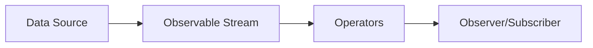

# TypeScript RxJS

## Introduction

RxJS (Reactive Extensions for JavaScript) is a powerful library for reactive programming using observables, making it easier to compose asynchronous or callback-based code. When combined with TypeScript's strong typing system, RxJS becomes even more powerful, providing compile-time safety and better developer experience.

In this guide, we'll explore how to use RxJS with TypeScript to implement reactive programming patterns that can handle complex asynchronous operations and event-based systems.

## What is Reactive Programming?

Reactive programming is a programming paradigm oriented around data flows and the propagation of change. In reactive programming, we model our application as a series of data streams that we can observe and react to.



## Getting Started with RxJS in TypeScript

### Installation

First, let's install RxJS and set up our TypeScript project:

```bash
npm install rxjs
```

### Basic Concepts

#### 1. Observable

An Observable represents a stream of data or events that can be observed over time.

```typescript
import { Observable } from 'rxjs';

// Creating a simple observable
const observable = new Observable<number>(subscriber => {
  subscriber.next(1);
  subscriber.next(2);
  subscriber.next(3);
  setTimeout(() => {
    subscriber.next(4);
    subscriber.complete();
  }, 1000);
});

// Subscribing to the observable
console.log('Before subscribe');
observable.subscribe({
  next(x) { console.log('got value ' + x); },
  error(err) { console.error('Error: ' + err); },
  complete() { console.log('Completed'); }
});
console.log('After subscribe');
```

Output:
```
Before subscribe
got value 1
got value 2
got value 3
After subscribe
got value 4
Completed
```

#### 2. Observer

An Observer is a consumer of values delivered by an Observable.

```typescript
import { Observable } from 'rxjs';

// Define an observer
const observer = {
  next: (x: number) => console.log('Observer got a next value: ' + x),
  error: (err: any) => console.error('Observer got an error: ' + err),
  complete: () => console.log('Observer got a complete notification'),
};

// Create observable and subscribe with the observer
const observable = new Observable<number>(subscriber => {
  subscriber.next(1);
  subscriber.next(2);
  subscriber.complete();
});

observable.subscribe(observer);
```

Output:
```
Observer got a next value: 1
Observer got a next value: 2
Observer got a complete notification
```

#### 3. Subscription

A Subscription represents the execution of an Observable and is primarily useful for cancelling the execution.

```typescript
import { interval } from 'rxjs';

const observable = interval(1000); // Emit value every 1 second
const subscription = observable.subscribe(x => console.log(x));

// Later, when you want to cancel:
setTimeout(() => {
  subscription.unsubscribe();
  console.log('Unsubscribed!');
}, 5500);
```

Output:
```
0
1
2
3
4
Unsubscribed!
```

## Working with Operators

Operators are functions that build on the observables foundation to enable sophisticated manipulation of collections.

### Transformation Operators

#### map

The `map` operator transforms the items emitted by an Observable by applying a function to each item.

```typescript
import { from } from 'rxjs';
import { map } from 'rxjs/operators';

// Create an observable from an array
const source = from([1, 2, 3, 4, 5]);

// Use map to transform each value
const example = source.pipe(
  map(val => val * 10)
);

// Output: 10, 20, 30, 40, 50
example.subscribe(val => console.log(val));
```

#### filter

The `filter` operator filters items emitted by the source Observable.

```typescript
import { from } from 'rxjs';
import { filter } from 'rxjs/operators';

const source = from([1, 2, 3, 4, 5]);

// Filter for even numbers
const example = source.pipe(
  filter(num => num % 2 === 0)
);

// Output: 2, 4
example.subscribe(val => console.log(val));
```

### Combination Operators

#### merge

Combines multiple Observables into one by merging their emissions.

```typescript
import { interval, merge } from 'rxjs';
import { take } from 'rxjs/operators';

// Creates two observables that emit every 2 seconds and 1.5 seconds
const first = interval(2000).pipe(take(3));
const second = interval(1500).pipe(take(3));

// Merge both streams
const example = merge(
  first.pipe(map(val => `First: ${val}`)),
  second.pipe(map(val => `Second: ${val}`))
);

// Output in order of emission: Second: 0, First: 0, Second: 1, First: 1, Second: 2, First: 2
example.subscribe(val => console.log(val));
```

#### combineLatest

Combines multiple Observables to create an Observable that emits the latest values from each.

```typescript
import { combineLatest, timer } from 'rxjs';
import { map } from 'rxjs/operators';

// timerOne emits first value at 1s, then once every 4s
const timerOne = timer(1000, 4000);
// timerTwo emits first value at 2s, then once every 4s
const timerTwo = timer(2000, 4000);

const combined = combineLatest([
  timerOne.pipe(map(v => `First: ${v}`)),
  timerTwo.pipe(map(v => `Second: ${v}`))
]);

combined.subscribe(value => console.log(value));
```

## Practical Examples

### Example 1: Type-Safe API Requests

Using RxJS with TypeScript for making API requests:

```typescript
import { Observable, throwError } from 'rxjs';
import { catchError, map } from 'rxjs/operators';
import axios from 'axios';

// Define our response interface
interface User {
  id: number;
  name: string;
  email: string;
}

function getUsers(): Observable<User[]> {
  return new Observable<User[]>(subscriber => {
    axios.get('https://api.example.com/users')
      .then(response => {
        subscriber.next(response.data);
        subscriber.complete();
      })
      .catch(error => {
        subscriber.error(error);
      });
  }).pipe(
    map((users: any[]): User[] => {
      return users.map(user => ({
        id: user.id,
        name: user.name,
        email: user.email
      }));
    }),
    catchError(error => {
      console.error('Error fetching users:', error);
      return throwError(() => new Error('Error fetching users'));
    })
  );
}

// Using our function
getUsers().subscribe({
  next: users => console.log('Users:', users),
  error: err => console.error('Error occurred:', err),
  complete: () => console.log('API call completed')
});
```

### Example 2: Form Input with Debounce

Handle user input with debounce to prevent excessive API calls:

```typescript
import { fromEvent } from 'rxjs';
import { debounceTime, distinctUntilChanged, map } from 'rxjs/operators';

// Assume we have an input element with id="search-input"
const searchInput = document.getElementById('search-input') as HTMLInputElement;

// Create an observable from the input events
const searchInputObservable = fromEvent<InputEvent>(searchInput, 'input').pipe(
  map(event => (event.target as HTMLInputElement).value),
  debounceTime(300), // Wait for 300ms pause in events
  distinctUntilChanged() // Only emit when the value changes
);

// Subscribe to the observable
searchInputObservable.subscribe(value => {
  console.log('Searching for:', value);
  // Make API call with the search term
  searchApi(value);
});

function searchApi(term: string): void {
  console.log(`API call for term: ${term}`);
  // Actual API call would go here
}
```

### Example 3: WebSocket with RxJS

Creating a type-safe WebSocket connection using RxJS:

```typescript
import { Observable, Subject } from 'rxjs';
import { map, filter } from 'rxjs/operators';

// Define the message interfaces
interface BaseMessage {
  type: string;
}

interface ChatMessage extends BaseMessage {
  type: 'chat';
  user: string;
  message: string;
  timestamp: number;
}

interface StatusMessage extends BaseMessage {
  type: 'status';
  user: string;
  status: 'online' | 'offline';
  timestamp: number;
}

type WebSocketMessage = ChatMessage | StatusMessage;

class WebSocketService {
  private socket: WebSocket;
  private messagesSubject = new Subject<WebSocketMessage>();
  
  public messages$: Observable<WebSocketMessage> = this.messagesSubject.asObservable();
  public chatMessages$: Observable<ChatMessage> = this.messages$.pipe(
    filter((msg): msg is ChatMessage => msg.type === 'chat')
  );
  public statusMessages$: Observable<StatusMessage> = this.messages$.pipe(
    filter((msg): msg is StatusMessage => msg.type === 'status')
  );

  constructor(url: string) {
    this.socket = new WebSocket(url);
    
    this.socket.addEventListener('message', (event) => {
      try {
        const message: WebSocketMessage = JSON.parse(event.data);
        this.messagesSubject.next(message);
      } catch (e) {
        console.error('Error parsing message:', e);
      }
    });
    
    this.socket.addEventListener('error', (event) => {
      console.error('WebSocket error:', event);
    });
  }

  public sendMessage(message: Omit<ChatMessage, 'timestamp'>): void {
    if (this.socket.readyState === WebSocket.OPEN) {
      const fullMessage: ChatMessage = {
        ...message,
        timestamp: Date.now()
      };
      this.socket.send(JSON.stringify(fullMessage));
    }
  }

  public disconnect(): void {
    this.socket.close();
  }
}

// Usage
const wsService = new WebSocketService('wss://example.com/chat');

// Subscription to all messages
const allMessages = wsService.messages$.subscribe(message => {
  console.log('Received message:', message);
});

// Subscription to chat messages only
const chatMessages = wsService.chatMessages$.subscribe(chatMessage => {
  console.log(`${chatMessage.user}: ${chatMessage.message}`);
});

// Subscription to status messages only
const statusMessages = wsService.statusMessages$.subscribe(statusMessage => {
  console.log(`${statusMessage.user} is now ${statusMessage.status}`);
});

// Send a message
wsService.sendMessage({
  type: 'chat',
  user: 'John',
  message: 'Hello, World!'
});

// Clean up when done
setTimeout(() => {
  allMessages.unsubscribe();
  chatMessages.unsubscribe();
  statusMessages.unsubscribe();
  wsService.disconnect();
}, 60000);
```

## Error Handling in RxJS

Error handling is critical in reactive programming. RxJS provides several operators for handling errors:

### catchError

```typescript
import { of } from 'rxjs';
import { catchError, map } from 'rxjs/operators';

const source = of(1, 2, 3, 4, 5);

const result = source.pipe(
  map(val => {
    if (val === 4) {
      throw new Error('Value is 4!');
    }
    return val;
  }),
  catchError(err => {
    console.log('Error caught:', err.message);
    return of('Recovered from error');
  })
);

result.subscribe({
  next: val => console.log(val),
  error: err => console.log('Error:', err),
  complete: () => console.log('Complete!')
});
```

Output:
```
1
2
3
Error caught: Value is 4!
Recovered from error
Complete!
```

### retry

```typescript
import { interval, of } from 'rxjs';
import { mergeMap, retry } from 'rxjs/operators';

const source = interval(1000);
const example = source.pipe(
  mergeMap(val => {
    if (val > 2) {
      return throwError(() => new Error('Value greater than 2!'));
    }
    return of(val);
  }),
  retry(2) // Retry 2 times on error
);

example.subscribe({
  next: val => console.log(val),
  error: err => console.log(`Error: ${err.message}`),
  complete: () => console.log('Complete!')
});
```

## Best Practices for RxJS with TypeScript

1. **Always provide proper types**: TypeScript's type system can greatly enhance RxJS usage.

```typescript
// Bad
const source = from([1, 2, 3]);

// Good
const source: Observable<number> = from([1, 2, 3]);
```

2. **Unsubscribe to prevent memory leaks**: Always unsubscribe from observables when they're no longer needed.

```typescript
import { interval } from 'rxjs';
import { takeUntil } from 'rxjs/operators';
import { Subject } from 'rxjs';

// Create a subject to signal completion
const destroy$ = new Subject<void>();

// Create an observable that emits every second
const timer$ = interval(1000).pipe(
  takeUntil(destroy$) // Automatically complete when destroy$ emits
);

// Subscribe
const subscription = timer$.subscribe(val => console.log(val));

// Later, when cleaning up
// Method 1: Using subject
destroy$.next();
destroy$.complete();

// Method 2: Direct unsubscribe
subscription.unsubscribe();
```

3. **Use pipeable operators**: They are more tree-shakable and provide better type inference.

```typescript
// Bad (deprecated approach)
import { Observable } from 'rxjs';
import 'rxjs/add/operator/map';

const source = new Observable<number>(/*...*/);
const result = source.map(x => x * x);

// Good (current approach)
import { Observable } from 'rxjs';
import { map } from 'rxjs/operators';

const source = new Observable<number>(/*...*/);
const result = source.pipe(
  map(x => x * x)
);
```

4. **Avoid nested subscriptions**: Use higher-order mapping operators instead.

```typescript
// Bad
source$.subscribe(value => {
  anotherSource$.subscribe(innerValue => {
    console.log(value, innerValue);
  });
});

// Good
import { mergeMap } from 'rxjs/operators';

source$.pipe(
  mergeMap(value => anotherSource$.pipe(
    map(innerValue => ({ value, innerValue }))
  ))
).subscribe(({ value, innerValue }) => {
  console.log(value, innerValue);
});
```

## Summary

RxJS combined with TypeScript provides a powerful framework for handling asynchronous operations and event-based programming in a type-safe manner. In this guide, we've covered:

- The core concepts of RxJS (Observables, Observers, Subscriptions)
- Common operators for transforming, filtering, and combining observables
- Practical examples of RxJS usage in real-world scenarios
- Error handling techniques
- Best practices for using RxJS with TypeScript

With these tools, you can build robust, reactive applications that can handle complex asynchronous flows while maintaining code readability and type safety.

## Additional Resources

- [RxJS Official Documentation](https://rxjs.dev/)
- [Learn RxJS](https://www.learnrxjs.io/)
- [RxJS Marbles (Interactive diagrams)](https://rxmarbles.com/)

## Exercises

1. Create a simple autocomplete search feature using RxJS observables with debounce, filter and switchMap.
2. Implement a click counter that tracks single, double and triple clicks using RxJS's buffer operator.
3. Build a progress indicator for a file upload that uses RxJS to track and display progress events.
4. Create a custom operator that retries a failed HTTP request with an exponential backoff strategy.
5. Implement a data synchronization service that combines multiple data sources and keeps a UI component updated.