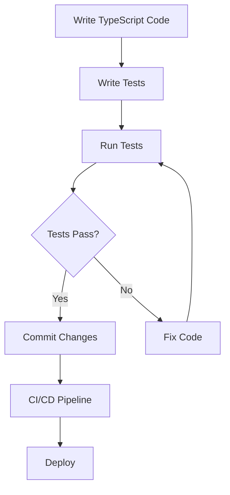

# TypeScript Testing Frameworks

Testing is an essential part of software development that helps ensure your code works as expected and remains maintainable as it evolves. TypeScript's static typing brings additional benefits to testing by catching type-related bugs before your tests even run. In this guide, we'll explore the most popular testing frameworks for TypeScript applications and how to use them effectively.

## Introduction to Testing in TypeScript

Testing TypeScript code brings the advantages of type safety to your test suites. When you write tests in TypeScript, you get:

- Type checking in test files
- Better IDE support with autocompletion
- Improved refactoring capabilities
- Documentation through types

Let's dive into the most popular testing frameworks that work well with TypeScript.

## Jest

[Jest](https://jestjs.io/) is one of the most popular JavaScript testing frameworks, and it has excellent TypeScript support.

### Setting Up Jest with TypeScript

To get started with Jest and TypeScript, you'll need to install a few dependencies:

```bash
npm install --save-dev jest @types/jest ts-jest
```

Create a `jest.config.js` file in your project root:

```javascript
module.exports = {
  preset: 'ts-jest',
  testEnvironment: 'node',
  moduleFileExtensions: ['ts', 'tsx', 'js', 'jsx', 'json'],
  transform: {
    '^.+\\.tsx?$': 'ts-jest',
  },
  testMatch: ['**/__tests__/**/*.ts?(x)', '**/?(*.)+(spec|test).ts?(x)'],
};
```

### Writing Your First Jest Test

Let's create a simple function to test:

```typescript
// src/math.ts
export function add(a: number, b: number): number {
  return a + b;
}

export function subtract(a: number, b: number): number {
  return a - b;
}
```

Now, let's write a test for this function:

```typescript
// src/__tests__/math.test.ts
import { add, subtract } from '../math';

describe('Math functions', () => {
  test('add function correctly adds two numbers', () => {
    expect(add(2, 3)).toBe(5);
    expect(add(-1, 1)).toBe(0);
    expect(add(0, 0)).toBe(0);
  });

  test('subtract function correctly subtracts two numbers', () => {
    expect(subtract(5, 2)).toBe(3);
    expect(subtract(1, 1)).toBe(0);
    expect(subtract(0, 5)).toBe(-5);
  });
});
```

Run the tests with:

```bash
npx jest
```

Output:
```
 PASS  src/__tests__/math.test.ts
  Math functions
    ✓ add function correctly adds two numbers (3 ms)
    ✓ subtract function correctly subtracts two numbers (1 ms)

Test Suites: 1 passed, 1 total
Tests:       2 passed, 2 total
Snapshots:   0 total
Time:        1.5 s
Ran all test suites.
```

### Jest with React and TypeScript

For testing React components written in TypeScript, you'll need to add React Testing Library:

```bash
npm install --save-dev @testing-library/react @testing-library/jest-dom
```

Example of testing a React component:

```typescript
// src/components/Greeting.tsx
import React from 'react';

interface GreetingProps {
  name: string;
}

export const Greeting: React.FC<GreetingProps> = ({ name }) => {
  return <h1>Hello, {name}!</h1>;
};
```

```typescript
// src/components/__tests__/Greeting.test.tsx
import React from 'react';
import { render, screen } from '@testing-library/react';
import '@testing-library/jest-dom';
import { Greeting } from '../Greeting';

describe('Greeting Component', () => {
  test('renders greeting message with the provided name', () => {
    render(<Greeting name="John" />);
    expect(screen.getByRole('heading')).toHaveTextContent('Hello, John!');
  });
});
```

## Mocha & Chai

Mocha is a flexible testing framework that can be paired with Chai (an assertion library) for TypeScript testing.

### Setting Up Mocha with TypeScript

Install the necessary packages:

```bash
npm install --save-dev mocha chai @types/mocha @types/chai ts-node
```

Create a `.mocharc.json` configuration file:

```json
{
  "require": "ts-node/register",
  "extension": ["ts"],
  "spec": "src/**/*.spec.ts"
}
```

### Writing Mocha Tests

```typescript
// src/utils/formatter.ts
export function capitalizeFirstLetter(input: string): string {
  if (!input) return '';
  return input.charAt(0).toUpperCase() + input.slice(1);
}
```

```typescript
// src/utils/formatter.spec.ts
import { expect } from 'chai';
import { capitalizeFirstLetter } from './formatter';

describe('String Formatter', () => {
  describe('capitalizeFirstLetter', () => {
    it('should capitalize the first letter of a string', () => {
      expect(capitalizeFirstLetter('hello')).to.equal('Hello');
    });

    it('should return an empty string when given an empty string', () => {
      expect(capitalizeFirstLetter('')).to.equal('');
    });

    it('should not change already capitalized strings', () => {
      expect(capitalizeFirstLetter('Hello')).to.equal('Hello');
    });
  });
});
```

Run the tests with:

```bash
npx mocha
```

Output:
```
  String Formatter
    capitalizeFirstLetter
      ✓ should capitalize the first letter of a string
      ✓ should return an empty string when given an empty string
      ✓ should not change already capitalized strings

  3 passing (10ms)
```

## Vitest

[Vitest](https://vitest.dev/) is a newer testing framework designed specifically for Vite-based projects. It's fast, has Jest-compatible APIs, and works very well with TypeScript.

### Setting Up Vitest with TypeScript

First, install Vitest:

```bash
npm install --save-dev vitest
```

Add a test script to your `package.json`:

```json
{
  "scripts": {
    "test": "vitest"
  }
}
```

Create a `vitest.config.ts`:

```typescript
import { defineConfig } from 'vitest/config';

export default defineConfig({
  test: {
    globals: true,
    environment: 'node',
  },
});
```

### Writing Vitest Tests

```typescript
// src/validation.ts
export function isValidEmail(email: string): boolean {
  const emailRegex = /^[^\s@]+@[^\s@]+\.[^\s@]+$/;
  return emailRegex.test(email);
}
```

```typescript
// src/validation.test.ts
import { describe, it, expect } from 'vitest';
import { isValidEmail } from './validation';

describe('Email Validation', () => {
  it('should validate correct email addresses', () => {
    expect(isValidEmail('test@example.com')).toBe(true);
    expect(isValidEmail('user.name@domain.co')).toBe(true);
  });

  it('should reject invalid email addresses', () => {
    expect(isValidEmail('test@example')).toBe(false);
    expect(isValidEmail('test.example.com')).toBe(false);
    expect(isValidEmail('@example.com')).toBe(false);
    expect(isValidEmail('')).toBe(false);
  });
});
```

Run tests using:

```bash
npm test
```

Output:
```
 ✓ src/validation.test.ts (2 tests) 2ms

 Test Files  1 passed (1)
      Tests  2 passed (2)
   Start at  10:00:00
   Duration  200ms
```

## Cypress for End-to-End Testing

[Cypress](https://www.cypress.io/) is a powerful end-to-end testing framework that can be used with TypeScript.

### Setting Up Cypress with TypeScript

Install Cypress and TypeScript support:

```bash
npm install --save-dev cypress @types/cypress
```

Create a `cypress/tsconfig.json` file:

```json
{
  "compilerOptions": {
    "target": "es5",
    "lib": ["es5", "dom"],
    "types": ["cypress", "node"]
  },
  "include": ["**/*.ts"]
}
```

### Writing Cypress Tests

Create a test file in `cypress/e2e/`:

```typescript
// cypress/e2e/homepage.cy.ts
describe('Homepage', () => {
  beforeEach(() => {
    cy.visit('/');
  });

  it('should display the title correctly', () => {
    cy.get('h1').should('have.text', 'Welcome to My App');
  });

  it('should navigate to About page when clicked', () => {
    cy.get('nav')
      .contains('About')
      .click();
      
    cy.url().should('include', '/about');
    cy.get('h1').should('have.text', 'About Us');
  });

  it('should submit the contact form', () => {
    cy.get('nav')
      .contains('Contact')
      .click();
    
    cy.get('input[name="name"]').type('John Doe');
    cy.get('input[name="email"]').type('john@example.com');
    cy.get('textarea[name="message"]').type('This is a test message');
    
    cy.get('form').submit();
    
    cy.get('.success-message').should('be.visible');
  });
});
```

## Advanced Testing Patterns

### Mocking in TypeScript Tests

Mocking is an essential part of testing, especially when dealing with external dependencies. Here's how to use mocking with Jest:

```typescript
// src/services/user-service.ts
import { ApiClient } from './api-client';

export interface User {
  id: number;
  name: string;
  email: string;
}

export class UserService {
  private apiClient: ApiClient;
  
  constructor(apiClient: ApiClient) {
    this.apiClient = apiClient;
  }
  
  async getUser(id: number): Promise<User> {
    return this.apiClient.get<User>(`/users/${id}`);
  }
}
```

```typescript
// src/services/__tests__/user-service.test.ts
import { UserService, User } from '../user-service';
import { ApiClient } from '../api-client';

// Mock the ApiClient
jest.mock('../api-client');
const MockedApiClient = ApiClient as jest.MockedClass<typeof ApiClient>;

describe('UserService', () => {
  beforeEach(() => {
    MockedApiClient.mockClear();
  });
  
  it('should fetch user by id', async () => {
    // Set up mock data
    const mockUser: User = {
      id: 1,
      name: 'John Doe',
      email: 'john@example.com'
    };
    
    // Configure mock to return our mock user
    const mockGet = jest.fn().mockResolvedValue(mockUser);
    MockedApiClient.prototype.get = mockGet;
    
    // Create service with mocked API client
    const userService = new UserService(new ApiClient());
    const user = await userService.getUser(1);
    
    // Assertions
    expect(mockGet).toHaveBeenCalledWith('/users/1');
    expect(user).toEqual(mockUser);
  });
});
```

### Testing Asynchronous Code

TypeScript applications often include asynchronous operations. Testing these operations requires special handling:

```typescript
// src/data/product-repository.ts
export interface Product {
  id: string;
  name: string;
  price: number;
}

export class ProductRepository {
  private products: Product[] = [
    { id: '1', name: 'Laptop', price: 999 },
    { id: '2', name: 'Phone', price: 699 },
    { id: '3', name: 'Tablet', price: 499 }
  ];
  
  async findById(id: string): Promise<Product | undefined> {
    // Simulate database delay
    await new Promise(resolve => setTimeout(resolve, 100));
    return this.products.find(p => p.id === id);
  }
  
  async findAll(): Promise<Product[]> {
    // Simulate database delay
    await new Promise(resolve => setTimeout(resolve, 100));
    return [...this.products];
  }
}
```

```typescript
// src/data/__tests__/product-repository.test.ts
import { ProductRepository } from '../product-repository';

describe('ProductRepository', () => {
  let repository: ProductRepository;
  
  beforeEach(() => {
    repository = new ProductRepository();
  });
  
  it('should find a product by id', async () => {
    const product = await repository.findById('2');
    expect(product).toBeDefined();
    expect(product?.name).toBe('Phone');
  });
  
  it('should return undefined for non-existent product', async () => {
    const product = await repository.findById('999');
    expect(product).toBeUndefined();
  });
  
  it('should return all products', async () => {
    const products = await repository.findAll();
    expect(products).toHaveLength(3);
    expect(products[0].name).toBe('Laptop');
  });
});
```

### Test-Driven Development with TypeScript

Test-Driven Development (TDD) is a development methodology where you write tests before implementing the actual code. Here's a simple example of how to practice TDD with TypeScript:

1. Write a failing test for a calculator's multiply function:

```typescript
// src/calculator.test.ts
import { Calculator } from './calculator';

describe('Calculator', () => {
  let calculator: Calculator;

  beforeEach(() => {
    calculator = new Calculator();
  });

  describe('multiply', () => {
    it('should multiply two positive numbers correctly', () => {
      expect(calculator.multiply(2, 3)).toBe(6);
    });
    
    it('should handle multiplication with zero', () => {
      expect(calculator.multiply(5, 0)).toBe(0);
      expect(calculator.multiply(0, 5)).toBe(0);
    });
    
    it('should handle negative numbers', () => {
      expect(calculator.multiply(-2, 3)).toBe(-6);
      expect(calculator.multiply(2, -3)).toBe(-6);
      expect(calculator.multiply(-2, -3)).toBe(6);
    });
  });
});
```

2. Implement the Calculator class to make the tests pass:

```typescript
// src/calculator.ts
export class Calculator {
  add(a: number, b: number): number {
    return a + b;
  }
  
  subtract(a: number, b: number): number {
    return a - b;
  }
  
  multiply(a: number, b: number): number {
    return a * b;
  }
  
  divide(a: number, b: number): number {
    if (b === 0) {
      throw new Error("Cannot divide by zero");
    }
    return a / b;
  }
}
```

3. Run the tests to make sure they pass.

## Testing Best Practices

### 1. Keep Tests Simple and Focused

Each test should focus on one specific behavior or aspect of functionality.

```typescript
// Bad: Testing multiple behaviors in one test
test('user authentication works', () => {
  // Tests login
  // Tests logout
  // Tests password reset
});

// Good: Separate tests for different behaviors
test('user can log in with valid credentials', () => {
  // Only test login functionality
});

test('user can log out successfully', () => {
  // Only test logout functionality
});

test('user can reset password', () => {
  // Only test password reset
});
```

### 2. Use Descriptive Test Names

Test names should clearly describe what is being tested and the expected outcome.

```typescript
// Less descriptive:
test('logout', () => { /* ... */ });

// More descriptive:
test('user should be redirected to login page after logout', () => { /* ... */ });
```

### 3. Set Up Test Data Appropriately

Use `beforeEach` and `beforeAll` to set up test data, and `afterEach` and `afterAll` to clean up.

```typescript
describe('ShoppingCart', () => {
  let cart: ShoppingCart;

  beforeEach(() => {
    cart = new ShoppingCart();
  });

  test('should add items to the cart', () => {
    cart.addItem({ id: '1', name: 'Product', price: 10 });
    expect(cart.getItemCount()).toBe(1);
  });

  test('should calculate total correctly', () => {
    cart.addItem({ id: '1', name: 'Product', price: 10 });
    cart.addItem({ id: '2', name: 'Another Product', price: 20 });
    expect(cart.getTotal()).toBe(30);
  });
});
```

### 4. Use Test Coverage Tools

TypeScript projects can benefit from code coverage tools to identify untested parts of your code:

```bash
npx jest --coverage
```

This will generate a coverage report showing which parts of your code are covered by tests.

## Visualizing Testing Workflow

Here's a simplified diagram of a typical TypeScript testing workflow:



## Summary

In this guide, we've explored several TypeScript testing frameworks:

- **Jest**: A complete and easy-to-configure testing solution with excellent TypeScript support.
- **Mocha & Chai**: A flexible combination that gives you more control over your testing setup.
- **Vitest**: A modern, fast alternative specially designed for Vite projects.
- **Cypress**: A powerful end-to-end testing tool to test your application from a user's perspective.

We've also covered advanced testing techniques like mocking, testing asynchronous code, and test-driven development. Remember that good tests are:

1. Fast to run
2. Independent of each other
3. Repeatable
4. Self-validating
5. Timely (written at the right time)

By incorporating these testing frameworks and practices into your TypeScript projects, you'll be able to catch bugs early, refactor with confidence, and maintain high-quality code.

## Additional Resources

- [Jest Documentation](https://jestjs.io/docs/getting-started)
- [TypeScript Testing Handbook](https://github.com/goldbergyoni/javascript-testing-best-practices)
- [Testing React with TypeScript](https://react-typescript-cheatsheet.netlify.app/docs/basic/testing)
- [Cypress TypeScript Documentation](https://docs.cypress.io/guides/tooling/typescript-support)

## Exercises

1. Set up Jest with TypeScript in a new project and write tests for a simple string utility library with functions like `capitalize`, `reverse`, and `countWords`.

2. Create a React component with TypeScript that displays a counter with increment and decrement buttons. Write tests using React Testing Library to verify the component's behavior.

3. Implement a simple async data fetching function that retrieves user data from a mock API. Write tests that use mocks to verify the function behaves correctly for both successful and failed requests.

4. Practice TDD by writing tests first for a shopping cart module that should handle adding items, removing items, and calculating the total price.

5. Set up Cypress with TypeScript and write an end-to-end test for a simple form submission, verifying that the form data is submitted correctly and success messages are displayed.