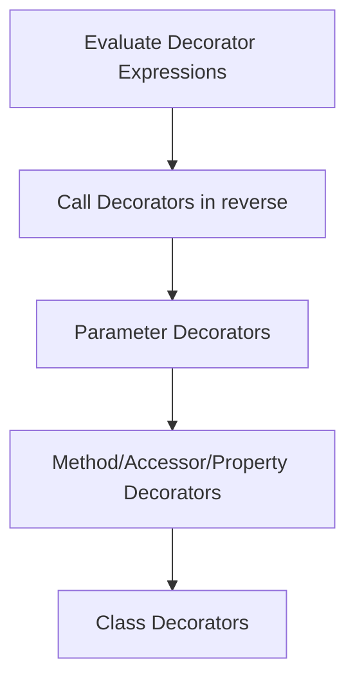

# TypeScript Decorators

## Introduction

TypeScript decorators are a powerful feature that allow you to add annotations and modify the behavior of your code at design time. They provide a way to extend and enhance classes, methods, properties, and parameters through a clean syntax. Decorators are a form of meta-programming, meaning they are code that manipulates other code.

:::info
Decorators are an **experimental** feature in TypeScript. To use them, you need to enable the `experimentalDecorators` compiler option in your `tsconfig.json` file.
:::

```json
{
  "compilerOptions": {
    "target": "ES5",
    "experimentalDecorators": true
  }
}
```

## Understanding Decorators

Decorators are special kinds of declarations that can be attached to a class declaration, method, accessor, property, or parameter. They use the form `@expression`, where `expression` is a function that will be called at runtime with information about the decorated declaration.

Decorators are applied using the `@` symbol followed by the decorator function name:

```typescript
@decoratorName
class MyClass {
  // class implementation
}
```

## Types of Decorators

TypeScript supports five types of decorators:

1. Class decorators
2. Method decorators
3. Property decorators
4. Accessor decorators
5. Parameter decorators

Let's explore each type with examples.

### 1. Class Decorators

Class decorators are applied to the class constructor and can be used to observe, modify, or replace a class definition.

#### Example:

```typescript
// Class decorator function
function Logger(constructor: Function) {
  console.log(`Creating an instance of ${constructor.name}`);
}

// Applying the decorator to a class
@Logger
class Person {
  name: string;
  
  constructor(name: string) {
    this.name = name;
    console.log(`Person instance created with name: ${name}`);
  }
}

// Creating an instance
const person = new Person("John");
```

**Output:**
```
Creating an instance of Person
Person instance created with name: John
```

### Decorator Factories

A decorator factory is a function that returns the decorator function. It allows you to customize how the decorator is applied to a declaration.

```typescript
function LoggerWithParam(logString: string) {
  return function(constructor: Function) {
    console.log(logString);
    console.log(`Creating an instance of ${constructor.name}`);
  };
}

@LoggerWithParam("LOGGING - PERSON")
class Person {
  name: string;
  
  constructor(name: string) {
    this.name = name;
  }
}

// Creating an instance
const person = new Person("John");
```

**Output:**
```
LOGGING - PERSON
Creating an instance of Person
```

### 2. Method Decorators

Method decorators are declared just before a method declaration. They can be used to observe, modify, or replace a method definition.

```typescript
function Log(target: any, propertyKey: string, descriptor: PropertyDescriptor) {
  const originalMethod = descriptor.value;
  
  descriptor.value = function(...args: any[]) {
    console.log(`Calling ${propertyKey} with args: ${JSON.stringify(args)}`);
    const result = originalMethod.apply(this, args);
    console.log(`Result: ${result}`);
    return result;
  };
  
  return descriptor;
}

class Calculator {
  @Log
  add(a: number, b: number): number {
    return a + b;
  }
}

const calc = new Calculator();
calc.add(5, 3);
```

**Output:**
```
Calling add with args: [5,3]
Result: 8
```

### 3. Property Decorators

Property decorators are declared just before a property declaration. They can be used to observe or modify the property.

```typescript
function ValidateLength(min: number, max: number) {
  return function(target: any, propertyKey: string) {
    let value: string;
    
    const getter = function() {
      return value;
    };
    
    const setter = function(newVal: string) {
      if (newVal.length < min) {
        throw new Error(`${propertyKey} is too short. Min length is ${min}`);
      }
      if (newVal.length > max) {
        throw new Error(`${propertyKey} is too long. Max length is ${max}`);
      }
      value = newVal;
    };
    
    Object.defineProperty(target, propertyKey, {
      get: getter,
      set: setter
    });
  };
}

class User {
  @ValidateLength(3, 10)
  name: string;
  
  constructor(name: string) {
    this.name = name;
  }
}

try {
  const user1 = new User("John"); // Valid
  console.log("User created with name:", user1.name);
  
  const user2 = new User("Jo"); // Too short, will throw error
} catch (err) {
  console.error(err.message);
}
```

**Output:**
```
User created with name: John
name is too short. Min length is 3
```

### 4. Accessor Decorators

Accessor decorators are applied to the accessor of a property (getter or setter). They can be used to observe, modify, or replace an accessor's definitions.

```typescript
function Enumerable(value: boolean) {
  return function(target: any, propertyKey: string, descriptor: PropertyDescriptor) {
    descriptor.enumerable = value;
  };
}

class Person {
  private _name: string;
  
  constructor(name: string) {
    this._name = name;
  }
  
  @Enumerable(false)
  get name() {
    return this._name;
  }
  
  set name(value: string) {
    this._name = value;
  }
}

const person = new Person("John");
console.log(Object.keys(person)); // Won't include 'name' as it's not enumerable
console.log(person.name); // Still accessible
```

### 5. Parameter Decorators

Parameter decorators are declared before a parameter declaration. They can be used to observe parameters passed to a method.

```typescript
function Required(target: Object, propertyKey: string, parameterIndex: number) {
  console.log(`Parameter at position ${parameterIndex} in ${propertyKey} is required`);
}

class UserService {
  login(username: string, @Required password: string) {
    console.log(`User ${username} attempting to login`);
    // authentication logic
  }
}

const service = new UserService();
service.login("john_doe", "password123");
```

**Output:**
```
Parameter at position 1 in login is required
User john_doe attempting to login
```

## Real-World Applications

### 1. Dependency Injection

Decorators can be used to implement dependency injection patterns, similar to what you might see in frameworks like Angular.

```typescript
// Simple dependency injection system
const DependencyContainer = new Map<string, any>();

function Injectable(key: string) {
  return function<T extends { new(...args: any[]): {} }>(target: T) {
    DependencyContainer.set(key, new target());
    return target;
  };
}

function Inject(key: string) {
  return function(target: any, propertyKey: string) {
    Object.defineProperty(target, propertyKey, {
      get: () => DependencyContainer.get(key),
      enumerable: true,
      configurable: true
    });
  };
}

@Injectable("loggerService")
class LoggerService {
  log(message: string) {
    console.log(`LOG: ${message}`);
  }
}

class ProductService {
  @Inject("loggerService")
  private logger: LoggerService;
  
  getProducts() {
    this.logger.log("Getting products");
    return ["Product 1", "Product 2"];
  }
}

const productService = new ProductService();
console.log(productService.getProducts());
```

**Output:**
```
LOG: Getting products
["Product 1", "Product 2"]
```

### 2. Validation and Form Handling

Decorators are excellent for implementing validation rules.

```typescript
// Validation decorator
function Validate(regex: RegExp) {
  return function(target: any, propertyKey: string) {
    let value: any;
    
    Object.defineProperty(target, propertyKey, {
      get: () => value,
      set: (newValue: string) => {
        if (!regex.test(newValue)) {
          throw new Error(`Invalid format for ${propertyKey}`);
        }
        value = newValue;
      }
    });
  };
}

class ContactForm {
  @Validate(/^[a-zA-Z ]+$/)
  name: string;
  
  @Validate(/^[a-zA-Z0-9._-]+@[a-zA-Z0-9.-]+\.[a-zA-Z]{2,6}$/)
  email: string;
  
  submitForm() {
    console.log("Form submitted with:", { name: this.name, email: this.email });
  }
}

try {
  const form = new ContactForm();
  form.name = "John Doe"; // Valid
  form.email = "invalid-email"; // Invalid
  form.submitForm();
} catch (err) {
  console.error(err.message);
}
```

**Output:**
```
Invalid format for email
```

### 3. Performance Monitoring

Decorators can be used to monitor the performance of methods:

```typescript
function MeasureTime() {
  return function(target: any, propertyKey: string, descriptor: PropertyDescriptor) {
    const originalMethod = descriptor.value;
    
    descriptor.value = function(...args: any[]) {
      const start = performance.now();
      const result = originalMethod.apply(this, args);
      const finish = performance.now();
      console.log(`Execution of ${propertyKey} took ${finish - start} milliseconds`);
      return result;
    };
    
    return descriptor;
  };
}

class DataProcessor {
  @MeasureTime()
  processLargeArray(size: number): number[] {
    const result = [];
    for (let i = 0; i < size; i++) {
      result.push(Math.random() * i);
    }
    return result;
  }
}

const processor = new DataProcessor();
processor.processLargeArray(1000000);
```

**Output:**
```
Execution of processLargeArray took 35.200000047683716 milliseconds
```

## Decorator Composition

You can apply multiple decorators to a declaration. They are applied in reverse order (from bottom to top):

```typescript
function First() {
  console.log("First decorator factory");
  return function(target: any) {
    console.log("First decorator called");
  };
}

function Second() {
  console.log("Second decorator factory");
  return function(target: any) {
    console.log("Second decorator called");
  };
}

@First()
@Second()
class Example {
}
```

**Output:**
```
First decorator factory
Second decorator factory
Second decorator called
First decorator called
```

## Decorator Evaluation Order

When multiple decorators apply to a single declaration, their evaluation is as follows:



## Summary

TypeScript decorators provide a powerful way to add metadata, validate inputs, monitor performance, and implement cross-cutting concerns in your code. They enhance your TypeScript applications by enabling meta-programming capabilities.

Key points to remember:
- Decorators use the `@` syntax
- They require the `experimentalDecorators` compiler option
- TypeScript supports class, method, property, accessor, and parameter decorators
- Decorator factories allow for customization through parameters
- Decorators are applied in reverse order when composed
- Common use cases include dependency injection, validation, and performance monitoring

## Additional Resources and Exercises

### Resources:
- [TypeScript Official Documentation on Decorators](https://www.typescriptlang.org/docs/handbook/decorators.html)
- [TC39 Decorator Proposal](https://github.com/tc39/proposal-decorators)

### Exercises:

1. **Create a Read-Only Decorator**  
   Create a `@ReadOnly` decorator that prevents properties from being modified after initialization.

2. **Implement a Cache Decorator**  
   Build a `@Cache` decorator that stores function results for specific arguments to improve performance when the same inputs are used repeatedly.

3. **Authentication Decorator**  
   Create a `@RequiresAuth` method decorator that checks if a user is authenticated before allowing method execution.

4. **Build a Simple Component System**  
   Create a decorator-based component system with `@Component` and `@Prop` decorators similar to those in frontend frameworks.

5. **Form Validation Library**  
   Extend the validation example to create a complete form validation library with multiple validator decorators like `@Required`, `@MinLength`, `@MaxLength`, and `@Email`.

By mastering decorators, you'll be able to write more maintainable, expressive, and powerful TypeScript applications.