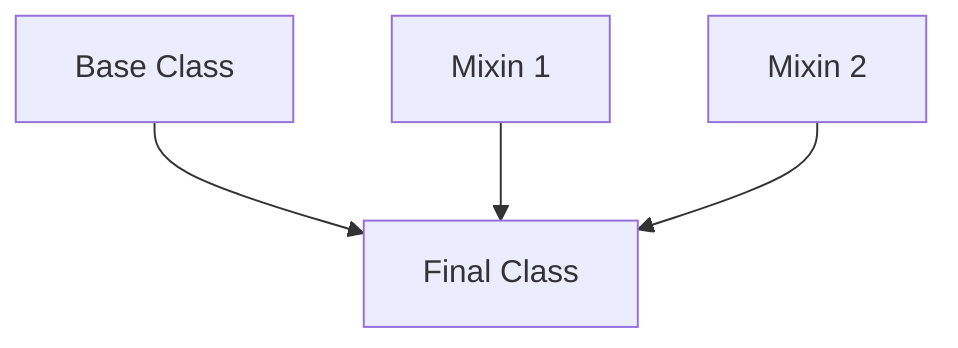

# TypeScript Mixins

## Introduction

In object-oriented programming, there are often scenarios where you want to share behavior across multiple classes. While TypeScript provides inheritance as one option, it can sometimes be limiting since a class can only extend from a single base class. This is where **mixins** come in.

Mixins are a pattern that allows classes to be composed by combining simpler partial classes. Instead of relying on inheritance, mixins use composition to add functionality. This approach provides greater flexibility and avoids some of the pitfalls of deep inheritance hierarchies.

In this guide, we'll explore:
- What mixins are and why they're useful
- How to implement mixins in TypeScript
- Practical examples of mixins in real-world applications
- Best practices and common pitfalls

## What are Mixins?

A mixin is a class or function that defines a set of methods which can be added to a class without using inheritance. Think of mixins as reusable building blocks of functionality that can be "mixed in" to other classes.



Mixins allow you to:

1. Reuse code across multiple classes
2. Avoid the limitations of single inheritance
3. Create more modular and maintainable code
4. Compose behavior from multiple sources

## Basic Mixin Implementation in TypeScript

Let's look at how mixins are implemented in TypeScript.

```typescript
// Define mixin types
type Constructor<T = {}> = new (...args: any[]) => T;

// Create a mixin that adds a timestamp property
function WithTimestamp<TBase extends Constructor>(Base: TBase) {
  return class extends Base {
    timestamp = Date.now();
    
    getTimestamp() {
      return new Date(this.timestamp).toISOString();
    }
  };
}

// Create a mixin that adds logging capability
function WithLogging<TBase extends Constructor>(Base: TBase) {
  return class extends Base {
    log(message: string) {
      console.log(`[LOG] ${message}`);
    }
    
    error(message: string) {
      console.error(`[ERROR] ${message}`);
    }
  };
}

// Base class
class User {
  constructor(public name: string) {}
}

// Apply mixins to create enhanced class
const TimestampedUser = WithTimestamp(User);
const LoggableTimestampedUser = WithLogging(TimestampedUser);

// Use the composed class
const user = new LoggableTimestampedUser("Alice");
console.log(user.name); // Output: Alice
console.log(user.getTimestamp()); // Output: (current date/time in ISO format)
user.log("User created"); // Output: [LOG] User created
```

In this example:
1. We define a `Constructor` type that represents any class constructor
2. We create two mixin functions: `WithTimestamp` and `WithLogging`
3. Each mixin takes a base class and returns a new class that extends it with additional functionality
4. We compose these mixins to create a final class that has all the combined features

## Step-by-Step Implementation Process

### 1. Create a Constructor Type

The first step is to create a type representing any class constructor:

```typescript
type Constructor<T = {}> = new (...args: any[]) => T;
```

This type represents a constructor function that takes any number of arguments and returns an object of type `T`.

### 2. Define Your Mixins

Each mixin is a function that:
- Takes a base class as an argument
- Returns a new class that extends the base class
- Adds new properties, methods, or behavior

```typescript
function WithStorage<TBase extends Constructor>(Base: TBase) {
  return class extends Base {
    save(key: string, data: any) {
      localStorage.setItem(key, JSON.stringify(data));
    }
    
    load(key: string) {
      const data = localStorage.getItem(key);
      return data ? JSON.parse(data) : null;
    }
  };
}
```

### 3. Apply Mixins to Create Enhanced Classes

You can now create enhanced classes by applying your mixins:

```typescript
class BasicUser {
  constructor(public id: string, public name: string) {}
}

// Create a user class with storage capabilities
const StorableUser = WithStorage(BasicUser);

// Instantiate and use
const storableUser = new StorableUser("123", "Bob");
storableUser.save("user-123", { lastLogin: new Date() });
const userData = storableUser.load("user-123");
console.log(userData); // Output: { lastLogin: "2023-..." }
```

## Real-World Application Examples

### Example 1: Building a UI Component Library

Mixins are particularly useful for UI component libraries, where components may share behavior:

```typescript
// Base component
class Component {
  constructor(public element: HTMLElement) {}
  
  render() {
    // Basic rendering logic
  }
}

// Add theming capabilities
function WithTheme<TBase extends Constructor<Component>>(Base: TBase) {
  return class extends Base {
    private currentTheme: string = "light";
    
    setTheme(theme: "light" | "dark") {
      this.currentTheme = theme;
      this.element.classList.remove("light-theme", "dark-theme");
      this.element.classList.add(`${theme}-theme`);
    }
    
    getTheme() {
      return this.currentTheme;
    }
  };
}

// Add animation capabilities
function WithAnimation<TBase extends Constructor<Component>>(Base: TBase) {
  return class extends Base {
    animate(animationName: string, duration: number = 500) {
      this.element.style.animation = `${animationName} ${duration}ms`;
    }
    
    stopAnimation() {
      this.element.style.animation = "";
    }
  };
}

// Create a button component with theme and animation
class Button extends Component {
  constructor(element: HTMLElement) {
    super(element);
  }
  
  click(handler: () => void) {
    this.element.addEventListener("click", handler);
  }
}

// Apply mixins
const AnimatedButton = WithAnimation(Button);
const ThemableAnimatedButton = WithTheme(AnimatedButton);

// Usage
const button = new ThemableAnimatedButton(document.getElementById("my-button")!);
button.setTheme("dark");
button.animate("fadeIn");
button.click(() => console.log("Button clicked"));
```

### Example 2: Data Models with Different Capabilities

Mixins can be used to create data models with different capabilities based on requirements:

```typescript
// Base model
class Model {
  constructor(public data: Record<string, any>) {}
}

// Add validation capabilities
function WithValidation<TBase extends Constructor<Model>>(Base: TBase) {
  return class extends Base {
    private errors: Record<string, string> = {};
    
    validate(schema: Record<string, (value: any) => boolean | string>) {
      this.errors = {};
      
      for (const [field, validator] of Object.entries(schema)) {
        const result = validator(this.data[field]);
        
        if (typeof result === "string") {
          this.errors[field] = result;
        }
      }
      
      return Object.keys(this.errors).length === 0;
    }
    
    getErrors() {
      return { ...this.errors };
    }
  };
}

// Add serialization capabilities
function WithSerialization<TBase extends Constructor<Model>>(Base: TBase) {
  return class extends Base {
    toJSON() {
      return JSON.stringify(this.data);
    }
    
    fromJSON(json: string) {
      this.data = JSON.parse(json);
      return this;
    }
  };
}

// Create a user model with validation and serialization
const ValidatedSerializedModel = WithSerialization(WithValidation(Model));

// Usage
const userModel = new ValidatedSerializedModel({
  name: "John",
  email: "john@example.com"
});

const isValid = userModel.validate({
  name: (value) => value.length > 0 || "Name is required",
  email: (value) => /\S+@\S+\.\S+/.test(value) || "Email is invalid"
});

console.log(isValid); // Output: true
console.log(userModel.toJSON()); // Output: {"name":"John","email":"john@example.com"}
```

## Best Practices and Common Pitfalls

### Best Practices

1. **Keep mixins focused**: Each mixin should provide a single coherent piece of functionality.

2. **Document interface requirements**: Document any expectations your mixin has about the base class.

3. **Use type constraints**: Use TypeScript's type system to ensure your mixins are applied to compatible classes:

```typescript
// Constrain the base class to have a specific method
interface Renderable {
  render(): void;
}

function WithTooltip<TBase extends Constructor<Renderable>>(Base: TBase) {
  return class extends Base {
    tooltip: string = "";
    
    setTooltip(text: string) {
      this.tooltip = text;
    }
    
    // Override render to add tooltip functionality
    render() {
      super.render();
      // Add tooltip rendering logic
    }
  };
}
```

4. **Be careful with method overrides**: When a mixin overrides a method from the base class, make sure to call the original method if appropriate.

### Common Pitfalls

1. **Property name collisions**: If multiple mixins define properties with the same name, they'll conflict. Use unique naming conventions to avoid this.

2. **Type definition challenges**: TypeScript doesn't automatically recognize properties added by mixins. You might need to use declaration merging:

```typescript
// Define the mixin
function WithIdentity<TBase extends Constructor>(Base: TBase) {
  return class extends Base {
    id: string = generateId();
    
    getId() {
      return this.id;
    }
  };
}

// Base class
class Person {
  constructor(public name: string) {}
}

// Create the mixed class
const IdentifiablePerson = WithIdentity(Person);

// Type declaration merging to help TypeScript understand the mixed class
interface IdentifiablePerson {
  id: string;
  getId(): string;
}

// Now TypeScript properly recognizes the properties
const person = new IdentifiablePerson("Charlie");
person.getId(); // TypeScript properly recognizes this method
```

3. **Overuse**: Don't use mixins everywhere! Sometimes inheritance or composition is still the better choice.

## Alternative Approach: Using Class Decorators

With TypeScript decorators (experimental), you can achieve similar functionality:

```typescript
// Simplified logging decorator
function Logger<T extends { new (...args: any[]): {} }>(constructor: T) {
  return class extends constructor {
    log(message: string) {
      console.log(`[LOG] ${message}`);
    }
  };
}

// Apply decorator
@Logger
class SampleClass {
  constructor(public name: string) {}
}

// Usage (needs manual type assertion because of experimental decorator status)
const instance = new SampleClass("Test") as SampleClass & { log: (message: string) => void };
instance.log("Hello decorator world");
```

## Summary

TypeScript mixins provide a powerful pattern for code reuse that overcomes the limitations of single inheritance. They allow you to:

- Compose classes from multiple functionality sources
- Create modular, reusable code components
- Avoid deep inheritance hierarchies
- Build more flexible class structures

Mixins work particularly well when you have orthogonal (independent) features that need to be combined in various ways. By composing functionality through mixins, your code becomes more adaptable to changing requirements and easier to maintain.

Remember that mixins are one tool among many in your TypeScript toolkit. Sometimes traditional inheritance, interfaces, or simple composition might be cleaner solutions depending on your specific use case.

## Additional Resources and Exercises

### Resources

- [TypeScript Handbook: Mixins](https://www.typescriptlang.org/docs/handbook/mixins.html)
- [TypeScript Deep Dive: Mixins](https://basarat.gitbook.io/typescript/type-system/mixins)

### Exercises

1. **Basic Mixin Practice**: Create a `WithDimensions` mixin that adds width and height properties to any class, along with methods to get area and perimeter.

2. **Mixin Composition**: Create three different mixins: `WithColor`, `WithPosition`, and `WithSize`. Then compose them to create a `Shape` class with all these features.

3. **Real-World Application**: Create a mixin-based logger system with different log levels (debug, info, warning, error) and outputs (console, file, remote).

4. **Advanced Challenge**: Implement an undo/redo mixin that can be applied to state-managing classes, allowing operations to be undone and redone.

5. **Type Safety Challenge**: Create a type-safe event emitter mixin that ensures event handlers match the expected event signature defined in an interface.

By mastering TypeScript mixins, you'll have a powerful tool to create flexible, modular, and reusable code structures that can adapt to your application's growing complexity.