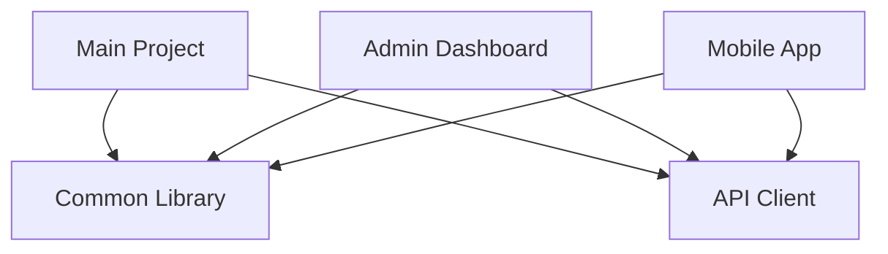

# TypeScript Advanced Configuration

When working with TypeScript in real-world applications, understanding how to properly configure the TypeScript compiler becomes essential. This guide will walk you through advanced configuration options that can help you customize TypeScript's behavior to fit your project's specific needs.

## Introduction to TypeScript Configuration

TypeScript configuration is primarily managed through a file named `tsconfig.json` that lives in the root of your project. While you might be familiar with basic options, mastering the advanced configuration capabilities allows you to unlock TypeScript's full potential.

Advanced configuration enables you to:
- Fine-tune type checking behavior
- Optimize compilation performance
- Customize module resolution
- Configure project references
- Set up path aliases
- Implement incremental builds

## The Anatomy of tsconfig.json

A TypeScript configuration file consists of several sections, with `compilerOptions` being the most extensive:

```json
{
  "compilerOptions": {
    // Compiler-specific options
  },
  "include": [
    // Files/paths to include
  ],
  "exclude": [
    // Files/paths to exclude
  ],
  "extends": "string",    // Base configuration to extend
  "references": []        // Project references
}
```

Let's dive deeper into each section's advanced options.

## Advanced Compiler Options

### Type Checking Strictness

TypeScript's power comes from its type system. You can configure how strict the type checking is:

```json
{
  "compilerOptions": {
    "strict": true,
    "noImplicitAny": true,
    "strictNullChecks": true,
    "strictFunctionTypes": true,
    "strictBindCallApply": true,
    "strictPropertyInitialization": true,
    "noImplicitThis": true,
    "useUnknownInCatchVariables": true,
    "alwaysStrict": true
  }
}
```

Setting `"strict": true` enables all strict type checking options, but you can also configure them individually.

#### Example: Impact of strictNullChecks

Without strict null checks:

```typescript
function getLength(text: string) {
  return text.length;
}

// This compiles but will fail at runtime
getLength(null);
```

With strict null checks:

```typescript
// With "strictNullChecks": true
function getLength(text: string) {
  return text.length;
}

// Error: Argument of type 'null' is not assignable to parameter of type 'string'
getLength(null);
```

### Module Resolution Strategies

Module resolution is how TypeScript finds files referenced by import statements. The two main strategies are:

```json
{
  "compilerOptions": {
    "moduleResolution": "node",
    // or
    "moduleResolution": "classic"
  }
}
```

Modern projects typically use `"node"`, which follows Node.js resolution rules, while `"classic"` is TypeScript's original resolution algorithm.

For TypeScript 4.7+, there are additional options:
- `"node16"` or `"nodenext"`: For Node.js with ECMAScript modules

#### Path Mapping

Path mapping allows you to define custom import paths:

```json
{
  "compilerOptions": {
    "baseUrl": ".",
    "paths": {
      "@core/*": ["src/core/*"],
      "@utils/*": ["src/utils/*"],
      "@components/*": ["src/components/*"]
    }
  }
}
```

This configuration lets you import modules like this:

```typescript
// Instead of relative paths like:
import { Button } from '../../../components/Button';

// You can use:
import { Button } from '@components/Button';
```

### Project References

Project references enable breaking large codebases into smaller, manageable pieces:

```json
{
  "references": [
    { "path": "../common" },
    { "path": "../api" }
  ],
  "compilerOptions": {
    "composite": true
  }
}
```

With this setup, TypeScript understands dependencies between projects, enabling:
- Incremental builds
- Faster type checking
- Better code organization

### Advanced Output Options

Control how TypeScript generates JavaScript:

```json
{
  "compilerOptions": {
    "outDir": "dist",
    "declaration": true,
    "declarationMap": true,
    "sourceMap": true,
    "inlineSources": true,
    "inlineSourceMap": false,
    "removeComments": false,
    "newLine": "lf",
    "noEmitOnError": true,
    "preserveConstEnums": true
  }
}
```

#### Source Maps Configuration

Source maps help with debugging by mapping compiled JavaScript back to your TypeScript sources:

```json
{
  "compilerOptions": {
    "sourceMap": true,
    "inlineSources": true,
    "sourceRoot": "/src"
  }
}
```

## Optimizing TypeScript Projects

### Incremental Compilation

For large projects, incremental compilation significantly improves build time:

```json
{
  "compilerOptions": {
    "incremental": true,
    "tsBuildInfoFile": "./buildcache/main.tsbuildinfo"
  }
}
```

This generates a `.tsbuildinfo` file that tracks dependencies between files, allowing TypeScript to only recompile what changed.

### Skip Type Checking for Libraries

When working with well-typed libraries, you can skip checking their types:

```json
{
  "compilerOptions": {
    "skipLibCheck": true
  }
}
```

This can dramatically improve performance, especially with large node_modules directories.

## Real-World Configuration Examples

### Configuration for a Modern React Project

```json
{
  "compilerOptions": {
    "target": "ES2020",
    "module": "ESNext",
    "moduleResolution": "node",
    "lib": ["DOM", "DOM.Iterable", "ESNext"],
    "jsx": "react-jsx",
    "strict": true,
    "esModuleInterop": true,
    "skipLibCheck": true,
    "forceConsistentCasingInFileNames": true,
    "allowSyntheticDefaultImports": true,
    "noFallthroughCasesInSwitch": true,
    "isolatedModules": true,
    "resolveJsonModule": true,
    "baseUrl": ".",
    "paths": {
      "@/*": ["src/*"]
    }
  },
  "include": ["src"],
  "exclude": ["node_modules"]
}
```

### Configuration for a Node.js API Server

```json
{
  "compilerOptions": {
    "target": "ES2019",
    "module": "commonjs",
    "outDir": "dist",
    "rootDir": "src",
    "strict": true,
    "esModuleInterop": true,
    "skipLibCheck": true,
    "forceConsistentCasingInFileNames": true,
    "resolveJsonModule": true,
    "sourceMap": true,
    "typeRoots": ["./node_modules/@types", "./src/types"],
    "experimentalDecorators": true,
    "emitDecoratorMetadata": true
  },
  "include": ["src/**/*"],
  "exclude": ["node_modules", "**/*.test.ts"]
}
```

## Advanced Techniques

### Using Multiple Configuration Files

For complex projects, you might need multiple configuration files:

```
project/
├── tsconfig.json           # Base configuration
├── tsconfig.app.json       # Frontend app config
├── tsconfig.server.json    # Backend server config
└── tsconfig.test.json      # Testing configuration
```

The extended configurations can inherit from the base:

```json
// tsconfig.app.json
{
  "extends": "./tsconfig.json",
  "compilerOptions": {
    "outDir": "dist/app"
  },
  "include": ["src/app"]
}
```

### Conditional Types Based on Configuration

TypeScript's configuration can influence type behavior:

```typescript
// With "strictNullChecks": true
type NonNullable<T> = T extends null | undefined ? never : T;

// Usage
type RequiredName = NonNullable<string | null>; // Type is string
```

### Using Node Path Mappings with ts-node

When using `ts-node` for development, you can enable path mappings:

```json
{
  "ts-node": {
    "require": ["tsconfig-paths/register"]
  },
  "compilerOptions": {
    "baseUrl": ".",
    "paths": {
      "@app/*": ["src/app/*"]
    }
  }
}
```

## Configuration for Different Environments

### Production Configuration

For production builds, optimize for performance and bundle size:

```json
{
  "compilerOptions": {
    "removeComments": true,
    "sourceMap": false,
    "declaration": true,
    "noEmitOnError": true
  }
}
```

### Development Configuration

For development, prioritize debugging capabilities:

```json
{
  "compilerOptions": {
    "sourceMap": true,
    "preserveConstEnums": true,
    "incremental": true
  }
}
```

## Visualizing Project Structure

When working with complex project references, visualizing the dependency graph can be helpful:



## Summary

Advanced TypeScript configuration gives you fine-grained control over the compiler's behavior, enabling you to:
- Customize type checking levels
- Optimize build performance
- Structure your projects more effectively
- Improve developer experience through path mappings and other conveniences

Understanding these options allows you to tailor TypeScript to your specific project requirements, whether you're building a small library or a large enterprise application.

## Additional Resources

- TypeScript Documentation on [tsconfig.json](https://www.typescriptlang.org/tsconfig)
- [TypeScript Compiler Options Reference](https://www.typescriptlang.org/docs/handbook/compiler-options.html)
- [Project References Documentation](https://www.typescriptlang.org/docs/handbook/project-references.html)

## Exercises

1. Create a TypeScript configuration that enables all strict type checking except `strictNullChecks`.
2. Set up path mappings to clean up imports in a project with a deep directory structure.
3. Configure a multi-project workspace using project references, with shared code in a core library.
4. Optimize the TypeScript configuration for a large project to improve build performance.
5. Create separate configurations for development, testing, and production environments.