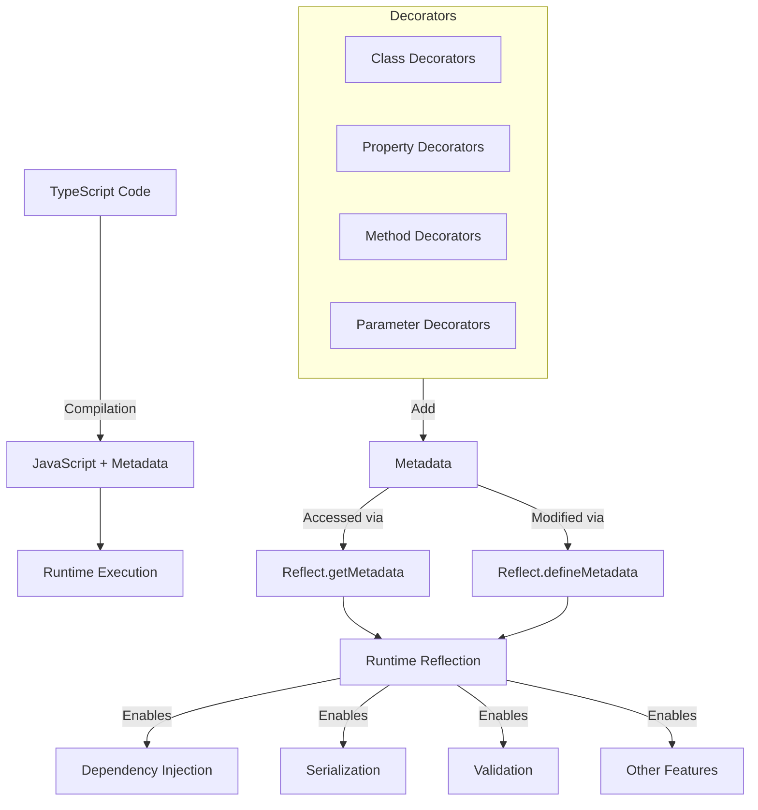

# TypeScript Reflection

## Introduction

Reflection is a programming concept that allows a program to inspect and modify its own structure and behavior at runtime. In many object-oriented languages like Java and C#, reflection is a built-in feature. TypeScript, being a statically typed superset of JavaScript, has limited built-in reflection capabilities since most of its type information is erased during compilation.

However, TypeScript does provide mechanisms that enable reflection-like patterns through decorators, metadata, and type queries. In this tutorial, we'll explore how to use these features to implement reflection in TypeScript applications.

## Prerequisites

Before diving into this topic, you should be familiar with:

- Basic TypeScript concepts
- Classes and interfaces in TypeScript
- Generics in TypeScript

## Understanding Type Erasure in TypeScript

TypeScript's type system exists primarily during compile-time. When TypeScript code is compiled to JavaScript, all type information is erased. This process is called "type erasure."

```typescript
// TypeScript code
function printType<T>(value: T): void {
  console.log(typeof value);
}

printType<string>("Hello");
printType<number>(42);
```

Output after compilation and execution:
```
string
number
```

Notice that the output shows JavaScript's runtime types (`string` and `number`), not TypeScript's compile-time type information (`T`).

## Reflection with `reflect-metadata`

To implement proper reflection in TypeScript, we often use the `reflect-metadata` library, which allows us to attach metadata to class declarations, methods, and properties.

### Setting Up Metadata Reflection

First, install the necessary packages:

```bash
npm install reflect-metadata
```

Then, update your `tsconfig.json` file to enable experimental decorators and metadata:

```json
{
  "compilerOptions": {
    "experimentalDecorators": true,
    "emitDecoratorMetadata": true
  }
}
```

Import the library at the top of your files:

```typescript
import "reflect-metadata";
```

### Basic Metadata Usage

Let's see how we can use metadata:

```typescript
import "reflect-metadata";

// Define a custom metadata key
const FORMAT_METADATA_KEY = Symbol("format");

// Create a decorator that sets metadata
function format(formatString: string) {
  return Reflect.metadata(FORMAT_METADATA_KEY, formatString);
}

class Person {
  @format("Mr. %s")
  name: string;

  constructor(name: string) {
    this.name = name;
  }

  greet() {
    // Get the format metadata
    const formatString = Reflect.getMetadata(FORMAT_METADATA_KEY, this, "name");
    if (formatString) {
      return formatString.replace("%s", this.name);
    }
    return this.name;
  }
}

const person = new Person("John");
console.log(person.greet()); // "Mr. John"
```

In this example, we attach metadata to the `name` property using a decorator and then retrieve it in the `greet` method.

## Type Reflection Using Decorators

Decorators are special declarations that can be attached to classes, methods, properties, or parameters. They allow us to add metadata or modify the behavior of declarations.

### Property Type Decorators

Let's create a decorator to store type information:

```typescript
import "reflect-metadata";

const TYPE_KEY = "design:type";

function LogType(target: any, propertyKey: string) {
  const type = Reflect.getMetadata(TYPE_KEY, target, propertyKey);
  console.log(`${propertyKey} type: ${type.name}`);
}

class Example {
  @LogType
  name: string = "John";

  @LogType
  age: number = 30;

  @LogType
  isActive: boolean = true;

  @LogType
  dates: Date[] = [];
}

// Creating an instance triggers the decorator
const example = new Example();
```

Output:
```
name type: String
age type: Number
isActive type: Boolean
dates type: Array
```

TypeScript automatically adds design-time type metadata when `emitDecoratorMetadata` is enabled.

### Parameter Type Reflection

We can also inspect parameter types:

```typescript
import "reflect-metadata";

function LogParameterTypes(target: any, key: string, descriptor: PropertyDescriptor) {
  const paramTypes = Reflect.getMetadata("design:paramtypes", target, key);
  console.log(`Method ${key} has parameters of types: ${paramTypes.map(t => t.name).join(', ')}`);
  return descriptor;
}

class UserService {
  @LogParameterTypes
  updateUser(id: number, name: string, isActive: boolean) {
    // Method implementation
  }
}

// Creating an instance to trigger the decorator
const service = new UserService();
service.updateUser(1, "Jane", true);
```

Output:
```
Method updateUser has parameters of types: Number, String, Boolean
```

## Creating a Runtime Type System

Now let's create a more comprehensive runtime type system:

```typescript
import "reflect-metadata";

// Type registry to store runtime type information
class TypeRegistry {
  private static types = new Map<string, Function>();

  static registerType(name: string, type: Function) {
    this.types.set(name, type);
  }

  static getType(name: string): Function | undefined {
    return this.types.get(name);
  }
}

// Decorator to register a class
function RegisterType(name?: string) {
  return function(constructor: Function) {
    const typeName = name || constructor.name;
    TypeRegistry.registerType(typeName, constructor);
    return constructor;
  }
}

// Property decorator to define property metadata
function Property() {
  return function(target: any, propertyKey: string) {
    const type = Reflect.getMetadata("design:type", target, propertyKey);
    
    // Get existing properties or initialize new array
    const properties = Reflect.getMetadata("properties", target.constructor) || [];
    
    // Add this property if not already included
    if (!properties.includes(propertyKey)) {
      properties.push(propertyKey);
      Reflect.defineMetadata("properties", properties, target.constructor);
    }
    
    // Store the type of this property
    Reflect.defineMetadata(`property:${propertyKey}:type`, type, target.constructor);
  }
}

// Decorator to make a class serializable
function Serializable() {
  return function(constructor: Function) {
    // Define toJSON method
    constructor.prototype.toJSON = function() {
      const properties = Reflect.getMetadata("properties", constructor) || [];
      const result: any = {};
      
      for (const prop of properties) {
        result[prop] = this[prop];
      }
      
      return result;
    };
    
    // Define fromJSON static method
    (constructor as any).fromJSON = function(json: any) {
      const instance = new (constructor as any)();
      const properties = Reflect.getMetadata("properties", constructor) || [];
      
      for (const prop of properties) {
        if (json.hasOwnProperty(prop)) {
          instance[prop] = json[prop];
        }
      }
      
      return instance;
    };
  }
}

// Example usage
@RegisterType()
@Serializable()
class User {
  @Property()
  id: number = 0;
  
  @Property()
  name: string = "";
  
  @Property()
  isActive: boolean = false;
  
  greet() {
    return `Hello, ${this.name}!`;
  }
}

// Create and serialize a user
const user = new User();
user.id = 1;
user.name = "Alice";
user.isActive = true;

const json = JSON.stringify(user);
console.log(json); // {"id":1,"name":"Alice","isActive":true}

// Deserialize back to a User instance
const retrievedUser = (User as any).fromJSON(JSON.parse(json));
console.log(retrievedUser.greet()); // "Hello, Alice!"
```

This example demonstrates a comprehensive runtime type system with:

1. A type registry to store type information
2. Property decorators to capture property metadata
3. A serialization system that uses the metadata

## Real-World Applications

### Dependency Injection

Reflection is commonly used in dependency injection frameworks:

```typescript
import "reflect-metadata";

// DI container
class Container {
  private services = new Map<string, any>();
  
  register<T>(token: string, instance: T) {
    this.services.set(token, instance);
  }
  
  resolve<T>(target: any): T {
    // Get parameter types from metadata
    const paramTypes = Reflect.getMetadata("design:paramtypes", target) || [];
    
    // Resolve dependencies
    const resolvedDependencies = paramTypes.map((type: any) => {
      const serviceName = type.name;
      const service = this.services.get(serviceName);
      
      if (!service) {
        throw new Error(`No service registered for ${serviceName}`);
      }
      
      return service;
    });
    
    // Create an instance with resolved dependencies
    return new target(...resolvedDependencies);
  }
}

// Service decorators
function Injectable() {
  return function(target: any) {
    // This decorator is mainly for semantic meaning
  };
}

// Services
@Injectable()
class Logger {
  log(message: string) {
    console.log(`[LOG]: ${message}`);
  }
}

@Injectable()
class UserRepository {
  findAll() {
    return [
      { id: 1, name: 'Alice' },
      { id: 2, name: 'Bob' }
    ];
  }
}

@Injectable()
class UserService {
  constructor(
    private logger: Logger,
    private repository: UserRepository
  ) {}
  
  getAllUsers() {
    this.logger.log("Fetching all users");
    return this.repository.findAll();
  }
}

// Set up container
const container = new Container();
container.register("Logger", new Logger());
container.register("UserRepository", new UserRepository());

// Resolve service with dependencies
const userService = container.resolve<UserService>(UserService);
console.log(userService.getAllUsers());
```

Output:
```
[LOG]: Fetching all users
[{ id: 1, name: 'Alice' }, { id: 2, name: 'Bob' }]
```

### Form Validation

Another practical use case is form validation:

```typescript
import "reflect-metadata";

// Validation decorators
function Required(target: any, propertyKey: string) {
  const validationRules = Reflect.getMetadata("validation:rules", target.constructor) || {};
  validationRules[propertyKey] = validationRules[propertyKey] || [];
  validationRules[propertyKey].push({
    type: "required",
    message: `${propertyKey} is required`
  });
  Reflect.defineMetadata("validation:rules", validationRules, target.constructor);
}

function MinLength(length: number) {
  return function(target: any, propertyKey: string) {
    const validationRules = Reflect.getMetadata("validation:rules", target.constructor) || {};
    validationRules[propertyKey] = validationRules[propertyKey] || [];
    validationRules[propertyKey].push({
      type: "minLength",
      value: length,
      message: `${propertyKey} must be at least ${length} characters`
    });
    Reflect.defineMetadata("validation:rules", validationRules, target.constructor);
  };
}

function Email(target: any, propertyKey: string) {
  const validationRules = Reflect.getMetadata("validation:rules", target.constructor) || {};
  validationRules[propertyKey] = validationRules[propertyKey] || [];
  validationRules[propertyKey].push({
    type: "email",
    message: `${propertyKey} must be a valid email address`
  });
  Reflect.defineMetadata("validation:rules", validationRules, target.constructor);
}

// Validator class
class Validator {
  static validate(instance: any): { valid: boolean, errors: string[] } {
    const errors: string[] = [];
    const validationRules = Reflect.getMetadata("validation:rules", instance.constructor);
    
    if (!validationRules) {
      return { valid: true, errors: [] };
    }
    
    for (const property in validationRules) {
      const value = instance[property];
      const rules = validationRules[property];
      
      for (const rule of rules) {
        switch (rule.type) {
          case "required":
            if (value === undefined || value === null || value === '') {
              errors.push(rule.message);
            }
            break;
          case "minLength":
            if (value && value.length < rule.value) {
              errors.push(rule.message);
            }
            break;
          case "email":
            const emailRegex = /^[^\s@]+@[^\s@]+\.[^\s@]+$/;
            if (value && !emailRegex.test(value)) {
              errors.push(rule.message);
            }
            break;
        }
      }
    }
    
    return {
      valid: errors.length === 0,
      errors
    };
  }
}

// Example usage
class UserRegistrationForm {
  @Required
  @MinLength(3)
  username: string;
  
  @Required
  @Email
  email: string;
  
  @Required
  @MinLength(8)
  password: string;
  
  constructor(data?: any) {
    if (data) {
      this.username = data.username;
      this.email = data.email;
      this.password = data.password;
    }
  }
}

// Valid form
const validForm = new UserRegistrationForm({
  username: "alice",
  email: "alice@example.com",
  password: "securePassword123"
});

console.log(Validator.validate(validForm));

// Invalid form
const invalidForm = new UserRegistrationForm({
  username: "a",
  email: "not-an-email",
  password: "short"
});

console.log(Validator.validate(invalidForm));
```

Output:
```
{ valid: true, errors: [] }
{
  valid: false,
  errors: [
    'username must be at least 3 characters',
    'email must be a valid email address',
    'password must be at least 8 characters'
  ]
}
```

## Visualizing TypeScript Reflection

Here's a diagram showing how reflection works in TypeScript:



## Limitations of Reflection in TypeScript

While these techniques provide reflection-like capabilities, there are some limitations to be aware of:

1. **Performance Impact**: Reflection operations are generally slower than direct property access.

2. **Bundle Size**: The `reflect-metadata` library adds to your bundle size.

3. **Type Limitations**: Complex types like unions, intersections, and generics may not be fully represented in metadata.

4. **Setup Required**: You must enable experimental decorators and metadata emission in `tsconfig.json`.

5. **TypeScript Version Dependency**: Some reflection features may change across TypeScript versions.

## Summary

TypeScript reflection provides powerful capabilities for creating more dynamic and self-describing code:

- We can use the `reflect-metadata` library to add and retrieve metadata.
- Decorators allow us to annotate classes, properties, methods, and parameters with metadata.
- By leveraging metadata, we can implement features like dependency injection, validation, and serialization.
- TypeScript's type erasure means we need to explicitly store type information if we want to access it at runtime.

While TypeScript's reflection capabilities have limitations compared to some other languages, the combination of decorators and metadata provides a robust foundation for creating reflection-based systems.

## Additional Resources

- [TypeScript Decorators documentation](https://www.typescriptlang.org/docs/handbook/decorators.html)
- [reflect-metadata on npm](https://www.npmjs.com/package/reflect-metadata)
- [TypeScript Deep Dive - Metadata](https://basarat.gitbook.io/typescript/decorators#metadata)

## Exercises

1. Create a simple serialization system that can convert class instances to JSON and back while preserving types.

2. Implement a basic dependency injection container that can automatically resolve constructor dependencies.

3. Build a validation system using decorators for common validation rules like required fields, minimum/maximum values, etc.

4. Create a "schema builder" that generates a JSON schema from decorated TypeScript classes.

5. Implement a logging system that uses method decorators to automatically log method calls and their parameters.