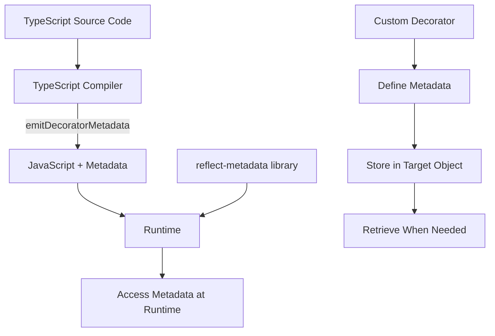

# TypeScript Metadata

## Introduction

TypeScript metadata is a powerful feature that allows you to attach additional information to classes, methods, properties, and parameters at design-time, which can later be accessed at runtime. This metadata system works through decorators and the reflection capabilities provided by the `reflect-metadata` library.

Metadata enables advanced patterns in TypeScript applications, such as dependency injection, validation frameworks, serialization/deserialization processes, and more. While TypeScript itself is a compile-time tool, metadata bridges the gap between compile-time type information and runtime behavior.

## Prerequisites

Before diving into TypeScript metadata, make sure you understand:
- Basic TypeScript concepts
- Classes and interfaces in TypeScript
- Decorators in TypeScript

## Setting Up Metadata in TypeScript

To use metadata in your TypeScript project, you need to configure your environment properly:

1. First, install the `reflect-metadata` library:

```bash
npm install reflect-metadata
```

2. Update your `tsconfig.json` to enable experimental decorators and metadata:

```json
{
  "compilerOptions": {
    "target": "ES5",
    "experimentalDecorators": true,
    "emitDecoratorMetadata": true
  }
}
```

3. Import the library at the application entry point:

```typescript
import "reflect-metadata";
```

## Understanding Reflect Metadata

The `reflect-metadata` library provides an API for reading and writing metadata, building on top of the ECMAScript's Reflect API. Key functions include:

- `Reflect.defineMetadata(metadataKey, metadataValue, target, propertyKey?)` 
- `Reflect.getMetadata(metadataKey, target, propertyKey?)`
- `Reflect.getOwnMetadata(metadataKey, target, propertyKey?)`
- `Reflect.hasMetadata(metadataKey, target, propertyKey?)`
- `Reflect.hasOwnMetadata(metadataKey, target, propertyKey?)`
- `Reflect.deleteMetadata(metadataKey, target, propertyKey?)`

## Working with Custom Metadata

Let's start with a simple example of defining and retrieving custom metadata:

```typescript
import "reflect-metadata";

// Define metadata for a class
@Reflect.metadata("classMetadata", "This is a sample class")
class Sample {
  
  @Reflect.metadata("methodMetadata", "This is a sample method")
  public doSomething(): void {
    console.log("Doing something...");
  }
}

// Retrieve metadata
console.log(Reflect.getMetadata("classMetadata", Sample));  
// Output: "This is a sample class"

console.log(Reflect.getMetadata("methodMetadata", Sample.prototype, "doSomething"));  
// Output: "This is a sample method"
```

## Creating Custom Decorators with Metadata

One of the most powerful applications of metadata is creating custom decorators. Here's how you can define a custom decorator that uses metadata:

```typescript
import "reflect-metadata";

// Define a custom decorator that adds metadata
function LogMethod(target: any, propertyKey: string, descriptor: PropertyDescriptor) {
  Reflect.defineMetadata("logEnabled", true, target, propertyKey);
  
  // Save original method
  const originalMethod = descriptor.value;
  
  // Replace method with wrapper that logs
  descriptor.value = function(...args: any[]) {
    console.log(`Calling ${propertyKey} with:`, args);
    const result = originalMethod.apply(this, args);
    console.log(`${propertyKey} returned:`, result);
    return result;
  };
  
  return descriptor;
}

class Calculator {
  @LogMethod
  add(a: number, b: number): number {
    return a + b;
  }
}

const calc = new Calculator();
const sum = calc.add(5, 3);
// Output:
// Calling add with: [5, 3]
// add returned: 8

// We can also check if logging is enabled for the method
console.log(Reflect.getMetadata("logEnabled", Calculator.prototype, "add")); 
// Output: true
```

## Type Metadata

TypeScript automatically generates some metadata when `emitDecoratorMetadata` is enabled. These include:

1. `design:type` - The type of a property/method
2. `design:paramtypes` - The types of parameters for a method
3. `design:returntype` - The return type of a method

Here's how to use this type metadata:

```typescript
import "reflect-metadata";

class User {
  name: string;
  age: number;
  
  constructor(name: string, age: number) {
    this.name = name;
    this.age = age;
  }
}

class UserService {
  @LogTypes
  createUser(name: string, age: number): User {
    return new User(name, age);
  }
}

function LogTypes(target: any, propertyKey: string, descriptor: PropertyDescriptor) {
  // Get parameter types
  const paramTypes = Reflect.getMetadata("design:paramtypes", target, propertyKey);
  console.log("Parameter types:", paramTypes.map(t => t.name));
  
  // Get return type
  const returnType = Reflect.getMetadata("design:returntype", target, propertyKey);
  console.log("Return type:", returnType.name);
  
  return descriptor;
}

// Create an instance and call the decorated method
const service = new UserService();
service.createUser("John", 30);

// Output:
// Parameter types: ["String", "Number"]
// Return type: User
```

## Practical Example: Building a Simple Validation Framework

Let's build a simple validation framework using metadata to validate class properties:

```typescript
import "reflect-metadata";

// Property decorators for validation
function MinLength(min: number) {
  return function(target: any, propertyKey: string) {
    Reflect.defineMetadata("validator:minLength", min, target, propertyKey);
  };
}

function Required(target: any, propertyKey: string) {
  Reflect.defineMetadata("validator:required", true, target, propertyKey);
}

function Email(target: any, propertyKey: string) {
  Reflect.defineMetadata("validator:email", true, target, propertyKey);
}

// Validation function
function validate(obj: any): { isValid: boolean, errors: string[] } {
  const errors: string[] = [];
  const prototype = Object.getPrototypeOf(obj);

  // Get all property names
  const properties = Object.getOwnPropertyNames(obj);

  for (const prop of properties) {
    // Check required
    const isRequired = Reflect.getMetadata("validator:required", prototype, prop);
    if (isRequired && (obj[prop] === undefined || obj[prop] === null || obj[prop] === "")) {
      errors.push(`${prop} is required`);
    }

    // Check min length
    const minLength = Reflect.getMetadata("validator:minLength", prototype, prop);
    if (minLength && obj[prop] && obj[prop].length < minLength) {
      errors.push(`${prop} should be at least ${minLength} characters`);
    }

    // Check email format
    const isEmail = Reflect.getMetadata("validator:email", prototype, prop);
    if (isEmail && obj[prop] && !/^\S+@\S+\.\S+$/.test(obj[prop])) {
      errors.push(`${prop} should be a valid email`);
    }
  }

  return {
    isValid: errors.length === 0,
    errors
  };
}

// Using our validation framework
class UserRegistration {
  @Required
  @MinLength(3)
  username: string;

  @Required
  @Email
  email: string;

  @Required
  @MinLength(8)
  password: string;

  constructor(username: string, email: string, password: string) {
    this.username = username;
    this.email = email;
    this.password = password;
  }
}

// Valid user
const validUser = new UserRegistration("johnsmith", "john@example.com", "password123");
const validResult = validate(validUser);
console.log("Valid user:", validResult);
// Output: Valid user: { isValid: true, errors: [] }

// Invalid user
const invalidUser = new UserRegistration("jo", "notanemail", "pass");
const invalidResult = validate(invalidUser);
console.log("Invalid user:", invalidResult);
// Output: Invalid user: {
//   isValid: false,
//   errors: [
//     'username should be at least 3 characters',
//     'email should be a valid email',
//     'password should be at least 8 characters'
//   ]
// }
```

## Practical Example: Dependency Injection with Metadata

Metadata is often used for dependency injection. Let's create a simple DI container:

```typescript
import "reflect-metadata";

// Service registry
const serviceRegistry = new Map<string, any>();

// Register a class as a singleton service
function Service(name?: string) {
  return function(target: any) {
    const serviceName = name || target.name;
    const instance = new target();
    serviceRegistry.set(serviceName, instance);
    console.log(`Registered service: ${serviceName}`);
  };
}

// Inject a service
function Inject(serviceName?: string) {
  return function(target: any, propertyKey: string) {
    const type = Reflect.getMetadata("design:type", target, propertyKey);
    const actualServiceName = serviceName || type.name;
    
    // Define a getter for the property
    Object.defineProperty(target, propertyKey, {
      get: function() {
        const service = serviceRegistry.get(actualServiceName);
        if (!service) {
          throw new Error(`Service ${actualServiceName} not found`);
        }
        return service;
      },
      enumerable: true,
      configurable: true
    });
  };
}

// Service implementations
@Service()
class Logger {
  log(message: string) {
    console.log(`[LOG]: ${message}`);
  }
}

@Service()
class Database {
  connect() {
    console.log("Connected to database");
  }
  
  query(sql: string) {
    console.log(`Executing query: ${sql}`);
    return [{ id: 1, name: "John" }, { id: 2, name: "Jane" }];
  }
}

// Using the services
class UserController {
  @Inject()
  private logger: Logger;
  
  @Inject()
  private database: Database;
  
  getUsers() {
    this.logger.log("Getting users");
    this.database.connect();
    return this.database.query("SELECT * FROM users");
  }
}

// Use the controller
const controller = new UserController();
const users = controller.getUsers();
console.log("Users:", users);

// Output:
// Registered service: Logger
// Registered service: Database
// [LOG]: Getting users
// Connected to database
// Executing query: SELECT * FROM users
// Users: [{ id: 1, name: "John" }, { id: 2, name: "Jane" }]
```

## Understanding Metadata Flow

To better understand how metadata works in TypeScript, let's visualize the flow:



## Best Practices for Using Metadata

1. **Keep metadata minimal**: Only store what you need, as excessive metadata can increase memory usage.
2. **Cache metadata lookups**: Avoid repeatedly accessing the same metadata.
3. **Make decorators composable**: Design decorators that work well together.
4. **Document metadata keys**: Maintain documentation for metadata keys to avoid conflicts.
5. **Use specific metadata keys**: Prefix your metadata keys to avoid collisions with other libraries.

## Performance Considerations

Metadata operations have a performance cost. Here are some tips to minimize it:

1. **Cache metadata results** when you need to access the same metadata multiple times
2. **Perform metadata operations during initialization** rather than in frequently called functions
3. **Avoid excessive metadata** that might never be used

## Summary

TypeScript metadata provides a powerful mechanism for adding runtime type information and annotations to your code. With the help of decorators and the reflect-metadata library, you can implement advanced patterns like validation, dependency injection, serialization, and more.

Key points covered:
- Setting up metadata in a TypeScript project
- Working with the `reflect-metadata` API
- Creating custom decorators with metadata
- Using TypeScript's automatic type metadata
- Building practical solutions with metadata (validation and dependency injection)
- Best practices and performance considerations

## Additional Resources and Exercises

### Resources
- [Official TypeScript Documentation on Decorators](https://www.typescriptlang.org/docs/handbook/decorators.html)
- [reflect-metadata npm package](https://www.npmjs.com/package/reflect-metadata)
- [Metadata Proposal for ECMAScript](https://github.com/tc39/proposal-decorators)

### Exercises
1. Build a serialization library that uses metadata to convert class instances to JSON and back.
2. Extend the validation framework to support more validation types like "maxLength", "pattern", and "range".
3. Create a routing decorator for a simple web framework that maps methods to HTTP routes using metadata.
4. Implement a permissions system using metadata to define access control for methods.
5. Build a simple ORM that uses metadata to map class properties to database columns.

The power of TypeScript metadata lies in its ability to bridge compile-time type information with runtime behavior, enabling more robust and feature-rich applications with less boilerplate code.