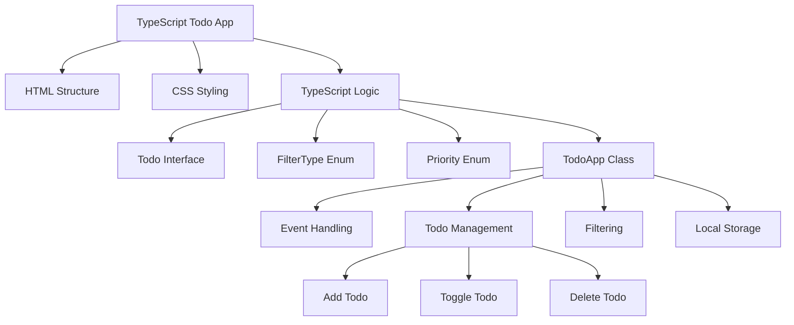

# TypeScript Todo App

## Introduction

Building a Todo application is a fantastic way to practice TypeScript fundamentals while creating something useful. In this tutorial, we'll develop a Todo application from scratch using TypeScript, HTML, and CSS. This project will help you understand how TypeScript enhances JavaScript by providing static typing, interfaces, and better tooling.

By the end of this tutorial, you'll have a fully functional Todo app where users can:

- Add new tasks
- Mark tasks as completed
- Delete tasks
- Filter tasks by status (all, active, completed)
- Save tasks to local storage for persistence

Let's dive into building our TypeScript Todo application!

## Project Setup

### Prerequisites

Before we begin, make sure you have the following installed:

- Node.js (latest LTS version)
- npm or yarn
- A code editor (VS Code recommended for TypeScript support)

### Setting Up the Project

First, let's create our project structure:

```bash
mkdir ts-todo-app
cd ts-todo-app
npm init -y
npm install typescript --save-dev
npx tsc --init
```

Now, let's create the necessary files:

```bash
touch index.html style.css
mkdir src
touch src/app.ts
```

### Configure TypeScript

Let's update our `tsconfig.json` file with appropriate settings:

```json
{
  "compilerOptions": {
    "target": "ES2015",
    "module": "ES2015",
    "strict": true,
    "esModuleInterop": true,
    "outDir": "./dist",
    "sourceMap": true,
    "lib": ["DOM", "ES2015"]
  },
  "include": ["src/**/*"]
}
```

### HTML Structure

Create a basic HTML structure in `index.html`:

```html
<!DOCTYPE html>
<html lang="en">
<head>
  <meta charset="UTF-8">
  <meta name="viewport" content="width=device-width, initial-scale=1.0">
  <title>TypeScript Todo App</title>
  <link rel="stylesheet" href="style.css">
</head>
<body>
  <div class="container">
    <h1>TypeScript Todo App</h1>
    
    <div class="todo-input">
      <input type="text" id="todoInput" placeholder="What needs to be done?">
      <button id="addTodoBtn">Add</button>
    </div>
    
    <div class="filters">
      <button id="filterAll" class="active">All</button>
      <button id="filterActive">Active</button>
      <button id="filterCompleted">Completed</button>
    </div>
    
    <ul id="todoList" class="todo-list">
      <!-- Todo items will be added here dynamically -->
    </ul>
  </div>

  <script type="module" src="dist/app.js"></script>
</body>
</html>
```

### CSS Styling

Add some basic styling in `style.css`:

```css
body {
  font-family: Arial, sans-serif;
  line-height: 1.6;
  margin: 0;
  padding: 0;
  background-color: #f5f5f5;
}

.container {
  max-width: 600px;
  margin: 2rem auto;
  padding: 1rem;
  background-color: white;
  border-radius: 5px;
  box-shadow: 0 2px 5px rgba(0, 0, 0, 0.1);
}

h1 {
  text-align: center;
  color: #333;
}

.todo-input {
  display: flex;
  margin-bottom: 1rem;
}

.todo-input input {
  flex: 1;
  padding: 0.5rem;
  font-size: 1rem;
  border: 1px solid #ddd;
  border-radius: 3px 0 0 3px;
}

.todo-input button {
  padding: 0.5rem 1rem;
  background-color: #4caf50;
  color: white;
  border: none;
  border-radius: 0 3px 3px 0;
  cursor: pointer;
}

.filters {
  display: flex;
  justify-content: center;
  margin-bottom: 1rem;
}

.filters button {
  background: none;
  border: 1px solid #ddd;
  padding: 0.5rem 1rem;
  margin: 0 0.25rem;
  cursor: pointer;
}

.filters button.active {
  background-color: #f0f0f0;
  font-weight: bold;
}

.todo-list {
  list-style-type: none;
  padding: 0;
}

.todo-item {
  display: flex;
  align-items: center;
  padding: 0.5rem;
  border-bottom: 1px solid #eee;
}

.todo-item.completed .todo-text {
  text-decoration: line-through;
  color: #888;
}

.todo-item input[type="checkbox"] {
  margin-right: 1rem;
}

.todo-text {
  flex: 1;
}

.delete-btn {
  background-color: #ff4d4d;
  color: white;
  border: none;
  border-radius: 3px;
  padding: 0.25rem 0.5rem;
  cursor: pointer;
}
```

## TypeScript Implementation

Now, let's implement our Todo application using TypeScript!

### Step 1: Define Todo Interface

First, let's define the interface for our Todo items:

```typescript
// src/app.ts

// Interface for Todo items
interface Todo {
  id: number;
  text: string;
  completed: boolean;
}

// Enum for filter types
enum FilterType {
  All = 'all',
  Active = 'active',
  Completed = 'completed',
}
```

### Step 2: Define Main Class

Let's create a main `TodoApp` class to handle our app's functionality:

```typescript
class TodoApp {
  private todos: Todo[] = [];
  private currentFilter: FilterType = FilterType.All;
  private nextId: number = 1;

  // DOM Elements
  private todoInput: HTMLInputElement;
  private addTodoBtn: HTMLButtonElement;
  private todoList: HTMLUListElement;
  private filterAllBtn: HTMLButtonElement;
  private filterActiveBtn: HTMLButtonElement;
  private filterCompletedBtn: HTMLButtonElement;

  constructor() {
    // Initialize DOM elements
    this.todoInput = document.getElementById('todoInput') as HTMLInputElement;
    this.addTodoBtn = document.getElementById('addTodoBtn') as HTMLButtonElement;
    this.todoList = document.getElementById('todoList') as HTMLUListElement;
    this.filterAllBtn = document.getElementById('filterAll') as HTMLButtonElement;
    this.filterActiveBtn = document.getElementById('filterActive') as HTMLButtonElement;
    this.filterCompletedBtn = document.getElementById('filterCompleted') as HTMLButtonElement;

    // Load todos from local storage
    this.loadTodos();

    // Set up event listeners
    this.setupEventListeners();

    // Initial render
    this.renderTodos();
  }

  private setupEventListeners(): void {
    // Add todo when button is clicked
    this.addTodoBtn.addEventListener('click', () => this.addTodo());
    
    // Add todo when Enter key is pressed
    this.todoInput.addEventListener('keypress', (e) => {
      if (e.key === 'Enter') {
        this.addTodo();
      }
    });

    // Filter buttons
    this.filterAllBtn.addEventListener('click', () => this.setFilter(FilterType.All));
    this.filterActiveBtn.addEventListener('click', () => this.setFilter(FilterType.Active));
    this.filterCompletedBtn.addEventListener('click', () => this.setFilter(FilterType.Completed));
  }

  private addTodo(): void {
    const text = this.todoInput.value.trim();
    
    if (text) {
      const newTodo: Todo = {
        id: this.nextId++,
        text,
        completed: false,
      };
      
      this.todos.push(newTodo);
      this.todoInput.value = '';
      this.saveTodos();
      this.renderTodos();
    }
  }

  private toggleTodo(id: number): void {
    this.todos = this.todos.map(todo => {
      if (todo.id === id) {
        return { ...todo, completed: !todo.completed };
      }
      return todo;
    });
    
    this.saveTodos();
    this.renderTodos();
  }

  private deleteTodo(id: number): void {
    this.todos = this.todos.filter(todo => todo.id !== id);
    this.saveTodos();
    this.renderTodos();
  }

  private setFilter(filter: FilterType): void {
    this.currentFilter = filter;
    
    // Update active filter button
    [this.filterAllBtn, this.filterActiveBtn, this.filterCompletedBtn].forEach(btn => {
      btn.classList.remove('active');
    });
    
    switch (filter) {
      case FilterType.All:
        this.filterAllBtn.classList.add('active');
        break;
      case FilterType.Active:
        this.filterActiveBtn.classList.add('active');
        break;
      case FilterType.Completed:
        this.filterCompletedBtn.classList.add('active');
        break;
    }
    
    this.renderTodos();
  }

  private getFilteredTodos(): Todo[] {
    switch (this.currentFilter) {
      case FilterType.Active:
        return this.todos.filter(todo => !todo.completed);
      case FilterType.Completed:
        return this.todos.filter(todo => todo.completed);
      default:
        return this.todos;
    }
  }

  private renderTodos(): void {
    // Clear existing list
    this.todoList.innerHTML = '';
    
    // Get filtered todos
    const filteredTodos = this.getFilteredTodos();
    
    // Render each todo
    filteredTodos.forEach(todo => {
      const li = document.createElement('li');
      li.className = `todo-item ${todo.completed ? 'completed' : ''}`;
      
      const checkbox = document.createElement('input');
      checkbox.type = 'checkbox';
      checkbox.checked = todo.completed;
      checkbox.addEventListener('change', () => this.toggleTodo(todo.id));
      
      const span = document.createElement('span');
      span.className = 'todo-text';
      span.textContent = todo.text;
      
      const deleteBtn = document.createElement('button');
      deleteBtn.className = 'delete-btn';
      deleteBtn.textContent = '×';
      deleteBtn.addEventListener('click', () => this.deleteTodo(todo.id));
      
      li.appendChild(checkbox);
      li.appendChild(span);
      li.appendChild(deleteBtn);
      
      this.todoList.appendChild(li);
    });
  }

  private saveTodos(): void {
    localStorage.setItem('todos', JSON.stringify(this.todos));
    localStorage.setItem('nextId', this.nextId.toString());
  }

  private loadTodos(): void {
    const storedTodos = localStorage.getItem('todos');
    const storedNextId = localStorage.getItem('nextId');
    
    if (storedTodos) {
      this.todos = JSON.parse(storedTodos);
    }
    
    if (storedNextId) {
      this.nextId = parseInt(storedNextId, 10);
    }
  }
}

// Initialize the app when DOM is loaded
document.addEventListener('DOMContentLoaded', () => {
  new TodoApp();
});
```

### Step 3: Compile and Run

To compile our TypeScript code to JavaScript:

```bash
npx tsc --watch
```

Now open the `index.html` file in your browser to see the Todo App in action!

## Understanding the TypeScript Features Used

Let's break down some of the key TypeScript features we used in this project:

### 1. Interfaces

We defined a `Todo` interface to establish a contract for the shape of our Todo items:

```typescript
interface Todo {
  id: number;
  text: string;
  completed: boolean;
}
```

This ensures that all Todo objects have these exact properties with the correct types.

### 2. Enums

We used an enum to define the possible filter types:

```typescript
enum FilterType {
  All = 'all',
  Active = 'active',
  Completed = 'completed',
}
```

Enums in TypeScript provide a way to define a set of named constants, making our code more readable and maintainable.

### 3. Strong Typing

We used TypeScript's type annotations throughout the code:

```typescript
private todos: Todo[] = [];
private currentFilter: FilterType = FilterType.All;
private todoInput: HTMLInputElement;
```

This helps catch type-related errors at compile-time rather than runtime.

### 4. Type Assertions

We used type assertions to inform TypeScript about the specific HTML element types:

```typescript
this.todoInput = document.getElementById('todoInput') as HTMLInputElement;
```

This tells TypeScript that we're confident the element with ID 'todoInput' is an input element.

### 5. Private Class Members

We used the `private` modifier to encapsulate class properties and methods:

```typescript
private setupEventListeners(): void {
  // ...
}
```

This helps enforce encapsulation and keeps the public API of our class clean.

## Enhancing the Todo App

Let's add some additional features to enhance our Todo application:

### Feature 1: Task Due Dates

Let's update our Todo interface to include optional due dates:

```typescript
interface Todo {
  id: number;
  text: string;
  completed: boolean;
  dueDate?: Date;  // Optional due date
}
```

Now, let's modify our HTML to include a date input:

```html
<div class="todo-input">
  <input type="text" id="todoInput" placeholder="What needs to be done?">
  <input type="date" id="dueDateInput">
  <button id="addTodoBtn">Add</button>
</div>
```

And update our `addTodo` method:

```typescript
private addTodo(): void {
  const text = this.todoInput.value.trim();
  const dueDateInput = document.getElementById('dueDateInput') as HTMLInputElement;
  
  if (text) {
    const newTodo: Todo = {
      id: this.nextId++,
      text,
      completed: false,
    };
    
    // Add due date if provided
    if (dueDateInput.value) {
      newTodo.dueDate = new Date(dueDateInput.value);
    }
    
    this.todos.push(newTodo);
    this.todoInput.value = '';
    dueDateInput.value = '';
    this.saveTodos();
    this.renderTodos();
  }
}
```

Update the `renderTodos` method to display the due date:

```typescript
// Inside renderTodos method, modify the todo item creation:
filteredTodos.forEach(todo => {
  // ... existing code ...
  
  const span = document.createElement('span');
  span.className = 'todo-text';
  span.textContent = todo.text;
  
  // Add due date if exists
  if (todo.dueDate) {
    const dueDate = new Date(todo.dueDate);
    const dueDateSpan = document.createElement('span');
    dueDateSpan.className = 'due-date';
    dueDateSpan.textContent = `Due: ${dueDate.toLocaleDateString()}`;
    span.appendChild(dueDateSpan);
  }
  
  // ... rest of the code ...
});
```

### Feature 2: Task Priority

Let's add priority levels to our todos:

```typescript
enum Priority {
  Low = 'low',
  Medium = 'medium',
  High = 'high',
}

interface Todo {
  id: number;
  text: string;
  completed: boolean;
  dueDate?: Date;
  priority: Priority;
}
```

Update the HTML:

```html
<div class="todo-input">
  <input type="text" id="todoInput" placeholder="What needs to be done?">
  <input type="date" id="dueDateInput">
  <select id="prioritySelect">
    <option value="low">Low</option>
    <option value="medium" selected>Medium</option>
    <option value="high">High</option>
  </select>
  <button id="addTodoBtn">Add</button>
</div>
```

Update the `addTodo` method:

```typescript
private addTodo(): void {
  const text = this.todoInput.value.trim();
  const dueDateInput = document.getElementById('dueDateInput') as HTMLInputElement;
  const prioritySelect = document.getElementById('prioritySelect') as HTMLSelectElement;
  
  if (text) {
    const newTodo: Todo = {
      id: this.nextId++,
      text,
      completed: false,
      priority: prioritySelect.value as Priority,
    };
    
    // Add due date if provided
    if (dueDateInput.value) {
      newTodo.dueDate = new Date(dueDateInput.value);
    }
    
    this.todos.push(newTodo);
    this.todoInput.value = '';
    dueDateInput.value = '';
    prioritySelect.value = Priority.Medium;
    this.saveTodos();
    this.renderTodos();
  }
}
```

Update the `renderTodos` method to display priority:

```typescript
filteredTodos.forEach(todo => {
  const li = document.createElement('li');
  li.className = `todo-item ${todo.completed ? 'completed' : ''} priority-${todo.priority}`;
  
  // ... rest of the code ...
});
```

Add some CSS for the priorities:

```css
.priority-high {
  border-left: 4px solid #ff4d4d;
}

.priority-medium {
  border-left: 4px solid #ffcc00;
}

.priority-low {
  border-left: 4px solid #4caf50;
}

.due-date {
  font-size: 0.8rem;
  color: #888;
  margin-left: 0.5rem;
}
```

## Project Structure Visualization

Here's a visualization of our project structure:



## Summary

In this tutorial, we've built a fully functional Todo application using TypeScript. We've covered many key TypeScript concepts, including:

- Interfaces for defining object shapes
- Enums for categorization
- Strong typing with TypeScript
- DOM manipulation with type safety
- Class-based architecture
- Local storage for data persistence

Our Todo application now includes features like:
- Adding, completing, and deleting tasks
- Filtering tasks by status
- Setting due dates for tasks
- Assigning priority levels to tasks
- Storing tasks in local storage for persistence

TypeScript provided us with better tooling, error detection, and code organization throughout our development process. This project demonstrates how TypeScript can enhance even simple applications by making the code more robust and maintainable.

## Next Steps and Exercises

To further improve your TypeScript skills and enhance this Todo application:

1. **Add task categories/tags**: Implement a feature that allows users to categorize tasks with tags.

2. **Implement drag-and-drop reordering**: Allow users to reorder tasks by dragging and dropping.

3. **Add user authentication**: Implement a simple authentication system so different users can have their own todo lists.

4. **Create unit tests**: Write unit tests for the Todo app using a framework like Jest.

5. **Implement task search**: Add functionality to search for tasks by text.

6. **Create a task completion history**: Track when tasks were completed and display statistics.

7. **Improve accessibility**: Ensure the app is accessible by implementing proper ARIA attributes and keyboard navigation.

8. **Convert to React or Angular**: Refactor the application to use a modern framework like React or Angular while maintaining TypeScript.

These exercises will help you deepen your understanding of TypeScript while building more advanced features for your Todo application.

Happy coding!