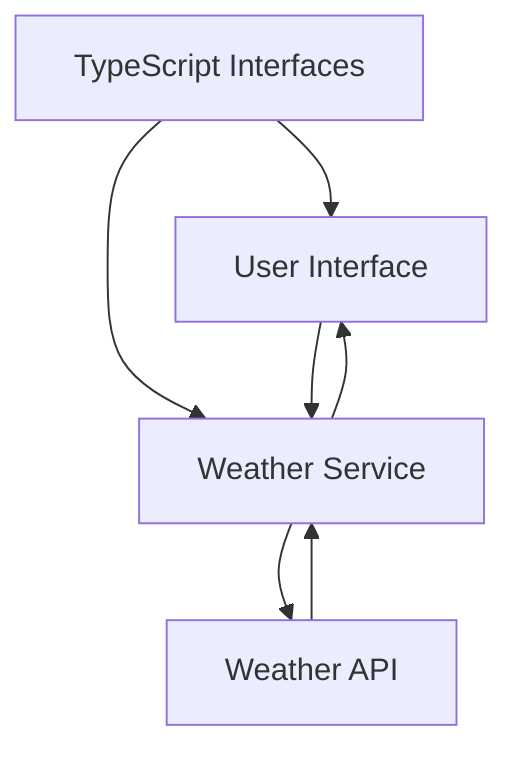

# TypeScript Weather App

## Introduction

Building a weather application is an excellent way to understand how TypeScript enhances JavaScript development. In this project, we'll create a weather app that fetches real-time data from a weather API and displays it to users with full type safety. You'll learn how to:

- Set up a TypeScript project
- Define interfaces for API responses
- Make typed API calls
- Handle errors in a type-safe manner
- Render weather data with proper typing

This project bridges the gap between theoretical TypeScript knowledge and practical application development, showing you how TypeScript's static typing helps create robust applications.

## Project Overview



Our weather app will have:
1. A user interface to input location and display weather
2. A weather service that handles API calls
3. TypeScript interfaces to ensure type safety

## Prerequisites

Before starting, make sure you have:

- Basic knowledge of HTML, CSS, and JavaScript
- Node.js installed on your machine
- Understanding of TypeScript basics (types, interfaces)
- A free API key from [OpenWeatherMap](https://openweathermap.org/api)

## Setting Up the Project

Let's begin by creating a new TypeScript project:

```bash
mkdir weather-app
cd weather-app
npm init -y
npm install typescript --save-dev
npx tsc --init
npm install webpack webpack-cli ts-loader html-webpack-plugin --save-dev
```

Let's configure our `tsconfig.json` file:

```json
{
  "compilerOptions": {
    "target": "es6",
    "module": "commonjs",
    "outDir": "./dist",
    "rootDir": "./src",
    "strict": true,
    "esModuleInterop": true,
    "skipLibCheck": true,
    "forceConsistentCasingInFileNames": true
  },
  "include": ["src/**/*"]
}
```

Create a basic webpack configuration in `webpack.config.js`:

```javascript
const path = require('path');
const HtmlWebpackPlugin = require('html-webpack-plugin');

module.exports = {
  entry: './src/app.ts',
  output: {
    filename: 'bundle.js',
    path: path.resolve(__dirname, 'dist'),
  },
  resolve: {
    extensions: ['.ts', '.js'],
  },
  module: {
    rules: [
      {
        test: /\.ts$/,
        use: 'ts-loader',
        exclude: /node_modules/,
      },
    ],
  },
  plugins: [
    new HtmlWebpackPlugin({
      template: './src/index.html',
    }),
  ],
  devtool: 'inline-source-map',
};
```

## Project Structure

Create the following directory structure:

```
weather-app/
├── src/
│   ├── app.ts           # Main application file
│   ├── index.html       # HTML template
│   ├── models/
│   │   └── weather.ts   # TypeScript interfaces
│   ├── services/
│   │   └── weather.ts   # Weather API service
│   └── utils/
│       └── dom.ts       # DOM utility functions
├── tsconfig.json
└── webpack.config.js
```

## Creating TypeScript Interfaces

First, let's define our interfaces for the weather data. Create `src/models/weather.ts`:

```typescript
export interface Coordinates {
  lon: number;
  lat: number;
}

export interface WeatherCondition {
  id: number;
  main: string;
  description: string;
  icon: string;
}

export interface MainWeatherData {
  temp: number;
  feels_like: number;
  temp_min: number;
  temp_max: number;
  pressure: number;
  humidity: number;
}

export interface Wind {
  speed: number;
  deg: number;
}

export interface Clouds {
  all: number;
}

export interface WeatherData {
  coord: Coordinates;
  weather: WeatherCondition[];
  base: string;
  main: MainWeatherData;
  visibility: number;
  wind: Wind;
  clouds: Clouds;
  dt: number;
  name: string;
  cod: number;
}

export interface WeatherError {
  cod: string;
  message: string;
}
```

These interfaces define the structure of the data we expect from the OpenWeatherMap API. By creating these interfaces, TypeScript will ensure that we handle this data correctly throughout our application.

## Creating the Weather Service

Now, let's create a service to interact with the OpenWeatherMap API. Create `src/services/weather.ts`:

```typescript
import { WeatherData, WeatherError } from '../models/weather';

export class WeatherService {
  private apiKey: string;
  private baseUrl: string;

  constructor(apiKey: string) {
    this.apiKey = apiKey;
    this.baseUrl = 'https://api.openweathermap.org/data/2.5/weather';
  }

  async getWeatherByCity(city: string): Promise<WeatherData> {
    try {
      const response = await fetch(
        `${this.baseUrl}?q=${city}&appid=${this.apiKey}&units=metric`
      );
      
      const data = await response.json();
      
      if (!response.ok) {
        const errorData = data as WeatherError;
        throw new Error(errorData.message || 'Failed to fetch weather data');
      }
      
      return data as WeatherData;
    } catch (error) {
      if (error instanceof Error) {
        throw new Error(`Weather service error: ${error.message}`);
      }
      throw new Error('An unexpected error occurred');
    }
  }

  async getWeatherByCoordinates(lat: number, lon: number): Promise<WeatherData> {
    try {
      const response = await fetch(
        `${this.baseUrl}?lat=${lat}&lon=${lon}&appid=${this.apiKey}&units=metric`
      );
      
      const data = await response.json();
      
      if (!response.ok) {
        const errorData = data as WeatherError;
        throw new Error(errorData.message || 'Failed to fetch weather data');
      }
      
      return data as WeatherData;
    } catch (error) {
      if (error instanceof Error) {
        throw new Error(`Weather service error: ${error.message}`);
      }
      throw new Error('An unexpected error occurred');
    }
  }
}
```

Notice how we're using the `WeatherData` and `WeatherError` interfaces to type our responses, which gives us compile-time safety when handling the API data.

## DOM Utility Functions

Create `src/utils/dom.ts` to abstract DOM manipulations:

```typescript
export function getElement<T extends HTMLElement>(selector: string): T {
  const element = document.querySelector<T>(selector);
  if (!element) {
    throw new Error(`Element not found: ${selector}`);
  }
  return element;
}

export function createElement<K extends keyof HTMLElementTagNameMap>(
  tagName: K,
  className?: string,
  textContent?: string
): HTMLElementTagNameMap[K] {
  const element = document.createElement(tagName);
  
  if (className) {
    element.className = className;
  }
  
  if (textContent) {
    element.textContent = textContent;
  }
  
  return element;
}
```

These utility functions use TypeScript's generics to provide type safety when working with DOM elements.

## HTML Structure

Create the HTML structure in `src/index.html`:

```html
<!DOCTYPE html>
<html lang="en">
<head>
    <meta charset="UTF-8">
    <meta name="viewport" content="width=device-width, initial-scale=1.0">
    <title>TypeScript Weather App</title>
    <style>
        body {
            font-family: 'Segoe UI', Tahoma, Geneva, Verdana, sans-serif;
            max-width: 800px;
            margin: 0 auto;
            padding: 20px;
            background-color: #f5f5f5;
        }
        .container {
            background-color: white;
            border-radius: 10px;
            box-shadow: 0 4px 6px rgba(0, 0, 0, 0.1);
            padding: 20px;
        }
        .search-container {
            display: flex;
            margin-bottom: 20px;
        }
        #city-input {
            flex-grow: 1;
            padding: 10px;
            border: 1px solid #ddd;
            border-radius: 4px 0 0 4px;
            font-size: 16px;
        }
        #search-btn {
            padding: 10px 15px;
            background-color: #4CAF50;
            color: white;
            border: none;
            border-radius: 0 4px 4px 0;
            cursor: pointer;
            font-size: 16px;
        }
        #weather-container {
            display: flex;
            flex-direction: column;
            align-items: center;
        }
        .weather-card {
            width: 100%;
            padding: 20px;
            border-radius: 8px;
            background-color: #f9f9f9;
            box-shadow: 0 2px 4px rgba(0, 0, 0, 0.05);
        }
        .weather-header {
            display: flex;
            justify-content: space-between;
            align-items: center;
            margin-bottom: 15px;
        }
        .weather-details {
            display: grid;
            grid-template-columns: repeat(2, 1fr);
            gap: 10px;
        }
        .detail-item {
            padding: 8px;
            background-color: #eee;
            border-radius: 4px;
        }
        .error {
            color: red;
            padding: 10px;
            border: 1px solid red;
            border-radius: 4px;
            background-color: #ffebee;
            margin-top: 10px;
        }
    </style>
</head>
<body>
    <div class="container">
        <h1>TypeScript Weather App</h1>
        
        <div class="search-container">
            <input type="text" id="city-input" placeholder="Enter city name..." />
            <button id="search-btn">Search</button>
        </div>
        
        <div id="error-container"></div>
        <div id="weather-container"></div>
        
        <div class="location-container">
            <button id="location-btn">Use My Location</button>
        </div>
    </div>
</body>
</html>
```

## Main Application Logic

Finally, let's implement the main application logic in `src/app.ts`:

```typescript
import { WeatherService } from './services/weather';
import { WeatherData } from './models/weather';
import { getElement, createElement } from './utils/dom';

// Replace with your actual API key
const API_KEY = 'your_api_key_here';

class WeatherApp {
  private weatherService: WeatherService;
  
  constructor() {
    this.weatherService = new WeatherService(API_KEY);
    this.initializeApp();
  }
  
  private initializeApp(): void {
    const searchBtn = getElement<HTMLButtonElement>('#search-btn');
    const locationBtn = getElement<HTMLButtonElement>('#location-btn');
    const cityInput = getElement<HTMLInputElement>('#city-input');
    
    searchBtn.addEventListener('click', () => {
      const city = cityInput.value.trim();
      if (city) {
        this.fetchWeatherByCity(city);
      }
    });
    
    cityInput.addEventListener('keypress', (e) => {
      if (e.key === 'Enter') {
        const city = cityInput.value.trim();
        if (city) {
          this.fetchWeatherByCity(city);
        }
      }
    });
    
    locationBtn.addEventListener('click', () => {
      this.getLocationAndFetchWeather();
    });
  }
  
  private async fetchWeatherByCity(city: string): Promise<void> {
    try {
      const weatherData = await this.weatherService.getWeatherByCity(city);
      this.renderWeatherData(weatherData);
      this.clearError();
    } catch (error) {
      this.showError(error instanceof Error ? error.message : 'An error occurred');
    }
  }
  
  private getLocationAndFetchWeather(): void {
    if (!navigator.geolocation) {
      this.showError('Geolocation is not supported by your browser');
      return;
    }
    
    navigator.geolocation.getCurrentPosition(
      async (position) => {
        try {
          const weatherData = await this.weatherService.getWeatherByCoordinates(
            position.coords.latitude,
            position.coords.longitude
          );
          this.renderWeatherData(weatherData);
          this.clearError();
        } catch (error) {
          this.showError(error instanceof Error ? error.message : 'An error occurred');
        }
      },
      (error) => {
        this.showError(`Geolocation error: ${error.message}`);
      }
    );
  }
  
  private renderWeatherData(data: WeatherData): void {
    const weatherContainer = getElement<HTMLDivElement>('#weather-container');
    weatherContainer.innerHTML = '';
    
    const weatherCard = createElement('div', 'weather-card');
    
    const weatherHeader = createElement('div', 'weather-header');
    const cityName = createElement('h2', '', data.name);
    const temperature = createElement('h2', '', `${Math.round(data.main.temp)}°C`);
    weatherHeader.appendChild(cityName);
    weatherHeader.appendChild(temperature);
    
    const weatherCondition = createElement(
      'p', 
      '', 
      `${data.weather[0].main} - ${data.weather[0].description}`
    );
    
    const iconUrl = `http://openweathermap.org/img/wn/${data.weather[0].icon}@2x.png`;
    const weatherIcon = document.createElement('img');
    weatherIcon.src = iconUrl;
    weatherIcon.alt = data.weather[0].description;
    
    const weatherDetails = createElement('div', 'weather-details');
    
    // Add weather details
    const addDetailItem = (label: string, value: string): void => {
      const detailItem = createElement('div', 'detail-item');
      detailItem.innerHTML = `<strong>${label}:</strong> ${value}`;
      weatherDetails.appendChild(detailItem);
    };
    
    addDetailItem('Feels Like', `${Math.round(data.main.feels_like)}°C`);
    addDetailItem('Humidity', `${data.main.humidity}%`);
    addDetailItem('Wind Speed', `${data.wind.speed} m/s`);
    addDetailItem('Pressure', `${data.main.pressure} hPa`);
    addDetailItem('Min Temp', `${Math.round(data.main.temp_min)}°C`);
    addDetailItem('Max Temp', `${Math.round(data.main.temp_max)}°C`);
    
    weatherCard.appendChild(weatherHeader);
    weatherCard.appendChild(weatherIcon);
    weatherCard.appendChild(weatherCondition);
    weatherCard.appendChild(weatherDetails);
    
    weatherContainer.appendChild(weatherCard);
  }
  
  private showError(message: string): void {
    const errorContainer = getElement<HTMLDivElement>('#error-container');
    errorContainer.innerHTML = '';
    
    const errorElement = createElement('div', 'error', message);
    errorContainer.appendChild(errorElement);
  }
  
  private clearError(): void {
    const errorContainer = getElement<HTMLDivElement>('#error-container');
    errorContainer.innerHTML = '';
  }
}

// Initialize the app when the DOM is loaded
document.addEventListener('DOMContentLoaded', () => {
  new WeatherApp();
});
```

## Running the Application

Add these scripts to your `package.json`:

```json
"scripts": {
  "build": "webpack --mode production",
  "start": "webpack serve --mode development --open"
}
```

Install the webpack dev server:

```bash
npm install webpack-dev-server --save-dev
```

Now you can run the application:

```bash
npm start
```

## How the Application Works

1. When the application loads, it initializes event listeners for the search button, city input, and geolocation button.
2. When a user enters a city name and clicks search, the app calls the OpenWeatherMap API with the city name.
3. If the user clicks "Use My Location," the app gets the user's coordinates and then fetches weather data for those coordinates.
4. The app processes the API response data through our TypeScript interfaces, ensuring type safety.
5. The weather data is displayed in a card format, showing temperature, conditions, and other details.
6. Error handling is implemented throughout, with appropriate error messages displayed to the user.

## TypeScript Benefits in This Project

This project demonstrates several key benefits of using TypeScript:

1. **Type Safety**: We defined interfaces for API responses, ensuring our application correctly handles the data.
2. **Autocompletion**: TypeScript provides intelligent code completion based on our defined types.
3. **Error Prevention**: TypeScript catches type-related errors at compile time, not at runtime.
4. **Better Documentation**: The types serve as documentation for our code, making it easier to understand.
5. **Safer Refactoring**: When changing code, TypeScript helps ensure we update all related parts correctly.

## Extending the Application

Here are some ways you can extend this weather app:

1. **Weather Forecast**: Add a 5-day forecast using additional API endpoints.
2. **Unit Conversion**: Add options to toggle between Celsius and Fahrenheit.
3. **Location History**: Store previously searched locations in localStorage.
4. **Weather Alerts**: Implement notifications for severe weather conditions.
5. **Visual Enhancements**: Add animations based on the current weather conditions.

## Common Issues and Solutions

### API Key Not Working
If you receive authentication errors, check that you've correctly entered your API key and that it's active.

### CORS Issues
If you encounter CORS issues, you might need to use a proxy server or consider deploying your app to avoid cross-origin problems.

### Type Errors
If TypeScript reports errors about the API response not matching your interfaces, you may need to update your interfaces to match the actual API response structure.

## Summary

In this project, we built a fully functional weather application using TypeScript. We learned how to:

- Structure a TypeScript project
- Define and use interfaces for external API data
- Create a weather service with proper error handling
- Build a user interface with type-safe DOM manipulation
- Handle geolocation in a TypeScript environment

TypeScript adds a layer of safety to our JavaScript code, making it more maintainable and less prone to runtime errors. This project demonstrates how TypeScript's powerful type system can improve the development experience for real-world applications.

## Additional Resources

- [TypeScript Documentation](https://www.typescriptlang.org/docs/)
- [OpenWeatherMap API Documentation](https://openweathermap.org/api)
- [MDN Fetch API Guide](https://developer.mozilla.org/en-US/docs/Web/API/Fetch_API/Using_Fetch)

## Exercises

1. Implement unit conversion between Celsius and Fahrenheit
2. Add a 5-day forecast feature using the appropriate OpenWeatherMap API endpoint
3. Implement caching for weather data to reduce API calls
4. Add a feature to display a background image that corresponds to the current weather conditions
5. Improve the responsive design for better mobile experience

By completing this project, you've gained valuable experience with TypeScript in a real-world application context. These skills will help you build more robust applications in your future development career.