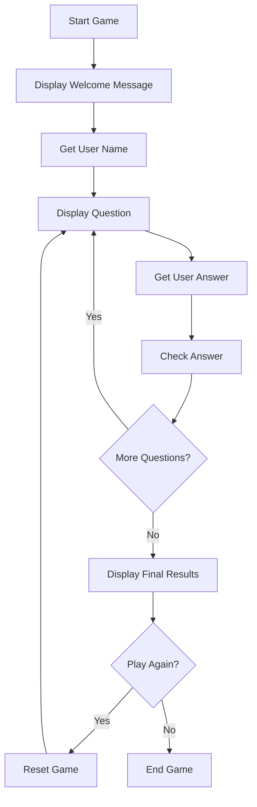

# TypeScript Quiz Game

## Introduction

Building a quiz game is an excellent way to practice your TypeScript skills while creating something fun and educational. In this tutorial, we'll walk through creating a command-line quiz game that demonstrates TypeScript's strengths including type safety, interfaces, and object-oriented programming concepts.

This project will help you understand:
- How to define and use interfaces in TypeScript
- Working with arrays and objects in a type-safe manner
- Handling user input with proper typing
- Implementing game logic with TypeScript features

By the end, you'll have a fully functional quiz game that you can customize with your own questions and expand with additional features.

## Project Setup

Let's start by setting up our TypeScript project:

```bash
# Create a new directory for our project
mkdir typescript-quiz-game
cd typescript-quiz-game

# Initialize a new npm project
npm init -y

# Install TypeScript and readline-sync (for user input)
npm install typescript --save-dev
npm install readline-sync
npm install @types/readline-sync --save-dev

# Initialize TypeScript configuration
npx tsc --init
```

The `tsconfig.json` should include these settings for our project:

```json
{
  "compilerOptions": {
    "target": "es2016",
    "module": "commonjs",
    "outDir": "./dist",
    "rootDir": "./src",
    "strict": true,
    "esModuleInterop": true
  }
}
```

## Defining Our Data Structure

First, we'll define interfaces for our quiz questions and the game state:

```typescript
// src/types.ts

// Define the structure of a quiz question
export interface Question {
  id: number;
  text: string;
  options: string[];
  correctAnswerIndex: number;
}

// Define the structure of the game state
export interface GameState {
  questions: Question[];
  currentQuestionIndex: number;
  score: number;
  userName: string;
}
```

## Creating Quiz Questions

Now, let's create a file to store our quiz questions:

```typescript
// src/questions.ts
import { Question } from './types';

export const questions: Question[] = [
  {
    id: 1,
    text: "What is TypeScript?",
    options: [
      "A programming language",
      "A superset of JavaScript",
      "A JavaScript framework",
      "A JavaScript compiler"
    ],
    correctAnswerIndex: 1
  },
  {
    id: 2,
    text: "Which of the following is NOT a TypeScript type?",
    options: [
      "number",
      "boolean",
      "character",
      "string"
    ],
    correctAnswerIndex: 2
  },
  {
    id: 3,
    text: "Which symbol is used for optional properties in TypeScript interfaces?",
    options: [
      "?",
      "!",
      "*",
      "$"
    ],
    correctAnswerIndex: 0
  },
  {
    id: 4,
    text: "What does the 'tsc' command do?",
    options: [
      "Tests TypeScript code",
      "Transpiles TypeScript to JavaScript",
      "Creates a TypeScript project",
      "Checks TypeScript syntax only"
    ],
    correctAnswerIndex: 1
  },
  {
    id: 5,
    text: "Which TypeScript feature allows you to combine multiple types?",
    options: [
      "Interfaces",
      "Generics",
      "Union types",
      "Decorators"
    ],
    correctAnswerIndex: 2
  }
];
```

## Implementing the Quiz Game Logic

Let's create the main game logic:

```typescript
// src/game.ts
import * as readlineSync from 'readline-sync';
import { GameState, Question } from './types';
import { questions } from './questions';

export class QuizGame {
  private gameState: GameState;

  constructor() {
    this.gameState = {
      questions,
      currentQuestionIndex: 0,
      score: 0,
      userName: ""
    };
  }

  private displayWelcomeMessage(): void {
    console.log("\n----------------------------");
    console.log("🎮 TYPESCRIPT QUIZ GAME 🎮");
    console.log("----------------------------\n");
    console.log("Test your TypeScript knowledge!\n");
  }

  private getUserName(): void {
    this.gameState.userName = readlineSync.question("Please enter your name: ");
    console.log(`\nWelcome, ${this.gameState.userName}! Let's begin the quiz.\n`);
  }

  private displayQuestion(question: Question): void {
    console.log(`Question ${this.gameState.currentQuestionIndex + 1}/${this.gameState.questions.length}: ${question.text}\n`);
    
    // Display options
    question.options.forEach((option, index) => {
      console.log(`${index + 1}. ${option}`);
    });
    
    console.log("");
  }

  private getUserAnswer(): number {
    const currentQuestion = this.gameState.questions[this.gameState.currentQuestionIndex];
    const validOptions = currentQuestion.options.length;
    
    // Loop until user provides valid input
    while (true) {
      const answer = readlineSync.question(`Enter your answer (1-${validOptions}): `);
      const parsedAnswer = parseInt(answer, 10);
      
      if (!isNaN(parsedAnswer) && parsedAnswer >= 1 && parsedAnswer <= validOptions) {
        return parsedAnswer - 1; // Convert to zero-based index
      } else {
        console.log(`Please enter a number between 1 and ${validOptions}.`);
      }
    }
  }

  private checkAnswer(userAnswerIndex: number): boolean {
    const currentQuestion = this.gameState.questions[this.gameState.currentQuestionIndex];
    const isCorrect = userAnswerIndex === currentQuestion.correctAnswerIndex;
    
    if (isCorrect) {
      console.log("✅ Correct! Well done!\n");
      this.gameState.score++;
    } else {
      console.log(`❌ Wrong. The correct answer is: ${currentQuestion.options[currentQuestion.correctAnswerIndex]}\n`);
    }
    
    return isCorrect;
  }

  private displayFinalResults(): void {
    const totalQuestions = this.gameState.questions.length;
    const percentageScore = (this.gameState.score / totalQuestions) * 100;
    
    console.log("\n----------------------------");
    console.log("🎯 QUIZ COMPLETED 🎯");
    console.log("----------------------------");
    console.log(`Name: ${this.gameState.userName}`);
    console.log(`Final Score: ${this.gameState.score}/${totalQuestions} (${percentageScore.toFixed(1)}%)`);
    
    // Give feedback based on score
    if (percentageScore === 100) {
      console.log("Perfect score! You're a TypeScript master! 🏆");
    } else if (percentageScore >= 80) {
      console.log("Excellent! You know TypeScript very well! 🌟");
    } else if (percentageScore >= 60) {
      console.log("Good job! You have a solid understanding of TypeScript. 👍");
    } else if (percentageScore >= 40) {
      console.log("Keep learning! You're on the right track. 📚");
    } else {
      console.log("Time to review TypeScript fundamentals! You'll get better with practice. 💪");
    }
    
    console.log("----------------------------\n");
  }

  private playAgainPrompt(): boolean {
    const playAgain = readlineSync.keyInYNStrict("Would you like to play again?");
    return playAgain;
  }

  private resetGame(): void {
    this.gameState.currentQuestionIndex = 0;
    this.gameState.score = 0;
    // Keep the username for replay
  }

  public start(): void {
    this.displayWelcomeMessage();
    this.getUserName();
    
    do {
      if (this.gameState.currentQuestionIndex > 0) {
        this.resetGame();
      }
      
      // Game loop
      while (this.gameState.currentQuestionIndex < this.gameState.questions.length) {
        const currentQuestion = this.gameState.questions[this.gameState.currentQuestionIndex];
        this.displayQuestion(currentQuestion);
        const userAnswer = this.getUserAnswer();
        this.checkAnswer(userAnswer);
        this.gameState.currentQuestionIndex++;
      }
      
      this.displayFinalResults();
    } while (this.playAgainPrompt());
    
    console.log(`Thanks for playing, ${this.gameState.userName}! Goodbye! 👋`);
  }
}
```

## Creating the Main Entry File

Finally, let's create our main entry file:

```typescript
// src/index.ts
import { QuizGame } from './game';

// Start the game
const game = new QuizGame();
game.start();
```

## Running the Game

To run the game, compile the TypeScript code and execute the resulting JavaScript:

```bash
# Create directory structure
mkdir -p src

# Create the files (make sure to copy the code snippets above into these files)
# Then compile and run:
npx tsc
node dist/index.js
```

## Game Flow Diagram

Here's a visual representation of our game flow:



## Enhancing the Game

Now that we have a basic quiz game working, let's explore some enhancements you could make to practice more TypeScript features:

### Adding a Timer

Let's add a time limit for each question:

```typescript
// In the QuizGame class, modify the getUserAnswer method

private getUserAnswer(): number {
  const currentQuestion = this.gameState.questions[this.gameState.currentQuestionIndex];
  const validOptions = currentQuestion.options.length;
  const timeLimit = 10; // 10 seconds per question
  
  console.log(`You have ${timeLimit} seconds to answer...`);
  
  // Set up timer
  const startTime = Date.now();
  
  // Loop until user provides valid input or time expires
  while (Date.now() - startTime < timeLimit * 1000) {
    // Check if there's input available (non-blocking)
    if (readlineSync.keyInYNStrict('Answer now? (Y/N)', { guide: false })) {
      const answer = readlineSync.question(`Enter your answer (1-${validOptions}): `);
      const parsedAnswer = parseInt(answer, 10);
      
      if (!isNaN(parsedAnswer) && parsedAnswer >= 1 && parsedAnswer <= validOptions) {
        return parsedAnswer - 1; // Convert to zero-based index
      } else {
        console.log(`Please enter a number between 1 and ${validOptions}.`);
      }
    }
  }
  
  console.log("Time's up! Moving to the next question.");
  return -1; // Indicates timeout
}

// Modify the checkAnswer method to handle timeouts
private checkAnswer(userAnswerIndex: number): boolean {
  if (userAnswerIndex === -1) {
    console.log("❌ You ran out of time. No points awarded.");
    return false;
  }
  
  const currentQuestion = this.gameState.questions[this.gameState.currentQuestionIndex];
  const isCorrect = userAnswerIndex === currentQuestion.correctAnswerIndex;
  
  if (isCorrect) {
    console.log("✅ Correct! Well done!\n");
    this.gameState.score++;
  } else {
    console.log(`❌ Wrong. The correct answer is: ${currentQuestion.options[currentQuestion.correctAnswerIndex]}\n`);
  }
  
  return isCorrect;
}
```

### Adding Difficulty Levels

Let's enhance our question interface to include difficulty levels:

```typescript
// Modified src/types.ts
export type Difficulty = 'easy' | 'medium' | 'hard';

export interface Question {
  id: number;
  text: string;
  options: string[];
  correctAnswerIndex: number;
  difficulty: Difficulty;
  points: number; // Points based on difficulty
}

// Modified GameState to include difficulty selection
export interface GameState {
  questions: Question[];
  filteredQuestions: Question[]; // Questions filtered by difficulty
  currentQuestionIndex: number;
  score: number;
  userName: string;
  selectedDifficulty: Difficulty | 'all';
}
```

Then update your quiz game to support difficulty selection:

```typescript
// In the QuizGame constructor:
constructor() {
  this.gameState = {
    questions,
    filteredQuestions: [],
    currentQuestionIndex: 0,
    score: 0,
    userName: "",
    selectedDifficulty: 'all'
  };
}

// Add a method to select difficulty
private selectDifficulty(): void {
  console.log("\nSelect difficulty level:");
  console.log("1. Easy");
  console.log("2. Medium");
  console.log("3. Hard");
  console.log("4. All levels");
  
  const choice = readlineSync.question("Enter your choice (1-4): ");
  switch(choice) {
    case '1':
      this.gameState.selectedDifficulty = 'easy';
      break;
    case '2':
      this.gameState.selectedDifficulty = 'medium';
      break;
    case '3':
      this.gameState.selectedDifficulty = 'hard';
      break;
    default:
      this.gameState.selectedDifficulty = 'all';
  }
  
  // Filter questions based on selected difficulty
  if (this.gameState.selectedDifficulty === 'all') {
    this.gameState.filteredQuestions = [...this.gameState.questions];
  } else {
    this.gameState.filteredQuestions = this.gameState.questions.filter(
      q => q.difficulty === this.gameState.selectedDifficulty
    );
  }
  
  console.log(`Selected difficulty: ${this.gameState.selectedDifficulty}\n`);
}

// Update the start method to call selectDifficulty
public start(): void {
  this.displayWelcomeMessage();
  this.getUserName();
  this.selectDifficulty();
  
  // Update the rest of your code to use filteredQuestions instead of questions
  // ...
}
```

## Summary

In this tutorial, we've built a TypeScript Quiz Game from scratch. We've:

1. Set up a TypeScript project with proper configuration
2. Defined interfaces for our game data
3. Created a collection of quiz questions
4. Implemented game logic with class-based TypeScript code
5. Added user interaction using readline-sync
6. Explored enhancements like timers and difficulty levels

This project demonstrates many powerful features of TypeScript including:
- Strong typing with interfaces
- Object-oriented programming with classes
- Type safety throughout the application
- Code organization with modules

## Further Exercises

To continue learning and enhancing your TypeScript skills, try these exercises:

1. **Store high scores**: Implement a system to save and display high scores.
2. **Add categories**: Group questions by categories and let users select a category.
3. **Randomize questions**: Add an option to shuffle questions for replayability.
4. **Add hints**: Implement a hint system that users can use a limited number of times.
5. **Web interface**: Convert this console app to a web application using HTML, CSS, and TypeScript.
6. **Multiple choice types**: Add support for different question types (true/false, multiple correct answers, etc.)

## Additional Resources

- [TypeScript Documentation](https://www.typescriptlang.org/docs/)
- [TypeScript Playground](https://www.typescriptlang.org/play) - Try out TypeScript code online
- [readline-sync Documentation](https://www.npmjs.com/package/readline-sync)
- [TypeScript Design Patterns](https://refactoring.guru/design-patterns/typescript)

Happy coding with TypeScript! This quiz game project provides a solid foundation for many more interactive applications you might want to build.