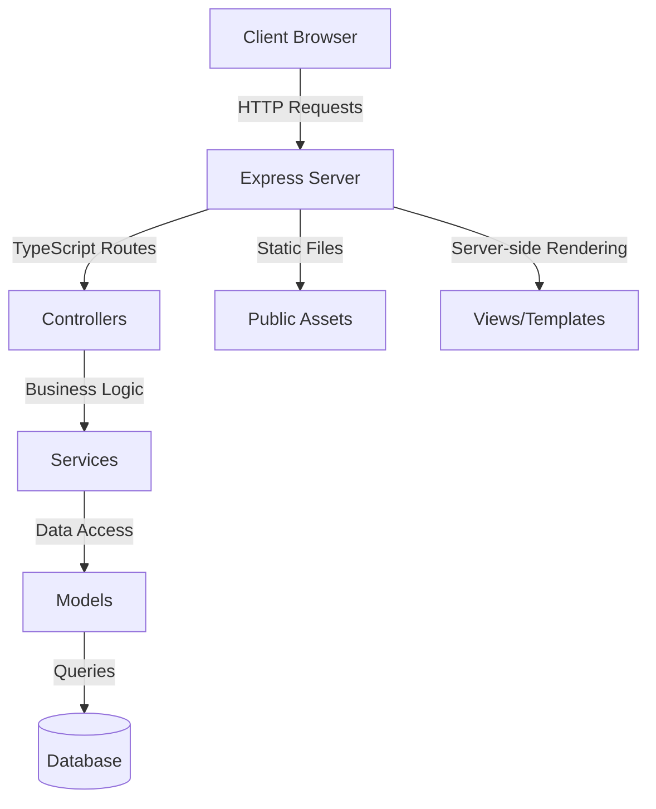

# TypeScript Blog Project

## Introduction

Building a blog is an excellent way to understand how full-stack applications work. In this tutorial, we'll create a blog application using TypeScript, Node.js, and Express. By the end of this tutorial, you'll have built a fully functional blog with user authentication, post creation, editing, and comments.

This project will help you apply TypeScript's type safety features in a real-world application while learning essential web development concepts. Let's begin by understanding what we're going to build.

## Project Overview

Our TypeScript blog will have the following features:

1. User authentication (signup, login, logout)
2. Create, edit, and delete blog posts
3. Add and delete comments on posts
4. User profiles
5. Markdown support for blog content

Here's the architecture we'll be following:



## Prerequisites

Before starting, make sure you have:

1. Node.js installed (v14 or later recommended)
2. Basic knowledge of TypeScript
3. Understanding of HTTP and REST APIs
4. Familiarity with Express.js (helpful but not required)

## Setting Up the Project

### Step 1: Project Initialization

First, let's create a new directory and initialize our project:

```bash
mkdir typescript-blog
cd typescript-blog
npm init -y
```

### Step 2: Install Required Dependencies

```bash
npm install express express-session mongoose bcrypt jsonwebtoken dotenv
npm install --save-dev typescript ts-node @types/express @types/node nodemon @types/express-session @types/bcrypt @types/jsonwebtoken
```

### Step 3: Configure TypeScript

Create a `tsconfig.json` file in the root directory:

```json
{
  "compilerOptions": {
    "target": "ES2018",
    "module": "commonjs",
    "outDir": "./dist",
    "rootDir": "./src",
    "strict": true,
    "esModuleInterop": true,
    "skipLibCheck": true,
    "forceConsistentCasingInFileNames": true
  },
  "include": ["src/**/*"]
}
```

### Step 4: Create the Project Structure

Set up the following directory structure:

```
typescript-blog/
├── src/
│   ├── config/
│   ├── controllers/
│   ├── interfaces/
│   ├── middlewares/
│   ├── models/
│   ├── routes/
│   ├── services/
│   ├── utils/
│   └── app.ts
├── public/
│   ├── css/
│   ├── js/
│   └── images/
├── views/
├── .env
├── package.json
└── tsconfig.json
```

## Building the Application

### Step 5: Set Up Environment Variables

Create a `.env` file in the root directory:

```
PORT=3000
MONGODB_URI=mongodb://localhost:27017/typescript-blog
JWT_SECRET=your_jwt_secret_key
```

### Step 6: Define Interfaces

Let's create our TypeScript interfaces. Create `src/interfaces/user.interface.ts`:

```typescript
export interface IUser {
  id?: string;
  name: string;
  email: string;
  password: string;
  bio?: string;
  createdAt?: Date;
  updatedAt?: Date;
}

export interface AuthRequest extends Request {
  user?: IUser;
}
```

Create `src/interfaces/post.interface.ts`:

```typescript
export interface IPost {
  id?: string;
  title: string;
  content: string;
  author: string | IUser;
  tags?: string[];
  comments?: IComment[];
  createdAt?: Date;
  updatedAt?: Date;
}
```

Create `src/interfaces/comment.interface.ts`:

```typescript
import { IUser } from './user.interface';

export interface IComment {
  id?: string;
  content: string;
  author: string | IUser;
  post: string | IPost;
  createdAt?: Date;
  updatedAt?: Date;
}
```

### Step 7: Create Database Models

Create `src/models/user.model.ts`:

```typescript
import mongoose, { Schema, Document } from 'mongoose';
import bcrypt from 'bcrypt';
import { IUser } from '../interfaces/user.interface';

interface UserDocument extends IUser, Document {
  comparePassword(candidatePassword: string): Promise<boolean>;
}

const userSchema = new Schema({
  name: { type: String, required: true },
  email: { type: String, required: true, unique: true },
  password: { type: String, required: true },
  bio: { type: String, default: '' },
}, { timestamps: true });

// Hash password before saving
userSchema.pre<UserDocument>('save', async function(next) {
  if (!this.isModified('password')) return next();
  
  try {
    const salt = await bcrypt.genSalt(10);
    this.password = await bcrypt.hash(this.password, salt);
    next();
  } catch (error: any) {
    next(error);
  }
});

// Compare password method
userSchema.methods.comparePassword = async function(candidatePassword: string): Promise<boolean> {
  return bcrypt.compare(candidatePassword, this.password);
};

export const User = mongoose.model<UserDocument>('User', userSchema);
```

Create `src/models/post.model.ts`:

```typescript
import mongoose, { Schema, Document } from 'mongoose';
import { IPost } from '../interfaces/post.interface';

const postSchema = new Schema({
  title: { type: String, required: true },
  content: { type: String, required: true },
  author: { type: Schema.Types.ObjectId, ref: 'User', required: true },
  tags: [{ type: String }],
}, { timestamps: true });

export const Post = mongoose.model<IPost & Document>('Post', postSchema);
```

Create `src/models/comment.model.ts`:

```typescript
import mongoose, { Schema, Document } from 'mongoose';
import { IComment } from '../interfaces/comment.interface';

const commentSchema = new Schema({
  content: { type: String, required: true },
  author: { type: Schema.Types.ObjectId, ref: 'User', required: true },
  post: { type: Schema.Types.ObjectId, ref: 'Post', required: true },
}, { timestamps: true });

export const Comment = mongoose.model<IComment & Document>('Comment', commentSchema);
```

### Step 8: Create Authentication Middleware

Create `src/middlewares/auth.middleware.ts`:

```typescript
import { Request, Response, NextFunction } from 'express';
import jwt from 'jsonwebtoken';
import { AuthRequest } from '../interfaces/user.interface';
import { User } from '../models/user.model';

export const auth = async (req: AuthRequest, res: Response, next: NextFunction) => {
  try {
    // Get token from header
    const token = req.header('Authorization')?.replace('Bearer ', '');
    
    if (!token) {
      return res.status(401).json({ message: 'Authentication required' });
    }
    
    const decoded = jwt.verify(token, process.env.JWT_SECRET as string) as { id: string };
    const user = await User.findById(decoded.id);
    
    if (!user) {
      return res.status(401).json({ message: 'Authentication failed' });
    }
    
    // Add user to request object
    req.user = {
      id: user._id.toString(),
      name: user.name,
      email: user.email,
      password: user.password,
      bio: user.bio
    };
    
    next();
  } catch (error) {
    res.status(401).json({ message: 'Authentication failed' });
  }
};
```

### Step 9: Create Controllers

Create `src/controllers/auth.controller.ts`:

```typescript
import { Request, Response } from 'express';
import jwt from 'jsonwebtoken';
import { User } from '../models/user.model';
import { IUser } from '../interfaces/user.interface';

export class AuthController {
  async register(req: Request, res: Response) {
    try {
      const { name, email, password } = req.body;
      
      // Check if user already exists
      const existingUser = await User.findOne({ email });
      if (existingUser) {
        return res.status(400).json({ message: 'User already exists' });
      }
      
      // Create new user
      const user = new User({
        name,
        email,
        password
      });
      
      await user.save();
      
      // Generate token
      const token = jwt.sign(
        { id: user._id }, 
        process.env.JWT_SECRET as string, 
        { expiresIn: '1d' }
      );
      
      res.status(201).json({
        token,
        user: {
          id: user._id,
          name: user.name,
          email: user.email
        }
      });
    } catch (error: any) {
      res.status(500).json({ message: error.message });
    }
  }
  
  async login(req: Request, res: Response) {
    try {
      const { email, password } = req.body;
      
      // Find user
      const user = await User.findOne({ email });
      if (!user) {
        return res.status(400).json({ message: 'Invalid credentials' });
      }
      
      // Check password
      const isMatch = await user.comparePassword(password);
      if (!isMatch) {
        return res.status(400).json({ message: 'Invalid credentials' });
      }
      
      // Generate token
      const token = jwt.sign(
        { id: user._id }, 
        process.env.JWT_SECRET as string, 
        { expiresIn: '1d' }
      );
      
      res.json({
        token,
        user: {
          id: user._id,
          name: user.name,
          email: user.email
        }
      });
    } catch (error: any) {
      res.status(500).json({ message: error.message });
    }
  }
}
```

Create `src/controllers/post.controller.ts`:

```typescript
import { Request, Response } from 'express';
import { Post } from '../models/post.model';
import { AuthRequest } from '../interfaces/user.interface';

export class PostController {
  async getAllPosts(req: Request, res: Response) {
    try {
      const posts = await Post.find()
        .populate('author', 'name email')
        .sort({ createdAt: -1 });
      
      res.json(posts);
    } catch (error: any) {
      res.status(500).json({ message: error.message });
    }
  }
  
  async getPostById(req: Request, res: Response) {
    try {
      const post = await Post.findById(req.params.id)
        .populate('author', 'name email');
      
      if (!post) {
        return res.status(404).json({ message: 'Post not found' });
      }
      
      res.json(post);
    } catch (error: any) {
      res.status(500).json({ message: error.message });
    }
  }
  
  async createPost(req: AuthRequest, res: Response) {
    try {
      const { title, content, tags } = req.body;
      
      const post = new Post({
        title,
        content,
        author: req.user?.id,
        tags: tags || []
      });
      
      await post.save();
      
      res.status(201).json(post);
    } catch (error: any) {
      res.status(500).json({ message: error.message });
    }
  }
  
  async updatePost(req: AuthRequest, res: Response) {
    try {
      const { title, content, tags } = req.body;
      
      const post = await Post.findById(req.params.id);
      
      if (!post) {
        return res.status(404).json({ message: 'Post not found' });
      }
      
      // Check if user owns the post
      if (post.author.toString() !== req.user?.id) {
        return res.status(403).json({ message: 'Unauthorized' });
      }
      
      post.title = title || post.title;
      post.content = content || post.content;
      post.tags = tags || post.tags;
      
      await post.save();
      
      res.json(post);
    } catch (error: any) {
      res.status(500).json({ message: error.message });
    }
  }
  
  async deletePost(req: AuthRequest, res: Response) {
    try {
      const post = await Post.findById(req.params.id);
      
      if (!post) {
        return res.status(404).json({ message: 'Post not found' });
      }
      
      // Check if user owns the post
      if (post.author.toString() !== req.user?.id) {
        return res.status(403).json({ message: 'Unauthorized' });
      }
      
      await post.remove();
      
      res.json({ message: 'Post deleted successfully' });
    } catch (error: any) {
      res.status(500).json({ message: error.message });
    }
  }
}
```

### Step 10: Set Up Routes

Create `src/routes/auth.routes.ts`:

```typescript
import { Router } from 'express';
import { AuthController } from '../controllers/auth.controller';

const router = Router();
const controller = new AuthController();

router.post('/register', controller.register);
router.post('/login', controller.login);

export default router;
```

Create `src/routes/post.routes.ts`:

```typescript
import { Router } from 'express';
import { PostController } from '../controllers/post.controller';
import { auth } from '../middlewares/auth.middleware';

const router = Router();
const controller = new PostController();

router.get('/', controller.getAllPosts);
router.get('/:id', controller.getPostById);
router.post('/', auth, controller.createPost);
router.put('/:id', auth, controller.updatePost);
router.delete('/:id', auth, controller.deletePost);

export default router;
```

### Step 11: Set Up the Main App

Create `src/config/db.ts`:

```typescript
import mongoose from 'mongoose';

export const connectDB = async () => {
  try {
    const conn = await mongoose.connect(process.env.MONGODB_URI as string);
    console.log(`MongoDB Connected: ${conn.connection.host}`);
  } catch (error: any) {
    console.error(`Error: ${error.message}`);
    process.exit(1);
  }
};
```

Create `src/app.ts`:

```typescript
import express from 'express';
import dotenv from 'dotenv';
import path from 'path';
import { connectDB } from './config/db';
import authRoutes from './routes/auth.routes';
import postRoutes from './routes/post.routes';

// Load environment variables
dotenv.config();

// Connect to database
connectDB();

const app = express();
const PORT = process.env.PORT || 3000;

// Middleware
app.use(express.json());
app.use(express.urlencoded({ extended: false }));
app.use(express.static(path.join(__dirname, '../public')));

// Routes
app.use('/api/auth', authRoutes);
app.use('/api/posts', postRoutes);

// Basic route for testing
app.get('/', (req, res) => {
  res.send('TypeScript Blog API Running');
});

// Start the server
app.listen(PORT, () => {
  console.log(`Server running on port ${PORT}`);
});
```

### Step 12: Configure npm Scripts

Update your `package.json` file:

```json
{
  "scripts": {
    "start": "node dist/app.js",
    "dev": "nodemon src/app.ts",
    "build": "tsc"
  }
}
```

### Step 13: Testing the API

Start the development server:

```bash
npm run dev
```

Now, let's test our API endpoints with these requests:

1. Register a new user:
```bash
curl -X POST http://localhost:3000/api/auth/register \
  -H "Content-Type: application/json" \
  -d '{"name":"Test User","email":"test@example.com","password":"password123"}'
```

Response:
```json
{
  "token": "eyJhbGciOiJIUzI1NiIsInR5cCI6IkpXVCJ9...",
  "user": {
    "id": "6123456789abcdef12345678",
    "name": "Test User",
    "email": "test@example.com"
  }
}
```

2. Login:
```bash
curl -X POST http://localhost:3000/api/auth/login \
  -H "Content-Type: application/json" \
  -d '{"email":"test@example.com","password":"password123"}'
```

3. Create a new post (using the token from login/register):
```bash
curl -X POST http://localhost:3000/api/posts \
  -H "Content-Type: application/json" \
  -H "Authorization: Bearer YOUR_TOKEN_HERE" \
  -d '{"title":"My First Blog Post","content":"This is the content of my first blog post!","tags":["typescript","nodejs"]}'
```

## Building the Frontend (Optional Extension)

For a complete blog application, we can add a simple frontend using TypeScript and React. However, this is beyond the scope of this tutorial. You could extend this project by:

1. Creating a React frontend with TypeScript
2. Adding forms for user registration, login, and post creation
3. Implementing a markdown editor for blog posts
4. Adding comment functionality to posts

## Summary

Congratulations! You've built a fully functional blog API using TypeScript, Node.js, and Express. The application includes:

1. User authentication with JWT
2. CRUD operations for blog posts
3. Type safety throughout with TypeScript interfaces
4. MongoDB integration with Mongoose
5. Proper project structure for scalability

This project demonstrates how to leverage TypeScript's type system in a real-world application. The static typing helps catch errors early and makes your code more maintainable.

## Next Steps and Additional Resources

To further enhance your blog application, consider:

1. Adding categories and tags for blog posts
2. Implementing a comment system
3. Adding user profiles with avatars
4. Implementing search functionality
5. Adding pagination for blog posts

### Additional Resources:

1. [TypeScript Documentation](https://www.typescriptlang.org/docs/)
2. [Express.js Documentation](https://expressjs.com/)
3. [Mongoose Documentation](https://mongoosejs.com/docs/)
4. [JWT Authentication](https://jwt.io/introduction/)

### Exercises:

1. Add a comment system to the blog
2. Implement user profiles with bio and avatar
3. Add a search feature for blog posts
4. Create a simple frontend using React and TypeScript
5. Implement password reset functionality

By completing this project, you've gained valuable experience in building full-stack applications with TypeScript. The skills you've learned here can be applied to many other types of web applications!