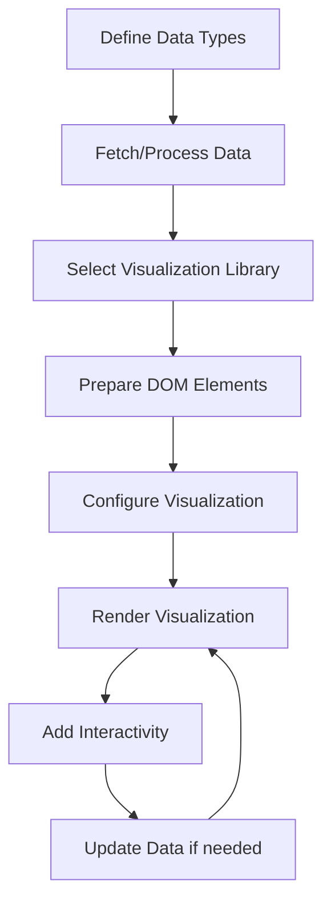

# TypeScript Data Visualization

## Introduction

Data visualization is a powerful way to communicate complex information in an accessible format. By combining TypeScript's type safety with visualization libraries, you can create robust, interactive, and error-resistant data visualizations for web applications.

In this tutorial, we'll explore how to leverage TypeScript for data visualization projects. We'll cover several popular libraries, implementation patterns, and build practical examples that you can adapt for your own projects.

## Why TypeScript for Data Visualization?

TypeScript offers several advantages when working with data visualization:

1. **Type Safety** - Catch errors at compile time rather than runtime
2. **Better IDE Support** - Auto-completion and intelligent suggestions
3. **Improved Maintainability** - Self-documenting code with interfaces and types
4. **Enhanced Refactoring** - Safely make changes with confidence

## Getting Started

### Prerequisites

Before you begin, make sure you have:

- Node.js and npm installed
- Basic knowledge of TypeScript
- Understanding of HTML and CSS

### Setting Up Your Project

Let's start by creating a new TypeScript project:

```bash
mkdir ts-data-viz
cd ts-data-viz
npm init -y
npm install typescript --save-dev
npx tsc --init
```

Now, let's install some visualization libraries:

```bash
npm install d3 @types/d3
npm install chart.js @types/chart.js
```

## Data Visualization with D3.js

[D3.js](https://d3js.org/) (Data-Driven Documents) is the most powerful and flexible data visualization library for the web. Let's create a simple bar chart using D3 and TypeScript.

### Setting Up D3 with TypeScript

First, we'll define our data interface:

```typescript
interface DataPoint {
  label: string;
  value: number;
}

const data: DataPoint[] = [
  { label: "A", value: 10 },
  { label: "B", value: 20 },
  { label: "C", value: 15 },
  { label: "D", value: 25 },
  { label: "E", value: 18 }
];
```

Now, let's create a simple bar chart:

```typescript
import * as d3 from 'd3';

function createBarChart(data: DataPoint[]): void {
  // Chart dimensions
  const width = 600;
  const height = 400;
  const margin = { top: 20, right: 30, bottom: 30, left: 40 };
  const innerWidth = width - margin.left - margin.right;
  const innerHeight = height - margin.top - margin.bottom;
  
  // Create SVG
  const svg = d3.select('#chart')
    .append('svg')
    .attr('width', width)
    .attr('height', height);
  
  // Create chart group
  const chart = svg.append('g')
    .attr('transform', `translate(${margin.left}, ${margin.top})`);
  
  // Create scales
  const xScale = d3.scaleBand()
    .domain(data.map(d => d.label))
    .range([0, innerWidth])
    .padding(0.1);
  
  const yScale = d3.scaleLinear()
    .domain([0, d3.max(data, d => d.value) || 0])
    .nice()
    .range([innerHeight, 0]);
  
  // Draw bars
  chart.selectAll('.bar')
    .data(data)
    .enter()
    .append('rect')
    .attr('class', 'bar')
    .attr('x', d => xScale(d.label) || 0)
    .attr('y', d => yScale(d.value))
    .attr('width', xScale.bandwidth())
    .attr('height', d => innerHeight - yScale(d.value))
    .attr('fill', 'steelblue');
  
  // Draw axes
  chart.append('g')
    .attr('transform', `translate(0, ${innerHeight})`)
    .call(d3.axisBottom(xScale));
  
  chart.append('g')
    .call(d3.axisLeft(yScale));
  
  // Add title
  svg.append('text')
    .attr('x', width / 2)
    .attr('y', margin.top / 2)
    .attr('text-anchor', 'middle')
    .style('font-size', '16px')
    .text('Sample Bar Chart');
}

// Call the function with our data
createBarChart(data);
```

To use this in your HTML, add:

```html
<div id="chart"></div>
```

### Output

The above code will produce a bar chart with 5 bars representing values from our data array, complete with axes and a title.

### Adding Interactivity

Let's enhance our bar chart with some interactivity:

```typescript
function createInteractiveBarChart(data: DataPoint[]): void {
  // Same setup code as before...
  
  // Draw bars with interactivity
  chart.selectAll('.bar')
    .data(data)
    .enter()
    .append('rect')
    .attr('class', 'bar')
    .attr('x', d => xScale(d.label) || 0)
    .attr('y', d => yScale(d.value))
    .attr('width', xScale.bandwidth())
    .attr('height', d => innerHeight - yScale(d.value))
    .attr('fill', 'steelblue')
    .on('mouseover', function(event, d) {
      d3.select(this)
        .transition()
        .duration(200)
        .attr('fill', 'orange');
      
      // Show tooltip
      chart.append('text')
        .attr('class', 'tooltip')
        .attr('x', xScale(d.label)! + xScale.bandwidth() / 2)
        .attr('y', yScale(d.value) - 10)
        .attr('text-anchor', 'middle')
        .text(`Value: ${d.value}`)
        .attr('fill', 'black')
        .attr('font-size', '12px')
        .attr('font-weight', 'bold');
    })
    .on('mouseout', function() {
      d3.select(this)
        .transition()
        .duration(200)
        .attr('fill', 'steelblue');
      
      // Remove tooltip
      chart.selectAll('.tooltip').remove();
    });
  
  // Rest of the code...
}
```

## Data Visualization with Chart.js

[Chart.js](https://www.chartjs.org/) is a simpler alternative to D3.js with fewer features but an easier learning curve. It's perfect for common chart types.

### Creating a Chart.js Visualization

First, add a canvas element to your HTML:

```html
<canvas id="myChart" width="400" height="400"></canvas>
```

Now, let's create a pie chart with TypeScript and Chart.js:

```typescript
import { Chart, registerables } from 'chart.js';
Chart.register(...registerables);

interface PieDataPoint {
  label: string;
  value: number;
  color: string;
}

function createPieChart(data: PieDataPoint[]): void {
  const ctx = document.getElementById('myChart') as HTMLCanvasElement;
  
  if (!ctx) {
    console.error('Canvas element not found');
    return;
  }
  
  new Chart(ctx, {
    type: 'pie',
    data: {
      labels: data.map(item => item.label),
      datasets: [{
        data: data.map(item => item.value),
        backgroundColor: data.map(item => item.color),
        hoverOffset: 4
      }]
    },
    options: {
      responsive: true,
      plugins: {
        legend: {
          position: 'top',
        },
        title: {
          display: true,
          text: 'Sample Distribution'
        }
      }
    }
  });
}

// Sample data
const pieData: PieDataPoint[] = [
  { label: 'Red', value: 12, color: 'rgb(255, 99, 132)' },
  { label: 'Blue', value: 19, color: 'rgb(54, 162, 235)' },
  { label: 'Yellow', value: 3, color: 'rgb(255, 205, 86)' },
  { label: 'Green', value: 5, color: 'rgb(75, 192, 192)' },
  { label: 'Purple', value: 2, color: 'rgb(153, 102, 255)' }
];

createPieChart(pieData);
```

### Output

This will generate a colorful pie chart showing the distribution of values with labels and a legend.

## Real-world Example: Data Dashboard

Let's create a more complex example—a data dashboard that displays information from an API:

### Step 1: Define Types for API Data

```typescript
// Data types for our API
interface SalesData {
  month: string;
  revenue: number;
  expenses: number;
  profit: number;
}

interface RegionData {
  region: string;
  sales: number;
  marketShare: number;
  customerCount: number;
}

interface DashboardData {
  sales: SalesData[];
  regions: RegionData[];
  totalCustomers: number;
  year: number;
}
```

### Step 2: Create API Service

```typescript
class DataService {
  async fetchDashboardData(): Promise<DashboardData> {
    try {
      const response = await fetch('https://api.example.com/dashboard');
      if (!response.ok) {
        throw new Error('Network response was not ok');
      }
      return await response.json() as DashboardData;
    } catch (error) {
      console.error('Failed to fetch dashboard data:', error);
      // Return mock data as fallback
      return this.getMockData();
    }
  }
  
  private getMockData(): DashboardData {
    return {
      sales: [
        { month: 'Jan', revenue: 65000, expenses: 40000, profit: 25000 },
        { month: 'Feb', revenue: 68000, expenses: 39000, profit: 29000 },
        { month: 'Mar', revenue: 72000, expenses: 41000, profit: 31000 },
        { month: 'Apr', revenue: 75000, expenses: 42000, profit: 33000 },
        { month: 'May', revenue: 80000, expenses: 45000, profit: 35000 },
        { month: 'Jun', revenue: 90000, expenses: 50000, profit: 40000 },
      ],
      regions: [
        { region: 'North', sales: 250000, marketShare: 0.32, customerCount: 1200 },
        { region: 'South', sales: 230000, marketShare: 0.29, customerCount: 1000 },
        { region: 'East', sales: 180000, marketShare: 0.22, customerCount: 800 },
        { region: 'West', sales: 140000, marketShare: 0.17, customerCount: 600 },
      ],
      totalCustomers: 3600,
      year: 2023
    };
  }
}
```

### Step 3: Create Dashboard Component

```typescript
class Dashboard {
  private dataService: DataService;
  
  constructor() {
    this.dataService = new DataService();
  }
  
  async initialize(): Promise<void> {
    try {
      const data = await this.dataService.fetchDashboardData();
      this.renderDashboard(data);
    } catch (error) {
      console.error('Failed to initialize dashboard:', error);
      document.getElementById('dashboard')!.innerHTML = `
        <div class="error">Failed to load dashboard data. Please try again later.</div>
      `;
    }
  }
  
  private renderDashboard(data: DashboardData): void {
    this.renderSalesChart(data.sales);
    this.renderRegionPieChart(data.regions);
    this.renderSummaryStats(data);
  }
  
  private renderSalesChart(salesData: SalesData[]): void {
    const ctx = document.getElementById('salesChart') as HTMLCanvasElement;
    
    new Chart(ctx, {
      type: 'line',
      data: {
        labels: salesData.map(d => d.month),
        datasets: [
          {
            label: 'Revenue',
            data: salesData.map(d => d.revenue),
            borderColor: 'rgb(54, 162, 235)',
            backgroundColor: 'rgba(54, 162, 235, 0.1)',
            fill: true
          },
          {
            label: 'Expenses',
            data: salesData.map(d => d.expenses),
            borderColor: 'rgb(255, 99, 132)',
            backgroundColor: 'rgba(255, 99, 132, 0.1)',
            fill: true
          },
          {
            label: 'Profit',
            data: salesData.map(d => d.profit),
            borderColor: 'rgb(75, 192, 192)',
            backgroundColor: 'rgba(75, 192, 192, 0.1)',
            fill: true
          }
        ]
      },
      options: {
        responsive: true,
        plugins: {
          title: {
            display: true,
            text: 'Monthly Sales Performance'
          }
        }
      }
    });
  }
  
  private renderRegionPieChart(regionData: RegionData[]): void {
    const ctx = document.getElementById('regionChart') as HTMLCanvasElement;
    
    new Chart(ctx, {
      type: 'pie',
      data: {
        labels: regionData.map(d => d.region),
        datasets: [{
          data: regionData.map(d => d.sales),
          backgroundColor: [
            'rgb(54, 162, 235)',
            'rgb(255, 99, 132)',
            'rgb(255, 205, 86)',
            'rgb(75, 192, 192)'
          ]
        }]
      },
      options: {
        responsive: true,
        plugins: {
          title: {
            display: true,
            text: 'Sales by Region'
          }
        }
      }
    });
  }
  
  private renderSummaryStats(data: DashboardData): void {
    const totalRevenue = data.sales.reduce((sum, item) => sum + item.revenue, 0);
    const totalProfit = data.sales.reduce((sum, item) => sum + item.profit, 0);
    
    const statsElement = document.getElementById('summaryStats');
    if (statsElement) {
      statsElement.innerHTML = `
        <div class="stat-card">
          <h3>Total Revenue</h3>
          <p>$${totalRevenue.toLocaleString()}</p>
        </div>
        <div class="stat-card">
          <h3>Total Profit</h3>
          <p>$${totalProfit.toLocaleString()}</p>
        </div>
        <div class="stat-card">
          <h3>Total Customers</h3>
          <p>${data.totalCustomers.toLocaleString()}</p>
        </div>
        <div class="stat-card">
          <h3>Profit Margin</h3>
          <p>${((totalProfit / totalRevenue) * 100).toFixed(1)}%</p>
        </div>
      `;
    }
  }
}

// Initialize the dashboard
document.addEventListener('DOMContentLoaded', () => {
  const dashboard = new Dashboard();
  dashboard.initialize();
});
```

### HTML Structure for Dashboard

```html
<div id="dashboard">
  <div class="dashboard-header">
    <h1>Sales Dashboard</h1>
  </div>
  <div id="summaryStats" class="stats-container"></div>
  <div class="chart-container">
    <canvas id="salesChart"></canvas>
  </div>
  <div class="chart-container">
    <canvas id="regionChart"></canvas>
  </div>
</div>
```

## TypeScript Data Visualization Process Flow

Here's a diagram showing the typical process flow for creating data visualizations with TypeScript:



## Best Practices for TypeScript Data Visualization

1. **Define Strong Types** - Create interfaces for your data structures to ensure consistency.

2. **Separate Concerns** - Keep data fetching, processing, and visualization logic separate.

3. **Error Handling** - Always include proper error handling for data fetching and rendering.

4. **Responsive Design** - Make your visualizations responsive to work across devices.

5. **Performance Optimization** - For large datasets, consider optimization techniques like:
   - Data aggregation
   - Canvas over SVG for large numbers of elements
   - Virtual rendering for large tables

6. **Accessibility** - Ensure your visualizations are accessible with:
   - Text alternatives
   - Keyboard navigation
   - Color considerations for color blindness

## Additional Libraries Worth Exploring

- **Plotly.js** - High-level chart library with extensive chart types
- **Highcharts** - Commercial library with beautiful visuals
- **Vega/Vega-Lite** - Declarative visualization grammar
- **Three.js** - For 3D visualizations
- **react-vis** - If you're working with React

## Summary

TypeScript provides powerful tools for creating robust and maintainable data visualizations. By combining TypeScript's type safety with visualization libraries like D3.js and Chart.js, you can create beautiful, interactive, and error-resistant data visuals.

In this guide, we've covered:

- Setting up TypeScript for data visualization projects
- Creating basic charts with D3.js and Chart.js
- Building a comprehensive data dashboard
- Best practices for TypeScript-based visualizations

## Additional Resources and Exercises

### Resources:
- [D3.js Documentation](https://d3js.org/)
- [Chart.js Documentation](https://www.chartjs.org/)
- [TypeScript Handbook](https://www.typescriptlang.org/docs/handbook/intro.html)

### Exercises:

1. **Simple Bar Chart**: Create a bar chart showing monthly sales data using D3.js.

2. **Interactive Dashboard**: Build a small dashboard that shows product sales across different categories with filters.

3. **Data Explorer**: Create an application that lets users upload CSV files and automatically generates appropriate visualizations based on the data types.

4. **Real-time Chart**: Create a chart that updates in real-time using WebSocket or simulated interval data.

5. **Map Visualization**: Build a choropleth map showing data distribution across geographic regions using D3.js and TopoJSON.

Remember, the best way to learn data visualization is through practice. Start with simple charts and progressively build more complex ones as you become comfortable with the libraries and TypeScript integration!