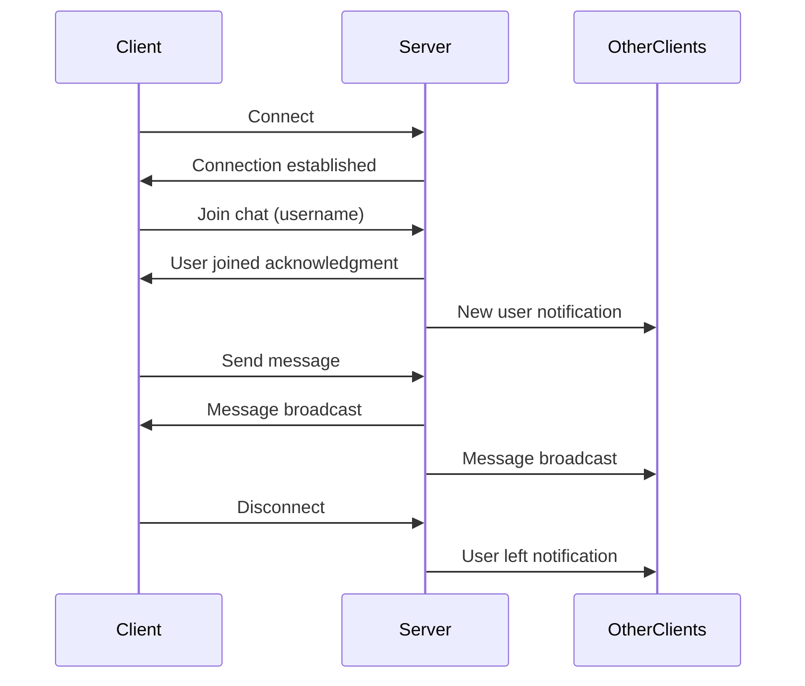

# TypeScript Chat Application

## Introduction

Real-time communication has become an essential feature of modern web applications. From customer support widgets to social media platforms, chat functionality enhances user engagement and provides immediate interaction. In this tutorial, we'll build a real-time chat application using TypeScript, which gives us the advantage of static typing to create more robust and maintainable code.

Our chat application will feature:
- Real-time messaging between multiple users
- TypeScript for type safety
- Node.js and Express for the backend server
- Socket.io for real-time bidirectional communication
- A simple frontend to test our application

By the end of this tutorial, you'll have a functional chat application and a solid understanding of how to implement real-time features in your TypeScript projects.

## Prerequisites

Before getting started, make sure you have the following installed:

- Node.js (v14.x or higher)
- npm or yarn
- Basic knowledge of TypeScript
- Familiarity with HTML/CSS/JavaScript

## Project Setup

Let's start by creating our project structure and installing the necessary dependencies.

```bash
# Create project directory
mkdir ts-chat-app
cd ts-chat-app

# Initialize a new npm project
npm init -y

# Install dependencies
npm install express socket.io cors
npm install --save-dev typescript @types/express @types/node @types/socket.io @types/cors ts-node nodemon

# Initialize TypeScript configuration
npx tsc --init
```

Now, let's configure our `tsconfig.json` file to suit our project needs:

```json
{
  "compilerOptions": {
    "target": "es2016",
    "module": "commonjs",
    "outDir": "./dist",
    "strict": true,
    "esModuleInterop": true,
    "skipLibCheck": true,
    "forceConsistentCasingInFileNames": true
  },
  "include": ["src/**/*"]
}
```

Create a basic project structure:

```bash
mkdir -p src/public
```

## Creating the Server

Let's start by defining our server-side code. Create a new file `src/server.ts`:

```typescript
import express from 'express';
import http from 'http';
import { Server } from 'socket.io';
import path from 'path';
import cors from 'cors';

// Define types for our chat message
interface ChatMessage {
  user: string;
  message: string;
  timestamp: number;
}

// Create Express app
const app = express();
app.use(cors());
app.use(express.static(path.join(__dirname, 'public')));

// Create HTTP server
const server = http.createServer(app);

// Initialize Socket.io with CORS configuration
const io = new Server(server, {
  cors: {
    origin: '*',
    methods: ['GET', 'POST']
  }
});

// Store active users
const activeUsers: Set<string> = new Set();

// Listen for socket connections
io.on('connection', (socket) => {
  console.log('A user connected:', socket.id);
  
  // Handle user joining
  socket.on('join', (username: string) => {
    // Store user information
    socket.data.username = username;
    activeUsers.add(username);
    
    // Broadcast to all clients that a new user has joined
    io.emit('userJoined', username);
    io.emit('activeUsers', Array.from(activeUsers));
    
    console.log(`${username} joined the chat`);
  });
  
  // Handle chat messages
  socket.on('chatMessage', (message: string) => {
    const username = socket.data.username || 'Anonymous';
    
    // Create message object
    const chatMessage: ChatMessage = {
      user: username,
      message: message,
      timestamp: Date.now()
    };
    
    // Broadcast message to all clients
    io.emit('message', chatMessage);
    
    console.log(`Message from ${username}: ${message}`);
  });
  
  // Handle disconnection
  socket.on('disconnect', () => {
    const username = socket.data.username;
    
    if (username) {
      activeUsers.delete(username);
      io.emit('userLeft', username);
      io.emit('activeUsers', Array.from(activeUsers));
      console.log(`${username} left the chat`);
    }
  });
});

// Define port
const PORT = process.env.PORT || 3000;

// Start server
server.listen(PORT, () => {
  console.log(`Server running on port ${PORT}`);
});
```

## Creating the Client-Side Interface

Now, let's create a simple HTML interface for our chat application. Create `src/public/index.html`:

```html
<!DOCTYPE html>
<html lang="en">
<head>
    <meta charset="UTF-8">
    <meta name="viewport" content="width=device-width, initial-scale=1.0">
    <title>TypeScript Chat App</title>
    <style>
        * {
            box-sizing: border-box;
            font-family: Arial, sans-serif;
        }
        body {
            margin: 0;
            padding: 20px;
            background-color: #f5f5f5;
        }
        .container {
            display: flex;
            max-width: 1000px;
            margin: 0 auto;
            height: 80vh;
        }
        .chat-container {
            flex: 3;
            display: flex;
            flex-direction: column;
            border: 1px solid #ddd;
            border-radius: 5px;
            overflow: hidden;
        }
        .active-users {
            flex: 1;
            margin-left: 20px;
            border: 1px solid #ddd;
            border-radius: 5px;
            padding: 10px;
            background-color: white;
        }
        .chat-header {
            background-color: #4CAF50;
            color: white;
            padding: 10px;
            text-align: center;
        }
        .chat-messages {
            flex: 1;
            padding: 15px;
            overflow-y: auto;
            background-color: white;
        }
        .message {
            margin-bottom: 10px;
            padding: 8px 12px;
            border-radius: 5px;
            max-width: 80%;
            word-wrap: break-word;
        }
        .message.own {
            background-color: #DCF8C6;
            align-self: flex-end;
            margin-left: auto;
        }
        .message.other {
            background-color: #ECECEC;
        }
        .user-name {
            font-weight: bold;
            margin-bottom: 3px;
        }
        .timestamp {
            font-size: 0.7em;
            color: #888;
            text-align: right;
            margin-top: 3px;
        }
        .input-area {
            display: flex;
            padding: 10px;
            border-top: 1px solid #ddd;
            background-color: white;
        }
        #message-input {
            flex: 1;
            padding: 10px;
            border: 1px solid #ddd;
            border-radius: 4px;
            margin-right: 10px;
        }
        button {
            background-color: #4CAF50;
            color: white;
            border: none;
            padding: 10px 15px;
            border-radius: 4px;
            cursor: pointer;
        }
        button:hover {
            background-color: #45a049;
        }
        .join-container {
            max-width: 400px;
            margin: 100px auto;
            padding: 20px;
            background-color: white;
            border-radius: 5px;
            box-shadow: 0 2px 5px rgba(0,0,0,0.1);
        }
        h2 {
            margin-top: 0;
        }
    </style>
</head>
<body>
    <!-- Join Screen -->
    <div id="join-screen" class="join-container">
        <h2>Join the Chat</h2>
        <div>
            <input type="text" id="username-input" placeholder="Enter your username" />
            <button id="join-button">Join</button>
        </div>
    </div>
    
    <!-- Chat Screen (initially hidden) -->
    <div id="chat-screen" class="container" style="display: none;">
        <div class="chat-container">
            <div class="chat-header">
                <h2>TypeScript Chat App</h2>
            </div>
            <div class="chat-messages" id="chat-messages"></div>
            <div class="input-area">
                <input type="text" id="message-input" placeholder="Type a message..." />
                <button id="send-button">Send</button>
            </div>
        </div>
        <div class="active-users">
            <h3>Active Users</h3>
            <ul id="users-list"></ul>
        </div>
    </div>
    
    <script src="/socket.io/socket.io.js"></script>
    <script>
        // Connect to Socket.io server
        const socket = io();
        
        // DOM elements
        const joinScreen = document.getElementById('join-screen');
        const chatScreen = document.getElementById('chat-screen');
        const usernameInput = document.getElementById('username-input');
        const joinButton = document.getElementById('join-button');
        const messageInput = document.getElementById('message-input');
        const sendButton = document.getElementById('send-button');
        const chatMessages = document.getElementById('chat-messages');
        const usersList = document.getElementById('users-list');
        
        let currentUsername = '';
        
        // Join chat when button is clicked
        joinButton.addEventListener('click', () => {
            const username = usernameInput.value.trim();
            if (username) {
                currentUsername = username;
                socket.emit('join', username);
                joinScreen.style.display = 'none';
                chatScreen.style.display = 'flex';
            }
        });
        
        // Allow joining by pressing Enter
        usernameInput.addEventListener('keypress', (e) => {
            if (e.key === 'Enter') {
                joinButton.click();
            }
        });
        
        // Send message when button is clicked
        sendButton.addEventListener('click', () => {
            sendMessage();
        });
        
        // Allow sending by pressing Enter
        messageInput.addEventListener('keypress', (e) => {
            if (e.key === 'Enter') {
                sendMessage();
            }
        });
        
        function sendMessage() {
            const message = messageInput.value.trim();
            if (message) {
                socket.emit('chatMessage', message);
                messageInput.value = '';
            }
        }
        
        // Handle received messages
        socket.on('message', (msg) => {
            const messageElement = document.createElement('div');
            messageElement.classList.add('message');
            
            if (msg.user === currentUsername) {
                messageElement.classList.add('own');
            } else {
                messageElement.classList.add('other');
            }
            
            const nameElement = document.createElement('div');
            nameElement.classList.add('user-name');
            nameElement.textContent = msg.user;
            
            const contentElement = document.createElement('div');
            contentElement.textContent = msg.message;
            
            const timeElement = document.createElement('div');
            timeElement.classList.add('timestamp');
            timeElement.textContent = new Date(msg.timestamp).toLocaleTimeString();
            
            messageElement.appendChild(nameElement);
            messageElement.appendChild(contentElement);
            messageElement.appendChild(timeElement);
            
            chatMessages.appendChild(messageElement);
            
            // Scroll to the bottom
            chatMessages.scrollTop = chatMessages.scrollHeight;
        });
        
        // Handle user joined notification
        socket.on('userJoined', (username) => {
            const messageElement = document.createElement('div');
            messageElement.style.textAlign = 'center';
            messageElement.style.color = '#888';
            messageElement.style.margin = '10px 0';
            messageElement.textContent = `${username} joined the chat`;
            chatMessages.appendChild(messageElement);
            
            chatMessages.scrollTop = chatMessages.scrollHeight;
        });
        
        // Handle user left notification
        socket.on('userLeft', (username) => {
            const messageElement = document.createElement('div');
            messageElement.style.textAlign = 'center';
            messageElement.style.color = '#888';
            messageElement.style.margin = '10px 0';
            messageElement.textContent = `${username} left the chat`;
            chatMessages.appendChild(messageElement);
            
            chatMessages.scrollTop = chatMessages.scrollHeight;
        });
        
        // Update active users list
        socket.on('activeUsers', (users) => {
            usersList.innerHTML = '';
            users.forEach(user => {
                const userElement = document.createElement('li');
                userElement.textContent = user;
                if (user === currentUsername) {
                    userElement.style.fontWeight = 'bold';
                }
                usersList.appendChild(userElement);
            });
        });
    </script>
</body>
</html>
```

## Setting Up the Project for Development

Let's configure nodemon to automatically restart our server when changes are detected. Add the following scripts to your `package.json`:

```json
"scripts": {
  "start": "node dist/server.js",
  "dev": "nodemon --exec ts-node src/server.ts",
  "build": "tsc"
}
```

## How the Application Works



Let's break down how our chat application works:

1. **Server Initialization**:
   - We set up an Express server with Socket.io integration
   - We define TypeScript interfaces for better type checking
   - We configure CORS to allow cross-origin requests

2. **Real-time Communication**:
   - Socket.io establishes a WebSocket connection (with fallbacks)
   - When a user joins, we store their username and notify others
   - Messages are broadcast to all connected clients
   - When users disconnect, we clean up and notify others

3. **Client-Side Interface**:
   - Simple HTML, CSS for the user interface
   - JavaScript to handle socket events and DOM manipulation
   - Users can join with a username and send messages in real-time

## Running the Application

To start the development server with auto-reloading:

```bash
npm run dev
```

Open your browser and navigate to `http://localhost:3000` to see the chat application in action. Open multiple browser tabs to test the multi-user functionality.

## Enhancing Your Application

Here are some ideas to extend this application:

### 1. Add Private Messaging

```typescript
// On the server side
socket.on('privateMessage', ({ to, message }: { to: string, message: string }) => {
  const sender = socket.data.username || 'Anonymous';
  
  // Find the socket of the recipient
  const recipientSocket = Array.from(io.sockets.sockets.values())
    .find(s => s.data.username === to);
  
  if (recipientSocket) {
    // Send to recipient
    recipientSocket.emit('privateMessage', {
      from: sender,
      message,
      timestamp: Date.now()
    });
    
    // Send back to sender
    socket.emit('privateMessage', {
      to,
      message,
      timestamp: Date.now()
    });
  }
});
```

### 2. Add Message Persistence with a Database

```typescript
import mongoose from 'mongoose';

// Define message schema
const messageSchema = new mongoose.Schema({
  user: String,
  message: String,
  timestamp: { type: Date, default: Date.now }
});

const Message = mongoose.model('Message', messageSchema);

// Connect to MongoDB
mongoose.connect('mongodb://localhost:27017/ts-chat-app')
  .then(() => console.log('Connected to MongoDB'))
  .catch(err => console.error('MongoDB connection error:', err));

// Save messages
socket.on('chatMessage', async (message: string) => {
  const username = socket.data.username || 'Anonymous';
  
  // Create message object
  const chatMessage: ChatMessage = {
    user: username,
    message: message,
    timestamp: Date.now()
  };
  
  // Save to database
  await Message.create({
    user: username,
    message: message
  });
  
  // Broadcast message to all clients
  io.emit('message', chatMessage);
});
```

### 3. Add Typing Indicators

```typescript
// On the server
socket.on('typing', () => {
  const username = socket.data.username || 'Anonymous';
  socket.broadcast.emit('userTyping', username);
});

socket.on('stopTyping', () => {
  const username = socket.data.username || 'Anonymous';
  socket.broadcast.emit('userStopTyping', username);
});

// On the client
let typingTimer;

messageInput.addEventListener('keydown', () => {
  if (!typingTimer) {
    socket.emit('typing');
  }
  
  clearTimeout(typingTimer);
  typingTimer = setTimeout(() => {
    socket.emit('stopTyping');
    typingTimer = null;
  }, 1000);
});
```

## Testing Your Chat Application

To verify your application is working correctly, follow these steps:

1. Open multiple browser windows pointing to your application
2. Join the chat with different usernames in each window
3. Send messages and confirm they appear in all windows
4. Close a window and verify the "user left" message appears
5. Test for edge cases like empty messages or special characters

## Summary

In this tutorial, we've built a real-time chat application using TypeScript, Node.js, Express, and Socket.io. We've covered:

- Setting up a TypeScript project with the necessary dependencies
- Creating a real-time server with Socket.io
- Implementing a simple chat interface
- Handling user connections, messages, and disconnections
- Adding real-time updates for active users

This project demonstrates how TypeScript can help us build more robust applications by providing type checking and better IDE support. The combination of TypeScript and Socket.io provides a powerful foundation for building real-time applications.

## Additional Resources

- [Socket.io Documentation](https://socket.io/docs/v4/)
- [TypeScript Handbook](https://www.typescriptlang.org/docs/handbook/intro.html)
- [Express.js Documentation](https://expressjs.com/en/guide/routing.html)

## Exercises

1. **Add Message Timestamps**: Modify the client code to display the time each message was sent.

2. **Message Formatting**: Implement Markdown support or emoji picker in the chat application.

3. **User Authentication**: Add a simple authentication system to verify users before they can join the chat.

4. **Room Support**: Extend the application to support multiple chat rooms that users can join and leave.

5. **Message History**: When a new user joins, show them the last 10 messages from the chat history.

Happy coding!