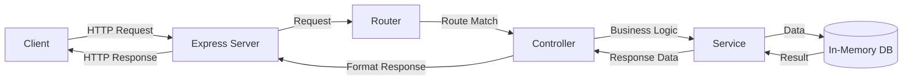

# Building a TypeScript REST API

## Introduction

REST (Representational State Transfer) APIs are the backbone of modern web applications, allowing frontend and backend services to communicate effectively. TypeScript brings the power of static typing to API development, enhancing code quality, maintainability, and developer experience.

In this tutorial, we'll learn how to build a robust REST API using TypeScript and Express.js. By the end, you'll have a solid understanding of how to structure your API, implement CRUD operations, handle errors gracefully, and add type safety throughout your backend application.

## Prerequisites

Before we begin, make sure you have:

- Node.js installed (v14 or newer)
- Basic knowledge of JavaScript and TypeScript
- Understanding of HTTP methods (GET, POST, PUT, DELETE)
- Familiarity with npm or yarn package managers

## Project Setup

Let's start by setting up our TypeScript project:

1. Create a new project directory:

```bash
mkdir ts-rest-api
cd ts-rest-api
```

2. Initialize a new npm project:

```bash
npm init -y
```

3. Install the necessary dependencies:

```bash
npm install express cors dotenv
npm install --save-dev typescript @types/express @types/node @types/cors ts-node nodemon
```

4. Create a TypeScript configuration file (`tsconfig.json`):

```json
{
  "compilerOptions": {
    "target": "es6",
    "module": "commonjs",
    "outDir": "./dist",
    "rootDir": "./src",
    "strict": true,
    "esModuleInterop": true,
    "skipLibCheck": true,
    "forceConsistentCasingInFileNames": true
  },
  "include": ["src/**/*"],
  "exclude": ["node_modules"]
}
```

5. Create a development script in `package.json`:

```json
"scripts": {
  "start": "node dist/index.js",
  "dev": "nodemon src/index.ts",
  "build": "tsc"
}
```

## Project Structure

Let's create a well-organized project structure:

```
src/
├── config/          # Environment variables and configuration
├── controllers/     # Request handlers
├── middleware/      # Custom middleware
├── models/          # Data models
├── routes/          # Route definitions
├── services/        # Business logic
├── types/           # TypeScript interfaces and types
├── utils/           # Utility functions
└── index.ts         # Application entry point
```

## Creating the Server

Let's create our entry point file:

```typescript
// src/index.ts
import express, { Express } from 'express';
import cors from 'cors';
import dotenv from 'dotenv';

// Import routes
import taskRoutes from './routes/taskRoutes';

// Load environment variables
dotenv.config();

// Create Express application
const app: Express = express();
const port = process.env.PORT || 3000;

// Middleware
app.use(cors());
app.use(express.json());
app.use(express.urlencoded({ extended: true }));

// Routes
app.use('/api/tasks', taskRoutes);

// Health check endpoint
app.get('/health', (req, res) => {
  res.status(200).json({ status: 'ok' });
});

// Start server
app.listen(port, () => {
  console.log(`Server running on port ${port}`);
});
```

## Defining Types

TypeScript's strength comes from its type system. Let's define our data model types:

```typescript
// src/types/task.ts
export interface Task {
  id: string;
  title: string;
  description?: string;
  completed: boolean;
  createdAt: Date;
  updatedAt: Date;
}

export type CreateTaskDto = Omit<Task, 'id' | 'createdAt' | 'updatedAt'>;
export type UpdateTaskDto = Partial<CreateTaskDto>;
```

## Creating a Simple In-Memory Database

For simplicity, we'll use an in-memory store for our tasks:

```typescript
// src/services/taskService.ts
import { v4 as uuidv4 } from 'uuid';
import { Task, CreateTaskDto, UpdateTaskDto } from '../types/task';

// In-memory storage
let tasks: Task[] = [];

// Get all tasks
export const getAllTasks = (): Task[] => {
  return tasks;
};

// Get task by ID
export const getTaskById = (id: string): Task | undefined => {
  return tasks.find(task => task.id === id);
};

// Create a new task
export const createTask = (taskDto: CreateTaskDto): Task => {
  const newTask: Task = {
    id: uuidv4(),
    ...taskDto,
    createdAt: new Date(),
    updatedAt: new Date()
  };
  
  tasks.push(newTask);
  return newTask;
};

// Update a task
export const updateTask = (id: string, taskDto: UpdateTaskDto): Task | null => {
  const taskIndex = tasks.findIndex(task => task.id === id);
  
  if (taskIndex === -1) return null;
  
  const updatedTask: Task = {
    ...tasks[taskIndex],
    ...taskDto,
    updatedAt: new Date()
  };
  
  tasks[taskIndex] = updatedTask;
  return updatedTask;
};

// Delete a task
export const deleteTask = (id: string): boolean => {
  const initialLength = tasks.length;
  tasks = tasks.filter(task => task.id !== id);
  
  return tasks.length !== initialLength;
};
```

Don't forget to install the UUID package:

```bash
npm install uuid
npm install --save-dev @types/uuid
```

## Creating Controllers

Controllers handle the request and response logic:

```typescript
// src/controllers/taskController.ts
import { Request, Response } from 'express';
import * as TaskService from '../services/taskService';
import { CreateTaskDto, UpdateTaskDto } from '../types/task';

// Get all tasks
export const getAllTasks = (req: Request, res: Response): void => {
  try {
    const tasks = TaskService.getAllTasks();
    res.status(200).json(tasks);
  } catch (error) {
    res.status(500).json({ message: 'Error fetching tasks', error });
  }
};

// Get a single task
export const getTaskById = (req: Request, res: Response): void => {
  try {
    const { id } = req.params;
    const task = TaskService.getTaskById(id);
    
    if (!task) {
      res.status(404).json({ message: `Task with ID ${id} not found` });
      return;
    }
    
    res.status(200).json(task);
  } catch (error) {
    res.status(500).json({ message: 'Error fetching task', error });
  }
};

// Create a new task
export const createTask = (req: Request, res: Response): void => {
  try {
    const taskDto: CreateTaskDto = req.body;
    
    // Simple validation
    if (!taskDto.title) {
      res.status(400).json({ message: 'Task title is required' });
      return;
    }
    
    const newTask = TaskService.createTask(taskDto);
    res.status(201).json(newTask);
  } catch (error) {
    res.status(500).json({ message: 'Error creating task', error });
  }
};

// Update a task
export const updateTask = (req: Request, res: Response): void => {
  try {
    const { id } = req.params;
    const taskDto: UpdateTaskDto = req.body;
    
    const updatedTask = TaskService.updateTask(id, taskDto);
    
    if (!updatedTask) {
      res.status(404).json({ message: `Task with ID ${id} not found` });
      return;
    }
    
    res.status(200).json(updatedTask);
  } catch (error) {
    res.status(500).json({ message: 'Error updating task', error });
  }
};

// Delete a task
export const deleteTask = (req: Request, res: Response): void => {
  try {
    const { id } = req.params;
    const deleted = TaskService.deleteTask(id);
    
    if (!deleted) {
      res.status(404).json({ message: `Task with ID ${id} not found` });
      return;
    }
    
    res.status(204).send();
  } catch (error) {
    res.status(500).json({ message: 'Error deleting task', error });
  }
};
```

## Setting Up Routes

Let's create the routes for our task API:

```typescript
// src/routes/taskRoutes.ts
import { Router } from 'express';
import * as TaskController from '../controllers/taskController';

const router = Router();

// GET /api/tasks - Get all tasks
router.get('/', TaskController.getAllTasks);

// GET /api/tasks/:id - Get a specific task
router.get('/:id', TaskController.getTaskById);

// POST /api/tasks - Create a new task
router.post('/', TaskController.createTask);

// PUT /api/tasks/:id - Update an existing task
router.put('/:id', TaskController.updateTask);

// DELETE /api/tasks/:id - Delete a task
router.delete('/:id', TaskController.deleteTask);

export default router;
```

## Adding Error Handling Middleware

Let's add a global error handler for better error responses:

```typescript
// src/middleware/errorHandler.ts
import { Request, Response, NextFunction } from 'express';

export interface AppError extends Error {
  statusCode?: number;
}

export const errorHandler = (
  err: AppError,
  req: Request,
  res: Response,
  next: NextFunction
) => {
  const statusCode = err.statusCode || 500;
  
  res.status(statusCode).json({
    status: 'error',
    statusCode,
    message: err.message || 'Internal Server Error',
    stack: process.env.NODE_ENV === 'development' ? err.stack : undefined,
  });
};
```

Update your `index.ts` to use this middleware:

```typescript
// Add after routes in index.ts
import { errorHandler } from './middleware/errorHandler';

// Error handler (should be after routes)
app.use(errorHandler);
```

## Adding Request Validation

For more robust API development, let's add request validation using a middleware:

```typescript
// src/middleware/validateRequest.ts
import { Request, Response, NextFunction } from 'express';

export const validateCreateTask = (
  req: Request,
  res: Response,
  next: NextFunction
) => {
  const { title, completed } = req.body;
  
  const errors = [];
  
  if (!title || typeof title !== 'string') {
    errors.push('Title is required and must be a string');
  }
  
  if (completed !== undefined && typeof completed !== 'boolean') {
    errors.push('Completed must be a boolean');
  }
  
  if (errors.length > 0) {
    return res.status(400).json({ errors });
  }
  
  next();
};
```

Update your task routes to use this validation:

```typescript
// src/routes/taskRoutes.ts
import { validateCreateTask } from '../middleware/validateRequest';

// Update the post route to use validation
router.post('/', validateCreateTask, TaskController.createTask);
```

## Testing the API

Now that we've built our API, let's test it using cURL or Postman:

1. Start your server:

```bash
npm run dev
```

2. Test the endpoints:

**Create a task:**

```bash
curl -X POST http://localhost:3000/api/tasks \
  -H "Content-Type: application/json" \
  -d '{"title": "Learn TypeScript", "description": "Master TypeScript for backend development", "completed": false}'
```

**Expected output:**
```json
{
  "id": "f8e7d6c5-b4a3-2c1d-0e9f-8g7h6i5j4k3l",
  "title": "Learn TypeScript",
  "description": "Master TypeScript for backend development",
  "completed": false,
  "createdAt": "2023-08-15T14:30:45.123Z",
  "updatedAt": "2023-08-15T14:30:45.123Z"
}
```

**Get all tasks:**

```bash
curl http://localhost:3000/api/tasks
```

**Get a specific task:**

```bash
curl http://localhost:3000/api/tasks/f8e7d6c5-b4a3-2c1d-0e9f-8g7h6i5j4k3l
```

**Update a task:**

```bash
curl -X PUT http://localhost:3000/api/tasks/f8e7d6c5-b4a3-2c1d-0e9f-8g7h6i5j4k3l \
  -H "Content-Type: application/json" \
  -d '{"completed": true}'
```

**Delete a task:**

```bash
curl -X DELETE http://localhost:3000/api/tasks/f8e7d6c5-b4a3-2c1d-0e9f-8g7h6i5j4k3l
```

## API Architecture Flow

Here's a visual representation of our API architecture:



## Enhancing the API

### Adding Authentication

In a real-world application, you would typically add authentication. Here's how you could implement a simple authentication middleware using JWT:

```typescript
// src/middleware/auth.ts
import { Request, Response, NextFunction } from 'express';
import jwt from 'jsonwebtoken';

interface AuthRequest extends Request {
  user?: {
    id: string;
    email: string;
  };
}

export const authenticate = (
  req: AuthRequest,
  res: Response,
  next: NextFunction
) => {
  try {
    const token = req.header('Authorization')?.replace('Bearer ', '');
    
    if (!token) {
      return res.status(401).json({ message: 'Authentication required' });
    }
    
    const decoded = jwt.verify(token, process.env.JWT_SECRET || 'default_secret') as {
      id: string;
      email: string;
    };
    
    req.user = decoded;
    next();
  } catch (error) {
    res.status(401).json({ message: 'Invalid token' });
  }
};
```

Don't forget to install the JWT package:

```bash
npm install jsonwebtoken
npm install --save-dev @types/jsonwebtoken
```

### Adding Database Integration

For production applications, you'll want to replace the in-memory database with a real one. Here's an example using TypeORM with PostgreSQL:

1. Install the necessary packages:

```bash
npm install typeorm pg reflect-metadata
```

2. Update your task service to use TypeORM:

```typescript
// src/entity/Task.ts
import { Entity, PrimaryGeneratedColumn, Column, CreateDateColumn, UpdateDateColumn } from 'typeorm';

@Entity()
export class Task {
  @PrimaryGeneratedColumn('uuid')
  id: string;

  @Column()
  title: string;

  @Column({ nullable: true })
  description?: string;

  @Column({ default: false })
  completed: boolean;

  @CreateDateColumn()
  createdAt: Date;

  @UpdateDateColumn()
  updatedAt: Date;
}
```

3. Update your task service to use this entity.

### Adding Documentation

For larger APIs, documentation is crucial. You can use Swagger/OpenAPI for this:

```typescript
// Add these imports to index.ts
import swaggerUi from 'swagger-ui-express';
import swaggerJsdoc from 'swagger-jsdoc';

// Swagger setup
const swaggerOptions = {
  definition: {
    openapi: '3.0.0',
    info: {
      title: 'Tasks API',
      version: '1.0.0',
      description: 'A simple Express Tasks API',
    },
    servers: [
      {
        url: 'http://localhost:3000',
      },
    ],
  },
  apis: ['./src/routes/*.ts'],
};

const specs = swaggerJsdoc(swaggerOptions);
app.use('/api-docs', swaggerUi.serve, swaggerUi.setup(specs));
```

Don't forget to install the packages:

```bash
npm install swagger-ui-express swagger-jsdoc
npm install --save-dev @types/swagger-ui-express @types/swagger-jsdoc
```

## Best Practices for TypeScript REST APIs

1. **Use Interfaces for Request/Response Types**: Define interfaces for your request bodies and responses to ensure type safety.

2. **Separate Concerns**: Keep your controllers thin by moving business logic to services.

3. **Error Handling**: Implement a global error handler to ensure consistent error responses.

4. **Input Validation**: Validate all input data before processing it.

5. **Use Environment Variables**: Store configuration in environment variables, not in the code.

6. **Add Logging**: Implement proper logging for debugging and monitoring.

7. **Implement Rate Limiting**: Protect your API from abuse with rate limiting.

8. **Use DTOs**: Data Transfer Objects help enforce a clean separation between your API interface and your domain model.

## Summary

In this tutorial, we've built a complete TypeScript REST API with Express. We've covered:

- Setting up a TypeScript project with Express
- Creating a well-organized project structure
- Implementing CRUD operations with strong typing
- Adding error handling and validation
- Testing the API endpoints
- Best practices for TypeScript API development

TypeScript adds tremendous value to API development by providing compile-time type checking, better tooling support, and clearer interfaces between different parts of your application.

## Next Steps and Exercises

1. **Add User Authentication**: Implement a full JWT authentication system with signup, login, and protected routes.

2. **Implement Database Integration**: Replace the in-memory store with a real database like PostgreSQL or MongoDB.

3. **Add Unit Tests**: Create tests for the service methods using Jest or Mocha.

4. **Create Pagination**: Modify the "get all tasks" endpoint to support pagination.

5. **Add Filtering and Sorting**: Allow filtering tasks by status and sorting by different fields.

6. **Implement Logging**: Add proper logging with Winston or Pino.

7. **Create API Versioning**: Implement API versioning to maintain backward compatibility as your API evolves.

Remember that learning to develop APIs is a journey. Start with the basics and gradually incorporate more advanced features as you become comfortable with the fundamentals.

## Resources

- [Express.js Documentation](https://expressjs.com/)
- [TypeScript Documentation](https://www.typescriptlang.org/docs/)
- [REST API Design Best Practices](https://stackoverflow.blog/2020/03/02/best-practices-for-rest-api-design/)
- [TypeORM Documentation](https://typeorm.io/)
- [JWT Authentication](https://jwt.io/introduction/)

Happy coding!