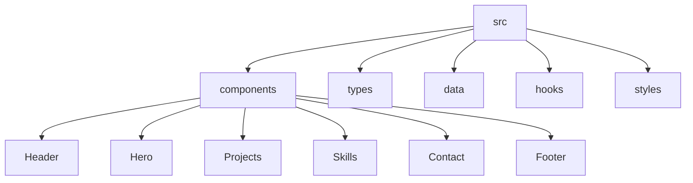

# TypeScript Portfolio Site

## Introduction

A portfolio website is an essential tool for any developer looking to showcase their skills, projects, and experience to potential employers or clients. Building your portfolio with TypeScript adds an additional layer of type safety and developer experience that can help you create a more robust, maintainable, and error-free website.

In this tutorial, we'll walk through creating a professional portfolio website using TypeScript, React, and some helpful libraries. By the end, you'll have a type-safe, responsive portfolio that not only looks impressive but also demonstrates your TypeScript skills.

## Why TypeScript for Your Portfolio?

Before diving into the code, let's understand why TypeScript is an excellent choice for your portfolio project:

1. **Type Safety**: Catch errors at compile time rather than runtime
2. **Better Developer Experience**: Improved autocomplete and documentation
3. **Enhanced Maintainability**: Easier to refactor and understand code
4. **Industry Relevance**: Showcase skills in a language highly valued in job markets
5. **Self-documenting Code**: Types serve as documentation for future reference

## Project Setup

Let's begin by setting up our TypeScript portfolio project:

### Prerequisites

- Node.js (v14 or later)
- npm or yarn
- Basic knowledge of React and TypeScript

### Creating a New Project

We'll use Create React App with TypeScript template to get started:

```bash
npx create-react-app my-portfolio --template typescript
cd my-portfolio
```

### Project Structure

Our portfolio project will have the following structure:



Let's create these folders:

```bash
mkdir -p src/components/{Header,Hero,Projects,Skills,Contact,Footer} src/types src/data src/hooks src/styles
```

## Defining TypeScript Types

A key benefit of TypeScript is defining clear interfaces for our data. Let's create some types we'll need:

```typescript
// src/types/index.ts

export interface Project {
  id: string;
  title: string;
  description: string;
  technologies: string[];
  imageUrl: string;
  liveUrl?: string;
  githubUrl?: string;
}

export interface Skill {
  id: string;
  name: string;
  icon: string;
  category: 'frontend' | 'backend' | 'tools' | 'other';
  proficiency: 1 | 2 | 3 | 4 | 5;
}

export interface SocialLink {
  id: string;
  platform: string;
  url: string;
  icon: string;
}

export interface NavLink {
  id: string;
  text: string;
  url: string;
}

export interface PersonalInfo {
  name: string;
  title: string;
  bio: string;
  location: string;
  email: string;
  socialLinks: SocialLink[];
}
```

## Creating Mock Data

Next, let's populate our data using the types we defined:

```typescript
// src/data/personalInfo.ts
import { PersonalInfo } from '../types';

export const personalInfo: PersonalInfo = {
  name: 'Jane Doe',
  title: 'Full Stack Developer',
  bio: 'Passionate developer with 3 years of experience building web applications with React, TypeScript, and Node.js.',
  location: 'San Francisco, CA',
  email: 'jane.doe@example.com',
  socialLinks: [
    {
      id: '1',
      platform: 'GitHub',
      url: 'https://github.com/jane-doe',
      icon: 'github',
    },
    {
      id: '2',
      platform: 'LinkedIn',
      url: 'https://linkedin.com/in/jane-doe',
      icon: 'linkedin',
    },
    {
      id: '3',
      platform: 'Twitter',
      url: 'https://twitter.com/jane-doe',
      icon: 'twitter',
    },
  ],
};
```

```typescript
// src/data/projects.ts
import { Project } from '../types';

export const projects: Project[] = [
  {
    id: '1',
    title: 'E-commerce Platform',
    description: 'A full-featured e-commerce website built with React, TypeScript, and Node.js.',
    technologies: ['React', 'TypeScript', 'Node.js', 'MongoDB', 'Express'],
    imageUrl: '/images/ecommerce.jpg',
    liveUrl: 'https://my-ecommerce.example.com',
    githubUrl: 'https://github.com/jane-doe/ecommerce',
  },
  {
    id: '2',
    title: 'Weather Dashboard',
    description: 'A weather application that displays current and forecasted weather for any location.',
    technologies: ['React', 'TypeScript', 'Weather API', 'Styled Components'],
    imageUrl: '/images/weather-app.jpg',
    liveUrl: 'https://weather-app.example.com',
    githubUrl: 'https://github.com/jane-doe/weather-app',
  },
  // Add more projects as needed
];
```

```typescript
// src/data/skills.ts
import { Skill } from '../types';

export const skills: Skill[] = [
  {
    id: '1',
    name: 'TypeScript',
    icon: 'typescript',
    category: 'frontend',
    proficiency: 5,
  },
  {
    id: '2',
    name: 'React',
    icon: 'react',
    category: 'frontend',
    proficiency: 5,
  },
  {
    id: '3',
    name: 'Node.js',
    icon: 'nodejs',
    category: 'backend',
    proficiency: 4,
  },
  // Add more skills as needed
];
```

## Creating Components

Now let's implement our components with TypeScript:

### Header Component

```tsx
// src/components/Header/Header.tsx
import React, { useState } from 'react';
import './Header.css';
import { NavLink } from '../../types';

interface HeaderProps {
  navLinks: NavLink[];
  logo?: string;
}

const Header: React.FC<HeaderProps> = ({ navLinks, logo }) => {
  const [isMenuOpen, setIsMenuOpen] = useState<boolean>(false);

  const toggleMenu = (): void => {
    setIsMenuOpen(!isMenuOpen);
  };

  return (
    <header className="header">
      <div className="header__container">
        <div className="header__logo">
          {logo ?  : <h1>Jane Doe</h1>}
        </div>
        
        <button className="header__menu-button" onClick={toggleMenu}>
          <span className="sr-only">Toggle menu</span>
          <div className={`hamburger ${isMenuOpen ? 'open' : ''}`}></div>
        </button>
        
        <nav className={`header__nav ${isMenuOpen ? 'open' : ''}`}>
          <ul>
            {navLinks.map((link) => (
              <li key={link.id}>
                <a href={link.url}>{link.text}</a>
              </li>
            ))}
          </ul>
        </nav>
      </div>
    </header>
  );
};

export default Header;
```

### Hero Component

```tsx
// src/components/Hero/Hero.tsx
import React from 'react';
import './Hero.css';
import { PersonalInfo } from '../../types';

interface HeroProps {
  personalInfo: PersonalInfo;
}

const Hero: React.FC<HeroProps> = ({ personalInfo }) => {
  return (
    <section className="hero">
      <div className="hero__container">
        <div className="hero__content">
          <h1>Hello, I'm {personalInfo.name}</h1>
          <h2>{personalInfo.title}</h2>
          <p>{personalInfo.bio}</p>
          
          <div className="hero__cta">
            <a href="#projects" className="button button--primary">
              View My Work
            </a>
            <a href="#contact" className="button button--secondary">
              Contact Me
            </a>
          </div>
          
          <div className="hero__social">
            {personalInfo.socialLinks.map((link) => (
              <a 
                key={link.id} 
                href={link.url} 
                target="_blank" 
                rel="noopener noreferrer"
                aria-label={link.platform}
              >
                <i className={`icon icon-${link.icon}`}></i>
              </a>
            ))}
          </div>
        </div>
      </div>
    </section>
  );
};

export default Hero;
```

### Projects Component

```tsx
// src/components/Projects/Projects.tsx
import React, { useState } from 'react';
import './Projects.css';
import { Project } from '../../types';

interface ProjectsProps {
  projects: Project[];
}

const Projects: React.FC<ProjectsProps> = ({ projects }) => {
  const [filter, setFilter] = useState<string>('all');
  
  // Get unique technologies across all projects
  const allTechnologies = Array.from(
    new Set(
      projects.flatMap(project => project.technologies)
    )
  );
  
  // Filter projects based on selected technology
  const filteredProjects = filter === 'all' 
    ? projects 
    : projects.filter(project => 
        project.technologies.includes(filter)
      );

  return (
    <section id="projects" className="projects">
      <div className="section__heading">
        <h2>My Projects</h2>
        <p>Here are some of my recent projects</p>
      </div>
      
      <div className="projects__filters">
        <button 
          className={`filter-button ${filter === 'all' ? 'active' : ''}`}
          onClick={() => setFilter('all')}
        >
          All
        </button>
        
        {allTechnologies.map((tech) => (
          <button 
            key={tech}
            className={`filter-button ${filter === tech ? 'active' : ''}`}
            onClick={() => setFilter(tech)}
          >
            {tech}
          </button>
        ))}
      </div>
      
      <div className="projects__grid">
        {filteredProjects.map((project) => (
          <div key={project.id} className="project-card">
            <div className="project-card__image">
              
            </div>
            
            <div className="project-card__content">
              <h3>{project.title}</h3>
              <p>{project.description}</p>
              
              <div className="project-card__tech">
                {project.technologies.map((tech, index) => (
                  <span key={index} className="tech-tag">
                    {tech}
                  </span>
                ))}
              </div>
              
              <div className="project-card__links">
                {project.liveUrl && (
                  <a 
                    href={project.liveUrl}
                    target="_blank" 
                    rel="noopener noreferrer"
                    className="button button--sm"
                  >
                    Live Demo
                  </a>
                )}
                
                {project.githubUrl && (
                  <a 
                    href={project.githubUrl}
                    target="_blank" 
                    rel="noopener noreferrer"
                    className="button button--sm button--outline"
                  >
                    View Code
                  </a>
                )}
              </div>
            </div>
          </div>
        ))}
      </div>
    </section>
  );
};

export default Projects;
```

## Putting It All Together

Now let's assemble our components in the main App component:

```tsx
// src/App.tsx
import React from 'react';
import './App.css';

// Components
import Header from './components/Header/Header';
import Hero from './components/Hero/Hero';
import Projects from './components/Projects/Projects';

// Data
import { personalInfo } from './data/personalInfo';
import { projects } from './data/projects';
import { skills } from './data/skills';

const navLinks = [
  { id: '1', text: 'Home', url: '#home' },
  { id: '2', text: 'Projects', url: '#projects' },
  { id: '3', text: 'Skills', url: '#skills' },
  { id: '4', text: 'Contact', url: '#contact' }
];

const App: React.FC = () => {
  return (
    <div className="app">
      <Header navLinks={navLinks} />
      
      <main>
        <Hero personalInfo={personalInfo} />
        <Projects projects={projects} />
        {/* Add Skills and Contact components here */}
      </main>
      
      <footer>
        <p>&copy; {new Date().getFullYear()} {personalInfo.name}. All rights reserved.</p>
      </footer>
    </div>
  );
};

export default App;
```

## Adding Advanced TypeScript Features

Let's enhance our portfolio with some advanced TypeScript features:

### Custom Hooks with TypeScript

Here's a custom hook for handling screen size with TypeScript:

```typescript
// src/hooks/useWindowSize.ts
import { useState, useEffect } from 'react';

interface WindowSize {
  width: number;
  height: number;
  isMobile: boolean;
  isTablet: boolean;
  isDesktop: boolean;
}

const useWindowSize = (): WindowSize => {
  const [windowSize, setWindowSize] = useState<WindowSize>({
    width: window.innerWidth,
    height: window.innerHeight,
    isMobile: window.innerWidth < 768,
    isTablet: window.innerWidth >= 768 && window.innerWidth < 1024,
    isDesktop: window.innerWidth >= 1024,
  });

  useEffect(() => {
    const handleResize = (): void => {
      const width = window.innerWidth;
      setWindowSize({
        width,
        height: window.innerHeight,
        isMobile: width < 768,
        isTablet: width >= 768 && width < 1024,
        isDesktop: width >= 1024,
      });
    };

    window.addEventListener('resize', handleResize);
    
    // Clean up
    return () => {
      window.removeEventListener('resize', handleResize);
    };
  }, []);

  return windowSize;
};

export default useWindowSize;
```

### Theme Switcher with TypeScript

Let's implement a theme switcher with TypeScript:

```tsx
// src/hooks/useTheme.ts
import { useState, useEffect } from 'react';

type Theme = 'light' | 'dark' | 'system';

interface UseThemeReturn {
  theme: Theme;
  isDark: boolean;
  setTheme: (theme: Theme) => void;
}

const useTheme = (): UseThemeReturn => {
  const [theme, setTheme] = useState<Theme>(() => {
    const savedTheme = localStorage.getItem('theme');
    return (savedTheme as Theme) || 'system';
  });

  const [isDark, setIsDark] = useState<boolean>(() => {
    if (theme === 'system') {
      return window.matchMedia('(prefers-color-scheme: dark)').matches;
    }
    return theme === 'dark';
  });

  useEffect(() => {
    const mediaQuery = window.matchMedia('(prefers-color-scheme: dark)');
    
    const handleChange = (): void => {
      if (theme === 'system') {
        setIsDark(mediaQuery.matches);
      }
    };
    
    handleChange();
    mediaQuery.addEventListener('change', handleChange);
    
    return () => {
      mediaQuery.removeEventListener('change', handleChange);
    };
  }, [theme]);

  useEffect(() => {
    localStorage.setItem('theme', theme);
    
    if (theme === 'dark' || (theme === 'system' && isDark)) {
      document.documentElement.classList.add('dark');
    } else {
      document.documentElement.classList.remove('dark');
    }
  }, [theme, isDark]);

  return { theme, isDark, setTheme };
};

export default useTheme;
```

Now let's create a theme toggle component:

```tsx
// src/components/ThemeToggle/ThemeToggle.tsx
import React from 'react';
import useTheme from '../../hooks/useTheme';
import './ThemeToggle.css';

const ThemeToggle: React.FC = () => {
  const { theme, setTheme } = useTheme();

  const handleChange = (e: React.ChangeEvent<HTMLSelectElement>): void => {
    setTheme(e.target.value as 'light' | 'dark' | 'system');
  };

  return (
    <div className="theme-toggle">
      <label htmlFor="theme-select" className="sr-only">
        Choose theme
      </label>
      <select 
        id="theme-select"
        value={theme}
        onChange={handleChange}
        className="theme-select"
      >
        <option value="light">Light</option>
        <option value="dark">Dark</option>
        <option value="system">System</option>
      </select>
    </div>
  );
};

export default ThemeToggle;
```

## Building for Production

When your portfolio site is ready for deployment, you can build it with:

```bash
npm run build
```

This will create an optimized production build in the `build` folder that you can deploy to hosting platforms like Netlify, Vercel, GitHub Pages, or any other hosting service.

## Adding TypeScript Configuration

TypeScript configuration allows you to customize the compiler options. Here's a more strict `tsconfig.json` that you might use for your portfolio project:

```json
{
  "compilerOptions": {
    "target": "es5",
    "lib": ["dom", "dom.iterable", "esnext"],
    "allowJs": true,
    "skipLibCheck": true,
    "esModuleInterop": true,
    "allowSyntheticDefaultImports": true,
    "strict": true,
    "forceConsistentCasingInFileNames": true,
    "noFallthroughCasesInSwitch": true,
    "module": "esnext",
    "moduleResolution": "node",
    "resolveJsonModule": true,
    "isolatedModules": true,
    "noEmit": true,
    "jsx": "react-jsx",
    "noImplicitAny": true,
    "noImplicitThis": true,
    "strictNullChecks": true
  },
  "include": ["src"]
}
```

## Summary

In this tutorial, we've built a comprehensive TypeScript portfolio site that showcases your projects and skills. We've covered:

1. **Project Setup**: Using Create React App with TypeScript
2. **Type Definitions**: Creating interfaces for our data
3. **Component Creation**: Building functional components with TypeScript
4. **State Management**: Using hooks with proper typing
5. **Advanced Features**: Adding theme switching and responsive design
6. **Production Build**: Preparing the site for deployment

By using TypeScript, we've added type safety to our portfolio, which helps catch errors early and provides better developer experience through improved autocomplete and documentation.

## Further Improvements

To further enhance your TypeScript portfolio site, consider:

1. **Animation Libraries**: Add smooth transitions with Framer Motion or React Spring
2. **State Management**: Implement global state with TypeScript-friendly libraries like Redux Toolkit or Zustand
3. **Testing**: Add Jest and React Testing Library with TypeScript
4. **Accessibility**: Ensure your portfolio is accessible to all users
5. **Blog Section**: Add a blog section to showcase your knowledge
6. **Internationalization**: Add multiple language support with i18n libraries

## Exercises

To practice what you've learned:

1. Add a Skills section to showcase your technical skills with rating visualizations
2. Create a Contact form with form validation using TypeScript
3. Implement filtering and sorting for your projects section
4. Add animations to improve user experience
5. Create a blog section to display your technical articles
6. Implement a dark/light theme toggle
7. Add unit tests for your components using Jest and React Testing Library

By completing this portfolio project, you now have a professional, type-safe website that showcases both your projects and your TypeScript skills to potential employers or clients.