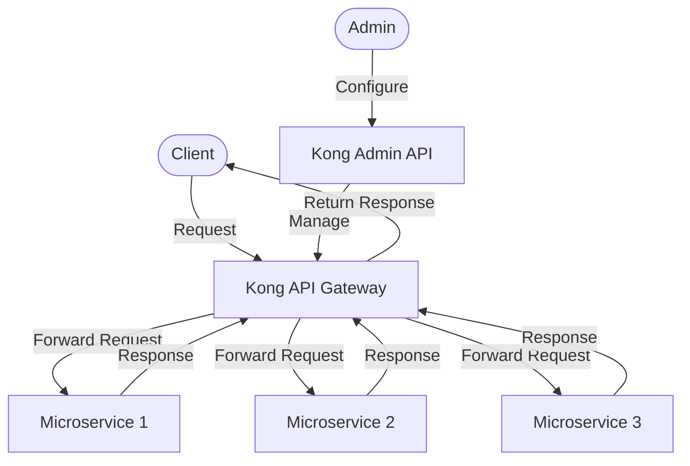

# Kong Introduction

## What is Kong?

<div style={{
    "width": "20%",
    "margin": "0 auto",
    "text-align": "center"
}}>
    
</div>

Kong is an open-source API Gateway platform built on top of NGINX, designed to secure, manage and orchestrate API traffic. As a lightweight, fast, and flexible API gateway, Kong sits in front of your APIs and microservices, routing client requests to appropriate backend services while providing crucial functionalities like authentication, rate limiting, and analytics.

Think of Kong as a smart traffic controller for your APIs - it receives all incoming requests, applies necessary policies and transformations, and directs them to the right destination.

## Why Use Kong?

In today's world of distributed systems and microservices, managing API communication becomes increasingly complex. Here's why Kong has become a popular solution:

- **Performance**: Built on NGINX, Kong delivers high throughput with minimal latency
- **Scalability**: Easily scales horizontally to handle growing API traffic
- **Extensibility**: Supports plugins for adding functionalities without modifying your APIs
- **Cloud-Native**: Designed to work seamlessly in containerized environments (Docker, Kubernetes)
- **Platform-Agnostic**: Works with any infrastructure or deployment strategy

## Kong Architecture

Kong follows a modular architecture with two main components:

1. **Kong Gateway**: The core proxy that processes API requests and responses
2. **Kong Admin API**: RESTful interface for configuring and managing Kong

Here's a visual representation of how Kong fits into your API ecosystem:



## Core Concepts

### Services

A Service in Kong represents a backend API or microservice that Kong proxies traffic to. It contains essential information about your backend service, such as its URL.

```bash
# Creating a service via Kong Admin API
curl -i -X POST http://localhost:8001/services \
  --data name=example-service \
  --data url=http://example.com/api
```

Response:
```json
{
  "id": "a5fb8d9e-9fdb-4a9d-a3c1-9c42f7fb1b3d",
  "name": "example-service",
  "protocol": "http",
  "host": "example.com",
  "port": 80,
  "path": "/api",
  "created_at": 1627984763,
  "updated_at": 1627984763
}
```

### Routes

Routes determine how requests are sent to Services. Each Route is associated with a Service and specifies rules for matching client requests (like paths, hosts, methods).

```bash
# Creating a route for our service
curl -i -X POST http://localhost:8001/services/example-service/routes \
  --data 'paths[]=/users' \
  --data name=users-route
```

Response:
```json
{
  "id": "d35165e2-d03e-461a-bdeb-dad0a112abfe",
  "name": "users-route",
  "service": { "id": "a5fb8d9e-9fdb-4a9d-a3c1-9c42f7fb1b3d" },
  "paths": ["/users"],
  "created_at": 1627984890,
  "updated_at": 1627984890
}
```

With this configuration, any request to `http://kong-host/users` will be forwarded to `http://example.com/api/users`.

### Plugins

Plugins extend Kong's functionality by adding features to Services or Routes. Kong offers numerous built-in plugins for authentication, security, traffic control, analytics, and more.

```bash
# Adding rate limiting plugin to a service
curl -i -X POST http://localhost:8001/services/example-service/plugins \
  --data name=rate-limiting \
  --data config.minute=5 \
  --data config.policy=local
```

Response:
```json
{
  "id": "ec1a1f6f-2aa4-4e58-93ff-b56368f19b27",
  "name": "rate-limiting",
  "service": { "id": "a5fb8d9e-9fdb-4a9d-a3c1-9c42f7fb1b3d" },
  "config": {
    "minute": 5,
    "policy": "local"
  },
  "enabled": true,
  "created_at": 1627985021,
  "updated_at": 1627985021
}
```

This plugin limits clients to 5 requests per minute to our example service.

## Setting Up Kong

Let's walk through installing and running Kong locally using Docker.

### Prerequisites

- Docker installed on your machine
- Basic knowledge of terminal/command line

### Installation and Setup

1. Pull the Kong Docker image:

```bash
docker pull kong:latest
```

2. Create a Docker network for Kong:

```bash
docker network create kong-net
```

3. Start a PostgreSQL database (Kong's default datastore):

```bash
docker run -d --name kong-database \
  --network=kong-net \
  -p 5432:5432 \
  -e "POSTGRES_USER=kong" \
  -e "POSTGRES_DB=kong" \
  -e "POSTGRES_PASSWORD=kongpass" \
  postgres:13
```

4. Prepare the database:

```bash
docker run --rm \
  --network=kong-net \
  -e "KONG_DATABASE=postgres" \
  -e "KONG_PG_HOST=kong-database" \
  -e "KONG_PG_PASSWORD=kongpass" \
  kong:latest kong migrations bootstrap
```

5. Start Kong:

```bash
docker run -d --name kong \
  --network=kong-net \
  -e "KONG_DATABASE=postgres" \
  -e "KONG_PG_HOST=kong-database" \
  -e "KONG_PG_PASSWORD=kongpass" \
  -e "KONG_PROXY_ACCESS_LOG=/dev/stdout" \
  -e "KONG_ADMIN_ACCESS_LOG=/dev/stdout" \
  -e "KONG_PROXY_ERROR_LOG=/dev/stderr" \
  -e "KONG_ADMIN_ERROR_LOG=/dev/stderr" \
  -e "KONG_ADMIN_LISTEN=0.0.0.0:8001, 0.0.0.0:8444 ssl" \
  -p 8000:8000 \
  -p 8443:8443 \
  -p 8001:8001 \
  -p 8444:8444 \
  kong:latest
```

Now Kong is running with:
- Admin API: http://localhost:8001
- Proxy: http://localhost:8000

Test if Kong is running:

```bash
curl http://localhost:8001
```

You should see a welcome message in JSON format.

## Practical Example: Creating a Simple API Proxy

Let's create a simple proxy to a public API (JSONPlaceholder) to demonstrate Kong's capabilities.

### 1. Create a Service

```bash
curl -i -X POST http://localhost:8001/services \
  --data name=jsonplaceholder \
  --data url=https://jsonplaceholder.typicode.com
```

### 2. Add a Route

```bash
curl -i -X POST http://localhost:8001/services/jsonplaceholder/routes \
  --data 'paths[]=/api' \
  --data name=jsonplaceholder-route
```

### 3. Test the Proxy

```bash
curl http://localhost:8000/api/posts/1
```

You should receive a JSON response from JSONPlaceholder:

```json
{
  "userId": 1,
  "id": 1,
  "title": "sunt aut facere repellat provident occaecati excepturi optio reprehenderit",
  "body": "quia et suscipit
suscipit recusandae consequuntur expedita et cum
reprehenderit molestiae ut ut quas totam
nostrum rerum est autem sunt rem eveniet architecto"
}
```

### 4. Add Rate Limiting

Let's add a rate limiting plugin to restrict clients to 5 requests per minute:

```bash
curl -i -X POST http://localhost:8001/services/jsonplaceholder/plugins \
  --data name=rate-limiting \
  --data config.minute=5 \
  --data config.policy=local
```

Now try making multiple requests quickly:

```bash
for i in {1..10}; do curl -i http://localhost:8000/api/posts/1; done
```

You'll start seeing rate limit headers, and after 5 requests, you'll get a 429 Too Many Requests response.

## Common Kong Plugins

Kong's strength lies in its extensive plugin ecosystem. Here are some commonly used plugins:

- **Authentication**: JWT, Basic Auth, OAuth 2.0, Key Authentication
- **Security**: IP Restriction, CORS, Bot Detection
- **Traffic Control**: Rate Limiting, Request Termination, Proxy Cache
- **Analytics & Monitoring**: Prometheus, HTTP Log, DataDog
- **Transformations**: Request/Response Transformer, XML to JSON

## Kong Enterprise vs. Kong Community Edition

Kong is available in two versions:

1. **Kong Community Edition (CE)**: Free, open-source version with core features
2. **Kong Enterprise Edition (EE)**: Paid version with additional features like:
   - Kong Manager (GUI)
   - Developer Portal
   - Advanced plugins
   - Enterprise support
   - Role-based access control

For beginners, Kong CE offers plenty of functionality to get started.

## Summary

Kong is a powerful, flexible API Gateway that helps you manage and secure your API traffic. In this introduction, we've covered:

- What Kong is and why it's useful
- Core Kong concepts (Services, Routes, Plugins)
- Setting up Kong with Docker
- Creating a simple API proxy
- Adding functionality with plugins

By mastering Kong, you'll be able to build more secure, reliable, and manageable API ecosystems for your applications.

## Additional Resources

- [Kong Documentation](https://docs.konghq.com/)
- [Kong GitHub Repository](https://github.com/Kong/kong)
- [Kong Plugins Hub](https://docs.konghq.com/hub/)

## Exercises

1. Set up Kong on your local machine using the instructions provided.
2. Create a service and route for a different public API (like OpenWeatherMap or GitHub API).
3. Experiment with different plugins:
   - Add basic authentication to your route
   - Configure request rate limiting
   - Set up request/response transformers
4. Use the Kong Admin API to list all your services, routes, and plugins.
5. Try setting up multiple routes for the same service with different path patterns.