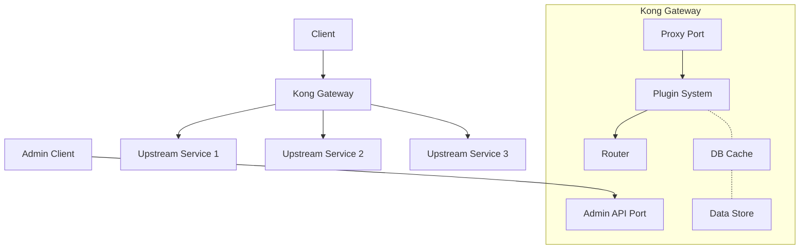
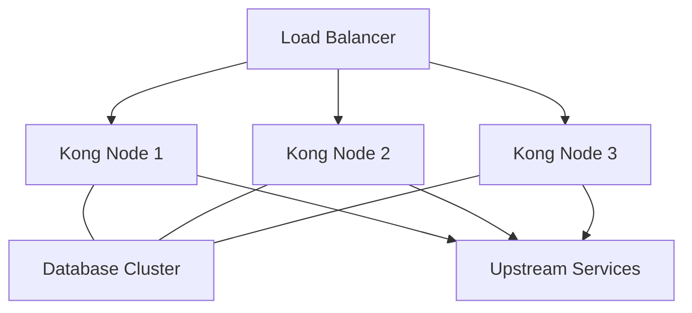
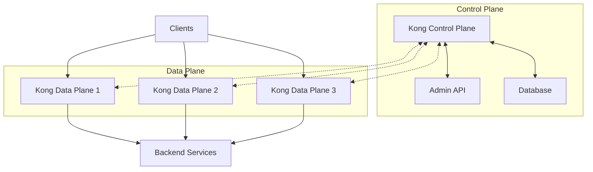
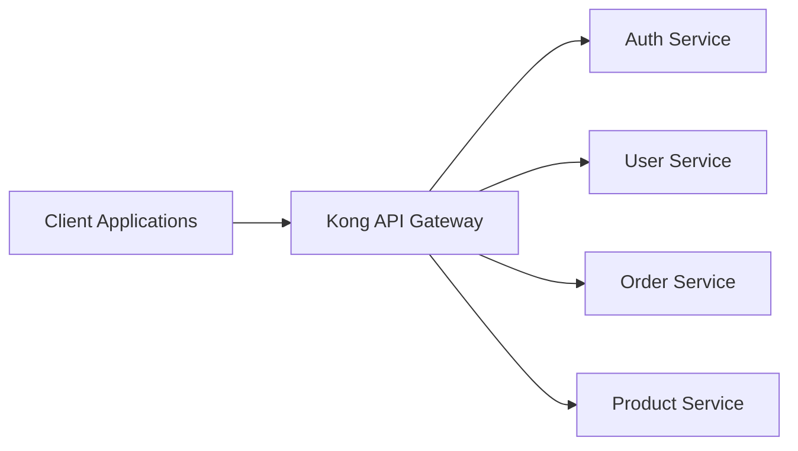
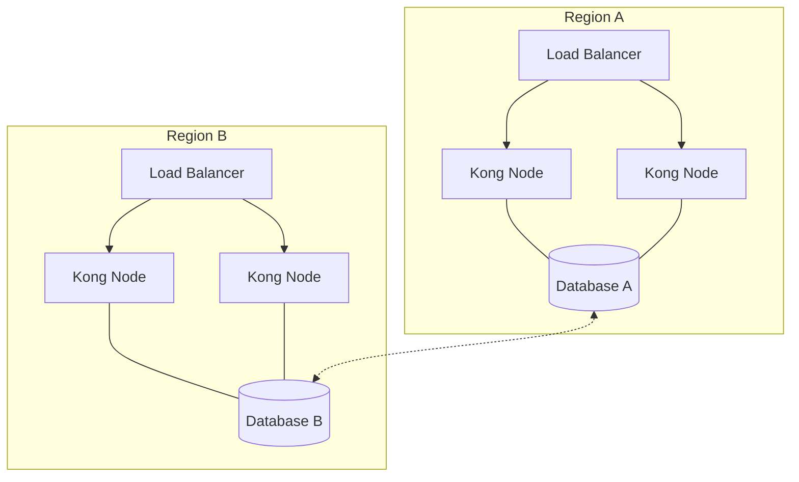

# Kong Architecture

## Introduction

Kong is a popular open-source API gateway and microservices management layer built on top of NGINX. It serves as a centralized control point for managing API traffic, enabling you to secure, transform, and monitor your APIs with minimal effort. In this guide, we'll explore Kong's architecture to understand how it works under the hood and how its components interact to provide powerful API management capabilities.

Whether you're building microservices, serverless functions, or traditional web applications, understanding Kong's architecture will help you leverage its full potential to create robust and scalable systems.

## Core Components of Kong

Kong's architecture consists of several key components working together:

### 1. NGINX Core

At its foundation, Kong is built on top of NGINX, a high-performance HTTP server and reverse proxy. This gives Kong several advantages:

- High throughput and low latency
- Connection handling capabilities
- Event-driven architecture
- Battle-tested reliability

Kong extends NGINX through custom modules and configurations to provide additional features specifically for API management.

### 2. Kong Server

The Kong server is the main process that handles incoming API requests. It's responsible for:

- Processing incoming HTTP requests
- Applying plugins to requests/responses
- Routing requests to appropriate upstream services
- Caching responses when configured

### 3. Data Store

Kong uses a database to store its configuration data. Currently, it supports:

- PostgreSQL
- Cassandra

For simpler deployments, Kong also offers a DB-less mode where configurations are stored in memory and loaded from YAML files.

### 4. Kong Admin API

The Admin API is a RESTful interface that allows you to configure and manage Kong. Through this API, you can:

- Add/remove services and routes
- Configure plugins
- Manage consumers
- View status information

### 5. Plugins

Plugins are extensions that add functionality to Kong. They can hook into different phases of the request/response lifecycle to modify behavior. Kong comes with numerous built-in plugins for:

- Authentication (JWT, OAuth, Basic Auth, etc.)
- Security (CORS, IP restriction, rate limiting)
- Traffic control (request termination, response transformation)
- Analytics and monitoring (Prometheus, DataDog, logging)

## Kong Architecture Diagram

Let's visualize how these components interact:



## Request Flow Through Kong

Understanding how a request flows through Kong's architecture helps in troubleshooting and optimization:

1. **Client Request**: A client sends an HTTP request to Kong.
2. **Routing**: Kong matches the request against configured routes.
3. **Plugin Execution (Pre-processing)**: Before forwarding the request, Kong executes pre-processing plugins like authentication, rate limiting, etc.
4. **Proxying**: Kong forwards the (possibly modified) request to the upstream service.
5. **Upstream Response**: The service processes the request and returns a response.
6. **Plugin Execution (Post-processing)**: Kong runs post-processing plugins on the response.
7. **Client Response**: The final response is sent back to the client.

Let's see a code example of how this flow is configured:

```lua
-- Example of Kong route configuration
{
  "name": "example-service",
  "url": "http://example-upstream-service:8000",
  "routes": [
    {
      "paths": ["/api/v1"],
      "strip_path": true
    }
  ],
  "plugins": [
    {
      "name": "rate-limiting",
      "config": {
        "second": 5,
        "hour": 10000
      }
    }
  ]
}
```

This configuration creates a service pointing to `example-upstream-service`, with a route that matches paths starting with `/api/v1`. It also applies a rate-limiting plugin to restrict traffic to 5 requests per second and 10,000 per hour.

## Deployment Patterns

Kong's architecture supports various deployment patterns:

### Single-node Deployment

For development or small-scale production:

```yaml
# docker-compose.yml for single-node Kong
version: '3'
services:
  kong-database:
    image: postgres:13
    environment:
      POSTGRES_USER: kong
      POSTGRES_DB: kong
      POSTGRES_PASSWORD: kongpass
    volumes:
      - kong_data:/var/lib/postgresql/data

  kong:
    image: kong:latest
    environment:
      KONG_DATABASE: postgres
      KONG_PG_HOST: kong-database
      KONG_PG_USER: kong
      KONG_PG_PASSWORD: kongpass
      KONG_PROXY_ACCESS_LOG: /dev/stdout
      KONG_ADMIN_ACCESS_LOG: /dev/stdout
      KONG_PROXY_ERROR_LOG: /dev/stderr
      KONG_ADMIN_ERROR_LOG: /dev/stderr
      KONG_ADMIN_LISTEN: 0.0.0.0:8001
    ports:
      - "8000:8000"  # Proxy
      - "8001:8001"  # Admin API
    depends_on:
      - kong-database

volumes:
  kong_data:
```

### High-availability Deployment

For production environments:



In this architecture:
- Multiple Kong nodes handle requests
- They share configuration through a common database
- A load balancer distributes traffic among Kong nodes

## Kong's Hybrid Mode

Kong Enterprise introduced a hybrid deployment model that separates control plane from data plane:



Benefits of hybrid mode:
- Configuration changes are made only to the control plane
- Data planes receive configuration updates automatically
- Reduced database load on data planes
- Improved security by isolating admin interface

## Advanced Kong Configuration

Let's look at some more advanced configuration scenarios:

### Setting Up Service-to-Route Relationships

```bash
# Create a service
curl -i -X POST http://localhost:8001/services \
  --data name=example-service \
  --data url='http://example.com'

# Create a route and associate it with the service
curl -i -X POST http://localhost:8001/services/example-service/routes \
  --data 'paths[]=/api/v1' \
  --data name=example-route
```

### Applying a Plugin to a Service

```bash
# Apply rate limiting plugin to a service
curl -i -X POST http://localhost:8001/services/example-service/plugins \
  --data name=rate-limiting \
  --data config.second=5 \
  --data config.hour=10000
```

## Performance Considerations

Kong's architecture is designed for high performance, but several factors can impact its efficiency:

1. **Plugin Selection**: Each active plugin adds processing overhead
2. **Database Access**: DB-less mode can be faster but loses dynamic configuration
3. **NGINX Worker Count**: Should be set based on available CPU cores
4. **Connection Pooling**: Properly configured connection pools improve upstream service connectivity
5. **Caching**: Response caching can significantly reduce load

Configuration example for performance tuning:

```nginx
# In kong.conf:
nginx_worker_processes = auto        # Set worker processes to match CPU cores
nginx_worker_connections = 2048      # Increase connection limit if needed
mem_cache_size = 128m                # Increase cache size for busier deployments
```

## Common Kong Architecture Patterns

### API Gateway for Microservices



Kong serves as the entry point to your microservices ecosystem, handling cross-cutting concerns like:
- Authentication and authorization
- Request routing
- Rate limiting
- Analytics and monitoring

### Multi-datacenter Deployment



This architecture enables:
- Geographic distribution
- Lower latency for regional users
- Disaster recovery capabilities

## Summary

Kong's architecture provides a flexible, scalable foundation for API management. Its components work together to deliver high performance, security, and extensibility:

1. **Built on NGINX**: Leverages NGINX's high-performance core
2. **Plugin System**: Enables functionality extension without modifying core code
3. **Database Support**: Stores configuration in PostgreSQL, Cassandra, or DB-less mode
4. **Admin API**: Provides programmatic control over all aspects of Kong
5. **Flexible Deployment Options**: Supports single-node, clustered, and hybrid deployments

Understanding Kong's architecture allows you to properly configure, deploy, and troubleshoot your API gateway infrastructure to support your application's needs.

## Next Steps and Exercises

To deepen your understanding of Kong architecture:

1. Install Kong locally and explore its components
2. Configure a basic service and route through the Admin API
3. Add authentication plugins to secure your routes
4. Try setting up Kong in DB-less mode with configuration in YAML
5. Experiment with different plugin combinations and observe their effect on request flow
6. Measure performance differences between various deployment patterns

With a solid understanding of Kong's architecture, you're well-equipped to design and implement effective API management solutions for your applications.