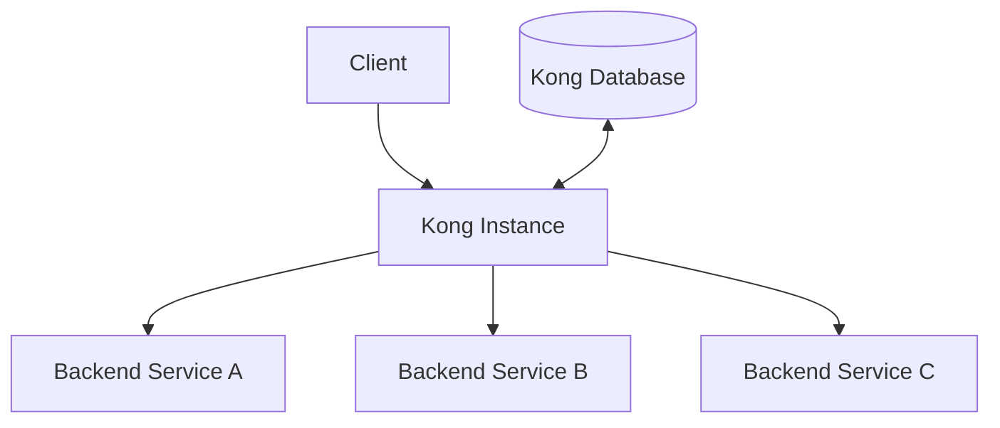
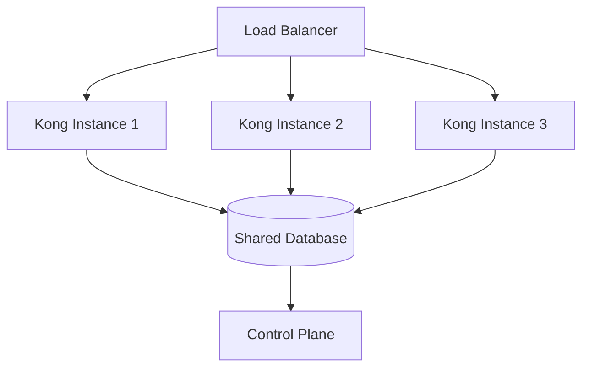

# Kong Instances

## Introduction

Kong is a popular open-source API gateway and microservices management layer that sits in front of your APIs. A Kong instance is a running deployment of Kong that processes API requests and applies policies like authentication, rate limiting, and transformations. Understanding how to set up, configure, and manage Kong instances is fundamental to leveraging Kong's capabilities in your API infrastructure.

This guide will introduce you to Kong instances, explain their architecture, and walk you through setting up and managing instances in different environments.

## What is a Kong Instance?

A Kong instance is a running process of the Kong gateway software. Each instance can handle API requests, apply configured plugins, and route traffic to appropriate backend services. Kong instances are stateless and can be deployed in various configurations depending on your scaling and reliability needs.



## Kong Instance Architecture

Each Kong instance consists of several core components:

1. **Core proxy**: Handles incoming requests and routes them to appropriate upstream services
2. **Plugin system**: Applies configured policies and extensions to requests and responses
3. **Admin API**: Provides configuration interface to manage routes, services, and plugins
4. **Data store connector**: Connects to configuration database (when using DB mode)

Kong instances can run in two different modes:

- **DB mode**: Uses a database (PostgreSQL or Cassandra) to store configuration
- **DB-less mode**: Uses a declarative configuration file without requiring a database

## Setting Up Your First Kong Instance

Let's set up a basic Kong instance using Docker. This is a quick way to get started without complex installation steps.

### Prerequisites

- Docker installed on your system
- Basic understanding of APIs and HTTP

### Step 1: Start Kong in DB-less Mode

Create a configuration file named `kong.yml`:

```yaml
_format_version: "2.1"
_transform: true

services:
  - name: example-service
    url: http://mockbin.org
    routes:
      - name: example-route
        paths:
          - /example
```

Now launch Kong with this configuration:

```bash
docker run -d --name kong \
  -v "$(pwd)/kong.yml:/kong/declarative/kong.yml" \
  -e "KONG_DATABASE=off" \
  -e "KONG_DECLARATIVE_CONFIG=/kong/declarative/kong.yml" \
  -e "KONG_PROXY_ACCESS_LOG=/dev/stdout" \
  -e "KONG_ADMIN_ACCESS_LOG=/dev/stdout" \
  -e "KONG_PROXY_ERROR_LOG=/dev/stderr" \
  -e "KONG_ADMIN_ERROR_LOG=/dev/stderr" \
  -e "KONG_ADMIN_LISTEN=0.0.0.0:8001, 0.0.0.0:8444 ssl" \
  -p 8000:8000 \
  -p 8443:8443 \
  -p 8001:8001 \
  -p 8444:8444 \
  kong:latest
```

### Step 2: Verify the Kong Instance

You can confirm your Kong instance is running by accessing the Admin API:

```bash
curl -i http://localhost:8001/
```

Expected output:
```
HTTP/1.1 200 OK
Access-Control-Allow-Origin: *
Content-Type: application/json
...

{
  "plugins": {
    "available_on_server": { ... },
    "enabled_in_cluster": []
  },
  "tagline": "Welcome to kong",
  "version": "2.8.1",
  ...
}
```

### Step 3: Test Your API Route

Now let's test the route we configured:

```bash
curl -i http://localhost:8000/example
```

You should receive a response from the mockbin.org service, indicating that Kong is properly forwarding requests.

## Kong Instance Configuration Options

Kong instances can be configured through various environment variables or configuration files. Here are some key configuration options:

### Essential Configuration Parameters

| Parameter | Description | Example |
| --------- | ----------- | ------- |
| `KONG_DATABASE` | Database type (postgres, cassandra, off) | `KONG_DATABASE=postgres` |
| `KONG_PG_HOST` | PostgreSQL host | `KONG_PG_HOST=db.example.com` |
| `KONG_ADMIN_LISTEN` | Admin API address/port | `KONG_ADMIN_LISTEN=0.0.0.0:8001` |
| `KONG_PROXY_LISTEN` | Proxy address/port | `KONG_PROXY_LISTEN=0.0.0.0:8000` |
| `KONG_SSL` | Enable HTTPS | `KONG_SSL=on` |
| `KONG_LOG_LEVEL` | Logging level | `KONG_LOG_LEVEL=info` |

You can set these parameters through environment variables or in a Kong configuration file.

### Example kong.conf file:

```
# Kong configuration example
database = postgres
pg_host = 127.0.0.1
pg_port = 5432
pg_user = kong
pg_password = kongpassword
pg_database = kong
admin_listen = 0.0.0.0:8001
```

## Running Multiple Kong Instances (High Availability)

For production environments, you'll typically want to run multiple Kong instances for high availability and scalability. Here's a typical pattern:



### Example Docker Compose for Multi-Instance Setup

Here's a basic Docker Compose configuration for running multiple Kong instances:

```yaml
version: '3'

services:
  kong-database:
    image: postgres:13
    environment:
      POSTGRES_USER: kong
      POSTGRES_DB: kong
      POSTGRES_PASSWORD: kong
    volumes:
      - kong_data:/var/lib/postgresql/data
    healthcheck:
      test: ["CMD", "pg_isready", "-U", "kong"]
      interval: 5s
      timeout: 5s
      retries: 5

  kong-migrations:
    image: kong:latest
    depends_on:
      - kong-database
    environment:
      KONG_DATABASE: postgres
      KONG_PG_HOST: kong-database
      KONG_PG_USER: kong
      KONG_PG_PASSWORD: kong
    command: kong migrations bootstrap

  kong1:
    image: kong:latest
    depends_on:
      - kong-migrations
    environment:
      KONG_DATABASE: postgres
      KONG_PG_HOST: kong-database
      KONG_PG_USER: kong
      KONG_PG_PASSWORD: kong
      KONG_PROXY_ACCESS_LOG: /dev/stdout
      KONG_ADMIN_ACCESS_LOG: /dev/stdout
      KONG_PROXY_ERROR_LOG: /dev/stderr
      KONG_ADMIN_ERROR_LOG: /dev/stderr
      KONG_ADMIN_LISTEN: 0.0.0.0:8001
    ports:
      - "8000:8000"
      - "8001:8001"

  kong2:
    image: kong:latest
    depends_on:
      - kong-migrations
    environment:
      KONG_DATABASE: postgres
      KONG_PG_HOST: kong-database
      KONG_PG_USER: kong
      KONG_PG_PASSWORD: kong
      KONG_PROXY_ACCESS_LOG: /dev/stdout
      KONG_ADMIN_ACCESS_LOG: /dev/stdout
      KONG_PROXY_ERROR_LOG: /dev/stderr
      KONG_ADMIN_ERROR_LOG: /dev/stderr
      KONG_ADMIN_LISTEN: 0.0.0.0:8001
    ports:
      - "8002:8000"
      - "8003:8001"

volumes:
  kong_data:
```

## Kong Instance Types

In more complex deployments, you might encounter different types of Kong instances:

### Data Plane Nodes

These instances handle actual API traffic and typically run at the edge of your network. They focus on performance and stability.

### Control Plane Nodes

These instances manage configuration and administration, and often have the Admin API exposed only internally. They focus on management tasks rather than processing high volumes of traffic.

Example control/data plane separation:

```yaml
# Control Plane instance
environment:
  KONG_ROLE: control_plane
  KONG_CLUSTER_CERT: /path/to/cluster.crt
  KONG_CLUSTER_CERT_KEY: /path/to/cluster.key
  KONG_ADMIN_LISTEN: 0.0.0.0:8001
  KONG_ADMIN_GUI_URL: https://admin.example.com

# Data Plane instance
environment:
  KONG_ROLE: data_plane
  KONG_CLUSTER_CERT: /path/to/cluster.crt
  KONG_CLUSTER_CERT_KEY: /path/to/cluster.key
  KONG_CLUSTER_CONTROL_PLANE: control-plane-host:8005
  KONG_ADMIN_LISTEN: off
```

## Kong Instance Monitoring

Monitoring your Kong instances is essential for maintaining a healthy API gateway. Kong provides various metrics through its Prometheus plugin or status API.

### Key Metrics to Monitor

- Request rate and latency
- Error rates (HTTP 4xx/5xx responses)
- Connection counts
- Plugin execution time
- Database health (in DB mode)

### Basic Status Check

You can quickly check the status of a Kong instance using:

```bash
curl http://localhost:8001/status
```

Sample output:
```json
{
  "database": {
    "reachable": true
  },
  "memory": {
    "lua_shared_dicts": {
      "kong": {
        "allocated_slabs": 12288,
        "capacity": 5242880
      },
      // More memory stats...
    },
    "workers_lua_vms": [
      {
        "http_allocated_gc": 13766,
        "pid": 1
      }
    ]
  },
  "server": {
    "connections_accepted": 1,
    "connections_active": 1,
    "connections_handled": 1,
    "connections_reading": 0,
    "connections_waiting": 0,
    "connections_writing": 1,
    "total_requests": 1
  }
}
```

## Practical Example: Adding Rate Limiting to Your Kong Instance

Let's add a rate limiting plugin to protect our backend services from excessive traffic.

### Update Your Kong Configuration

Add the following to your `kong.yml` file:

```yaml
_format_version: "2.1"
_transform: true

services:
  - name: example-service
    url: http://mockbin.org
    routes:
      - name: example-route
        paths:
          - /example
    plugins:
      - name: rate-limiting
        config:
          minute: 5
          policy: local
```

### Reload Kong Configuration

```bash
curl -X POST http://localhost:8001/config \
  -H "Content-Type: application/json" \
  --data '{"config":"`cat kong.yml`"}'
```

### Test Rate Limiting

Make multiple requests to see rate limiting in action:

```bash
for i in {1..10}; do curl -i http://localhost:8000/example; done
```

After 5 requests within a minute, you should see responses with a 429 status code and headers showing the rate limit information:

```
HTTP/1.1 429 Too Many Requests
X-RateLimit-Limit-Minute: 5
X-RateLimit-Remaining-Minute: 0
...
```

## Troubleshooting Kong Instances

When working with Kong instances, you might encounter various issues. Here are some common problems and their solutions:

### Connection Issues

**Problem**: Unable to connect to Kong Admin API or proxy
**Solution**: Check network settings, firewall rules, and port configurations. Verify Kong is running:

```bash
docker ps | grep kong
```

### Configuration Errors

**Problem**: Kong fails to start with configuration errors
**Solution**: Check logs for specific errors:

```bash
docker logs kong
```

Common configuration problems include:
- Invalid YAML or JSON syntax
- Missing required fields
- Database connection issues

### Performance Issues

**Problem**: High latency or low throughput
**Solution**:
- Increase Kong resources (CPU/memory)
- Optimize plugin configuration
- Scale horizontally by adding more instances
- Check upstream service health

## Summary

Kong instances are the running deployments of Kong that form the backbone of your API gateway infrastructure. Key points to remember:

- Kong instances can run in DB or DB-less mode
- Configuration is done via Admin API, environment variables, or declarative config files
- Multiple instances can be used for high availability and scaling
- Control/data plane separation is useful for large-scale deployments
- Monitoring and troubleshooting are essential for maintaining healthy Kong instances

As you grow your API infrastructure, understanding how to effectively manage Kong instances will help you build robust, scalable, and secure API gateways.

## Additional Resources

- Practice setting up Kong instances in different environments (development, staging, production)
- Experiment with different plugins and configurations
- Try deploying Kong in Kubernetes using the Kong Ingress Controller
- Implement a monitoring solution for your Kong instances

## Exercises

1. Set up a Kong instance with at least two different backend services
2. Configure Kong with authentication (key-auth or jwt) and rate limiting plugins
3. Create a high-availability setup with multiple Kong instances and a load balancer
4. Implement canary deployments using Kong's traffic splitting capabilities
5. Set up monitoring for your Kong instances using Prometheus and Grafana