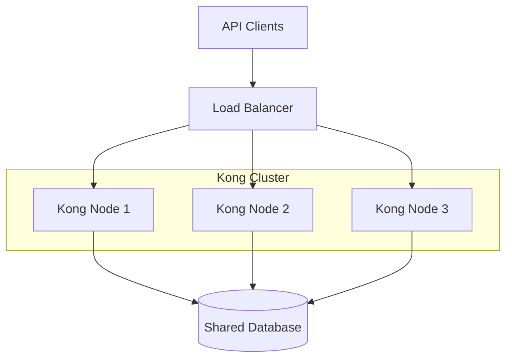
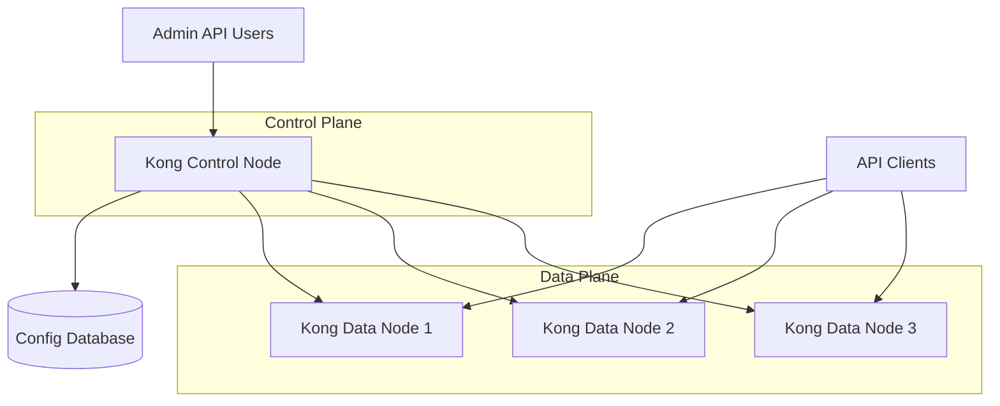

# Kong Clustering

## Introduction

Kong is a popular open-source API gateway that helps you manage, secure, and observe your APIs. As your API traffic grows, running Kong on a single node might not be sufficient to handle the load or provide the necessary reliability. This is where Kong clustering comes in.

Kong clustering allows you to deploy multiple Kong instances that work together as a unified system, providing high availability, improved performance, and horizontal scalability for your API management infrastructure.

In this guide, we'll explore how Kong clustering works, how to set it up, and best practices for managing a Kong cluster in production environments.

## What is Kong Clustering?

Kong clustering refers to running multiple Kong instances that share configuration data to operate as a cohesive unit. This allows for:

- **High Availability**: If one Kong node fails, others can continue processing API requests
- **Horizontal Scalability**: Add more Kong nodes to handle increased API traffic
- **Load Distribution**: Spread API requests across multiple nodes for improved performance

Let's understand the core components that make clustering possible:

### The Role of Kong's Database

Kong can operate in two modes:

1. **DB mode**: Kong nodes connect to a shared database (PostgreSQL or Cassandra)
2. **DB-less mode**: Kong nodes use local configuration files

For clustering in DB mode, all Kong nodes connect to the same database, which acts as the source of truth for configuration data:



## Setting Up Kong Clustering

Let's walk through the process of setting up a basic Kong cluster in DB mode:

### Prerequisites

- Multiple servers/VMs to host Kong nodes
- PostgreSQL or Cassandra database
- Load balancer (like Nginx, HAProxy, or a cloud load balancer)

### Step 1: Set Up the Shared Database

First, we need to set up a PostgreSQL database that all Kong nodes will connect to:

```bash
# Create Kong database and user in PostgreSQL
$ psql -U postgres
postgres=# CREATE USER kong WITH PASSWORD 'kong_password';
postgres=# CREATE DATABASE kong OWNER kong;
postgres=# \q

# Run Kong migrations
$ kong migrations bootstrap -c /etc/kong/kong.conf
```

### Step 2: Configure Kong Nodes

On each server that will run a Kong node, create a configuration file with the database connection details:

```bash
# /etc/kong/kong.conf
database = postgres
pg_host = your_database_host
pg_port = 5432
pg_user = kong
pg_password = kong_password
pg_database = kong
```

Ensure each node has a unique identifier:

```bash
# Add to kong.conf
cluster_listen = 0.0.0.0:8005
cluster_advertise = public_ip:8005
```

### Step 3: Start Kong on Each Node

On each server, start Kong with the configuration file:

```bash
$ kong start -c /etc/kong/kong.conf
```

### Step 4: Configure Load Balancing

Set up a load balancer in front of your Kong nodes. Here's a simple Nginx configuration example:

```nginx
upstream kong_upstream {
    server kong_node1:8000;
    server kong_node2:8000;
    server kong_node3:8000;
}

server {
    listen 80;
    
    location / {
        proxy_pass http://kong_upstream;
        proxy_set_header Host $host;
        proxy_set_header X-Real-IP $remote_addr;
    }
}
```

## Practical Example: Deploying a Kong Cluster with Docker Compose

Let's see how we can easily set up a Kong cluster using Docker Compose for development and testing:

```yaml
# docker-compose.yml
version: '3'

services:
  kong-db:
    image: postgres:13
    environment:
      POSTGRES_USER: kong
      POSTGRES_DB: kong
      POSTGRES_PASSWORD: kong_password
    ports:
      - "5432:5432"
    healthcheck:
      test: ["CMD", "pg_isready", "-U", "kong"]
      interval: 10s
      timeout: 5s
      retries: 5

  kong-migrations:
    image: kong:latest
    depends_on:
      - kong-db
    environment:
      KONG_DATABASE: postgres
      KONG_PG_HOST: kong-db
      KONG_PG_USER: kong
      KONG_PG_PASSWORD: kong_password
    command: kong migrations bootstrap

  kong-node1:
    image: kong:latest
    depends_on:
      - kong-db
      - kong-migrations
    environment:
      KONG_DATABASE: postgres
      KONG_PG_HOST: kong-db
      KONG_PG_USER: kong
      KONG_PG_PASSWORD: kong_password
      KONG_PROXY_ACCESS_LOG: /dev/stdout
      KONG_ADMIN_ACCESS_LOG: /dev/stdout
      KONG_PROXY_ERROR_LOG: /dev/stderr
      KONG_ADMIN_ERROR_LOG: /dev/stderr
      KONG_ADMIN_LISTEN: 0.0.0.0:8001
    ports:
      - "8000:8000"
      - "8001:8001"

  kong-node2:
    image: kong:latest
    depends_on:
      - kong-db
      - kong-migrations
    environment:
      KONG_DATABASE: postgres
      KONG_PG_HOST: kong-db
      KONG_PG_USER: kong
      KONG_PG_PASSWORD: kong_password
      KONG_PROXY_ACCESS_LOG: /dev/stdout
      KONG_ADMIN_ACCESS_LOG: /dev/stdout
      KONG_PROXY_ERROR_LOG: /dev/stderr
      KONG_ADMIN_ERROR_LOG: /dev/stderr
      KONG_ADMIN_LISTEN: 0.0.0.0:8001
    ports:
      - "8002:8000"
      - "8003:8001"
```

Start the cluster with:

```bash
$ docker-compose up -d
```

Now you have a simple Kong cluster with two nodes sharing the same configuration database.

## Advanced Kong Clustering Concepts

### Control Plane / Data Plane Separation

In larger deployments, Kong supports a control plane / data plane architecture:



In this model:
- **Control Plane**: Manages configuration through Admin API
- **Data Plane**: Handles actual API traffic

To configure this separation, use:

```bash
# Control Plane node configuration
cluster_role = control_plane
cluster_cert = /path/to/cluster.crt
cluster_cert_key = /path/to/cluster.key

# Data Plane node configuration
cluster_role = data_plane
cluster_control_plane = control_plane_address:8005
cluster_cert = /path/to/cluster.crt
cluster_cert_key = /path/to/cluster.key
```

### Hybrid Mode

Kong Enterprise offers a Hybrid Mode deployment, which extends the control plane / data plane separation for multi-datacenter configurations.

### Cache Consistency

Kong nodes maintain caches of entities like Services, Routes, and Plugins. When a change is made through the Admin API, Kong ensures eventual consistency across nodes through:

1. Database polling (in DB mode)
2. Cluster events (in Hybrid mode)

## Monitoring Kong Clusters

To ensure your Kong cluster is healthy, monitor these key metrics:

1. **Node Status**: Check that all nodes are running
2. **Request Latency**: Track response times across nodes
3. **Error Rates**: Monitor HTTP errors and Kong-specific errors
4. **Database Connectivity**: Ensure all nodes can reach the database

Kong exposes a status endpoint that can be used for health checks:

```bash
$ curl -i http://kong_node:8001/status
```

## Best Practices for Kong Clusters

1. **Use Production-Grade Databases**: For PostgreSQL, consider using managed services or high-availability setups.

2. **Implement Database Redundancy**: Consider database replication to prevent a single point of failure.

3. **Deploy in Multiple Availability Zones**: If using cloud providers, spread Kong nodes across zones.

4. **Graceful Scaling**: When adding or removing nodes, do so gradually to avoid disruption.

5. **Consistent Configuration**: Use configuration management tools to ensure consistency.

6. **Regular Backups**: Back up your Kong database regularly.

7. **Upgrade Strategy**: Plan for rolling upgrades to minimize downtime.

## Troubleshooting Common Issues

### Node Not Joining Cluster

If a node isn't joining the cluster properly:

1. Check network connectivity between nodes
2. Verify database connection settings
3. Ensure cluster listen and advertise addresses are correct
4. Check for firewall rules blocking cluster communication

### Configuration Inconsistency

If you notice different behavior between nodes:

1. Verify all nodes are connected to the same database
2. Check for cached configurations with `kong reload`
3. Confirm all nodes are running the same Kong version

## Summary

Kong clustering provides a robust solution for scaling your API gateway infrastructure. By running multiple Kong nodes that share configuration, you can achieve high availability, improved performance, and horizontal scalability.

Key points to remember:
- Kong nodes in a cluster share configuration through a common database
- Clustering supports both traditional shared-database and control/data plane architectures
- Proper load balancing is essential for distributing traffic across nodes
- Monitoring and maintenance practices ensure cluster health and reliability

## Further Learning

To deepen your knowledge of Kong clustering, consider these exercises:

1. **Exercise**: Set up a three-node Kong cluster using Docker Compose.
2. **Exercise**: Configure Kong with a highly available PostgreSQL database.
3. **Exercise**: Implement health checks and failover strategies for your Kong cluster.
4. **Exercise**: Practice scaling your Kong cluster up and down without service interruption.

## Additional Resources

- [Kong Documentation on Clustering](https://docs.konghq.com/)
- [Kong High Availability Reference Architecture](https://konghq.com/blog/)
- [Kong Enterprise Documentation for Hybrid Mode](https://docs.konghq.com/enterprise/)
- Kong Community Forum for troubleshooting and discussions