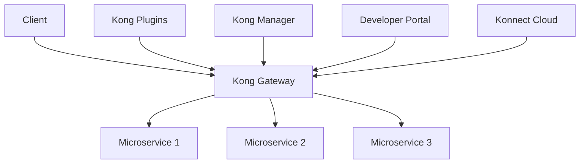
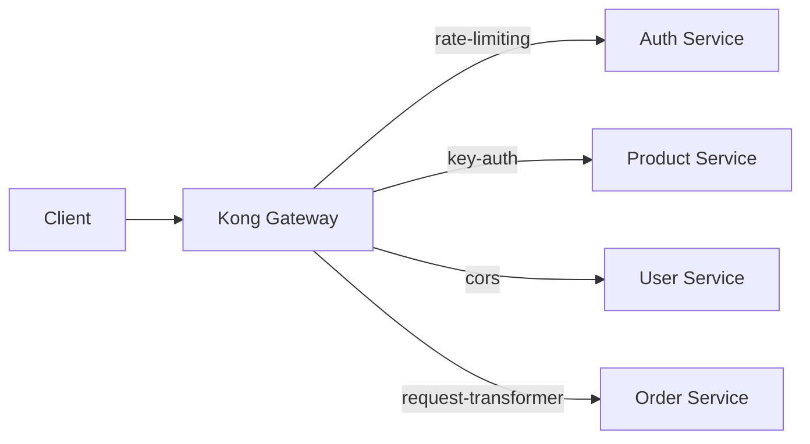

# Kong Ecosystem

## Introduction

The Kong ecosystem represents a robust platform for API management and microservices orchestration. At its core, Kong is an open-source API gateway designed to manage, secure, and optimize API traffic for modern applications. Whether you're building microservices, serverless functions, or traditional monolithic applications, Kong provides the tools needed to handle your API communication efficiently.

In this guide, we'll explore the various components of the Kong ecosystem, how they work together, and how you can leverage them in your applications. We'll focus on practical applications and beginner-friendly explanations to help you get started.

## Core Components of the Kong Ecosystem

### Kong Gateway

The heart of the Kong ecosystem is the Kong Gateway—a lightweight, high-performance API gateway that sits in front of your APIs. It routes client requests to appropriate services while providing essential functionality like:

- Request routing
- Authentication
- Rate limiting
- Logging and monitoring
- Transformations

Kong Gateway is built on top of NGINX, making it extremely efficient at handling high volumes of API traffic with minimal latency.

### Kong Manager

Kong Manager is the graphical user interface (GUI) for administering the Kong Gateway. It provides a user-friendly dashboard to:

- Configure and manage APIs
- Apply plugins
- Monitor traffic
- Manage consumers and credentials

For beginners, Kong Manager makes it much easier to understand and work with Kong without needing to master command-line tools right away.

### Kong Developer Portal

The Developer Portal allows API providers to create documentation and onboarding experiences for API consumers. Features include:

- Interactive API documentation
- API catalogs
- Authentication key management
- Analytics on API usage

This component is crucial for teams that want to make their APIs accessible and usable by other developers.

### Kong Plugins

Plugins are modular extensions that add functionality to the Kong Gateway. They allow you to enhance your API gateway with capabilities like:

- Security features (authentication, authorization)
- Traffic control (rate limiting, request validation)
- Analytics and monitoring
- Transformations (request/response modification)
- Logging and debugging

There are over 100 plugins available, both open-source and enterprise.

### Konnect (Kong Cloud)

Konnect is Kong's cloud-based service platform that provides managed Kong services. It allows you to:

- Deploy Kong gateways across multiple regions
- Centrally manage configuration
- Monitor performance
- Apply consistent policies across environments

## Kong Architecture

Let's visualize how the Kong ecosystem components fit together:



In this architecture:
1. Clients send requests to the Kong Gateway
2. Kong Gateway processes these requests using configured plugins
3. Requests are routed to the appropriate microservices
4. Kong Manager and Developer Portal provide administrative and documentation interfaces
5. Konnect can manage Kong deployments from the cloud

## Setting Up Kong Gateway

Let's walk through a basic setup of Kong Gateway using Docker:

```bash
# Pull the Kong Docker image
docker pull kong:latest

# Start a PostgreSQL instance
docker run -d --name kong-database \
  -p 5432:5432 \
  -e "POSTGRES_USER=kong" \
  -e "POSTGRES_DB=kong" \
  -e "POSTGRES_PASSWORD=kongpass" \
  postgres:13

# Run Kong migrations
docker run --rm \
  --link kong-database:kong-database \
  -e "KONG_DATABASE=postgres" \
  -e "KONG_PG_HOST=kong-database" \
  -e "KONG_PG_USER=kong" \
  -e "KONG_PG_PASSWORD=kongpass" \
  kong:latest kong migrations bootstrap

# Start Kong Gateway
docker run -d --name kong \
  --link kong-database:kong-database \
  -e "KONG_DATABASE=postgres" \
  -e "KONG_PG_HOST=kong-database" \
  -e "KONG_PG_USER=kong" \
  -e "KONG_PG_PASSWORD=kongpass" \
  -e "KONG_PROXY_ACCESS_LOG=/dev/stdout" \
  -e "KONG_ADMIN_ACCESS_LOG=/dev/stdout" \
  -e "KONG_PROXY_ERROR_LOG=/dev/stderr" \
  -e "KONG_ADMIN_ERROR_LOG=/dev/stderr" \
  -e "KONG_ADMIN_LISTEN=0.0.0.0:8001, 0.0.0.0:8444 ssl" \
  -p 8000:8000 \
  -p 8443:8443 \
  -p 8001:8001 \
  -p 8444:8444 \
  kong:latest
```

After running these commands, Kong Gateway will be:
- Listening on port 8000 for API traffic (HTTP)
- Listening on port 8443 for secure API traffic (HTTPS)
- Providing an Admin API on port 8001 (HTTP) and 8444 (HTTPS)

## Configuring Services and Routes

Once Kong is running, you can configure services and routes. A service represents your API or microservice, while a route specifies how clients can access that service.

### Adding a Service

```bash
# Add a service pointing to a mock API
curl -i -X POST \
  --url http://localhost:8001/services/ \
  --data 'name=example-service' \
  --data 'url=http://mockbin.org/request'
```

### Adding a Route

```bash
# Add a route for the service
curl -i -X POST \
  --url http://localhost:8001/services/example-service/routes \
  --data 'paths[]=/example'
```

Now, when clients send requests to `/example`, Kong will route them to the mock API at `http://mockbin.org/request`.

### Testing the Configuration

```bash
# Send a request through Kong
curl -i -X GET \
  --url http://localhost:8000/example
```

You should receive a response from the mockbin service, indicating that Kong is successfully routing your request.

## Using Kong Plugins

One of Kong's most powerful features is its plugin architecture. Let's add a basic rate-limiting plugin:

```bash
# Add rate limiting to our service
curl -i -X POST \
  --url http://localhost:8001/services/example-service/plugins/ \
  --data 'name=rate-limiting' \
  --data 'config.minute=5' \
  --data 'config.policy=local'
```

This configuration limits clients to 5 requests per minute to our example service. If you try to make more than 5 requests in a minute, you'll receive a 429 Too Many Requests response.

Let's test the rate-limiting:

```bash
# Send multiple requests to test rate limiting
for i in {1..7}; do
  echo "Request $i:"
  curl -i -X GET --url http://localhost:8000/example | head -n 1
  echo ""
done
```

Output:
```
Request 1:
HTTP/1.1 200 OK

Request 2:
HTTP/1.1 200 OK

...

Request 6:
HTTP/1.1 429 Too Many Requests
```

## Authentication with Kong

Kong provides various authentication methods. Let's implement a simple key-based authentication:

```bash
# Add the key-auth plugin to our service
curl -i -X POST \
  --url http://localhost:8001/services/example-service/plugins/ \
  --data 'name=key-auth'

# Create a consumer
curl -i -X POST \
  --url http://localhost:8001/consumers/ \
  --data 'username=example-user'

# Create an API key for the consumer
curl -i -X POST \
  --url http://localhost:8001/consumers/example-user/key-auth/ \
  --data 'key=example-api-key'
```

Now, requests to the example service require an API key:

```bash
# Request without API key (should fail)
curl -i -X GET \
  --url http://localhost:8000/example

# Request with API key (should succeed)
curl -i -X GET \
  --url http://localhost:8000/example \
  --header 'apikey: example-api-key'
```

## Declarative Configuration with Kong

Kong also supports a declarative configuration approach using YAML:

```yaml
_format_version: "2.1"
_transform: true

services:
  - name: example-service
    url: http://mockbin.org/request
    routes:
      - name: example-route
        paths:
          - /example
    plugins:
      - name: rate-limiting
        config:
          minute: 5
          policy: local
      - name: key-auth
        config:
          key_names:
            - apikey

consumers:
  - username: example-user
    keyauth_credentials:
      - key: example-api-key
```

Save this as `kong.yml` and apply it with:

```bash
# Apply declarative configuration
curl -i -X POST \
  --url http://localhost:8001/config \
  --data @kong.yml
```

## Integration with Microservices

In a real-world scenario, Kong would typically sit in front of multiple microservices:



Each service can have its own set of plugins and configurations, allowing for granular control over how traffic flows through your architecture.

## Advanced Use Cases

### Service Mesh with Kong Mesh

Kong Mesh extends Kong's capabilities into a full service mesh solution:

```bash
# Install Kong Mesh
curl -L https://docs.konghq.com/mesh/installer.sh | sh -

# Start Kong Mesh
kong-mesh start
```

This enables advanced service-to-service communication features like:
- Mutual TLS encryption
- Traffic permissions
- Traffic routing
- Observability

### API Analytics with Prometheus and Grafana

Kong can be integrated with Prometheus and Grafana for monitoring:

```bash
# Add the Prometheus plugin
curl -i -X POST \
  --url http://localhost:8001/plugins/ \
  --data 'name=prometheus'
```

Once configured, you can set up Grafana dashboards to visualize:
- Request rates
- Latency statistics
- Error rates
- Geographic distribution of traffic

## Common Challenges and Solutions

### Challenge 1: Managing Kong in Production

In production environments, you'll want to:
- Use a proper database (PostgreSQL recommended)
- Implement high availability with multiple Kong nodes
- Use a load balancer in front of Kong
- Implement proper logging and monitoring

Solution: Consider using Kong Konnect or Kong Enterprise for production deployments.

### Challenge 2: Migrating from Traditional API Management

When migrating from traditional API gateways to Kong:
1. Start with simple routes and services
2. Gradually implement plugins that match your existing policies
3. Use canary deployments to test the migration
4. Monitor performance metrics closely during the transition

## Summary

The Kong ecosystem provides a comprehensive solution for API management and microservices orchestration. In this guide, we've covered:

- Core components of the Kong ecosystem
- Setting up Kong Gateway
- Configuring services and routes
- Adding plugins for functionality like rate limiting and authentication
- Declarative configuration
- Integration with microservices
- Advanced use cases

By leveraging Kong's flexibility and extensive plugin ecosystem, you can build robust, secure, and scalable API architectures that grow with your application needs.

## Additional Resources

To continue your learning journey:

1. **Practice Exercises:**
   - Set up Kong with multiple services
   - Experiment with different authentication plugins
   - Try implementing request and response transformations

2. **Kong Documentation:**
   - Kong Gateway docs: https://docs.konghq.com/gateway/
   - Kong Plugin Hub: https://docs.konghq.com/hub/

3. **Community Resources:**
   - Kong Nation community forum
   - Kong GitHub repositories
   - Kong Slack channel

Remember that the Kong ecosystem is constantly evolving, with new features and capabilities being added regularly. The foundation you've built here will help you adapt to these changes and make the most of what Kong has to offer for your API management needs.