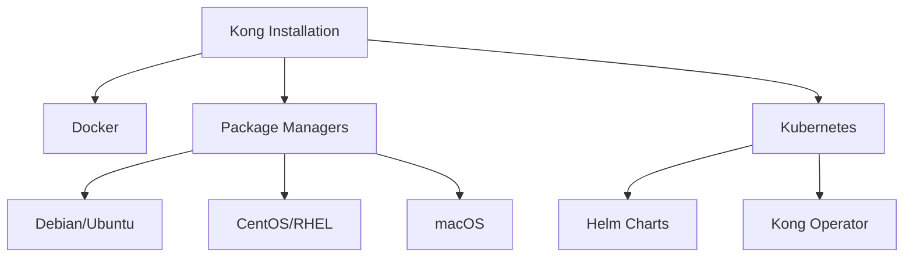

# Kong Installation

## Introduction

Kong is a popular open-source API Gateway built on top of NGINX. It serves as a middleware layer between clients and your API services, managing traffic, securing connections, and adding functionality through plugins. In this guide, we'll walk through the process of installing Kong on different platforms.

Kong's architecture allows it to act as a gateway for your microservices, handling tasks like:

- Traffic control and load balancing
- Authentication and security
- Monitoring and analytics
- Request/response transformation
- API composition

Before we begin the installation process, it's important to understand that Kong comes in two versions:

1. **Kong Community Edition (Kong CE)**: The free, open-source version
2. **Kong Enterprise**: A commercial version with additional features and support

This guide will focus on installing Kong Community Edition.

## Prerequisites

Before installing Kong, ensure you have:

- Administrative access to your system
- Basic understanding of command-line interfaces
- Familiarity with package managers (depending on your OS)
- Knowledge of database concepts (Kong requires either Postgres or Cassandra)

## Installation Methods



## Docker Installation

Docker provides the easiest way to get started with Kong. With just a few commands, you can have Kong running in containers.

### Step 1: Create a Docker Network

Let's start by creating a Docker network to allow Kong and its database to communicate:

```bash
docker network create kong-net
```

### Step 2: Start the Database

Kong supports both PostgreSQL and Cassandra. For this guide, we'll use PostgreSQL:

```bash
docker run -d --name kong-database \
  --network=kong-net \
  -p 5432:5432 \
  -e "POSTGRES_USER=kong" \
  -e "POSTGRES_DB=kong" \
  -e "POSTGRES_PASSWORD=kongpass" \
  postgres:13
```

### Step 3: Prepare the Database

Before starting Kong, we need to prepare the database:

```bash
docker run --rm --network=kong-net \
  -e "KONG_DATABASE=postgres" \
  -e "KONG_PG_HOST=kong-database" \
  -e "KONG_PG_USER=kong" \
  -e "KONG_PG_PASSWORD=kongpass" \
  kong:latest kong migrations bootstrap
```

### Step 4: Start Kong

Now we can start Kong:

```bash
docker run -d --name kong \
  --network=kong-net \
  -e "KONG_DATABASE=postgres" \
  -e "KONG_PG_HOST=kong-database" \
  -e "KONG_PG_USER=kong" \
  -e "KONG_PG_PASSWORD=kongpass" \
  -e "KONG_PROXY_ACCESS_LOG=/dev/stdout" \
  -e "KONG_ADMIN_ACCESS_LOG=/dev/stdout" \
  -e "KONG_PROXY_ERROR_LOG=/dev/stderr" \
  -e "KONG_ADMIN_ERROR_LOG=/dev/stderr" \
  -e "KONG_ADMIN_LISTEN=0.0.0.0:8001, 0.0.0.0:8444 ssl" \
  -p 8000:8000 \
  -p 8443:8443 \
  -p 8001:8001 \
  -p 8444:8444 \
  kong:latest
```

This command starts Kong with the following ports exposed:
- 8000: Kong proxy port (HTTP)
- 8443: Kong proxy port (HTTPS)
- 8001: Kong admin API (HTTP)
- 8444: Kong admin API (HTTPS)

### Step 5: Verify the Installation

Test that Kong is running by accessing the admin API:

```bash
curl -i http://localhost:8001/
```

You should receive a JSON response containing Kong's configuration information.

## Installing on Linux

### Debian/Ubuntu

#### Step 1: Install Dependencies

```bash
sudo apt-get update
sudo apt-get install -y apt-transport-https curl lsb-core
```

#### Step 2: Add Kong's Repository

```bash
curl -Lo kong.deb "https://download.konghq.com/gateway-2.x-ubuntu-$(lsb_release -cs)/pool/all/k/kong/kong_2.8.1_amd64.deb"
```

#### Step 3: Install Kong

```bash
sudo dpkg -i kong.deb
```

#### Step 4: Configure Kong

Create a configuration file:

```bash
sudo cp /etc/kong/kong.conf.default /etc/kong/kong.conf
```

Edit the configuration to set up the database connection:

```bash
sudo vi /etc/kong/kong.conf
```

Uncomment and modify these lines in the configuration file:

```
database = postgres
pg_host = 127.0.0.1
pg_user = kong
pg_password = kong
pg_database = kong
```

#### Step 5: Prepare the Database

Make sure PostgreSQL is installed and running, then:

```bash
sudo kong migrations bootstrap
```

#### Step 6: Start Kong

```bash
sudo kong start
```

### CentOS/RHEL

#### Step 1: Add the Repository

```bash
sudo yum install -y https://download.konghq.com/gateway-2.x-centos-7/Packages/k/kong-2.8.1.el7.amd64.rpm
```

#### Step 2: Configure and Start Kong

Follow the same configuration steps as in the Debian/Ubuntu section.

## Installing on macOS

The easiest way to install Kong on macOS is using Homebrew:

```bash
brew tap kong/kong
brew install kong
```

Configure Kong by editing the configuration file:

```bash
cp /usr/local/etc/kong/kong.conf.default /usr/local/etc/kong/kong.conf
```

Edit the file and follow the same database configuration steps as above.

## Kubernetes Installation

### Using Helm

Helm is the package manager for Kubernetes. You can use it to install Kong:

#### Step 1: Add the Kong Helm Repository

```bash
helm repo add kong https://charts.konghq.com
helm repo update
```

#### Step 2: Install Kong

```bash
helm install kong kong/kong
```

This command installs Kong with the default configuration. For a production setup, you should create a custom values file to configure Kong according to your needs.

### Using Kong Operator

For more advanced Kubernetes deployments, you can use the Kong Kubernetes Operator:

```bash
kubectl create -f https://raw.githubusercontent.com/Kong/kong-operator/master/deploy/single/all-in-one-postgres.yaml
```

## DB-less Mode

Kong can also run without a database, using a declarative configuration:

### Step 1: Create a Kong Configuration File

Create a file named `kong.yml`:

```yaml
_format_version: "2.1"
_transform: true

services:
  - name: example-service
    url: http://example.com
    routes:
      - name: example-route
        paths:
          - "/"
```

### Step 2: Start Kong in DB-less Mode

```bash
docker run -d --name kong \
  -v "$(pwd)/kong.yml:/usr/local/kong/declarative/kong.yml" \
  -e "KONG_DATABASE=off" \
  -e "KONG_DECLARATIVE_CONFIG=/usr/local/kong/declarative/kong.yml" \
  -e "KONG_PROXY_ACCESS_LOG=/dev/stdout" \
  -e "KONG_ADMIN_ACCESS_LOG=/dev/stdout" \
  -e "KONG_PROXY_ERROR_LOG=/dev/stderr" \
  -e "KONG_ADMIN_ERROR_LOG=/dev/stderr" \
  -e "KONG_ADMIN_LISTEN=0.0.0.0:8001, 0.0.0.0:8444 ssl" \
  -p 8000:8000 \
  -p 8443:8443 \
  -p 8001:8001 \
  -p 8444:8444 \
  kong:latest
```

## Verifying Your Installation

Regardless of the installation method, you can verify Kong is working by accessing the admin API:

```bash
curl -i http://localhost:8001/
```

If the installation is successful, you'll receive a JSON response with Kong's configuration details.

You can also check the status of Kong with:

```bash
kong health
```

## Common Issues and Troubleshooting

### 1. Database Connection Issues

If Kong fails to connect to the database, check:
- Database credentials in your configuration
- Network connectivity between Kong and the database
- Database service status

Error message example:

```
[ERROR] Failed to connect to the database: could not connect to server: Connection refused
```

Solution: Ensure the database is running and accessible from Kong's host.

### 2. Port Conflicts

If Kong fails to start because ports are already in use:

```
[ERROR] Address already in use
```

Solution: Change the ports in Kong's configuration or stop the services using those ports.

### 3. Permission Issues

On Linux systems, you might encounter permission issues:

```
[ERROR] failed to open the prefix directory
```

Solution: Ensure that Kong has the proper permissions to access its directories.

## Summary

In this guide, we've covered:

1. Different methods to install Kong API Gateway
2. Step-by-step instructions for each platform
3. How to verify your installation
4. Common issues and how to troubleshoot them

Kong is a powerful API Gateway that can enhance your microservices architecture. Now that you have Kong installed, you can start configuring it to route traffic, apply plugins, and secure your APIs.

## Next Steps

After installing Kong, you might want to:

1. Learn how to configure Kong for your first API
2. Explore Kong's plugin ecosystem
3. Set up authentication for your APIs
4. Configure rate limiting to protect your services
5. Implement monitoring and logging

## Practice Exercises

1. Install Kong using Docker and add a basic service and route configuration
2. Try running Kong in DB-less mode with a custom configuration
3. Experiment with different environment variables to customize your Kong installation
4. Set up a development environment with Kong and a sample API