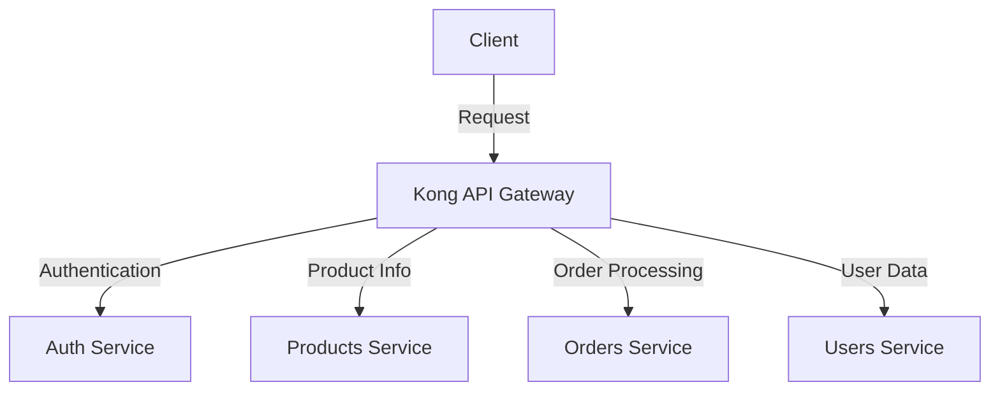

# Kong Configuration

## Introduction

Kong is a powerful, open-source API gateway and microservices management layer that sits in front of your APIs. Configuration is a fundamental aspect of working with Kong, as it determines how your gateway behaves, routes traffic, and applies plugins.

In this guide, we'll explore how to configure Kong effectively, from basic setup to advanced configurations that help you manage your APIs like a pro.

## Understanding Kong's Configuration

Kong's configuration can be divided into several key components:

1. **Core Configuration** - Setting up Kong itself
2. **Services and Routes** - Defining your APIs
3. **Plugins** - Extending functionality
4. **Consumers** - Managing API access

Let's break these down step by step.

## Core Configuration

### Kong Configuration File

Kong uses a configuration file (typically `kong.conf` or `kong.yml`) that defines how the gateway operates. Here's a basic example:

```yaml
# Basic Kong configuration
database: postgres
pg_host: localhost
pg_port: 5432
pg_user: kong
pg_password: kong
pg_database: kong
proxy_listen: 0.0.0.0:8000
admin_listen: 0.0.0.0:8001
```

This configuration tells Kong:
- Use PostgreSQL as the database
- Connect to PostgreSQL at localhost:5432 with specified credentials
- Listen for API traffic on port 8000
- Listen for admin API requests on port 8001

### Environment Variables

You can also configure Kong using environment variables, which is useful for containerized deployments:

```bash
export KONG_DATABASE=postgres
export KONG_PG_HOST=localhost
export KONG_PG_USER=kong
export KONG_PG_PASSWORD=kong
export KONG_PROXY_LISTEN=0.0.0.0:8000
```

## Setting Up Services and Routes

In Kong, a **Service** represents an API or microservice, while a **Route** defines how to reach that Service.

### Creating a Service

Services can be created using the Admin API:

```bash
# Create a service pointing to a backend API
curl -X POST http://localhost:8001/services \
  --data name=example-service \
  --data url=http://example-api.com
```

The response will be something like:

```json
{
  "id": "2bbbac4f-a2a0-4c56-9096-c1a74487da66",
  "name": "example-service",
  "host": "example-api.com",
  "path": null,
  "port": 80,
  "protocol": "http",
  "created_at": 1646751623
}
```

### Adding a Route

Next, create a route that directs traffic to your service:

```bash
# Create a route for the service
curl -X POST http://localhost:8001/services/example-service/routes \
  --data name=example-route \
  --data paths[]=/api/v1
```

Now, requests to `/api/v1` on your Kong gateway will be forwarded to your backend API.

## Using `deck` for Declarative Configuration

Kong provides a tool called `deck` that allows declarative configuration management using YAML files:

```yaml
# kong.yaml
_format_version: "2.1"
services:
  - name: example-service
    url: http://example-api.com
    routes:
      - name: example-route
        paths:
          - /api/v1
    plugins:
      - name: rate-limiting
        config:
          minute: 5
```

You can apply this configuration with:

```bash
deck sync --state kong.yaml
```

Output:
```
Successfully synchronized configuration
```

## Configuring Plugins

Plugins enhance Kong with additional features like authentication, rate limiting, and more.

### Adding a Rate Limiting Plugin

```bash
# Add rate limiting to a service
curl -X POST http://localhost:8001/services/example-service/plugins \
  --data name=rate-limiting \
  --data config.minute=5 \
  --data config.policy=local
```

This configures the service to allow only 5 requests per minute.

### JWT Authentication Plugin

```bash
# Add JWT authentication
curl -X POST http://localhost:8001/services/example-service/plugins \
  --data name=jwt
```

## Managing Consumers

Consumers represent users of your APIs and are essential for authentication.

### Creating a Consumer

```bash
# Create a consumer
curl -X POST http://localhost:8001/consumers \
  --data username=john-doe
```

### Associating Credentials with a Consumer

For JWT authentication:

```bash
# Create JWT credentials for a consumer
curl -X POST http://localhost:8001/consumers/john-doe/jwt \
  --data key=user-key \
  --data secret=user-secret
```

The system will respond with:

```json
{
  "id": "1c8f05e0-86e5-4ea1-911e-973f142625a0",
  "algorithm": "HS256",
  "key": "user-key",
  "secret": "user-secret",
  "consumer": { "id": "2bda353f-6879-4b07-9517-3bdf93f96461" }
}
```

## Real-World Example: Comprehensive API Configuration

Let's put it all together with a real-world example of configuring an e-commerce API gateway:



Here's the corresponding Kong configuration:

```yaml
_format_version: "2.1"
services:
  - name: auth-service
    url: http://auth-api:3000
    routes:
      - name: auth-route
        paths:
          - /auth
    plugins:
      - name: rate-limiting
        config:
          minute: 20
          
  - name: products-service
    url: http://products-api:3001
    routes:
      - name: products-route
        paths:
          - /products
    plugins:
      - name: cors
        config:
          origins:
            - "*"
          methods:
            - GET
            
  - name: orders-service
    url: http://orders-api:3002
    routes:
      - name: orders-route
        paths:
          - /orders
    plugins:
      - name: jwt
        config:
          claims_to_verify:
            - exp
      - name: rate-limiting
        config:
          minute: 10
          
  - name: users-service
    url: http://users-api:3003
    routes:
      - name: users-route
        paths:
          - /users
    plugins:
      - name: jwt
      - name: request-transformer
        config:
          remove:
            headers:
              - Authorization
          add:
            headers:
              - "X-Consumer-ID:$(consumer.id)"
```

## Troubleshooting Kong Configuration

Here are some common issues and their solutions:

### Problem: Kong won't start

Check your configuration file syntax:

```bash
kong check /path/to/kong.conf
```

### Problem: Routes not matching

Kong routes follow priority rules. Check if another route is capturing your traffic:

```bash
curl http://localhost:8001/routes
```

### Problem: Plugin not working

Verify the plugin is properly configured:

```bash
curl http://localhost:8001/services/example-service/plugins
```

## Advanced Configuration Techniques

### Upstreams and Targets

Kong can load-balance traffic using upstreams:

```bash
# Create an upstream
curl -X POST http://localhost:8001/upstreams \
  --data name=app-upstream

# Add targets to the upstream
curl -X POST http://localhost:8001/upstreams/app-upstream/targets \
  --data target=app-server-1:3000
curl -X POST http://localhost:8001/upstreams/app-upstream/targets \
  --data target=app-server-2:3000
```

Then reference the upstream in your service:

```bash
curl -X POST http://localhost:8001/services \
  --data name=app-service \
  --data host=app-upstream
```

### DB-less Mode Configuration

For environments where a database isn't preferred, configure Kong in DB-less mode:

```yaml
# kong.conf
database: off
declarative_config: /path/to/kong.yml
```

Your `kong.yml` would include all services, routes, and plugins:

```yaml
_format_version: "2.1"
services:
  - name: example-service
    # ... service configuration
```

## Summary

Kong configuration is a powerful system that allows you to:

1. Define core gateway behavior
2. Create and manage services and routes
3. Apply plugins for extended functionality
4. Manage consumer access
5. Scale and load-balance API traffic

By mastering Kong configuration, you'll be able to build sophisticated API management solutions that are secure, scalable, and maintainable.

## Additional Resources

- Practice configuring Kong with these exercises:
  1. Set up a basic Kong gateway with two services
  2. Configure rate limiting and authentication plugins
  3. Create a load-balanced upstream with multiple targets

- Kong best practices:
  1. Use environment variables for sensitive configuration
  2. Apply version control to your Kong configuration files
  3. Implement a CI/CD pipeline for Kong configuration changes
  4. Regularly audit your Kong setup for security and performance

You now have a solid foundation in Kong configuration. As you progress, you'll discover more advanced techniques to optimize your API gateway implementation.