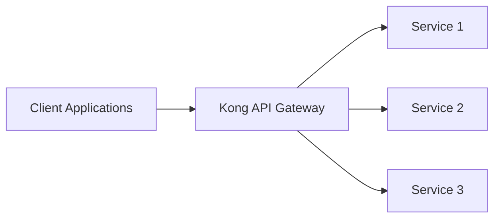
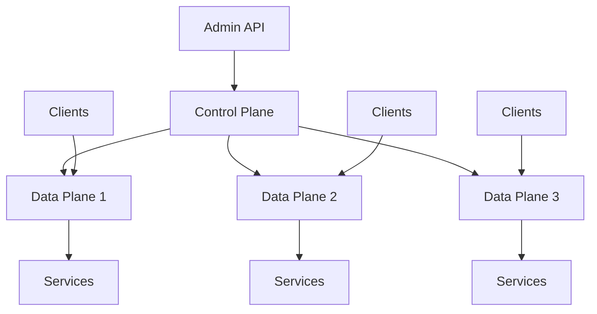

# Kong Terminology

## Introduction

Welcome to our guide on Kong terminology! [Kong](https://konghq.com) is a popular open-source API gateway and microservices management layer that helps you control, secure, and monitor your APIs. As you begin your journey with Kong, understanding its specific terminology is crucial for effective implementation and usage.

This guide breaks down the essential terms and concepts used in the Kong ecosystem, providing clear explanations and practical examples to help beginners navigate the world of API management with confidence.

## Core Kong Concepts

### API Gateway

An API Gateway serves as the entry point for all client requests to your backend services. It routes requests to the appropriate service, handles authentication, rate limiting, and can transform requests and responses.



In this architecture, Kong acts as the API Gateway that manages traffic between clients and your services.

### Node

A **Node** refers to a single Kong instance. You can run multiple Kong nodes to create a clustered deployment for high availability and load balancing.

### Service

A **Service** in Kong represents a backend API or microservice that Kong forwards traffic to. It's essentially an abstraction of your upstream services.

```js
// Example: Creating a Service with Kong Admin API
// POST /services
{
  "name": "user-service",
  "url": "http://user-api.example.com"
}
```

Once created, this service is available in Kong but not yet accessible to clients until you create a Route.

### Route

A **Route** defines how client requests are sent to Services. Routes are matched based on protocols, hosts, paths, and methods. Each Route is associated with a Service.

```js
// Example: Creating a Route with Kong Admin API
// POST /routes
{
  "name": "user-route",
  "service": { "id": "7fca61eb-9c54-4d71-a6ab-b8088e1d98cb" },
  "paths": ["/users"],
  "methods": ["GET", "POST"]
}
```

This example route will direct all GET and POST requests to `/users` to the user service.

### Consumer

A **Consumer** represents a user or application that makes requests to your Kong-proxied APIs. Consumers are primarily used for authentication, authorization, and rate limiting.

```js
// Example: Creating a Consumer
// POST /consumers
{
  "username": "mobile-app",
  "custom_id": "mobile-app-v1"
}
```

### Plugin

**Plugins** extend Kong's functionality. They can be configured globally, for specific Services, Routes, or Consumers. Kong offers plugins for authentication, logging, rate limiting, transformations, and more.

```js
// Example: Adding a rate limiting plugin to a Service
// POST /services/{service_id}/plugins
{
  "name": "rate-limiting",
  "config": {
    "second": 5,
    "hour": 1000
  }
}
```

This example limits requests to 5 per second and 1000 per hour for the specified service.

## Kong Gateway Deployment Models

### Kong Gateway

**Kong Gateway** is the core product that includes the API gateway functionality. It's available in both open-source (Kong Gateway OSS) and enterprise editions.

### Kong Mesh

**Kong Mesh** is a service mesh that builds on top of Kong Gateway to provide enhanced service-to-service communication capabilities, including mTLS, observability, and traffic control patterns.

### Control Plane vs. Data Plane

In distributed Kong deployments, the architecture is split into:

- **Control Plane**: Handles administrative tasks and configuration
- **Data Plane**: Processes API traffic



## Kong Admin Interface Components

### Admin API

The **Admin API** is a RESTful interface used to configure and manage Kong. It lets you create and manage Services, Routes, Consumers, and Plugins.

### Kong Manager

**Kong Manager** is a web-based GUI for the Admin API, available in Kong Enterprise, that simplifies Kong administration.

### decK

**decK** is a command-line tool for declarative configuration management of Kong. It allows you to backup, restore, and synchronize Kong configurations.

```bash
# Example: Export Kong configuration
$ deck dump

# Example: Sync configuration from a file
$ deck sync --state kong.yaml
```

## Advanced Kong Terminology

### Upstreams and Targets

**Upstreams** represent virtual hostnames that can be used as targets for Services. **Targets** are the actual instances of your backend services.

```js
// Example: Creating an Upstream
// POST /upstreams
{
  "name": "user-service.v2"
}

// Example: Adding Targets to an Upstream
// POST /upstreams/{upstream_id}/targets
{
  "target": "user-service-instance1:8080",
  "weight": 100
}
```

This configuration enables load balancing across multiple targets.

### Workspaces

**Workspaces** (in Kong Enterprise) allow you to segment your Kong cluster and partition entities for different teams or environments.

### Tags

**Tags** help organize and categorize Kong entities, making them easier to find and manage.

```js
// Example: Creating a Service with tags
// POST /services
{
  "name": "payment-service",
  "url": "http://payment-api.example.com",
  "tags": ["payments", "production", "team-finance"]
}
```

## Kong Configuration Formats

### kong.conf

**kong.conf** is the main configuration file for Kong Gateway, containing settings for databases, networking, and plugins.

```
# Example kong.conf snippet
database = postgres
pg_host = 127.0.0.1
pg_port = 5432
pg_database = kong
pg_user = kong
```

### Kong YAML Declarations

Kong configurations can be expressed in YAML format, especially when using tools like decK.

```yaml
# Example Kong YAML configuration
_format_version: "2.1"
services:
- name: user-service
  url: http://user-api.example.com
  routes:
  - name: user-route
    paths:
    - /users
    methods:
    - GET
    - POST
  plugins:
  - name: rate-limiting
    config:
      second: 5
      hour: 1000
```

## Practical Example: Setting Up a Basic API Gateway

Let's walk through a complete example of setting up Kong to proxy requests to a backend API:

1. Start by creating a Service:

```bash
curl -i -X POST http://localhost:8001/services \
  --data "name=product-service" \
  --data "url=http://product-api.example.com"
```

2. Create a Route for the Service:

```bash
curl -i -X POST http://localhost:8001/services/product-service/routes \
  --data "name=products-route" \
  --data "paths[]=/products"
```

3. Add an authentication plugin:

```bash
curl -i -X POST http://localhost:8001/services/product-service/plugins \
  --data "name=key-auth"
```

4. Create a Consumer:

```bash
curl -i -X POST http://localhost:8001/consumers \
  --data "username=mobile-app"
```

5. Provide the Consumer with authentication credentials:

```bash
curl -i -X POST http://localhost:8001/consumers/mobile-app/key-auth \
  --data "key=your-secret-key"
```

Now, clients can access your product API through Kong at `/products` using the provided key:

```bash
curl -i http://localhost:8000/products \
  -H "apikey: your-secret-key"
```

Without the key, Kong will return a 401 Unauthorized error.

## Summary

Kong's terminology might seem overwhelming at first, but understanding these core concepts is essential for effectively managing your API gateway:

- **Services** define your backend APIs
- **Routes** determine how requests reach your Services
- **Consumers** represent your API clients
- **Plugins** add functionality like security, monitoring, and transformations
- **Admin API** configures all of the above

As you grow more comfortable with Kong, you'll encounter more advanced concepts like Upstreams, Targets, and hybrid deployment models. The good news is that once you master the core terminology, these advanced topics become much easier to understand.

## Additional Resources

Here are some exercises to reinforce your understanding of Kong terminology:

1. **Practice Exercise**: Set up a Kong Gateway locally and create a Service, Route, and basic authentication Plugin.

2. **Challenge**: Configure rate limiting for a specific Consumer that differs from your global rate limiting.

3. **Advanced Exercise**: Create an Upstream with multiple Targets to load balance traffic to different instances of the same service.

For official documentation and further learning:

- Kong Documentation (https://docs.konghq.com)
- Kong University (https://university.konghq.com)
- Kong GitHub Repository (https://github.com/Kong/kong)