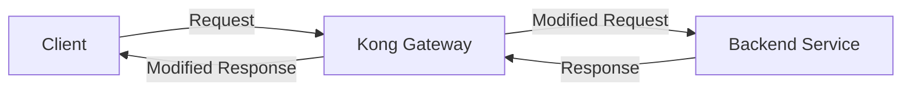
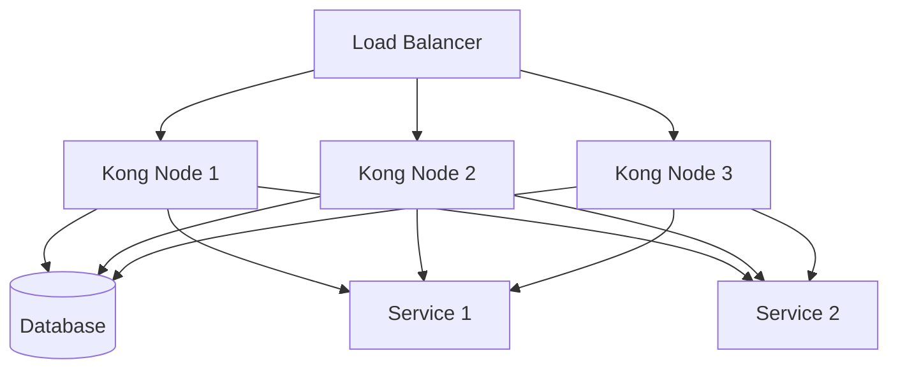

# Kong Components

## Introduction

Kong is a popular open-source API gateway that helps manage, secure, and extend your APIs and microservices. At its core, Kong functions as a middleware that sits between your clients and your services, handling tasks like authentication, rate limiting, and request transformation. Understanding Kong's components is essential for effectively implementing and managing API infrastructures.

In this guide, we'll explore the fundamental components that make up Kong and how they work together to create a robust API management system.

## Core Components of Kong

Kong's architecture is built around several key components that provide its functionality:

### 1. Kong Gateway

The Kong Gateway is the main engine that processes API requests. It's a lightweight, fast, and scalable proxy built on top of NGINX that intercepts incoming requests, applies configured plugins, and routes them to appropriate backend services.



The Kong Gateway handles the core request processing pipeline, including:

- Request routing
- Plugin execution
- Proxying requests to upstream services
- Response handling

### 2. Kong Database (Optional)

Kong can operate in two modes:

- **DB-less mode**: Configuration is declared in YAML files
- **DB mode**: Configuration is stored in a database

When using DB mode, Kong supports PostgreSQL or Cassandra as its datastore. The database stores:

- Service configurations
- Route definitions
- Consumer information
- Plugin configurations

For small deployments or when using Kong as part of a GitOps workflow, DB-less mode can be simpler to manage.

### 3. Kong Admin API

The Admin API provides a RESTful interface to configure and manage Kong. Through this API, you can:

- Create and manage services
- Define routes
- Configure plugins
- Manage consumers
- Monitor the health of your Kong instances

Here's a simple example of using the Admin API to create a new service:

```bash
# Creating a new service via the Admin API
curl -X POST http://localhost:8001/services \
  --data "name=example-service" \
  --data "url=http://example.com"

# Expected output:
# {
#   "id": "2b47ba9b-761a-492d-9a3c-9ee2cf3a645a",
#   "name": "example-service",
#   "host": "example.com",
#   "path": null,
#   "port": 80,
#   "protocol": "http",
#   ...
# }
```

### 4. Kong Manager (Enterprise)

Kong Manager is a graphical user interface available in the Enterprise edition that makes it easier to configure and manage Kong. It provides a visual way to:

- Monitor API traffic
- Configure services and routes
- Manage plugins
- Control access

### 5. Services and Routes

Services and Routes are fundamental entities in Kong:

**Services** represent your upstream APIs or microservices. A Service in Kong includes:

- A name
- A URL (protocol, host, port, path)
- Connection timeouts
- Read timeouts

**Routes** define how requests are sent to Services. A Route includes:
- Paths
- Hosts
- Methods
- Headers (optional)
- Protocols

Each Route is associated with a Service, and a Service can have multiple Routes.

```javascript
// Example of defining a Service and Route in declarative config (YAML)
// services.yaml
services:
- name: user-service
  url: http://user-api.internal:8000
  routes:
  - name: user-routes
    paths:
    - /users
    - /accounts
    methods:
    - GET
    - POST
```

### 6. Plugins

Plugins extend Kong's functionality. They can be configured globally, per service, per route, or per consumer, allowing for granular control over your API gateway behavior.

Popular plugins include:

- **Authentication**: Key Authentication, JWT, OAuth2
- **Security**: ACL, IP Restriction, CORS
- **Traffic Control**: Rate Limiting, Request Termination
- **Transformations**: Request/Response Transformer
- **Logging and Monitoring**: HTTP Log, Prometheus, Datadog

Example of adding a rate limiting plugin to a service:

```bash
# Adding a rate-limiting plugin to a service
curl -X POST http://localhost:8001/services/example-service/plugins \
  --data "name=rate-limiting" \
  --data "config.minute=100" \
  --data "config.policy=local"

# Expected output:
# {
#   "id": "ec1a1f6f-2aa4-4e58-93ff-b56368f19b27",
#   "name": "rate-limiting",
#   "service": { "id": "2b47ba9b-761a-492d-9a3c-9ee2cf3a645a" },
#   "route": null,
#   "consumer": null,
#   "config": { "minute": 100, "policy": "local" },
#   ...
# }
```

### 7. Consumers

Consumers represent the users of your API. They are used for:

- Authentication
- Rate limiting
- Access control
- Tracking API usage

Consumers can be associated with credentials for various authentication plugins.

```bash
# Creating a consumer
curl -X POST http://localhost:8001/consumers \
  --data "username=user123"

# Expected output:
# {
#   "id": "876bf719-8f18-4ce5-cc9f-5b5af6c36007",
#   "username": "user123",
#   "custom_id": null,
#   ...
# }

# Adding key-auth credentials to a consumer
curl -X POST http://localhost:8001/consumers/user123/key-auth \
  --data "key=apikey123"

# Expected output:
# {
#   "id": "17ab4e95-9598-424f-a99a-ffa9f413a821",
#   "created_at": 1627984584,
#   "key": "apikey123",
#   "consumer": { "id": "876bf719-8f18-4ce5-cc9f-5b5af6c36007" }
# }
```

### 8. Upstreams and Targets

Upstreams and Targets provide load balancing functionality in Kong:

**Upstreams** define a virtual hostname that can be used in a Service's `host` field.

**Targets** are the actual servers associated with an Upstream, including:
- Address (host/port)
- Weight (for load balancing)

Example configuration:

```bash
# Create an upstream
curl -X POST http://localhost:8001/upstreams \
  --data "name=app-upstream"

# Add targets to the upstream
curl -X POST http://localhost:8001/upstreams/app-upstream/targets \
  --data "target=service1.local:8000" \
  --data "weight=100"

curl -X POST http://localhost:8001/upstreams/app-upstream/targets \
  --data "target=service2.local:8000" \
  --data "weight=50"
```

In this example, `service1` will receive about twice as many requests as `service2` due to the weight difference.

## Real-world Example: API Gateway Setup

Let's walk through a practical example of setting up a basic API gateway with Kong:

1. First, we'll create a service for our backend API:

```bash
curl -X POST http://localhost:8001/services \
  --data "name=product-api" \
  --data "url=http://product-service:3000/api"
```

2. Next, we'll add a route to expose this service:

```bash
curl -X POST http://localhost:8001/services/product-api/routes \
  --data "name=product-route" \
  --data "paths[]=/products" \
  --data "methods[]=GET" \
  --data "methods[]=POST"
```

3. Add an authentication plugin:

```bash
curl -X POST http://localhost:8001/services/product-api/plugins \
  --data "name=key-auth"
```

4. Create a consumer and provide API key credentials:

```bash
curl -X POST http://localhost:8001/consumers \
  --data "username=mobile-app"

curl -X POST http://localhost:8001/consumers/mobile-app/key-auth \
  --data "key=MOBILE_APP_SECRET_KEY"
```

5. Add rate limiting:

```bash
curl -X POST http://localhost:8001/services/product-api/plugins \
  --data "name=rate-limiting" \
  --data "config.minute=60" \
  --data "config.hour=1000"
```

Now, your API gateway is set up to:
- Proxy requests to your product service
- Require API key authentication
- Limit requests to 60 per minute and 1000 per hour

To use the API, clients would make requests like:

```bash
curl -X GET http://kong-gateway:8000/products \
  -H "apikey: MOBILE_APP_SECRET_KEY"
```

## Advanced Features

Kong's components work together to provide several advanced features:

### Health Checks

Kong can actively monitor the health of your upstream services:

```bash
curl -X POST http://localhost:8001/upstreams/app-upstream \
  --data "name=app-upstream" \
  --data "healthchecks.active.http_path=/health" \
  --data "healthchecks.active.healthy.interval=5" \
  --data "healthchecks.active.unhealthy.interval=2"
```

### Plugin Development

Kong allows you to develop custom plugins to extend its functionality:

```lua
-- Example of a simple custom plugin in Lua
local CustomPlugin = {
  VERSION = "1.0.0",
  PRIORITY = 1000,
}

function CustomPlugin:access(config)
  -- Add a custom header to the request
  kong.service.request.set_header("X-Custom-Header", "Custom Value")
end

return CustomPlugin
```

### Clustering

Kong's components can be deployed in a clustered architecture for high availability:



## Summary

Kong's components form a powerful and flexible API gateway system:

- **Kong Gateway** processes API requests
- **Database** (optional) stores configuration
- **Admin API** provides a management interface
- **Services and Routes** define your API endpoints
- **Plugins** extend functionality
- **Consumers** represent API users
- **Upstreams and Targets** provide load balancing

Understanding these components enables you to build scalable and secure API architectures. Kong's modular design allows you to start simple and gradually add complexity as your needs evolve.

## Additional Resources

- Practice implementing these components in a test environment
- Try creating a multi-service gateway with different authentication methods
- Explore custom plugin development
- Experiment with Kong's clustering capabilities

## Exercises

1. Set up a basic Kong gateway with two services and appropriate routes
2. Configure different authentication plugins for different routes
3. Implement rate limiting and monitor the effects
4. Create a load-balanced upstream with multiple targets
5. Develop a simple custom plugin to modify request headers