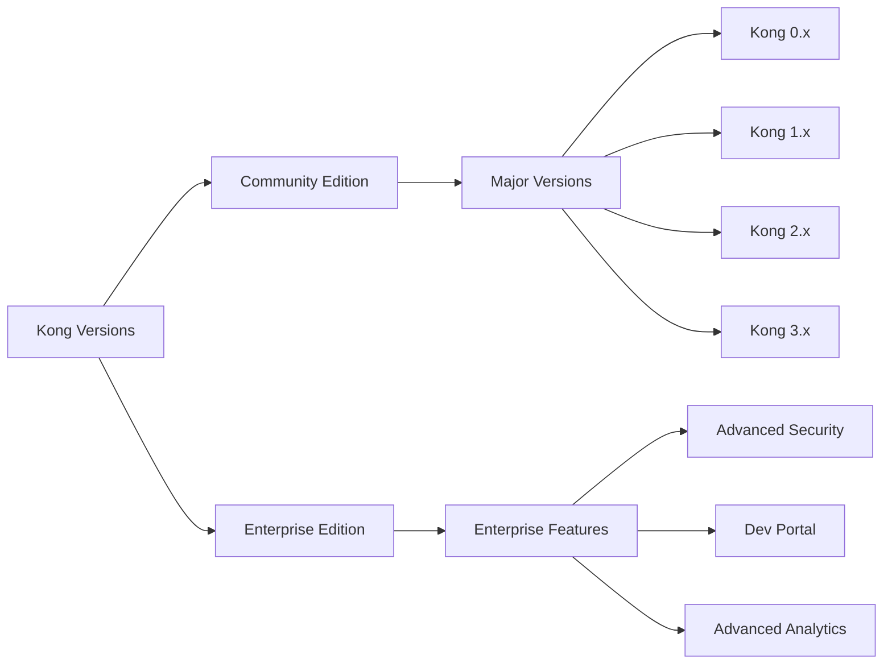

# Kong Versions

## Introduction

Kong is a popular open-source API gateway and microservices management layer that helps you control, secure, and observe your APIs and microservices. Like any actively maintained software, Kong has evolved through multiple versions, each introducing new features, improvements, and sometimes changes in architecture or functionality.

In this guide, we'll explore Kong's versioning system, understand the differences between major releases, and help you make informed decisions about which version to use for your projects.

## Kong Versioning Overview

Kong follows semantic versioning (SemVer) with the format `MAJOR.MINOR.PATCH`:

- **MAJOR**: Increments when incompatible API changes are made
- **MINOR**: Increments when functionality is added in a backward-compatible manner
- **PATCH**: Increments when backward-compatible bug fixes are implemented



## Kong Community vs. Enterprise Editions

Kong is available in two primary editions:

### Kong Community Edition (CE)

The open-source version of Kong that provides core API gateway functionality:

- Free to use under the Apache 2.0 license
- Community-supported
- Basic features for routing, authentication, and rate limiting
- Suitable for many production deployments

### Kong Enterprise Edition (EE)

The commercial offering with enhanced features:

- Paid subscription with support
- Advanced security features
- Developer portal
- Role-based access control
- Enhanced monitoring and analytics

## Major Kong Versions

Let's look at the significant changes between major Kong versions:

### Kong 0.x (Legacy)

The initial series of Kong releases that established its core functionality:

- Basic routing capabilities
- Plugin architecture
- Simple configuration via APIs

### Kong 1.x

Introduced several architectural improvements:

- New DB-less mode for running without a database
- Declarative configuration with `kong.conf`
- Enhanced plugin development framework
- Improved performance

### Kong 2.x

Focused on decoupling components and enhancing flexibility:

- Introduction of Kong Gateway and Kong Konnect
- Hybrid deployment mode
- Enhanced plugin management
- Improved clustering

### Kong 3.x

The latest major version with significant architectural changes:

- New expression-based routing
- Enhanced security features
- Improved performance and scalability
- More plugin ecosystem integrations

## Choosing the Right Kong Version

When selecting a Kong version for your project, consider these factors:

1. **Stability requirements**: Newer versions have more features but may have fewer real-world deployments
2. **Feature needs**: Check if the specific features you need are available in the version
3. **Plugin compatibility**: Ensure the plugins you need are supported
4. **Deployment environment**: Some versions have better support for specific environments (Kubernetes, cloud, etc.)
5. **Upgrade path**: Consider the effort required to upgrade as your application evolves

## Practical Example: Installing Different Kong Versions

Let's look at how to install different Kong versions:

### Installing Kong 2.x Using Docker

```bash
# Pull the specific Kong version
docker pull kong:2.8.1

# Run Kong container
docker run -d --name kong \
  -e "KONG_DATABASE=off" \
  -e "KONG_PROXY_ACCESS_LOG=/dev/stdout" \
  -e "KONG_ADMIN_ACCESS_LOG=/dev/stdout" \
  -e "KONG_PROXY_ERROR_LOG=/dev/stderr" \
  -e "KONG_ADMIN_ERROR_LOG=/dev/stderr" \
  -e "KONG_ADMIN_LISTEN=0.0.0.0:8001, 0.0.0.0:8444 ssl" \
  -p 8000:8000 \
  -p 8443:8443 \
  -p 8001:8001 \
  -p 8444:8444 \
  kong:2.8.1
```

### Installing Kong 3.x Using Docker

```bash
# Pull the specific Kong version
docker pull kong:3.2.2

# Run Kong container
docker run -d --name kong \
  -e "KONG_DATABASE=off" \
  -e "KONG_PROXY_ACCESS_LOG=/dev/stdout" \
  -e "KONG_ADMIN_ACCESS_LOG=/dev/stdout" \
  -e "KONG_PROXY_ERROR_LOG=/dev/stderr" \
  -e "KONG_ADMIN_ERROR_LOG=/dev/stderr" \
  -e "KONG_ADMIN_LISTEN=0.0.0.0:8001, 0.0.0.0:8444 ssl" \
  -p 8000:8000 \
  -p 8443:8443 \
  -p 8001:8001 \
  -p 8444:8444 \
  kong:3.2.2
```

## Version-Specific Configuration Examples

Different Kong versions may have different configuration approaches. Here are examples for two major versions:

### Kong 2.x Declarative Configuration (kong.yml)

```yaml
_format_version: "2.1"
_transform: true

services:
  - name: example-service
    url: http://example.com
    routes:
      - name: example-route
        paths:
          - /example
    plugins:
      - name: rate-limiting
        config:
          minute: 5
          policy: local
```

### Kong 3.x Declarative Configuration (kong.yml)

```yaml
_format_version: "3.0"

services:
  - name: example-service
    url: http://example.com
    routes:
      - name: example-route
        paths:
          - /example
    plugins:
      - name: rate-limiting
        config:
          minute: 5
          policy: local
```

## Version Compatibility Considerations

When working with Kong, it's important to consider compatibility between:

1. **Kong and its plugins**: Some plugins may not be compatible with all Kong versions
2. **Kong and the database**: Different Kong versions support different database versions
3. **Kong and the operating system**: OS requirements may vary between versions

## Upgrade Strategies

When upgrading Kong, consider these approaches:

### In-place Upgrade

Suitable for minor version upgrades:

```bash
# Example upgrade steps for Debian/Ubuntu
$ sudo apt update
$ sudo apt upgrade kong
```

### Blue-Green Deployment

Safer for major version upgrades:

1. Deploy new Kong version alongside existing version
2. Test thoroughly in the new environment
3. Gradually shift traffic to the new version
4. Monitor for any issues
5. Decommission old version once stable

## Summary

Understanding Kong versions is essential for building and maintaining reliable API infrastructure. Each version brings improvements, but may also introduce changes that require planning. The right choice depends on your specific requirements, existing infrastructure, and future growth plans.

Key takeaways:
- Kong follows semantic versioning with Community and Enterprise editions
- Major versions (0.x, 1.x, 2.x, 3.x) introduce significant architectural changes
- Consider stability, features, plugin compatibility, and upgrade paths when choosing a version
- Use appropriate installation and configuration methods for your selected version
- Plan upgrades carefully to minimize disruption to your services

## Additional Resources

- [Kong Official Documentation](https://docs.konghq.com/)
- [Kong GitHub Repository](https://github.com/Kong/kong)
- [Kong Forums](https://discuss.konghq.com/)

## Exercises

1. Set up Kong 2.x and Kong 3.x in separate Docker containers and compare their admin APIs.
2. Create a simple API proxy in both Kong 2.x and 3.x and compare the configuration differences.
3. Research which plugins are available in different Kong versions and identify any that were deprecated or added.
4. Design an upgrade strategy for moving from Kong 2.x to Kong 3.x for a fictional company with 50 microservices.