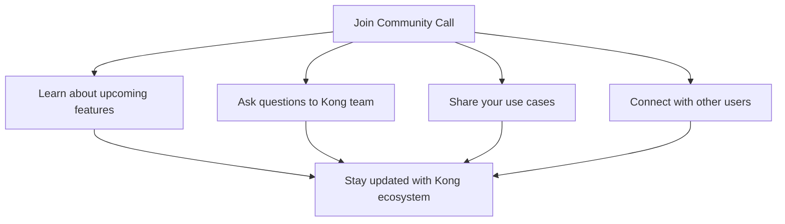
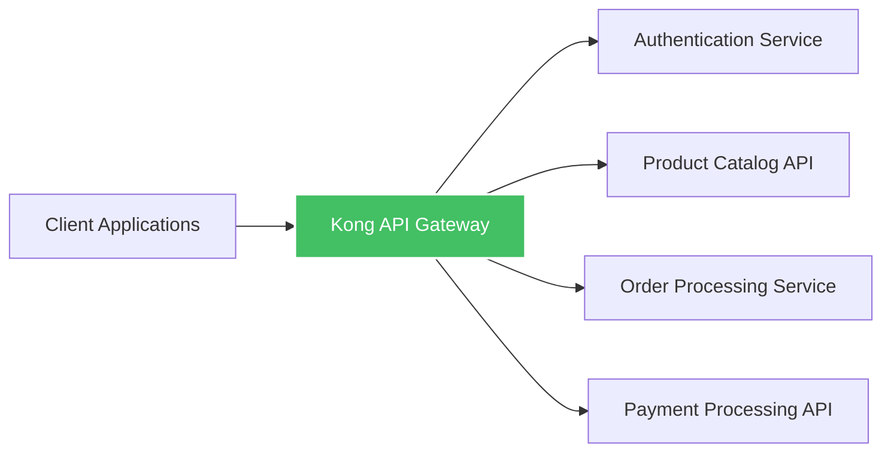

# Kong Community

## Introduction

The Kong Community is a vibrant ecosystem of developers, contributors, and users centered around Kong, the world's most popular open-source API gateway and microservices management layer. As a beginner, understanding how to engage with the Kong Community can significantly accelerate your learning journey and provide valuable resources for your projects.

Kong's community-driven approach has been fundamental to its growth and success. Whether you're looking to solve a technical problem, contribute code, or simply learn more about API management, the Kong Community offers multiple avenues for engagement and collaboration.

## Community Resources

### Official Channels

Kong's community is spread across several official platforms, each serving different purposes:

#### Kong Nation Forum

Kong Nation is the official community forum where users can ask questions, share knowledge, and discuss best practices.

```javascript
// Example: Using the Kong community forum to get help
// URL: https://discuss.konghq.com

// Common categories on Kong Nation:
// - Announcements
// - Kong Gateway
// - Kong Mesh
// - Plugins
// - Deployment
// - API Development
```

#### GitHub Repositories

Kong's source code and documentation are hosted on GitHub, where you can explore the codebase, report issues, and contribute to the project.

```bash
# Clone the Kong Gateway repository
git clone https://github.com/Kong/kong.git

# Navigate to the repository
cd kong

# View issues and pull requests
# This is where the community collaboratively improves Kong
```

#### Slack Community

The Kong Slack workspace is perfect for real-time discussions with Kong team members and other users.

```
Channels to join in Kong Slack:
#general - General Kong discussions
#help - Get help with Kong-related issues
#plugins - Discussions about Kong plugins
#contribute - Collaboration on Kong contributions
```

### Community Calls

Kong hosts regular community calls that allow users to learn about new features, roadmaps, and engage directly with the Kong team.



## Getting Involved

### How to Ask for Help

When seeking assistance from the Kong Community, following these best practices will help you get better responses:

```markdown
# Effective help request template

## Problem Description
[Clear description of what you're trying to accomplish]

## Environment
- Kong version: x.y.z
- Platform: Docker/Kubernetes/VM
- Operating System: Linux/macOS/Windows

## What I've Tried
[Steps you've already taken]

## Error Messages/Logs
```

### Contributing to Kong

The Kong project welcomes contributions of all kinds, from code to documentation.

```bash
# Basic workflow for contributing to Kong

# 1. Fork the repository on GitHub

# 2. Clone your fork
git clone https://github.com/YOUR_USERNAME/kong.git

# 3. Create a branch for your feature
git checkout -b feature/my-new-feature

# 4. Make your changes and commit them
git commit -am 'Add some feature'

# 5. Push to your branch
git push origin feature/my-new-feature

# 6. Create a new Pull Request on GitHub
```

### Plugin Development

One of the most common ways to contribute to the Kong ecosystem is by developing plugins.

```lua
-- Example: Basic structure of a Kong plugin

-- kong/plugins/my-custom-plugin/handler.lua
local BasePlugin = require "kong.plugins.base_plugin"
local CustomHandler = BasePlugin:extend()

function CustomHandler:new()
  CustomHandler.super.new(self, "my-custom-plugin")
end

function CustomHandler:access(config)
  CustomHandler.super.access(self)
  
  -- Plugin logic goes here
  kong.log.debug("Hello from my custom plugin!")
end

return CustomHandler
```

## Community Events

### Kong Summit

Kong Summit is the annual conference dedicated to API management, microservices, and Kong-related technologies.

```
Typical Kong Summit Schedule:
- Keynotes from Kong leadership
- Technical deep dives
- User case studies
- Hands-on workshops
- Networking opportunities
```

### Meetups and Local Groups

Many cities have Kong user groups that meet regularly to discuss experiences and share knowledge.

```javascript
// Finding Kong meetups in your area
// Visit: https://www.meetup.com/topics/kong/
// or check the Kong events page

// Starting your own Kong meetup:
// 1. Reach out to Kong for support materials
// 2. Find a venue for your first meeting
// 3. Prepare a discussion topic or demo
// 4. Promote your meetup in Kong Nation and local dev communities
```

## Success Stories

The Kong Community includes users from various industries who have successfully implemented Kong in their architecture.

### Case Study: E-commerce Platform



This e-commerce company used Kong to:
- Standardize API security across services
- Implement rate limiting to prevent abuse
- Collect analytics on API usage
- Simplify service discovery

## Community-Maintained Resources

The Kong Community has created various tools and libraries that extend Kong's functionality:

```javascript
// Example community projects:

// 1. Kong plugin templates
// https://github.com/Kong/kong-plugin

// 2. Kong Kubernetes tools
// https://github.com/Kong/kubernetes-ingress-controller

// 3. Community-maintained Docker images
// Various optimized Kong configurations on Docker Hub
```

## Getting Recognition

Kong acknowledges active community members through various programs:

- **Kong Champions**: Recognized experts in Kong who share knowledge and advocate for the platform
- **Kong Contributors**: Those who regularly contribute code, documentation, or help others

## Summary

The Kong Community is a powerful resource for beginners and experienced developers alike. By engaging with the community, you can:

1. Get help with Kong implementation challenges
2. Learn best practices from experienced users
3. Contribute to an impactful open-source project
4. Network with API and microservices experts
5. Stay updated on the latest developments in the API management space

## Additional Resources

- **Kong Documentation**: Comprehensive guides and references
- **Kong University**: Free online courses for learning Kong
- **Kong Blog**: Latest news and technical articles
- **Kong YouTube Channel**: Tutorials and recorded talks

## Exercises

1. Join Kong Nation and introduce yourself in the New Members category
2. Explore the Kong GitHub repository and find an issue labeled "good first issue"
3. Set up a local Kong instance and share your experience on Kong Nation
4. Attend a Kong Community Call and ask a question
5. Try extending Kong with a simple custom plugin