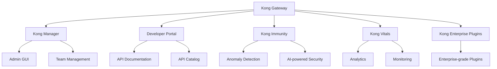
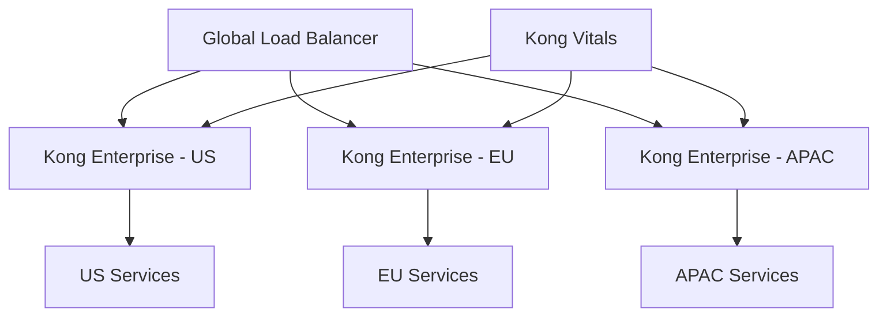
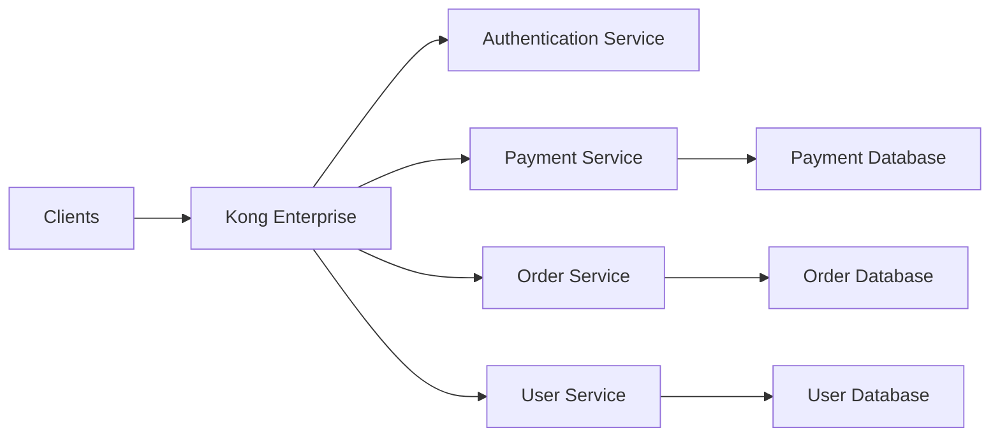
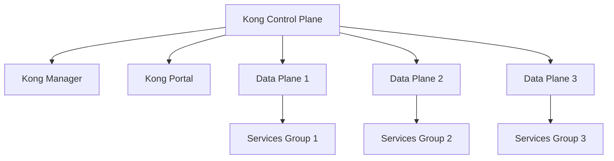

# Kong Enterprise

## Introduction

Kong Enterprise is a robust, commercial API management platform built on top of the open-source Kong Gateway. It provides advanced features for managing, securing, and monitoring APIs in enterprise environments. As organizations adopt microservices architectures and develop more APIs, Kong Enterprise offers the tools necessary to manage this complexity at scale.

In this guide, we'll explore the core concepts of Kong Enterprise, its key features, and how it extends the capabilities of the open-source Kong Gateway to meet enterprise requirements.

## What is Kong Enterprise?

Kong Enterprise is a comprehensive API management platform that helps organizations secure, govern, and analyze their APIs. It's built on top of the open-source Kong Gateway (previously known as Kong API Gateway), adding enterprise-grade features such as:

- Advanced security capabilities
- Developer portal for API documentation
- Team management and role-based access control
- Advanced analytics and monitoring
- Enterprise support

## Key Components of Kong Enterprise

Kong Enterprise consists of several key components:



### 1. Kong Gateway

At the core of Kong Enterprise is the Kong Gateway, which handles all API traffic. It's responsible for routing requests, enforcing policies, and applying transformations.

### 2. Kong Manager

Kong Manager is the administrative GUI that allows teams to manage and configure Kong Enterprise. It provides a user-friendly interface for:

- Configuring services and routes
- Managing plugins
- Monitoring API traffic
- Managing teams and users

### 3. Developer Portal

The Developer Portal is a customizable platform where organizations can publish their APIs for consumption by internal or external developers. Features include:

- Interactive API documentation
- API testing tools
- Application registration
- API versioning

### 4. Kong Vitals

Kong Vitals provides real-time analytics and monitoring capabilities, allowing teams to:

- Track API performance
- Monitor usage patterns
- Identify bottlenecks
- Set up alerts

### 5. Kong Immunity

Kong Immunity uses artificial intelligence and machine learning to:

- Detect anomalies in API traffic
- Identify potential security threats
- Automatically respond to incidents

## Kong Enterprise vs. Kong Gateway (Open Source)

To understand Kong Enterprise better, let's compare it with the open-source Kong Gateway:

| Feature | Kong Gateway (Open Source) | Kong Enterprise |
|---------|----------------------------|----------------|
| Core API Gateway Functionality | ✓ | ✓ |
| Basic Plugins | ✓ | ✓ |
| Admin API | ✓ | ✓ |
| Kong Manager (GUI) | ✗ | ✓ |
| Developer Portal | ✗ | ✓ |
| Role-Based Access Control | ✗ | ✓ |
| Enterprise Plugins | ✗ | ✓ |
| Kong Vitals (Advanced Analytics) | ✗ | ✓ |
| Kong Immunity (AI-powered security) | ✗ | ✓ |
| Enterprise Support | ✗ | ✓ |

## Getting Started with Kong Enterprise

Let's go through a basic example of setting up Kong Enterprise in a development environment.

### Prerequisites

Before you begin, you'll need:

- Docker and Docker Compose
- A Kong Enterprise license (you can request a free trial from Kong's website)
- Basic understanding of APIs and microservices

### Installation with Docker

Here's a step-by-step guide to set up Kong Enterprise with Docker:

1. Create a `docker-compose.yml` file:

```yaml
version: '3.7'

services:
  kong-database:
    image: postgres:13
    container_name: kong-database
    environment:
      POSTGRES_USER: kong
      POSTGRES_DB: kong
      POSTGRES_PASSWORD: kong
    ports:
      - "5432:5432"
    healthcheck:
      test: ["CMD", "pg_isready", "-U", "kong"]
      interval: 5s
      timeout: 5s
      retries: 5

  kong-migrations:
    image: kong/kong-gateway:3.0.0.0-enterprise
    command: "kong migrations bootstrap"
    depends_on:
      - kong-database
    environment:
      KONG_DATABASE: postgres
      KONG_PG_HOST: kong-database
      KONG_PG_USER: kong
      KONG_PG_PASSWORD: kong
      KONG_LICENSE_DATA: ${KONG_LICENSE_DATA}

  kong:
    image: kong/kong-gateway:3.0.0.0-enterprise
    container_name: kong
    depends_on:
      - kong-database
      - kong-migrations
    environment:
      KONG_DATABASE: postgres
      KONG_PG_HOST: kong-database
      KONG_PG_USER: kong
      KONG_PG_PASSWORD: kong
      KONG_PROXY_ACCESS_LOG: /dev/stdout
      KONG_ADMIN_ACCESS_LOG: /dev/stdout
      KONG_PROXY_ERROR_LOG: /dev/stderr
      KONG_ADMIN_ERROR_LOG: /dev/stderr
      KONG_ADMIN_LISTEN: 0.0.0.0:8001
      KONG_ADMIN_GUI_URL: http://localhost:8002
      KONG_PORTAL: on
      KONG_PORTAL_GUI_HOST: localhost:8003
      KONG_LICENSE_DATA: ${KONG_LICENSE_DATA}
    ports:
      - "8000:8000" # Proxy
      - "8443:8443" # Proxy SSL
      - "8001:8001" # Admin API
      - "8444:8444" # Admin API SSL
      - "8002:8002" # Kong Manager
      - "8445:8445" # Kong Manager SSL
      - "8003:8003" # Dev Portal
      - "8446:8446" # Dev Portal SSL
```

2. Export your Kong Enterprise license as an environment variable:

```bash
export KONG_LICENSE_DATA='{"license":{"payload":{"admin_seats":"5","customer":"Example Company","dataplanes":"5","license_creation_date":"2023-01-01","license_expiration_date":"2024-01-01","license_key":"00141000000000000000000000000000","product_subscription":"Kong Enterprise Edition","support_plan":"None"},"signature":"example_signature_here","version":"1"}}'
```

3. Start Kong Enterprise:

```bash
docker-compose up -d
```

4. Verify the installation by accessing Kong Manager at `http://localhost:8002`

### Creating Your First Service and Route

Let's create a service and a route to a mock API:

1. Create a Service:

```bash
curl -X POST http://localhost:8001/services \
  --data name=example-service \
  --data url=https://mockbin.org
```

This will output something like:

```json
{
  "id": "a5a3108f-c654-4d83-8d12-9f0be773646d",
  "name": "example-service",
  "protocol": "https",
  "host": "mockbin.org",
  "port": 443,
  "path": null,
  "created_at": 1646757242,
  "updated_at": 1646757242,
  "retries": 5,
  "connect_timeout": 60000,
  "write_timeout": 60000,
  "read_timeout": 60000
}
```

2. Create a Route:

```bash
curl -X POST http://localhost:8001/services/example-service/routes \
  --data name=example-route \
  --data paths[]=/example
```

This will output:

```json
{
  "id": "d9535eda-653b-4806-8cb6-5f0b0c2643f6",
  "name": "example-route",
  "protocols": ["http", "https"],
  "methods": null,
  "hosts": null,
  "paths": ["/example"],
  "https_redirect_status_code": 426,
  "regex_priority": 0,
  "strip_path": true,
  "preserve_host": false,
  "tags": null,
  "service": {
    "id": "a5a3108f-c654-4d83-8d12-9f0be773646d"
  },
  "created_at": 1646757298,
  "updated_at": 1646757298
}
```

3. Test the Route:

```bash
curl -i http://localhost:8000/example
```

You should receive a response from mockbin.org.

## Advanced Features

### Implementing Rate Limiting

Let's add rate limiting to our API to prevent abuse:

```bash
curl -X POST http://localhost:8001/services/example-service/plugins \
  --data name=rate-limiting \
  --data config.minute=5 \
  --data config.policy=local
```

This configures our service to allow only 5 requests per minute. Let's test it:

```bash
for i in {1..10}; do
  curl -i http://localhost:8000/example
  echo ""
done
```

After the 5th request, you'll see responses with status code 429 (Too Many Requests).

### Setting Up the Developer Portal

Kong Enterprise's Developer Portal allows you to publish your APIs for developers. Here's how to set it up:

1. Enable the Developer Portal if not already enabled:

```bash
curl -X PATCH http://localhost:8001/workspaces/default \
  --data config.portal=true
```

2. Create a Developer Portal file:

```bash
curl -X POST http://localhost:8001/files \
  --data type=spec \
  --data contents='{"openapi":"3.0.0","info":{"title":"Example API","version":"1.0.0","description":"This is an example API"},"paths":{"/example":{"get":{"summary":"Example endpoint","responses":{"200":{"description":"OK"}}}}}}'
```

3. Visit the Developer Portal at `http://localhost:8003`

### Implementing Authentication

Kong Enterprise offers various authentication plugins. Let's add key authentication:

1. Enable the key-auth plugin:

```bash
curl -X POST http://localhost:8001/services/example-service/plugins \
  --data name=key-auth \
  --data config.key_names=apikey
```

2. Create a consumer:

```bash
curl -X POST http://localhost:8001/consumers \
  --data username=example-user
```

3. Create a key for the consumer:

```bash
curl -X POST http://localhost:8001/consumers/example-user/key-auth \
  --data key=example-key
```

4. Test the authentication:

```bash
# This should fail
curl -i http://localhost:8000/example

# This should succeed
curl -i http://localhost:8000/example?apikey=example-key
```

## Enterprise Plugin Showcase

Kong Enterprise comes with exclusive plugins not available in the open-source version. Let's look at a few important ones:

### OpenID Connect

The OpenID Connect plugin allows you to integrate with identity providers:

```bash
curl -X POST http://localhost:8001/services/example-service/plugins \
  --data name=openid-connect \
  --data config.issuer=https://auth.example.com/.well-known/openid-configuration \
  --data config.client_id=your-client-id \
  --data config.client_secret=your-client-secret \
  --data config.scopes=openid,email,profile
```

### Request Transformer Advanced

This plugin offers enhanced request transformation capabilities:

```bash
curl -X POST http://localhost:8001/services/example-service/plugins \
  --data name=request-transformer-advanced \
  --data config.add.headers=x-enterprise-header:enterprise-value
```

### Canary Release

The Canary Release plugin allows for gradual traffic shifting:

```bash
curl -X POST http://localhost:8001/routes/example-route/plugins \
  --data name=canary \
  --data config.percentage=20 \
  --data config.upstream_host=new-version.example.com \
  --data config.upstream_port=443 \
  --data config.upstream_protocol=https
```

## Best Practices for Kong Enterprise

1. **Use Workspaces**: Organize your APIs by teams or departments using Kong's workspace feature.

```bash
# Create a new workspace
curl -X POST http://localhost:8001/workspaces \
  --data name=team-a
```

2. **Implement RBAC**: Use role-based access control to limit what users can do.

```bash
# Create a role
curl -X POST http://localhost:8001/rbac/roles \
  --data name=api-admin

# Create a user
curl -X POST http://localhost:8001/admins \
  --data username=alice \
  --data email=alice@example.com \
  --data password=secret

# Assign the role to the user
curl -X POST http://localhost:8001/rbac/users/alice/roles \
  --data roles=api-admin
```

3. **Set Up Health Checks**: Ensure your upstream services are monitored.

```bash
curl -X PATCH http://localhost:8001/upstreams/example-upstream \
  --data healthchecks.active.healthy.interval=5 \
  --data healthchecks.active.unhealthy.interval=5
```

4. **Monitor with Kong Vitals**: Keep an eye on your API traffic and performance.

5. **Use Tags**: Organize your Kong entities with tags for easier management.

```bash
curl -X POST http://localhost:8001/services \
  --data name=payment-service \
  --data url=https://payment.example.com \
  --data tags=financial,critical
```

## Real-World Use Cases

### Multi-Region Deployment

For global applications, Kong Enterprise can be deployed across multiple regions:



### Microservices API Gateway

Kong Enterprise serves as an entry point to your microservices architecture:



### Hybrid Deployment

Kong Enterprise supports hybrid deployments with control plane and data planes:



## Summary

Kong Enterprise extends the capabilities of the open-source Kong Gateway with enterprise-grade features essential for organizations managing APIs at scale. Key benefits include:

- Comprehensive API lifecycle management
- Advanced security features
- Developer portal for API documentation and discovery
- Team-based access control
- Advanced analytics and monitoring
- Enterprise support

By leveraging these capabilities, organizations can effectively manage their API ecosystem, ensure security and compliance, and provide a better experience for API consumers.

## Additional Resources

- Official Kong Enterprise Documentation
- Kong Nation Community Forum
- Kong Enterprise API Reference
- Kong University (Training)

## Exercises

1. Install Kong Enterprise using Docker Compose and set up a service and route to a public API.
2. Configure rate limiting and authentication for your API.
3. Set up the Developer Portal with documentation for your API.
4. Implement canary releasing for a service to test a new version.
5. Configure Kong Vitals to monitor your API traffic and set up alerts.