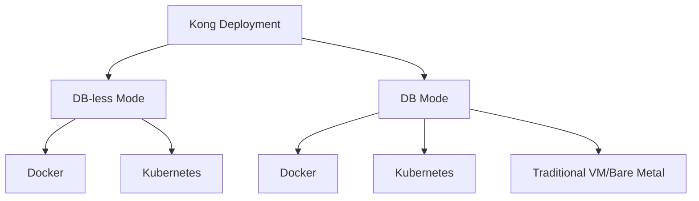
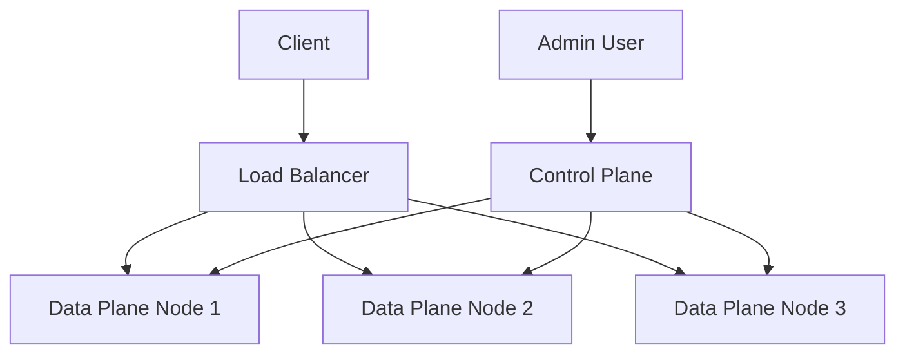

# Kong Deployment

## Introduction

Kong is a popular open-source API Gateway that helps manage, secure, and scale your APIs. This guide will walk you through deploying Kong in various environments, from simple local setups to production-ready configurations in Kubernetes.

Kong's architecture allows it to sit between your clients and your upstream services, acting as a traffic manager for all incoming API requests. Before diving into deployment, it's important to understand that Kong can be deployed in two main modes:

1. **DB-less mode** - Kong stores its configuration in memory from a local file
2. **DB mode** - Kong uses a database (PostgreSQL or Cassandra) to store configuration

Let's explore how to deploy Kong in these different scenarios.

## Prerequisites

Before deploying Kong, ensure you have:

- Basic understanding of API concepts
- Familiarity with command-line operations
- Docker installed (for containerized deployments)
- Kubernetes knowledge (for K8s deployments)

## Kong Deployment Options



## DB-less Mode Deployment

DB-less mode is perfect for simple deployments and CI/CD pipelines where configurations can be version-controlled.

### Local Docker Deployment (DB-less)

Here's how to deploy Kong in DB-less mode using Docker:

```bash
# Create a configuration file
mkdir -p kong/conf
cat > kong/conf/kong.yml << EOF
_format_version: "2.1"
services:
  - name: example-service
    url: http://mockbin.org
    routes:
      - name: example-route
        paths:
          - "/example"
EOF

# Run Kong in DB-less mode
docker run -d --name kong \
  -v "$(pwd)/kong/conf/kong.yml:/kong/declarative/kong.yml" \
  -e "KONG_DATABASE=off" \
  -e "KONG_DECLARATIVE_CONFIG=/kong/declarative/kong.yml" \
  -e "KONG_PROXY_ACCESS_LOG=/dev/stdout" \
  -e "KONG_ADMIN_ACCESS_LOG=/dev/stdout" \
  -e "KONG_PROXY_ERROR_LOG=/dev/stderr" \
  -e "KONG_ADMIN_ERROR_LOG=/dev/stderr" \
  -e "KONG_ADMIN_LISTEN=0.0.0.0:8001, 0.0.0.0:8444 ssl" \
  -p 8000:8000 \
  -p 8443:8443 \
  -p 8001:8001 \
  -p 8444:8444 \
  kong:latest
```

After running this command, Kong will be available at:
- Proxy: http://localhost:8000
- Admin API: http://localhost:8001

Test your deployment:

```bash
curl -i http://localhost:8000/example
```

You should get a response from the mockbin.org service.

## DB Mode Deployment

For production use cases with dynamic configuration changes, DB mode is recommended.

### Docker Compose Deployment (with PostgreSQL)

Create a `docker-compose.yml` file:

```yaml
version: '3'

services:
  kong-database:
    image: postgres:13
    container_name: kong-database
    environment:
      POSTGRES_USER: kong
      POSTGRES_DB: kong
      POSTGRES_PASSWORD: kongpass
    volumes:
      - kong_data:/var/lib/postgresql/data
    healthcheck:
      test: ["CMD", "pg_isready", "-U", "kong"]
      interval: 5s
      timeout: 5s
      retries: 5

  kong-migration:
    image: kong:latest
    depends_on:
      - kong-database
    environment:
      KONG_DATABASE: postgres
      KONG_PG_HOST: kong-database
      KONG_PG_USER: kong
      KONG_PG_PASSWORD: kongpass
    command: kong migrations bootstrap

  kong:
    image: kong:latest
    container_name: kong
    depends_on:
      - kong-database
      - kong-migration
    environment:
      KONG_DATABASE: postgres
      KONG_PG_HOST: kong-database
      KONG_PG_USER: kong
      KONG_PG_PASSWORD: kongpass
      KONG_PROXY_ACCESS_LOG: /dev/stdout
      KONG_ADMIN_ACCESS_LOG: /dev/stdout
      KONG_PROXY_ERROR_LOG: /dev/stderr
      KONG_ADMIN_ERROR_LOG: /dev/stderr
      KONG_ADMIN_LISTEN: 0.0.0.0:8001, 0.0.0.0:8444 ssl
    ports:
      - "8000:8000"
      - "8443:8443"
      - "8001:8001"
      - "8444:8444"
    healthcheck:
      test: ["CMD", "kong", "health"]
      interval: 10s
      timeout: 10s
      retries: 10

volumes:
  kong_data:
```

Launch the stack with:

```bash
docker-compose up -d
```

Once running, you can add services and routes through the Admin API:

```bash
# Add a service
curl -i -X POST http://localhost:8001/services \
  --data name=example-service \
  --data url='http://mockbin.org'

# Add a route
curl -i -X POST http://localhost:8001/services/example-service/routes \
  --data 'paths[]=/example' \
  --data name=example-route
```

## Kubernetes Deployment

For scalable, production-grade deployments, Kubernetes is the preferred platform.

### Using Kong Helm Chart

First, add the Kong Helm repository:

```bash
helm repo add kong https://charts.konghq.com
helm repo update
```

#### DB-less Mode in Kubernetes

```bash
# Create namespace
kubectl create namespace kong

# Create ConfigMap for kong.yml
kubectl create configmap kong-config -n kong --from-file=kong.yml=./kong/conf/kong.yml

# Install Kong with Helm
helm install kong kong/kong -n kong \
  --set ingressController.enabled=true \
  --set postgresql.enabled=false \
  --set env.database=off \
  --set env.declarative_config=/kong/declarative/kong.yml \
  --set dblessConfig.configMap=kong-config
```

#### DB Mode in Kubernetes

```bash
helm install kong kong/kong -n kong \
  --set ingressController.enabled=true \
  --set postgresql.enabled=true
```

The Helm chart will create all necessary resources including:
- Kong Deployment
- PostgreSQL StatefulSet (if DB mode)
- Services for Kong Proxy and Admin API
- Ingress Controller (optional)

## Kong Enterprise Deployment Considerations

When deploying Kong Enterprise, additional considerations include:

1. **License management** - Ensure your license is properly configured
2. **Kong Manager** - The Enterprise Admin GUI needs specific configuration
3. **Enterprise plugins** - Additional configuration for enterprise-only plugins

Example Enterprise configuration for Docker:

```bash
docker run -d --name kong-enterprise \
  -e "KONG_DATABASE=postgres" \
  -e "KONG_PG_HOST=kong-database" \
  -e "KONG_PG_PASSWORD=kongpass" \
  -e "KONG_LICENSE_DATA=`cat license.json`" \
  -e "KONG_ADMIN_GUI_URL=http://localhost:8002" \
  -e "KONG_ADMIN_GUI_LISTEN=0.0.0.0:8002" \
  -p 8000:8000 \
  -p 8443:8443 \
  -p 8001:8001 \
  -p 8444:8444 \
  -p 8002:8002 \
  -p 8445:8445 \
  -p 8003:8003 \
  -p 8004:8004 \
  kong-enterprise:latest
```

## Configuration Management

Regardless of your deployment method, you'll need to manage Kong's configuration. Here are the key approaches:

### DB-less Configuration

In DB-less mode, your configuration is stored in a YAML file (`kong.yml`). This file defines all your services, routes, plugins, and consumers.

Example `kong.yml` with a rate-limiting plugin:

```yaml
_format_version: "2.1"
services:
  - name: example-service
    url: http://mockbin.org
    routes:
      - name: example-route
        paths:
          - "/example"
    plugins:
      - name: rate-limiting
        config:
          minute: 5
          policy: local
```

### DB Configuration via Admin API

In DB mode, you configure Kong through the Admin API:

```bash
# Add a plugin to a service
curl -X POST http://localhost:8001/services/example-service/plugins \
  --data "name=rate-limiting" \
  --data "config.minute=5" \
  --data "config.policy=local"
```

## Deployment Environment Considerations

### Development

For development, consider:
- DB-less mode for simplicity
- Docker for easy setup/teardown
- Volume mounts for quick configuration changes

### Production

For production, consider:
- High availability with multiple Kong nodes
- Load balancers in front of Kong
- Database backups (if using DB mode)
- Monitoring and logging infrastructure
- Security considerations (TLS, network policies)

## Advanced Deployment Topics

### Hybrid Mode Deployment

Kong can be deployed in hybrid mode, where control plane nodes handle the Admin API and data plane nodes handle the traffic:



Configuration:

```bash
# Control Plane
docker run -d --name kong-cp \
  -e "KONG_ROLE=control_plane" \
  -e "KONG_CLUSTER_CERT=/path/to/cert.pem" \
  -e "KONG_CLUSTER_CERT_KEY=/path/to/key.pem" \
  -e "KONG_CLUSTER_LISTEN=0.0.0.0:8005" \
  -p 8001:8001 \
  kong:latest

# Data Plane
docker run -d --name kong-dp \
  -e "KONG_ROLE=data_plane" \
  -e "KONG_CLUSTER_CERT=/path/to/cert.pem" \
  -e "KONG_CLUSTER_CERT_KEY=/path/to/key.pem" \
  -e "KONG_CLUSTER_CONTROL_PLANE=control-plane:8005" \
  -p 8000:8000 \
  kong:latest
```

### Auto Scaling in Kubernetes

For dynamic scaling based on traffic:

```yaml
apiVersion: autoscaling/v2
kind: HorizontalPodAutoscaler
metadata:
  name: kong-hpa
spec:
  scaleTargetRef:
    apiVersion: apps/v1
    kind: Deployment
    name: kong
  minReplicas: 2
  maxReplicas: 10
  metrics:
  - type: Resource
    resource:
      name: cpu
      target:
        type: Utilization
        averageUtilization: 70
```

## Troubleshooting Common Deployment Issues

### Unable to Connect to Admin API

Check if the admin API is properly exposed:

```bash
# Check Kong container logs
docker logs kong

# Verify admin listen configuration
curl -i http://localhost:8001/status
```

### Database Connection Issues

For DB mode deployments:

```bash
# Check database connectivity
docker exec -it kong kong health

# Verify database configuration
docker exec -it kong env | grep KONG_PG
```

### Plugin Configuration Problems

If plugins aren't working properly:

```bash
# Check plugin status
curl -i http://localhost:8001/plugins

# Enable verbose logging
docker exec -it kong kong config -e "log_level = debug"
```

## Summary

Kong deployment can range from simple Docker containers for development to complex Kubernetes deployments for production. Key considerations include:

1. Choosing between DB-less and DB modes based on your requirements
2. Selecting the right deployment platform (Docker, Kubernetes, etc.)
3. Properly configuring Kong for your specific use case
4. Planning for scaling, high availability, and security

By following the deployment strategies outlined in this guide, you'll be able to set up Kong in a way that best suits your application's needs.

## Additional Resources

- [Kong Documentation](https://docs.konghq.com/)
- [Kong Deployment Best Practices](https://konghq.com/blog/tag/best-practices/)
- [Kong Community Forum](https://discuss.konghq.com/)

## Exercises

1. Deploy Kong in DB-less mode locally using Docker and configure it to proxy requests to a public API like JSONPlaceholder.
2. Set up Kong in DB mode with PostgreSQL and add rate limiting to your API.
3. Create a Kubernetes deployment for Kong in your local minikube or kind cluster.
4. Configure a plugin through the Admin API and verify it's working by making requests.
5. Experiment with different deployment architectures and determine which works best for your use case.