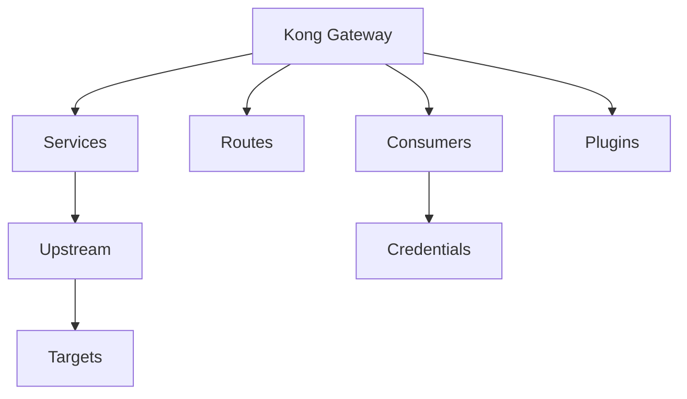

# Kong Admin API

## Introduction

The Kong Admin API is a powerful interface that allows you to manage and configure your Kong API Gateway instance. As an essential part of Kong Administration, the Admin API provides a RESTful interface that enables developers and administrators to programmatically control all aspects of Kong's functionality.

Kong is a popular open-source API gateway that sits in front of your APIs, acting as a middleware layer for managing traffic, authentication, rate limiting, and more. The Admin API is what makes Kong truly flexible and automation-friendly.

In this tutorial, we'll explore how to work with the Kong Admin API, understand its core concepts, and learn how to perform common administrative tasks.

## Getting Started with Kong Admin API

### Prerequisites

Before diving into the Kong Admin API, make sure you have:

- A running Kong instance
- Basic understanding of RESTful APIs
- cURL, Postman, or any HTTP client to make requests

### Admin API Basics

By default, the Kong Admin API listens on port `8001` on localhost. If you're running Kong in a Docker container or on a remote server, you'll need to adjust the URL accordingly.

The base URL structure for the Kong Admin API is:

```
http://{kong-host}:{admin-port}
```

For example, if Kong is running locally with default settings:

```
http://localhost:8001
```

## Key Concepts

### RESTful Interface

The Kong Admin API follows RESTful principles, using standard HTTP methods:

- `GET`: Retrieve information
- `POST`: Create resources
- `PATCH`: Update resources
- `PUT`: Create or update resources
- `DELETE`: Remove resources

### Response Format

All responses from the Kong Admin API are in JSON format. Successful requests typically return an HTTP status code in the `2xx` range, while errors return codes in the `4xx` or `5xx` range.

Here's an example of a successful response:

```json
{
  "data": [
    {
      "id": "a1b2c3d4-e5f6-7890-abcd-ef1234567890",
      "name": "example-service",
      "host": "example.com",
      "port": 80,
      "path": "/api",
      "created_at": 1614728400
    }
  ],
  "next": null
}
```

## Working with Kong Resources

The Kong Admin API allows you to manage several key resources:



Let's explore how to manage these resources using the Admin API.

### Services

Services represent your upstream APIs or microservices. They define where Kong should proxy traffic.

#### Creating a Service

```bash
curl -X POST http://localhost:8001/services \
  -d "name=example-service" \
  -d "url=http://example.com/api"
```

Response:

```json
{
  "id": "a1b2c3d4-e5f6-7890-abcd-ef1234567890",
  "name": "example-service",
  "protocol": "http",
  "host": "example.com",
  "port": 80,
  "path": "/api",
  "created_at": 1614728400,
  "updated_at": 1614728400
}
```

#### Listing All Services

```bash
curl -X GET http://localhost:8001/services
```

#### Retrieving a Specific Service

```bash
curl -X GET http://localhost:8001/services/example-service
```

#### Updating a Service

```bash
curl -X PATCH http://localhost:8001/services/example-service \
  -d "path=/newapi"
```

#### Deleting a Service

```bash
curl -X DELETE http://localhost:8001/services/example-service
```

### Routes

Routes define how requests to Kong are matched and routed to Services.

#### Creating a Route

```bash
curl -X POST http://localhost:8001/services/example-service/routes \
  -d "name=example-route" \
  -d "paths[]=/example" \
  -d "strip_path=true"
```

Response:

```json
{
  "id": "b2c3d4e5-f6a1-7890-bcde-f12345678901",
  "name": "example-route",
  "service": { "id": "a1b2c3d4-e5f6-7890-abcd-ef1234567890" },
  "protocols": ["http", "https"],
  "paths": ["/example"],
  "strip_path": true,
  "created_at": 1614728500,
  "updated_at": 1614728500
}
```

### Consumers

Consumers represent users of your API. They are typically end-users or applications that make requests to your APIs through Kong.

#### Creating a Consumer

```bash
curl -X POST http://localhost:8001/consumers \
  -d "username=example-user" \
  -d "custom_id=user-123"
```

Response:

```json
{
  "id": "c3d4e5f6-a1b2-7890-cdef-123456789012",
  "username": "example-user",
  "custom_id": "user-123",
  "created_at": 1614728600
}
```

### Plugins

Plugins extend Kong's functionality, allowing you to add features like authentication, rate limiting, logging, and more.

#### Adding a Rate Limiting Plugin

```bash
curl -X POST http://localhost:8001/services/example-service/plugins \
  -d "name=rate-limiting" \
  -d "config.minute=5" \
  -d "config.policy=local"
```

Response:

```json
{
  "id": "d4e5f6a1-b2c3-7890-defg-2345678901234",
  "name": "rate-limiting",
  "service": { "id": "a1b2c3d4-e5f6-7890-abcd-ef1234567890" },
  "route": null,
  "consumer": null,
  "config": {
    "minute": 5,
    "policy": "local"
  },
  "enabled": true,
  "created_at": 1614728700
}
```

## Real-World Applications

### Scenario 1: Setting Up an API Proxy with Authentication

In this example, we'll set up a service that proxies requests to an external API and secures it with key authentication.

Step 1: Create the service

```bash
curl -X POST http://localhost:8001/services \
  -d "name=weather-api" \
  -d "url=https://api.weatherservice.com/v1"
```

Step 2: Add a route to the service

```bash
curl -X POST http://localhost:8001/services/weather-api/routes \
  -d "name=weather-route" \
  -d "paths[]=/weather" \
  -d "strip_path=true"
```

Step 3: Add key authentication plugin

```bash
curl -X POST http://localhost:8001/services/weather-api/plugins \
  -d "name=key-auth"
```

Step 4: Create a consumer

```bash
curl -X POST http://localhost:8001/consumers \
  -d "username=weather-app"
```

Step 5: Provision key credentials for the consumer

```bash
curl -X POST http://localhost:8001/consumers/weather-app/key-auth \
  -d "key=your-api-key"
```

Now, to access the weather API through Kong, clients would need to include the API key in their requests:

```bash
curl -X GET http://localhost:8000/weather/forecast \
  -H "apikey: your-api-key"
```

### Scenario 2: Implementing Rate Limiting and Response Transformations

This example demonstrates how to implement rate limiting and transform the response headers.

Step 1: Add rate limiting plugin to a service

```bash
curl -X POST http://localhost:8001/services/example-service/plugins \
  -d "name=rate-limiting" \
  -d "config.minute=10" \
  -d "config.hour=100" \
  -d "config.policy=local"
```

Step 2: Add response transformer plugin

```bash
curl -X POST http://localhost:8001/services/example-service/plugins \
  -d "name=response-transformer" \
  -d "config.add.headers=X-API-Version:v1" \
  -d "config.remove.headers=Server"
```

## Advanced Usage

### Health Checks and Status

Kong provides endpoints to check the health and status of your gateway:

```bash
# Get basic status
curl -X GET http://localhost:8001/status

# Check if database is available
curl -X GET http://localhost:8001/
```

### Bulk Operations with Admin API

For managing multiple resources at once, you can use tools like `jq` and bash scripting:

```bash
# Get all plugins for a service and disable them
SERVICE_ID="a1b2c3d4-e5f6-7890-abcd-ef1234567890"
curl -s http://localhost:8001/services/$SERVICE_ID/plugins | \
  jq -r '.data[].id' | \
  while read plugin_id; do
    curl -X PATCH http://localhost:8001/plugins/$plugin_id \
      -d "enabled=false"
  done
```

### Using Tags for Organization

Kong allows tagging resources for better organization:

```bash
# Create a service with tags
curl -X POST http://localhost:8001/services \
  -d "name=tagged-service" \
  -d "url=http://example.com" \
  -d "tags[]=production" \
  -d "tags[]=external"

# Find all resources with a specific tag
curl -X GET http://localhost:8001/tags/production
```

## Security Considerations

When working with the Kong Admin API, keep these security practices in mind:

1. **Never expose the Admin API to public networks** without proper security measures
2. **Use HTTPS** for all Admin API communications
3. **Implement network-level security** (firewalls, VPNs) to restrict access
4. **Consider using Kong Enterprise RBAC** for fine-grained access control
5. **Audit Admin API actions** for tracking changes

For production environments, configure a separate listener for the Admin API:

```
admin_listen = 127.0.0.1:8001 ssl
```

## Troubleshooting

### Common Error Codes

- `400 Bad Request`: Malformed request syntax
- `404 Not Found`: Resource doesn't exist
- `409 Conflict`: Resource already exists
- `500 Internal Server Error`: Something went wrong in Kong

### Logging

To troubleshoot issues, increase the log level in your Kong configuration:

```
log_level = debug
```

Then check the Kong error logs:

```bash
tail -f /usr/local/kong/logs/error.log
```

## Summary

The Kong Admin API is a powerful tool for managing your API gateway. In this tutorial, we've covered:

- Basic concepts and interaction with the Admin API
- Managing core Kong resources (Services, Routes, Consumers, Plugins)
- Real-world application scenarios
- Advanced usage patterns
- Security considerations and troubleshooting

By leveraging the Kong Admin API, you can automate your API gateway management, integrate Kong with your CI/CD pipelines, and build custom administrative interfaces tailored to your organization's needs.

## Additional Resources

- Practice implementing various authentication mechanisms (JWT, OAuth2)
- Try setting up a full API management solution with rate limiting, analytics, and caching
- Experiment with declarative configuration using Kong's DB-less mode
- Explore Kong's plugin development to extend functionality

## Exercises

1. Create a service with multiple routes pointing to different paths on the same backend
2. Implement a plugin that logs all requests to a specific service
3. Set up a consumer with rate limiting that differs from the global rate limits
4. Write a simple script that backs up all Kong configuration using the Admin API
5. Configure a plugin that adds CORS headers to responses

By mastering the Kong Admin API, you'll be well-equipped to manage your API gateway efficiently and integrate it seamlessly into your development workflow.