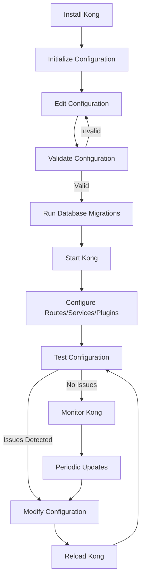

# Kong CLI: Mastering the Command Line Interface

## Introduction

The Kong Command Line Interface (CLI) is a powerful tool for administrators and developers working with Kong API Gateway. This command-line utility allows you to manage your Kong instance directly from your terminal, making it easier to automate tasks, integrate with CI/CD pipelines, and perform quick administrative operations without using the Admin API directly.

In this guide, we'll explore the Kong CLI, its capabilities, and how you can use it to efficiently manage your Kong API Gateway deployment.

## Prerequisites

Before diving into the Kong CLI, make sure you have:

- Kong Gateway installed (Community or Enterprise edition)
- Basic familiarity with command-line interfaces
- Administrative access to your Kong instance

## Installing the Kong CLI

The Kong CLI comes bundled with your Kong installation. If you've installed Kong following the official documentation, you should already have access to the `kong` command in your terminal.

To verify your installation, open your terminal and run:

```bash
kong version
```

You should see output similar to:

```
Kong Enterprise 3.4.1
```

If the command is not found, ensure that Kong's bin directory is in your system's PATH.

## Basic Kong CLI Structure

The Kong CLI follows a simple command structure:

```
kong COMMAND [OPTIONS]
```

The most commonly used commands include:

- `kong start`: Start the Kong Gateway
- `kong stop`: Stop the Kong Gateway
- `kong reload`: Reload the Kong configuration
- `kong config`: Manage Kong configurations
- `kong migrations`: Manage database migrations
- `kong health`: Check the health of Kong

Let's explore each of these commands in detail.

## Starting and Stopping Kong

### Starting Kong

To start Kong, use the following command:

```bash
kong start
```

This will start Kong with the default configuration file (`/etc/kong/kong.conf`). If you want to use a different configuration file, use the `-c` or `--conf` flag:

```bash
kong start -c /path/to/custom/kong.conf
```

### Stopping Kong

To stop Kong:

```bash
kong stop
```

This will gracefully stop Kong, allowing it to finish processing any current requests.

### Reloading Kong

If you've made changes to your Kong configuration and want to apply them without downtime, use the reload command:

```bash
kong reload
```

Kong will reload its configuration without disrupting ongoing connections.

## Managing Kong Configuration

The `kong config` command allows you to work with Kong's configuration files:

### Validating Configuration

To check if your configuration file is valid without starting Kong:

```bash
kong config parse /path/to/kong.conf
```

If the configuration is valid, you'll see:

```
parse successful
```

### Generating Default Configuration

To generate a default configuration file with comments explaining each option:

```bash
kong config init
```

This will output a template configuration file to stdout. To save it to a file, redirect the output:

```bash
kong config init > kong.conf.default
```

## Database Migrations

Kong stores its configuration in a database (PostgreSQL or Cassandra). When upgrading Kong, you often need to run database migrations.

### Check Migration Status

```bash
kong migrations status
```

This shows which migrations have been run and which are pending.

### Running Migrations

To run all pending migrations:

```bash
kong migrations up
```

For a major version upgrade, you'll need to run:

```bash
kong migrations bootstrap
```

## Declarative Configuration (DB-less mode)

For DB-less mode, Kong uses declarative configuration via YAML files.

### Checking Declarative Config

To validate a declarative configuration file:

```bash
kong config parse my-kong-config.yml
```

### Applying Declarative Config

To apply a declarative configuration file:

```bash
kong config db_import my-kong-config.yml
```

In DB-less mode, you can use:

```bash
kong start -c kong.conf --declarative-config my-kong-config.yml
```

## Health Checks

Kong provides health check commands to verify that your instance is running correctly:

```bash
kong health
```

This returns information about your Kong node's health:

```
Kong is healthy at /usr/local/kong
```

For more detailed information:

```bash
kong health -v
```

## Working with Plugins

The Kong CLI lets you manage plugins directly from the command line.

### Listing Available Plugins

To see all available plugins:

```bash
kong list plugins
```

Example output:

```
Bundled plugins:
- acl
- basic-auth
- hmac-auth
- jwt
- key-auth
- oauth2
- rate-limiting
- response-ratelimiting
- cors
- ip-restriction
- request-transformer
- response-transformer
- request-size-limiting
- response-size-limiting
- request-termination
- bot-detection
- correlation-id
- session
- aws-lambda
- azure-functions
- zipkin
- prometheus
- datadog
- statsd
```

## Real-World Examples

Let's look at some practical examples of using the Kong CLI in real-world scenarios.

### Example 1: Setting Up a New Kong Instance with CLI

```bash
# Generate a default config
kong config init > /etc/kong/kong.conf

# Edit the configuration file as needed

# Run migrations (if using a database)
kong migrations bootstrap

# Start Kong
kong start -c /etc/kong/kong.conf
```

### Example 2: Deploying Configuration Changes in a CI/CD Pipeline

```bash
#!/bin/bash
# CI/CD script for deploying Kong changes

# Validate the configuration
kong config parse kong.conf || exit 1

# Apply migrations if needed
kong migrations up

# Reload Kong to apply changes
kong reload

# Verify Kong is healthy
kong health || exit 1

echo "Kong deployment successful!"
```

### Example 3: Backing Up and Restoring Kong Configuration (DB-less mode)

```bash
# Export current configuration
curl http://localhost:8001/config > kong_backup.json

# Later, restore the configuration
curl -X POST http://localhost:8001/config \
  -H "Content-Type: application/json" \
  -d @kong_backup.json
```

## Flow Diagram: Kong CLI Workflow

Here's a visual representation of a typical Kong CLI workflow:



## Advanced Kong CLI Usage

### Environment Variables

The Kong CLI respects several environment variables that can simplify your commands:

```bash
# Set default configuration file
export KONG_CONF=/path/to/kong.conf

# Then you can run commands without specifying the config file
kong start
```

### Prefix Path

Kong stores runtime data in a prefix directory. You can specify a custom prefix path:

```bash
kong start --prefix /path/to/custom/prefix
```

### Non-Interactive Mode

For scripts and automation, use the non-interactive mode:

```bash
kong start --no-user-interactive
```

## Troubleshooting with Kong CLI

The Kong CLI provides several tools for troubleshooting:

### Check Kong Logs

```bash
# View logs (if using systemd)
journalctl -u kong

# Or check logs in the prefix directory
cat /usr/local/kong/logs/error.log
```

### Debug Mode

Start Kong in debug mode for more verbose logging:

```bash
kong start --vv
```

### Checking Configuration Values

To see the actual configuration values Kong is using:

```bash
kong config show
```

## Summary

The Kong CLI is an indispensable tool for Kong API Gateway administrators. It provides a streamlined interface for managing your Kong deployment, from initial setup to ongoing maintenance and troubleshooting.

Key takeaways from this guide:

- The Kong CLI provides commands for starting, stopping, and reloading Kong
- You can validate and manage configurations directly from the command line
- Database migrations can be handled through the CLI
- Health checks help ensure your Kong instance is functioning correctly
- The CLI integrates well with automation and CI/CD pipelines

By mastering the Kong CLI, you'll be able to efficiently manage your API Gateway infrastructure and streamline your administration workflows.

## Additional Resources

To further your knowledge of the Kong CLI and Kong administration:

- Kong's official documentation: [https://docs.konghq.com/](https://docs.konghq.com/)
- Kong CLI reference: [https://docs.konghq.com/gateway/latest/reference/cli/](https://docs.konghq.com/gateway/latest/reference/cli/)
- Kong Nation community: [https://discuss.konghq.com/](https://discuss.konghq.com/)

## Practice Exercises

1. Install Kong and use the CLI to start it with a custom configuration file.
2. Create a declarative configuration file and apply it using the Kong CLI.
3. Write a shell script that checks Kong's health and sends an alert if issues are detected.
4. Use the Kong CLI to list all installed plugins and their configurations.
5. Set up a test environment where you use the Kong CLI to perform a zero-downtime configuration update.