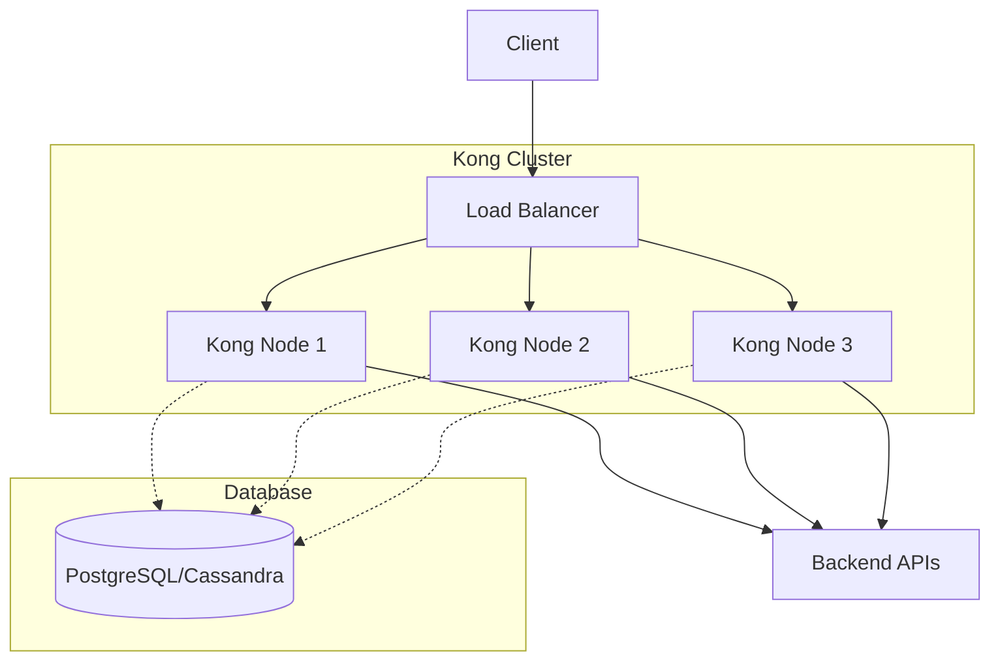
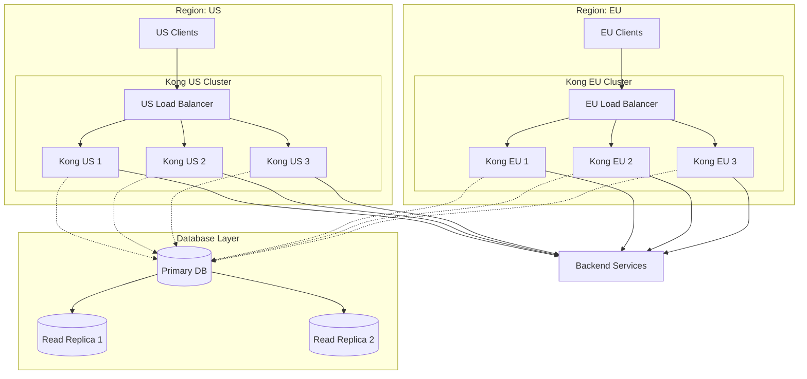

# Kong Scaling

## Introduction

Kong is a popular open-source API Gateway built on top of NGINX that helps manage API traffic, implement security policies, and transform requests and responses. As your API traffic grows, properly scaling Kong becomes essential to maintain performance and reliability.

This guide will walk you through the fundamentals of scaling Kong in production environments, covering horizontal and vertical scaling strategies, database considerations, and deployment patterns to ensure your API Gateway can handle increasing loads.

## Why Scale Kong?

Before diving into scaling strategies, let's understand why scaling matters:

- **Increased traffic**: As your APIs gain more users, Kong needs to handle more requests
- **High availability**: Preventing single points of failure in your API infrastructure
- **Geographic distribution**: Serving users across different regions with low latency
- **Resource optimization**: Efficiently using infrastructure resources

## Kong's Architecture

To understand scaling Kong, we first need to understand its architecture:



Kong can run in two modes:
1. **DB-less mode**: Configuration is stored in memory and loaded from YAML/JSON files
2. **DB mode**: Configuration is stored in PostgreSQL or Cassandra

## Scaling Strategies

### Vertical Scaling

Vertical scaling involves increasing the resources (CPU, memory) of individual Kong nodes.

**Example: Increasing resources in Docker**

```yaml
version: '3'
services:
  kong:
    image: kong:latest
    environment:
      KONG_DATABASE: postgres
      KONG_PG_HOST: kong-database
      KONG_PROXY_ACCESS_LOG: /dev/stdout
      KONG_ADMIN_ACCESS_LOG: /dev/stdout
      KONG_PROXY_ERROR_LOG: /dev/stderr
      KONG_ADMIN_ERROR_LOG: /dev/stderr
    ports:
      - "8000:8000"
      - "8443:8443"
      - "8001:8001"
      - "8444:8444"
    deploy:
      resources:
        limits:
          cpus: '2'
          memory: 2G
        reservations:
          cpus: '1'
          memory: 1G
```

**Pros of Vertical Scaling:**
- Simple to implement
- No additional configuration needed
- Works well for low to medium traffic

**Cons of Vertical Scaling:**
- Hardware limitations
- Potential single point of failure
- Cost increases may not be linear with performance gains

### Horizontal Scaling

Horizontal scaling involves adding more Kong nodes to distribute the load.

**Example: Kong deployment with Kubernetes**

```yaml
apiVersion: apps/v1
kind: Deployment
metadata:
  name: kong
spec:
  replicas: 3
  selector:
    matchLabels:
      app: kong
  template:
    metadata:
      labels:
        app: kong
    spec:
      containers:
      - name: kong
        image: kong:latest
        env:
        - name: KONG_DATABASE
          value: "postgres"
        - name: KONG_PG_HOST
          value: "postgres"
        - name: KONG_PROXY_ACCESS_LOG
          value: "/dev/stdout"
        - name: KONG_ADMIN_ACCESS_LOG
          value: "/dev/stdout"
        - name: KONG_PROXY_ERROR_LOG
          value: "/dev/stderr"
        - name: KONG_ADMIN_ERROR_LOG
          value: "/dev/stderr"
        ports:
        - containerPort: 8000
        - containerPort: 8443
```

To scale up:

```bash
kubectl scale deployment kong --replicas=5
```

**Pros of Horizontal Scaling:**
- Better fault tolerance and high availability
- Easier to scale dynamically based on load
- Better cost-performance ratio at scale

**Cons of Horizontal Scaling:**
- More complex setup
- Requires load balancing
- May require database optimizations

## Database Considerations

### PostgreSQL Scaling

When using PostgreSQL with Kong, consider these scaling techniques:

1. **Connection Pooling**: Use pgBouncer to manage database connections efficiently

```bash
# Example pgBouncer configuration in pgbouncer.ini
[databases]
kong = host=127.0.0.1 port=5432 dbname=kong

[pgbouncer]
listen_port = 6432
listen_addr = 0.0.0.0
auth_type = md5
auth_file = /etc/pgbouncer/userlist.txt
pool_mode = transaction
max_client_conn = 1000
default_pool_size = 20
```

2. **Read Replicas**: Offload read operations to replicas

```bash
# Kong configuration with read replicas
KONG_PG_HOST=master.postgres
KONG_PG_RO_HOST=replica.postgres
```

3. **Database Sharding**: For very large deployments

### Cassandra Scaling

Cassandra is designed for horizontal scaling and is well-suited for large Kong deployments:

```yaml
# Example Kong configuration for Cassandra
KONG_DATABASE=cassandra
KONG_CASSANDRA_CONTACT_POINTS=cassandra-node1,cassandra-node2,cassandra-node3
KONG_CASSANDRA_KEYSPACE=kong
KONG_CASSANDRA_CONSISTENCY=LOCAL_QUORUM
```

### DB-less Mode

For high-performance scenarios, consider DB-less mode:

```yaml
# Kong configuration for DB-less mode
KONG_DATABASE=off
KONG_DECLARATIVE_CONFIG=/kong/declarative/kong.yml
```

DB-less deployments typically use CI/CD pipelines to update configuration:

```bash
# Update Kong configuration
curl -X POST http://kong:8001/config \
  -F config=@kong.yml
```

## Load Balancing

Properly load balancing Kong nodes is crucial for horizontal scaling.

### Using NGINX as a Load Balancer

```nginx
# /etc/nginx/conf.d/kong.conf
upstream kong {
    server kong1:8000;
    server kong2:8000;
    server kong3:8000;
    
    keepalive 32;
}

server {
    listen 80;
    
    location / {
        proxy_pass http://kong;
        proxy_set_header Host $host;
        proxy_set_header X-Real-IP $remote_addr;
        proxy_set_header X-Forwarded-For $proxy_add_x_forwarded_for;
        proxy_set_header X-Forwarded-Proto $scheme;
    }
}
```

### Using a Cloud Load Balancer

Most cloud providers offer managed load balancers:

- AWS Elastic Load Balancer
- Google Cloud Load Balancing
- Azure Load Balancer

## Caching Strategies

Implement caching to reduce load on Kong and backend services:

```bash
# Enable proxy caching plugin globally
curl -X POST http://localhost:8001/plugins/ \
    --data "name=proxy-cache" \
    --data "config.content_type=application/json" \
    --data "config.cache_ttl=300" \
    --data "config.strategy=memory"
```

## Monitoring and Autoscaling

Set up monitoring to detect when scaling is needed:

1. **Prometheus and Grafana**: Monitor Kong metrics

```yaml
# Enable Prometheus plugin
curl -X POST http://localhost:8001/plugins/ \
    --data "name=prometheus"
```

2. **Kubernetes Horizontal Pod Autoscaler**:

```yaml
apiVersion: autoscaling/v2
kind: HorizontalPodAutoscaler
metadata:
  name: kong-hpa
spec:
  scaleTargetRef:
    apiVersion: apps/v1
    kind: Deployment
    name: kong
  minReplicas: 3
  maxReplicas: 10
  metrics:
  - type: Resource
    resource:
      name: cpu
      target:
        type: Utilization
        averageUtilization: 70
```

## Health Checks and Circuit Breaking

Implement health checks to ensure Kong nodes are functioning properly:

```yaml
# Kong health check configuration
KONG_NGINX_HTTP_UPSTREAM_HEALTHCHECK=1
KONG_NGINX_HTTP_UPSTREAM_HEALTHCHECK_INTERVAL=5000
KONG_NGINX_HTTP_UPSTREAM_HEALTHCHECK_UNHEALTHY_THRESHOLD=2
KONG_NGINX_HTTP_UPSTREAM_HEALTHCHECK_HEALTHY_THRESHOLD=2
```

## Real-World Scaling Example

Let's look at a complete example of scaling Kong for a medium-sized application:

1. **Initial Setup**: 3 Kong nodes behind a load balancer

2. **Traffic Growth**: Traffic increases by 3x

3. **Scaling Response**:
   - Increase Kong nodes to 6
   - Add database read replicas
   - Implement caching for common requests
   - Add region-specific deployments



## Kong Scaling Best Practices

1. **Start small and scale gradually**
   - Begin with a few Kong nodes and monitor performance
   - Scale based on actual metrics rather than assumptions

2. **Separate admin and proxy traffic**
   - Use different endpoints or nodes for admin API and proxy traffic
   
3. **Use node affinity in Kubernetes**
   - Ensure Kong pods are distributed across multiple availability zones
   
4. **Implement proper connection handling**
   - Configure `upstream_keepalive` settings to maintain connections
   
5. **Consider hybrid modes for large deployments**
   - Separate control plane and data plane

## Troubleshooting Scaling Issues

| Issue | Potential Cause | Solution |
|-------|----------------|----------|
| High latency | Database bottleneck | Add read replicas or tune database |
| Connection errors | Node overload | Add more nodes or increase resources |
| Inconsistent configuration | Replication lag | Use DB-less mode or optimize DB replication |
| Memory issues | Plugin overload | Optimize plugin usage or increase memory |

## Summary

Scaling Kong effectively requires understanding your traffic patterns, choosing the right deployment mode, and implementing proper monitoring. By following the strategies outlined in this guide, you can ensure your Kong API Gateway remains performant and reliable as your API traffic grows.

Key takeaways:
- Vertical scaling is simple but limited
- Horizontal scaling provides better reliability and flexibility
- Database choice and configuration significantly impact scalability
- Monitoring and autoscaling help manage dynamic workloads
- Regional deployment can improve user experience

## Additional Resources

- Kong's official documentation on scaling and performance
- Kong Kubernetes Ingress Controller for containerized environments
- Kong Enterprise for additional scaling features

## Exercises

1. Set up a basic Kong cluster with 3 nodes using Docker Compose
2. Implement database read replicas for a PostgreSQL-backed Kong deployment
3. Configure and test automatic scaling in a Kubernetes environment
4. Benchmark Kong performance under different loads and configurations
5. Design a multi-region Kong deployment strategy for a global application