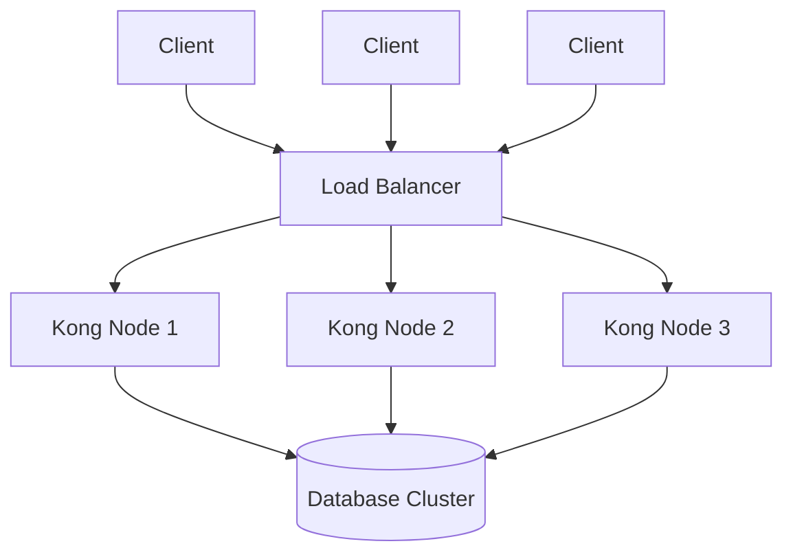

# Kong High Availability

## Introduction

High Availability (HA) is a critical aspect of deploying Kong Gateway in production environments. A highly available Kong deployment ensures that your API gateway continues to function even when individual components fail, preventing service disruptions and maintaining consistent performance under varying loads.

In this guide, we'll explore how to set up Kong Gateway in a high availability configuration, understand the key components involved, and learn best practices for maintaining a resilient Kong infrastructure.

## Why High Availability Matters

Before diving into implementation, let's understand why high availability is crucial for API gateways:

- **Eliminating Single Points of Failure**: Ensures continuous operation even when individual nodes fail
- **Maintaining Service Levels**: Preserves consistent response times during traffic spikes
- **Supporting Horizontal Scaling**: Allows for graceful scaling as demand increases
- **Enabling Zero-Downtime Updates**: Facilitates updates and maintenance without service interruptions

## Kong HA Architecture Overview

A highly available Kong deployment typically consists of multiple components working together:



The key components include:

1. **Multiple Kong Nodes**: Independent Kong instances running on separate servers
2. **Load Balancer**: Distributes traffic across Kong nodes
3. **Database Cluster**: Shared database (PostgreSQL or Cassandra) for configuration storage
4. **Monitoring & Alerting**: Systems to detect and respond to failures

Let's explore each component in detail.

## Kong Deployment Modes

Kong offers two primary deployment modes, each with different high availability considerations:

### DB Mode (Traditional)

In this mode, Kong uses a database (PostgreSQL or Cassandra) to store and share configuration:

- **Advantages**: Centralized configuration, dynamic updates
- **Considerations**: Database becomes critical for operation

### DB-less Mode (Declarative)

In this mode, Kong uses local configuration files instead of a database:

- **Advantages**: No database dependency, simpler architecture
- **Considerations**: Requires configuration synchronization across nodes

## Setting Up Kong HA with Database (DB Mode)

Let's walk through setting up a highly available Kong cluster with a PostgreSQL database.

### Step 1: Set Up a Database Cluster

First, we need a resilient database. For PostgreSQL, you can use:

- **PostgreSQL with Replication**: Primary and replica setup
- **Cloud-Managed Solutions**: AWS RDS, Azure Database for PostgreSQL, etc.

Example PostgreSQL replication configuration:

```bash
# On primary database server
# In postgresql.conf
wal_level = replica
max_wal_senders = 10
max_replication_slots = 10

# In pg_hba.conf
host replication replicator 192.168.1.0/24 md5
```

### Step 2: Deploy Multiple Kong Nodes

Next, deploy Kong on multiple servers with identical configurations pointing to your database cluster:

```bash
# Install Kong on each server
$ sudo apt-get update
$ sudo apt-get install -y kong

# Configure Kong to use your database cluster
$ sudo cat > /etc/kong/kong.conf << EOF
database = postgres
pg_host = your-db-cluster-endpoint
pg_port = 5432
pg_database = kong
pg_user = kong
pg_password = your-secure-password
EOF

# Initialize the database (only needed on one node)
$ kong migrations bootstrap

# Start Kong on each node
$ sudo kong start
```

### Step 3: Set Up a Load Balancer

Now, deploy a load balancer in front of your Kong nodes. Here's an example using NGINX:

```nginx
upstream kong_upstream {
    server kong-node1:8000;
    server kong-node2:8000;
    server kong-node3:8000;
    
    keepalive 60;
}

server {
    listen 80;
    
    location / {
        proxy_pass http://kong_upstream;
        proxy_set_header Host $host;
        proxy_set_header X-Real-IP $remote_addr;
        proxy_set_header X-Forwarded-For $proxy_add_x_forwarded_for;
        proxy_set_header X-Forwarded-Proto $scheme;
    }
}
```

You can also use cloud load balancers like AWS ELB, GCP Load Balancer, or hardware load balancers.

## Setting Up Kong HA in DB-less Mode

For environments where a database dependency is undesirable, you can set up Kong in DB-less mode:

### Step 1: Create a Declarative Configuration

Create a YAML file with your Kong configuration:

```yaml
# kong.yml
_format_version: "2.1"
_transform: true

services:
  - name: example-service
    url: http://example.com
    routes:
      - name: example-route
        paths:
          - /example
```

### Step 2: Deploy Kong Nodes with Identical Configuration

Deploy Kong on multiple servers with the same configuration:

```bash
# On each Kong node
$ sudo cat > /etc/kong/kong.conf << EOF
database = off
declarative_config = /etc/kong/kong.yml
EOF

# Copy the configuration file to each node
$ sudo cp kong.yml /etc/kong/kong.yml

# Start Kong on each node
$ sudo kong start
```

### Step 3: Set Up a Load Balancer

Set up a load balancer as described in the DB mode section.

### Step 4: Configuration Updates

For configuration updates, you'll need to:

1. Update the configuration file
2. Deploy it to all nodes
3. Reload Kong on each node:

```bash
$ sudo kong reload
```

You can automate this process using configuration management tools like Ansible, Chef, or Puppet.

## Health Checks and Monitoring

To maintain high availability, implement proper health checks and monitoring:

### Load Balancer Health Checks

Configure your load balancer to perform health checks on Kong nodes:

```nginx
upstream kong_upstream {
    server kong-node1:8000 max_fails=3 fail_timeout=30s;
    server kong-node2:8000 max_fails=3 fail_timeout=30s;
    server kong-node3:8000 max_fails=3 fail_timeout=30s;
}
```

### Kong Health Endpoints

Kong provides built-in health endpoints:

```bash
# Basic health check
$ curl -i http://kong-node:8000/status

# Response example
HTTP/1.1 200 OK
Content-Type: application/json
{
  "database": {
    "reachable": true
  },
  "server": {
    "connections_accepted": 1234,
    "connections_active": 12,
    "connections_handled": 1234,
    "connections_reading": 0,
    "connections_waiting": 0,
    "connections_writing": 23,
    "total_requests": 5678
  }
}
```

### Monitoring Tools

Implement comprehensive monitoring using:

- **Prometheus & Grafana**: For metrics collection and visualization
- **ELK Stack**: For log aggregation and analysis
- **Kong Vitals**: Enterprise feature for detailed Kong metrics

Example Prometheus configuration for Kong:

```yaml
# prometheus.yml
scrape_configs:
  - job_name: 'kong'
    metrics_path: /metrics
    static_configs:
      - targets: ['kong-node1:8001', 'kong-node2:8001', 'kong-node3:8001']
```

## Scaling Kong for High Availability

To scale Kong effectively:

### Horizontal Scaling

Add more Kong nodes when:
- CPU utilization consistently exceeds 70%
- Memory usage is high
- Response times increase
- Traffic volumes grow

### Database Scaling

For DB mode:
- Scale read replicas for PostgreSQL
- Add more nodes for Cassandra
- Consider database connection pooling

## Handling Failures and Recovery

A robust HA setup should have procedures for various failure scenarios:

### Node Failure

When a Kong node fails:
1. Load balancer redirects traffic to healthy nodes
2. Replace or restart the failed node
3. Verify the node is healthy before adding it back to the pool

### Database Failure (DB Mode)

When the database experiences issues:
1. Automatic failover to replica (if configured)
2. Kong continues processing requests with cached configurations
3. Once database is restored, Kong automatically reconnects

## Real-World Example: Kong HA on Kubernetes

Kubernetes provides an excellent platform for running highly available Kong clusters:

```yaml
# Kong deployment example
apiVersion: apps/v1
kind: Deployment
metadata:
  name: kong
spec:
  replicas: 3
  selector:
    matchLabels:
      app: kong
  template:
    metadata:
      labels:
        app: kong
    spec:
      containers:
      - name: kong
        image: kong:2.8
        env:
        - name: KONG_DATABASE
          value: "postgres"
        - name: KONG_PG_HOST
          value: "postgres-cluster"
        ports:
        - containerPort: 8000
          name: proxy
        - containerPort: 8001
          name: admin
        livenessProbe:
          httpGet:
            path: /status
            port: 8000
          initialDelaySeconds: 5
          timeoutSeconds: 1
          periodSeconds: 10
          failureThreshold: 3
```

Coupled with a Kubernetes Service:

```yaml
apiVersion: v1
kind: Service
metadata:
  name: kong-proxy
spec:
  type: LoadBalancer
  selector:
    app: kong
  ports:
  - port: 80
    targetPort: 8000
    protocol: TCP
    name: proxy
```

## Best Practices for Kong High Availability

To ensure maximum resilience:

1. **Always run at least three Kong nodes** across different availability zones
2. **Use proper health checks** to detect failed nodes quickly
3. **Implement connection draining** for graceful node removal during updates
4. **Automate deployment and configuration** to reduce human error
5. **Regularly test failure scenarios** to validate your HA setup
6. **Monitor performance metrics** to anticipate scaling needs
7. **Use session persistence** for plugins that require it
8. **Implement proper backup strategies** for database and configurations
9. **Document recovery procedures** for various failure scenarios
10. **Consider using Kong Enterprise** for additional HA features

## Troubleshooting Common Issues

### Inconsistent Configuration

**Problem**: Changes appear on some nodes but not others.
**Solution**: Verify database connectivity on all nodes or ensure configuration files are synchronized in DB-less mode.

```bash
# Check database connectivity on Kong nodes
$ kong health
```

### Load Balancer Issues

**Problem**: Some nodes receive too much or too little traffic.
**Solution**: Check load balancer algorithm and health check settings.

### Node Communication Problems

**Problem**: Nodes cannot communicate properly.
**Solution**: Verify network settings, security groups, and firewall rules.

## Summary

Setting up Kong for high availability is essential for production deployments. By implementing multiple Kong nodes, database clustering (in DB mode), proper load balancing, and comprehensive monitoring, you can create a resilient API gateway infrastructure that maintains performance and availability even during component failures.

Remember that high availability is not just about the initial setup but also about ongoing maintenance, monitoring, and having well-tested procedures for various failure scenarios.

## Additional Resources

- [Kong Documentation on High Availability](https://docs.konghq.com/)
- [PostgreSQL Replication Guide](https://www.postgresql.org/docs/current/high-availability.html)
- [Cassandra Multi-DC Deployment](https://cassandra.apache.org/doc/latest/operating/multi-dc.html)

## Exercises

1. Set up a local three-node Kong cluster using Docker Compose
2. Implement a health check endpoint that verifies both Kong and your API services
3. Create a disaster recovery plan for your Kong infrastructure
4. Develop an automated script to update Kong configuration across multiple nodes in DB-less mode
5. Configure Prometheus and Grafana to monitor your Kong cluster and set up alerts for potential issues