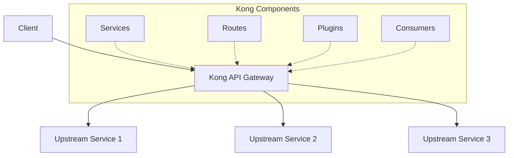

# Kong Management

## Introduction

Kong is a popular, open-source API gateway that acts as a middleware between clients and your API services. Effective Kong management involves configuring and maintaining various Kong entities such as services, routes, consumers, and plugins to ensure optimal API performance, security, and monitoring.

This guide will walk you through the essential aspects of Kong management, providing practical examples and best practices for beginners who want to harness the full power of Kong API Gateway.

## Kong Architecture Overview

Before diving into management tasks, let's understand Kong's core components:



- **Services**: Represent your upstream APIs/microservices
- **Routes**: Define how requests are sent to services
- **Plugins**: Add functionality to services/routes (authentication, logging, etc.)
- **Consumers**: Represent users of your API

## Managing Kong Services

Services in Kong represent your upstream APIs or microservices that Kong forwards requests to.

### Creating a Service

```bash
# Create a service using the Kong Admin API
curl -X POST http://localhost:8001/services \
  --data name=example-service \
  --data url=http://example-api.com
```

**Output:**
```json
{
  "id": "a5fb8d9f-c42d-4e33-9c19-4841e9e75c05",
  "name": "example-service",
  "host": "example-api.com",
  "path": "/",
  "port": 80,
  "protocol": "http",
  "connect_timeout": 60000,
  "write_timeout": 60000,
  "read_timeout": 60000,
  "created_at": 1614687794
}
```

You can also use Kong's declarative configuration format (YAML):

```yaml
services:
  - name: example-service
    url: http://example-api.com
```

### Listing Services

```bash
# List all services
curl -X GET http://localhost:8001/services
```

### Updating a Service

```bash
# Update a service by name
curl -X PATCH http://localhost:8001/services/example-service \
  --data path=/api/v2 \
  --data protocol=https
```

### Deleting a Service

```bash
# Delete a service by name
curl -X DELETE http://localhost:8001/services/example-service
```

## Managing Routes

Routes determine how client requests are matched and forwarded to services.

### Creating a Route

```bash
# Create a route for our example service
curl -X POST http://localhost:8001/services/example-service/routes \
  --data name=example-route \
  --data 'paths[]=/example' \
  --data 'methods[]=GET' \
  --data 'methods[]=POST'
```

**Output:**
```json
{
  "id": "d35165e2-d03e-461a-bdeb-dad0a112abfe",
  "name": "example-route",
  "paths": ["/example"],
  "methods": ["GET", "POST"],
  "service": {
    "id": "a5fb8d9f-c42d-4e33-9c19-4841e9e75c05"
  },
  "created_at": 1614688035
}
```

YAML configuration:

```yaml
routes:
  - name: example-route
    service: example-service
    paths:
      - /example
    methods:
      - GET
      - POST
```

### Path Handling and Request Forwarding

When a client sends a request to `/example/users`, Kong matches it to the route with path `/example` and forwards the request to the associated service, preserving the remaining path component (`/users`).

## Managing Plugins

Plugins extend Kong's functionality by adding features like authentication, rate limiting, logging, and more.

### Adding a Rate Limiting Plugin

```bash
# Add rate limiting to a service
curl -X POST http://localhost:8001/services/example-service/plugins \
  --data name=rate-limiting \
  --data config.minute=5 \
  --data config.hour=100
```

**Output:**
```json
{
  "id": "ec1a1f6f-2aa4-4e58-93ff-b56498e8cbad",
  "name": "rate-limiting",
  "service": {
    "id": "a5fb8d9f-c42d-4e33-9c19-4841e9e75c05"
  },
  "config": {
    "minute": 5,
    "hour": 100,
    "policy": "local"
  },
  "enabled": true,
  "created_at": 1614688194
}
```

### Common Plugins and Use Cases

| Plugin | Purpose | Example Use Case |
|--------|---------|------------------|
| rate-limiting | Limit requests | Prevent API abuse |
| key-auth | API key authentication | Secure APIs |
| jwt | JWT authentication | Single sign-on |
| cors | Cross-origin resource sharing | Browser security |
| request-transformer | Modify requests | Add headers |
| response-transformer | Modify responses | Remove sensitive data |
| http-log | Log to HTTP endpoint | Centralized logging |
| prometheus | Metrics | API monitoring |

### Global vs. Scoped Plugins

Plugins can be applied at different levels:

```bash
# Global plugin (applies to all services)
curl -X POST http://localhost:8001/plugins \
  --data name=cors \
  --data config.origins=*

# Service-specific plugin
curl -X POST http://localhost:8001/services/example-service/plugins \
  --data name=key-auth

# Route-specific plugin
curl -X POST http://localhost:8001/routes/example-route/plugins \
  --data name=request-transformer \
  --data config.add.headers=X-Custom-Header:Value

# Consumer-specific plugin
curl -X POST http://localhost:8001/consumers/john/plugins \
  --data name=rate-limiting \
  --data config.minute=10
```

## Managing Consumers

Consumers represent the users of your API.

### Creating a Consumer

```bash
# Create a consumer
curl -X POST http://localhost:8001/consumers \
  --data username=john
```

**Output:**
```json
{
  "id": "cd114233-e25a-4843-9c29-726b5cc2da40",
  "username": "john",
  "created_at": 1614688412
}
```

### Adding Authentication Credentials

```bash
# Add API key for the consumer
curl -X POST http://localhost:8001/consumers/john/key-auth \
  --data key=my-secure-api-key
```

### Managing Consumer Groups

For Kong Enterprise, you can organize consumers into groups:

```bash
# Create a consumer group
curl -X POST http://localhost:8001/consumer_groups \
  --data name=premium-users

# Add consumer to group
curl -X POST http://localhost:8001/consumer_groups/premium-users/consumers \
  --data consumer=john
```

## Practical Example: Setting Up an API with Authentication

Let's walk through a complete example of setting up an API with key authentication:

1. Create a service for your API:

```bash
curl -X POST http://localhost:8001/services \
  --data name=user-api \
  --data url=http://internal-user-service:3000/api
```

2. Create a route:

```bash
curl -X POST http://localhost:8001/services/user-api/routes \
  --data name=user-route \
  --data 'paths[]=/users' \
  --data 'methods[]=GET'
```

3. Enable key authentication for the service:

```bash
curl -X POST http://localhost:8001/services/user-api/plugins \
  --data name=key-auth
```

4. Create a consumer:

```bash
curl -X POST http://localhost:8001/consumers \
  --data username=application1
```

5. Generate an API key for the consumer:

```bash
curl -X POST http://localhost:8001/consumers/application1/key-auth
```

**Output:**
```json
{
  "consumer": {
    "id": "876bf719-8f18-4ce5-cc9f-5b5af6c36007"
  },
  "created_at": 1614688801,
  "id": "62eb165c-740b-4562-b587-c78932d3b1a5",
  "key": "GEnajFe3UQp1QQmJQnYX8hakFnRpb5NR"
}
```

6. Test your authenticated API:

```bash
# This will fail with 401 Unauthorized
curl http://localhost:8000/users

# This will succeed
curl http://localhost:8000/users \
  -H "apikey: GEnajFe3UQp1QQmJQnYX8hakFnRpb5NR"
```

## Health Checks and Status Monitoring

Kong provides endpoints to check the health of your API gateway and connected services:

```bash
# Check Kong's status
curl http://localhost:8001/status
```

You can also configure active and passive health checks for your upstream services:

```bash
# Configure health checks for a service
curl -X PATCH http://localhost:8001/upstreams/my-upstream/health \
  --data active.healthy.interval=5 \
  --data active.unhealthy.interval=10
```

## Declarative Configuration with Kong YAML

Instead of using the Admin API for each operation, you can use declarative configuration by defining all entities in a single YAML file:

```yaml
_format_version: "2.1"
services:
  - name: user-api
    url: http://internal-user-service:3000/api
    routes:
      - name: user-route
        paths:
          - /users
        methods:
          - GET
    plugins:
      - name: key-auth
        config:
          key_names:
            - apikey
          
consumers:
  - username: application1
    keyauth_credentials:
      - key: my-secret-api-key
```

To load this configuration:

```bash
kong config db_import config.yaml
```

## Versioning and Deployment Strategies

When updating your APIs, consider using these strategies:

### URI Versioning

Create different routes for different API versions:

```bash
# v1 API route
curl -X POST http://localhost:8001/services/user-api/routes \
  --data name=users-v1 \
  --data 'paths[]=/v1/users'

# v2 API route
curl -X POST http://localhost:8001/services/user-api-v2/routes \
  --data name=users-v2 \
  --data 'paths[]=/v2/users'
```

### Canary Releases

Use the request-termination plugin with a percentage of traffic:

```bash
# Block 20% of traffic to simulate canary release
curl -X POST http://localhost:8001/services/new-version/plugins \
  --data name=request-termination \
  --data config.status_code=503 \
  --data config.message="Service in canary testing" \
  --data config.consumer_id=canary-group
```

## Summary

Kong Management involves configuring and maintaining various components including services, routes, plugins, and consumers. By understanding these core concepts and learning how to manipulate them through the Admin API or declarative configuration, you can effectively manage your API gateway.

Remember these key points:
- Services represent your upstream APIs
- Routes define how requests reach services
- Plugins add functionality like security, rate limiting, and monitoring
- Consumers represent users of your APIs
- Declarative configuration simplifies deployment across environments

## Exercises

1. Set up a Kong service and route that proxies to a public API (like JSONPlaceholder).
2. Add rate limiting and key authentication to your service.
3. Create a consumer and generate credentials.
4. Test your API with and without authentication.
5. Create a declarative configuration file that includes all the entities you created.

## Additional Resources

- [Kong Documentation](https://docs.konghq.com/)
- [Kong Plugin Hub](https://docs.konghq.com/hub/)
- [Kong Discussions](https://discuss.konghq.com/)
- [Kong University](https://konghq.com/kong-university/)