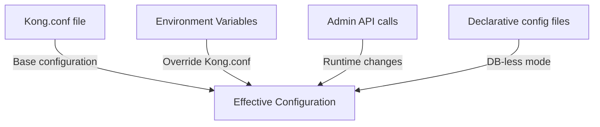

# Kong Configuration

## Introduction

Kong is a powerful, open-source API Gateway that acts as a middleware between clients and your API services. Proper configuration of Kong is essential for leveraging its full potential in managing, securing, and optimizing your API traffic. This guide will walk you through the fundamentals of Kong configuration, from basic setup to advanced customization options.

## Understanding Kong's Configuration Hierarchy

Kong uses a hierarchical configuration model that consists of several layers:

1. **Kong.conf** - The main configuration file
2. **Environment variables** - Overrides Kong.conf settings
3. **Admin API** - Runtime configuration changes
4. **Declarative configuration** - YAML/JSON files for DB-less mode

Let's visualize this hierarchy:



## Basic Configuration Setup

### The Kong.conf File

The `kong.conf` file is the primary method for configuring Kong. It contains settings that affect Kong's behavior, database connections, plugins, and more.

A typical Kong installation includes a `kong.conf.default` file which serves as a template. To create your own configuration:

```bash
# Copy the default config to create your custom config
cp /etc/kong/kong.conf.default /etc/kong/kong.conf

# Edit the configuration file
vim /etc/kong/kong.conf
```

### Essential Configuration Parameters

Let's review some of the most important configuration parameters:

```
# Database configuration
database = postgres          # Determines which database Kong uses (postgres, cassandra, or off for DB-less)
pg_host = 127.0.0.1         # PostgreSQL host
pg_port = 5432              # PostgreSQL port
pg_user = kong              # PostgreSQL user
pg_password = kong          # PostgreSQL password
pg_database = kong          # PostgreSQL database name

# Network settings
proxy_listen = 0.0.0.0:8000, 0.0.0.0:8443 ssl  # Address/port where Kong listens for incoming traffic
admin_listen = 127.0.0.1:8001, 127.0.0.1:8444 ssl  # Address/port for Admin API

# Performance tuning
nginx_worker_processes = auto  # Number of worker processes
```

## Configuration Methods

### Method 1: Using the kong.conf File

As shown above, you can directly edit the `kong.conf` file to configure Kong. After making changes, restart Kong to apply them:

```bash
# Restart Kong to apply configuration changes
kong restart
```

### Method 2: Environment Variables

Every setting in `kong.conf` can be overridden with an environment variable. The naming convention is `KONG_` followed by the uppercase configuration name with underscores:

```bash
# Set database configuration via environment variables
export KONG_DATABASE=postgres
export KONG_PG_HOST=db.example.com
export KONG_PG_USER=kong_user
export KONG_PG_PASSWORD=strong_password

# Start Kong with these environment variables
kong start
```

### Method 3: Declarative Configuration (DB-less mode)

For simpler deployments or containerized environments, Kong supports DB-less mode using declarative configuration files in YAML or JSON format:

1. First, set Kong to run in DB-less mode:

```
# In kong.conf or as environment variable
database = off
declarative_config = /path/to/kong.yml
```

2. Create your `kong.yml` file:

```yaml
_format_version: "2.1"
_transform: true

services:
  - name: example-service
    url: http://example.com
    routes:
      - name: example-route
        paths:
          - /example
    plugins:
      - name: rate-limiting
        config:
          minute: 5
          policy: local
```

3. Load the configuration:

```bash
# Validate your declarative configuration
kong config parse kong.yml

# Start Kong with declarative configuration
kong start -c kong.conf
```

## Working with the Admin API

Kong's Admin API provides a dynamic way to configure Kong at runtime without restarts. This is particularly useful for production environments where downtime should be minimized.

### Basic Admin API Usage

```bash
# Create a new Service
curl -i -X POST http://localhost:8001/services \
  --data name=example-service \
  --data url=http://example.com

# Create a Route for this Service
curl -i -X POST http://localhost:8001/services/example-service/routes \
  --data 'paths[]=/example' \
  --data name=example-route

# Enable a plugin for the Service
curl -i -X POST http://localhost:8001/services/example-service/plugins \
  --data name=rate-limiting \
  --data config.minute=5 \
  --data config.policy=local
```

## Advanced Configuration Scenarios

### Load Balancing Configuration

Kong can act as a load balancer for your upstream services. Here's how to configure load balancing:

```bash
# Create an upstream entity
curl -X POST http://localhost:8001/upstreams \
  --data name=example-upstream

# Add targets to the upstream
curl -X POST http://localhost:8001/upstreams/example-upstream/targets \
  --data target=service1.example.com:80 \
  --data weight=100

curl -X POST http://localhost:8001/upstreams/example-upstream/targets \
  --data target=service2.example.com:80 \
  --data weight=50

# Create a service using the upstream
curl -X POST http://localhost:8001/services \
  --data name=balanced-service \
  --data host=example-upstream
```

In the example above, `service1` will receive approximately twice as much traffic as `service2` due to the weights assigned.

### SSL Configuration

To configure SSL for your APIs:

```bash
# Add an SSL certificate
curl -i -X POST http://localhost:8001/certificates \
  --form cert=@/path/to/cert.pem \
  --form key=@/path/to/key.pem

# Assign the certificate to a specific SNI
curl -i -X POST http://localhost:8001/snis \
  --data name=secure.example.com \
  --data certificate.id=CERT_ID_FROM_PREVIOUS_RESPONSE
```

### Plugin Configuration

Kong's functionality can be extended with plugins. Here's how to configure the rate-limiting plugin globally:

```bash
# Enable rate-limiting plugin globally
curl -i -X POST http://localhost:8001/plugins \
  --data name=rate-limiting \
  --data config.minute=60 \
  --data config.hour=1000 \
  --data config.policy=local
```

### Multi-environment Configuration

For managing different environments (development, staging, production), use different configuration files:

```bash
# Development
kong start -c kong.dev.conf

# Production
kong start -c kong.prod.conf
```

Alternatively, use environment variables with a consistent base configuration file:

```bash
# Development
export KONG_PG_HOST=dev-db.example.com
kong start

# Production
export KONG_PG_HOST=prod-db.example.com
kong start
```

## Best Practices for Kong Configuration

1. **Use version control** for your configuration files to track changes
2. **Document your configurations** with comments
3. **Start with minimal configuration** and add features as needed
4. **Secure the Admin API** by limiting access or using HTTPS
5. **Use declarative configuration** for consistency across environments
6. **Implement proper monitoring** to track Kong's performance
7. **Regular backups** of your configuration

## Troubleshooting Configuration Issues

### Common Configuration Problems

1. **Kong won't start**

Check the error logs:

```bash
tail -f /usr/local/kong/logs/error.log
```

Verify database connectivity:

```bash
psql -h 127.0.0.1 -U kong -d kong
```

2. **Admin API not responding**

Verify the `admin_listen` configuration:

```bash
grep admin_listen /etc/kong/kong.conf
```

3. **Plugins not working**

Check if the plugin is properly installed:

```bash
curl http://localhost:8001/plugins/available | grep plugin_name
```

## Summary

Kong configuration is a powerful system that allows you to customize how your API Gateway operates. By understanding the configuration hierarchy, different configuration methods, and best practices, you can effectively deploy and manage Kong in various environments.

The key points to remember:
- Kong uses a hierarchical configuration system with `kong.conf` as the base
- Environment variables can override configuration settings
- Admin API allows for runtime configuration changes
- Declarative configuration provides a DB-less option for simpler deployments
- Different configuration approaches suit different deployment scenarios

## Additional Resources

- [Kong Official Documentation](https://docs.konghq.com/)
- [Kong GitHub Repository](https://github.com/Kong/kong)
- [Kong Community Forums](https://discuss.konghq.com/)

## Exercises

1. Set up Kong in DB-less mode using a declarative configuration file
2. Configure rate limiting for a specific service
3. Implement SSL termination for your APIs
4. Create a load-balanced upstream with multiple targets
5. Configure Kong to use a different database connection